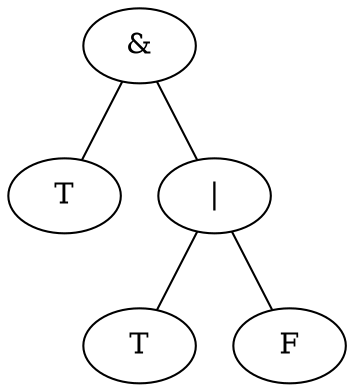

Today
=====

1. Advice on notation
2. What is a function: syntax and semantics
3. Equational reasoning


Advice on notation
==================

Current exercise sheet:

> "Draw the parse tree, [...]".

How should this be handed in?

You have three options:

1. ASCII-art
2. LaTeX TikZ/forest
3. GraphViz

 - - - - - - - - - - - - - - - - - - - - - - - - - - - - - - - - - - - - - - - -

### ASCII-Art

Use plain text to draw trees.

Example: The trees from slide 42

Parse Tree

       _________BoolEx_______
      /         /  |  \       \
    `(`   BoolEx   Op  \      `)`
            |      |    \________
            |      |             \
           `T`    `&`           BoolEx
                          ______/ /| \ \______
                         /       / |  \       \
                       `(` BoolEx  Op  BoolEx `)`
                              |    |      |
                             `T`  `|`    `F`

- - -

      _________BoolEx________________________________
     /         / |  \___________                     \
     |   BoolEx  Op      _______BoolEx________       |
     |     |     |      /       /  | \        \      |
     |     |     |     |  BoolEx  Op  BoolEx   |     |
     |     |     |     |     |     |     |     |     |
    `(`   `T`   `&`   `(`   `T`   `|`   `F`   `)`   `)`

- - -

Abstract Syntax Tree

      &
     / \
    T   |
       / \
      T   F


Important: Use spaces for indentation, not tabs!

 - - - - - - - - - - - - - - - - - - - - - - - - - - - - - - - - - - - - - - - -


Do not overdo it!

                .        +          .      .          .
         .            _        .                    .
      ,              /;-._,-.____        ,-----.__
     ((        .    (_:#::_.:::. `-._   /:, /-._, `._,
      `                 \   _|`"=:_::.`.);  \ __/ /
                          ,    `./  \:. `.   )==-'  .
        .      ., ,-=-.  ,\, +#./`   \:.  / /           .
    .           \/:/`-' , ,\ '` ` `   ): , /_  -o
           .    /:+- - + +- : :- + + -:'  /(o-) \)     .
      .      ,=':  \    ` `/` ' , , ,:' `'--".--"---._/`7
       `.   (    \: \,-._` ` + '\, ,"   _,--._,---":.__/
                  \:  `  X` _| _,\/'   .-'
    .               ":._:`\____  /:'  /      .           .
                        \::.  :\/:'  /              +
       .                 `.:.  /:'  }      .
               .           ):_(:;   \           .
                          /:. _/ ,  |
                       . (|::.     ,`                  .
         .                |::.    {\
                          |::.\  \ `.
                          |:::(\    |
                  O       |:::/{ }  |                  (o
                   )  ___/#\::`/ (O "==._____   O, (O  /`
              ~~~w/w~"~~,\` `:/,-(~`"~~~~~~~~"~o~\~/~w|/~
    dew   ~~~~~~~~~~~~~~~~~~~~~~~\\W~~~~~~~~~~~~\|/~~
    -- http://www.chris.com/ascii/index.php?art=plants/trees


This is also a tree, very nice, a bit gnarled, doesn't give points.

 - - - - - - - - - - - - - - - - - - - - - - - - - - - - - - - - - - - - - - - -


### TikZ with forest package (LaTeX)

The [forest][forest] package helps with typesetting your trees in LaTeX.


```latex
\begin{forest}
  [\& 
      [T]
      [$|$ 
           [T]
           [F]
      ]
  ]
\end{forest}
```
- - -

The `forest` package has a lot of options, and is implemented on top of TikZ,
which is an extremely powerful package for drawing graphics in LaTeX.
If you want to have more control over your trees you can have a look 
at the TikZ `child` action [documented here][tikz].

[forest]: https://texdoc.org/serve/forest/0 "Forest Docs"
[tikz]:   https://tikz.dev/tikz-trees       "TikZ Docs"


 - - - - - - - - - - - - - - - - - - - - - - - - - - - - - - - - - - - - - - - -

### GraphViz

[Graphviz][dot] is a program that takes as input a textual description
of a graph and can generate a graphic depiction of it,
using automatic layout algorithms to place the nodes and draw the edges nicely.
The `dot` program included with it is very good at automatically handling trees.

- - -

As an example, you can save the following in a `trees.dot` file:



Then by running

    dot -Tpng trees.dot -o trees.png

you would get a PNG showing the tree.

[dot]: https://graphviz.org/

 - - - - - - - - - - - - - - - - - - - - - - - - - - - - - - - - - - - - - - - -

 ASCII can also be useful for formulas in e-mails,
 e.g. if you want to ask a question on a mailing list.

Example: "The sum of the first n odd numbers equals n squared."

     n
    Sum (2 * i - 1) = n^2
    i=1

Or in "set-builder" notation:

    Sum { 2 * i - 1 | 1 <= i <= n } = n ^ 2

- - -

Or with Unicode (no longer ASCII):

     n
     Σ (2 ⋅ i - 1) = n²
    i=1

  * This requires Unicode support for all systems involved
    (mail server, installed fonts at the recipient, ...).

  * It often makes sense to limit yourself to the bare minimum, better: `n ^ 2`
    and `2 * i`.

- - -

  * Using a font/editor with ligatures helps
    (e.g. with "Fira Code" `A => B` is rendered as `A ⇒ B`)

Or as LaTeX source code:

    \sum_{i=1}^n (2 \cdot i - 1) = n^2

  * The recipient must understand LaTeX, but in the field of mathematics and 
    computer science this is expected.

  * Restrict to globally known LaTeX commands.
    Do not use packages or custom-defined commands.
    (Important if you copy formulae from your own document)


 - - - - - - - - - - - - - - - - - - - - - - - - - - - - - - - - - - - - - - - -


Notation
--------


  * The Computer Science 3 module requires some knowledge of maths.

  * Good and useful reading are, for example, the first four chapters of the
    [DML script by Sven Kosub][math].


- - -


We will use different notation in some cases, e.g.

    ∃x. x < 3       // this lecture

instead of

    (∃x)[x < 3]    // Prof. Dr Kosub.


Example with conditions:

    ∀x, x>0. x*x > 0 instead of (∀x; x>0)[x*x > 0] .


Why?  This is also common notation, and it fits
      better with the λ-calculus, cf. later in the lecture.


[math]: https://www.toc.uni-konstanz.de/lehre/wintersemester-2017-18/mathematische-grundlagen-der-informatik/


 - - - - - - - - - - - - - - - - - - - - - - - - - - - - - - - - - - - - - - - -


What is a function (Part II)
============================

The question "What is a function?" is actually surprisingly deep!

Answering it fully requires discussing the foundations of Mathematics.
In fact, there are two main ways of setting up such foundations:

- Set Theory
- (Constructive) Type Theory

A full discussion is way beyond the scope of this course,
but I can give you a little intuition which may help
when thinking about functions.

Set Theory is what you are used to in the Mathematics lectures.
You learn about what a set is, and every other mathematical concept
is defined in terms of sets.
You can think of this as "Sets" providing the "Assembly language" for
mathematics.
In this view, a function is a special kind of set of pairs.
This is also called the "extensional" view of functions:
the "extension" is the explicit list of the "contents" of the function,
i.e. its output given any input.

In Type Theory (or at least in certain flavors of it),
functions are instead identified with *algorithms*, i.e. terminating programs.
This is called the "intensional" view, where the input-output relation
is described by *how* to transform one into the other.
In this view, you may consider that two functions are different 
even if their extension is the same: they might give same output from same input
but compute it in different ways, for example one more efficiently than the other.

Both views are useful in thinking about functions, and they can coexist peacefully.
We will often use one view or the other when thinking about Haskell programs.

- - -

The Haskell Language
--------------------

In the lecture you have learned that a programming language is specified by
giving:

- Syntax
- Semantics

The *syntax* defines which sequences of symbols are valid programs.
Syntax is usually specified using a formal grammar.

Not just in theory!
The official document specifying the Haskell language
is the ["Haskell 2010 Language Report"][report].
In Chapter 3 you find the grammar defining the syntax of Haskell.

- - -

The *semantics* defines the **behaviour** of valid programs.
This can come in many forms, but the two we will talk about are:

- Operational semantics
- Denotational semantics

- - -

The operational semantics explains what it means to *execute* a program,
as a sequence of steps that the computer will take to compute the output.

(When I say "computer" I actually mean a suitable abstraction of a computational
device.)

This semantics serves as the specification for a correct interpreter (and compiler) of the language.

- - -

The denotational semantics formally defines a map from programs to
some mathematical object that represents the behaviour of a program.

For λ-calculus and Haskell this would, for instance, map
a program of type `Integer -> Integer` to a mathematical function from ℤ to ℤ.
(more about this in a moment)


- - -

**The bad news**: unfortunately, this kind of only happens in theory!

Most programming languages do *not* come with a formal specification for their
operational semantics (or any semantics!).
Most commonly what is given is:

- An informal description of what programs are supposed to do, in words.
- A reference interpreter/compiler, which becomes the authority on the interpretation of programs.

There have been efforts in rectifying the situation, notable examples:

- [CompCert][] for C 
- [JSCert][] for JavaScript

but this is far from being industry standard.

[report]:   https://www.haskell.org/definition/haskell2010.pdf 
            "Haskell 2010 Language Report"
[CompCert]: https://compcert.org/
[JSCert]:   https://jscert.org/

- - -

Case in point: the Haskell Language Report does not specify the semantics of the language!

Luckily for us, however, the situation is not that bad:

- Haskell is based very firmly on the theory of λ-calculus, which is thoroughly studied and documented.
- Haskell's semantics can be directly linked to the one of the λ-calculus, and can be seen as just adding a bunch of bells and whistles to it, the meaning of which can be in principle incorporated into the λ-calculus semantics.

- - -

What I want to show you next is a rough sketch of the semantics of Haskell.

This is *not* going to be a full definition, and it is *not* covered in the exam.

The purpose is to give you some intuitive mental model for how Haskell works.

You will see more of this in the lectures on the λ-calculus.


- - -

Operational Semantics
---------------------

Operational semantics is given by defining a "step relation" between expressions,
which here we write with the symbol `~>`.

Intuition:

    e1 ~> e2     means    e1 can take a computation step and become e2

Example:

    2 * (4 + 1) ~> 2 * 5 ~> 10

The full definition of `~>` includes rules for all the primitive operations,
e.g. `+` and `*`.

- - -

The most basic Haskell expressions are *values*.
These are *defined* as the expressions that cannot take a step.

Example:

- `5` is a value.
- `4+1` is *not* a value because it can take a step and evaluate to `5`.

- - -

What the Haskell interpreter `ghci` does is essentially this:

- Given an input expression `e0`
- It follows the definition of `~>` computing the next expression `e0 ~> e1`
- Then continues `e1 ~> e2 ~> ... ~> eN` until
- There is no further step from `eN`, which is then a value
- Print out that value `eN`

> Note: Not all expressions terminate!
>       This means that from some `e0`, `ghci` would keep running steps forever.
>       If this happens to you press ctrl+C to kill the execution and return
>       to the `ghci` prompt.


- - -

Denotational Semantics
----------------------

In Haskell, every expression is associated with a *type*.

Most of the types of expressions can be inferred, and so are omitted from
programs, but they are there!
In fact, an important function of the Haskell compiler is exactly to fill in
all omitted types, making sure the program is consistently using them.

- - -

Haskell has syntax for writing down types.
Denotational semantics would associate a set with each type.
We write `T` for the set associated with type `T`.

Haskell has a number of built-in types, for example:

      Syntax      Semantics

       Bool   = {0,1}   (any two distinguishable constants would work)
     Integer  = ℤ
     (T1,T2)  = T1 × T2
               = { (a,b) | a ∈ T1, b ∈ T2 }
    T1 -> T2  = (partial) functions from T1 to T2

- - -

Wait a minute... do you really mean it when you write ` Integer  = ℤ`?!?
The set ℤ is infinite!

Well, let's put it to the test.
Normal "machine" integers (e.g. the ones with type `int` in C)
will be stored in 64bit registers.
So for sure a number like 2^1000 should overflow such register.

    ghci > let n :: Integer = 2^1000 in n
    10715086071862673209484250490600018105614048117055336074437503883703510511249361224931983788156958581275946729175531468251871452856923140435984577574698574803934567774824230985421074605062371141877954182153046474983581941267398767559165543946077062914571196477686542167660429831652624386837205668069376

This worked!
Haskell's `Integer` type is internally implemented with a data structure
which can represent arbitrarily big numbers (up to your amount of RAM!)

> To get "normal" bounded ints you can use the `Int` type:
> 
>     ghci > 2^1000 :: Int
>     ghci > 0             -- it overflowed!

- - -

Then we can move to the semantics of *expressions*.
We write `e :: T` to indicate expression `e` insisting that it has type `T`.

The denotational semantics maps a typed expression `e :: T`
to its meaning `e :: T`, i.e. an element of `T`.

- - -

The semantics of literal values is easy,
as they denote the corresponding mathematical constants:

    True  :: Bool = 0   (∈ Bool = {0,1})
    False :: Bool = 1
    0 :: Integer  = 0   (∈ ℤ)
    1 :: Integer  = 1
    ...
    (20,10) :: (Integer, Integer) = (20,10)    (∈ ℤ×ℤ)

- - -

Primitive functions are also self-explanatory:

    not :: Bool -> Bool = { (0, 1), (1, 0) }
    + :: (Integer, Integer) -> Integer = { ((a,b), a+b) | a,b ∈ ℤ }
    ...


> To be precise, the type of `+` is a bit different in Haskell,
> but we'll talk about it later in the lecture.

- - -

There are other expressions that are less obvious:

- Variable: `x`
- Let bindings: `let x = e1 in e2`
- Anonymous functions: `\x -> e`
- Function application: `f e`

- - -

Let's start from a variable: what is the meaning of `x :: T`?
It must be an element of `T` but... which one?
It depends on what we bound to that variable when we introduced it!

So there is this concept of an "environment" `ρ` that maps variable names
to their meaning, and the denotational semantics is actually parameterized by
an environment `e::Tρ` (when ρ is omitted it is simply arbitrary)

- - -

So for variables we have:

    x::Tρ = ρ(x)   (assumed to be ∈ T)

variables are at some point given a definition using `let` bindings:

    let x :: T = e1 in e2

says that we evaluate expression `e2` but assuming that `x` actually means `e1`.

    let x :: T = e1 in e2ρ =
        e2ρ' where ρ' = ρ[x:=a] and a = e1ρ


> Here ρ[x:=a] is notation for the environment that coincides with ρ
> on every variable except for `x`, on which it returns `a`.

- - -

Anonymous functions `(\x.e) :: A -> B` are expressions denoting
a function taking `x` as argument and with body `e`.

They correspond to:
- `(λx.e)` in λ-calculus
- `lambda x: e` in Python
- `(x)->{e}` in Java.
- `(x)=>e` in JavaScript.

- - -

The denotational semantics of `(\x.e) :: A -> B`, as the type suggests,
partial functions:

     (\x.e) :: A -> B ρ = { (a,b) | a ∈ A, b = eρ', ρ' = ρ[x:=a] }

That is: it's the function that on input `a`
    is determined by the meaning of `e` when `x` has meaning `a`.

- - -

Finally, application `f e` where we assume `f::A->B` and `e::A`:

     f e :: B ρ = F(a)
        where F =  f :: A -> B ρ
              a =  e :: A ρ 

For example,:

     let x = True in not x ρ
    =  not x ρ'      where ρ' = ρ[x:= True ρ] = ρ[x:=1]
    =  not ρ(1)      since  x ρ' = ρ'(x) = 1
    = 0               which is the meaning of False

- - -

Good to keep in mind:
when we write a definition like

    f x = e

in an Haskell file, it is as if we are writing

    let f = \x -> e in ...

where the `...` are the rest of the file.

- - -

Also, in `ghci` we can write the expression

    let x = e

and it will be similarly interpreted as
adding the binding for `x` in the current environment.

> Bonus observation:
>   actually, `let x=e1 in e2` can be defined as
>   `(\x->e2) e1`!

- - -

What we sketched is *not* the full denotational semantics of the language:

- Haskell has many more built-ins
- Haskell supports recursion:
    to properly handle it in the semantics
    we would need much more sophisticated mathematics
- Haskell types are more advanced (e.g. they support polymorphism)

If you are curious about these more advanced features and semantics,
good keywords are:

- PCF (Programming Computable Functions)
- SystemF (aka polymorphic λ-calculus)

- - -

Naturally, if we have two semantics for a language,
one operational and one denotational,
we would want them to agree on the meaning of programs!

In fact, the two semantics are related as follows.

Let `e` be an expression without free variables
(e.g. it can be evaluated in the empty environment),
and let `v` be a value, then

    e ~> ... ~> v   if and only if   e::T = v

- - -

Why is Haskell a *functional* language?
---------------------------------------

Because an expression `e :: A -> B` really behaves
as a mathematical function!

This is not the case in other languages...

- - -

Consider the following Python functions,
which fail to denote mathematical functions ℤ -> ℤ:

```python
def f(x):
    global i
    i += 1
    return x+i
```
For any `n∈ℤ`, this `f(n)` can return any number depending on the value of `i`!

```python
def f(x):
    from random import randint
    i = randint(1,10)
    return x+i
```
For any `n∈ℤ`, this `f(n)` can return any number between `n+1` and `n+10`!

- - -

More generally, in Haskell, every closed expression `e`
will evaluate to a unique value (or fail to terminate).

Failure of termination is reflected in the denotational semantics
as using *partial* functions.
For example, if we define

   f x = if x == 42 then 1 else 1 + f x 

we would have

    f = { (42,1) }

and so

    f 1 = ⊥

- - -

Why do we care?!?
-----------------

Because these properties support **equational reasoning**!

Does the following hold for every `x∈ℤ`:

    f(x) + f(x) = 2 f(x)

It depends!

- If `f` is a mathematical function `ℤ -> ℤ` then yes!
- If `f` is as our first Python function: NO!
   * Assuming `i=0` initially, we get `x+1+x+2 = 2(x+1)` which is false.
- If `f` is as our second Python function: also NO!
   * eg. if `randint` returns 1 on the right-hand side,
     but 10 on the left-hand side

An Haskell function of type `Integer -> Integer` will satisfy the above
equation because it denotes a genuine function, so `f(x)` denotes a unique
value, no matter in which context it appears.

- Functions like Haskell's are called *pure*.
- Functions like Python's are said to have *side-effects*.


- - -

Wait...what does equality mean, exactly?
----------------------------------------

Excellent question! This is also a pretty deep question!

We can interpret "equality" in many ways:

- `=def` is *definitional* equality
  Example: if we defined `let x=1` then `x` equals `1` by definition
- `=syn` is *syntactic* equality: two expressions have the same AST
  Example: `(2*4)+1 =syn 2*4+1` but `4+1` and `5` are *not* syntactically equal
- `≡` is *semantic* equality: `e1 ≡ e2` if `e1 = e2`
  Example: `4+1 ≡ 5`, `(\x.2*(x+1)) ≡ (\x.2*x+2)`
- `==` is *decidable* equality: it is a program that can determine if `v1` and `v2` are the same value.
   * For many types this can be computed, eg `Integer`, `String`...
   * For many other types this is not computable, eg `Integer -> Integer`

In any case, it only makes sense to compare two expressions of the same type,
so we talk of equality *at type `T`*.

- - -

The possibility of non-termination needs a comment in the context of
semantic equality:

> When should we consider `e1` semantically equivalent to `e2` when they can fail to terminate?

The answer is that it's up to us, actually.
It depends what we want to capture with equality.

In this course we care about when an expression terminates
(actually we want them to always terminate!)
so we stick with the definition we gave:

    e1 ≡ e2   if and only if   e1 = e2

which implies that if `e1 = ⊥` then `e2 = ⊥` and vice versa.

- - -

Example: given

    f x = if x == 42 then 1 else f x
    g x = x - 41
    h x = if x == 42 then 1 else 100 + f x

we have:

    f x ≡ g x   is only true if x=42
    f x ≡ h x   is true for all x∈ℤ

and as semantic equalities at `Integer -> Integer`

    f ≡ g   is FALSE
    f ≡ h   is TRUE
