# Foundations

NLP - Natural Languages Processing

## The challenges of NLP [+]

?

## Evolution of NLP Methods [+]

Rule-based NLP

- Languages are inherently rule-based (to a point)
- A skilled linguist can create rules that solve many problems in NLP quite well
- However, this does not scale and meaning is not rule-based

Statical Language Models and Corpus linguistics

- The idea had been around longer, but in the 1990s, we reached thresholds for
    - computing power
    - storage space
    - available digital text data

- Core idea: combine memorizing word cooccurence patterns and learned rules
- How to do it: 
    - Obtain large text collections
    - Compute statistics over words (co)occurences in those collections
    - Use these statistics to make 'smarter' decisions with rules
    - Or learn rules directly from the statistics

Deep Learning for NLP

Neural language models:

- In the early 2000s, we reached new thresholds for
    - parallel computing power
    - storage space, and
    - available text data

- Core idea: feed web-scale corpora of unlabeled text into (deep) neural networks with billions of parameters to learn word cooccurence patterns
- Current deep neural language models:
    - can solve NLP tasks better than humans
    - can solve tasks for which they have not or barely been trained (transfer learning, zero-shot learning)
    - can be quite biased (GAGO)

## Distributional sematics [++]

“You shall know a word by the company it keeps.” — J.R. Firth

the main idea, is that we do not understand the meaning of the word in a dictionary, we understand it in the context, where it was used

## Zipf's law [+++]

the most frequent word will occur approximately twice as often as the second most frequent word, three times as often as the third most frequent word, etc.

## Elements of Language [-]

- Sound - Phonetic 
- Grammar - Phonology, Morpholohy, Syntax
- Meaning - Semantics

## Morphology [++]

Morphology:
- The study of the way in which words are constructed from smaller units of meaning

Morpheme:
- The smallest meaningful unit in the grammar of a language

Example of Morphemes 

unladylike

- 3 morphemes, 4 syllables
    - un-: meaning "not"
    - lady: meaning "(well behaved) female adult human"
    - -like: meaning "Having the characteristics of"

techinque 

- 1 morpheme, 2 syllables

dogs

- 2 morphemes, 1 syllable
    - dog: meaning "a domestic animal"
    - -s: a plural marker for nouns

Typical word classes:

- Parts of speech: noun, verb, adjectives, etc.

Inflection:

- Variation in the form of a word, typically by means of an affix, that expresses a grammatical contrast.
- Does not change the word class.
- Usually produces a predictable, non-idiosyncratic change of meaning.
- Example: run -> runs | running

Derivation:

- The formation of a new word or inflectable stem from anther word or stem.
- Example: compute -> computer -> computerization 

Inflectional Morphology:

Typically, inflectional morphology:

- Does not change the word class
- Modifies words to serve a new grammatical role
- Adds morphemes that encode
    - tense, number, person, mood, aspect, etc.
- English example:
    - The pizza guy arrives at noon.
    - arrive is inflected for person (3rd person) and number (singular)

Derivational Morphology

Normalization: formation of nouns from other parts of speech

- compute -> computerization
- appoint -> appointee
- kill -> killer
- fuzzy -> fuzziness formation of adjectives (primarily from nouns)
- computer -> computational
- clue -> clueless
- embrace -> embraceable

Morphemes: Terminology

Root: The components of word is that 

- common to a set of derived or inflected forms, if any, when all affixes are removed
- cannot be split futher into meaningful components
- carries the principal portion of meaning of the words

## Tokenization [+]

Token:

- The occurence of a word in a text

Tokenization:

- Segmentation of an input stream into an ordered sequence of tokens 

Tokemizer:

- A system that splits text into word tokens

Example:

- Input text: John likes Mary and Mary likes John.

- Tokens: {"John", "likes", "Mary", "and", "Mary", "likes", "John", "."}

## Stemming [+]

Stemming usually refers to a crude heuristic process that chops off the ends of words in the hope of achieving this goal correctly most of the time.

Example: studying / studies -> studi

## Porter Stemmer [-]

A simple approach:

- We effectively chop off the end of the word
- Only suffixies are considered for removal
- Frequently used algorithm
- Results are pretty ugly

caresses -> caress
libraries -> librari
dogs -> dog

## Lemmatization [+]

Lemmatization usually refers to doing things properly with the use of a vocabulary and moprhological analysis of words, normally aiming to remove inflectional endings only and return the based or dictionary form of a word, which is known as the lemma.

Example: studying / studies -> (to) study

# Part of Speech Tagging

## POS hierarchy[+]

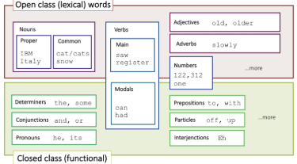

## The POS tagging task[++]

Words often have more than one POS

The POS tagging problem addresses how to determine the POS tag for a particular instance of a word in a given context.

The purpose of POS tagging

1. Collapsing distinction into equivalence classes
    - All personal pronouns (You, they, etc) tagged with PRP

2. Introducing distinctions to resolve ambiguities
    - E.g. leaves could be tagged with NN or VB

3. Helpful features in classification and prediction tasks
    - Named Entity Extraction
    - Machine Translation

Terminology

Tagging
- The process of assosiating labels with each token in text
- Not limited to parts of speech

Tags
- The labels that are assigned to the tokens

Tag Set
- The collection of tags that is used for a particular task
- Tag sets are defined by linguists and not unambigous
- Different languages require different language-specific tag sets-> it is difficult to compare tags between different languages

## Feature-based Tagging[-]

Probabilistic methods 

- Use a corpus for training
- Obtain POS probabilities from manual annotations of the corpus
- Language-agnostic: Method can be applied to different languages

Tagging with Lexical Frequencies

Problem: How can we determine the most likely POS tag for a given token?
Solution: Derive probabilities from a large, annotated text corpus

Rule-based methods

- Use linguistic knowledge
- Knowledge is mapped to rules
- Rules are easy to interpret
- Each language needs its own rules

## Unigram tagger[++]

How it works?

- We have access to an annotated text corpus (= our training data)
- We create statistics of how many times each token is seen with each POS tag(= the training process)
- Based on these learned frequencies, we use the training model on new, unseen text to associte with each word its most likely POS tag( = prediction)

Problem: the most frequent tag is obviously not always correct! we need to know in which sense that is being used. We need to take the context into account.

## N-grams POS tagger[++]

Core idea:

- Use the unigram probability for the current token (-> unigram tagger)
- Use the predicted preceding n-1 tags
- Optionally: We could also use the preceding n-1 tokens, but this is impractical

Bigram tagger:

- Prediction: What is the most likely tag for token n, given token n and tag n - 1?
- The tagger picks the tag which is most likely, given the context

Backoff: Combining Multiple Taggers

- Attempt to tag the token with the 1st order tagger (e.g. bigram tagger)
- If the 1st order tagger is unable to find a tag for the token, fall back to using a 0th order tagger (e.g., unigram tagger)
- If the 0th order tagger is also unable to find a tag, use the default tagger to find a tag(e.g. feature based tagger)

Important note:
Bigram and trigram taggers need the previous tag context to assign new tags. If they see a [ na ] tag in the previous context, they will also print [ na ]. -> Error propagation

## Rule-based Tagging[+]

The Brill Tagger 

An example of transformation-based learning

- Core idea:

    - Use a probabilistic approach first
    - Then revise and correct it using contextual rules

- Similar to painting: sketch first, then paint propertly
- Very popular
- The rules are linguistically interpretable
- It is a supervies method and therefore require a tagged corpus

Process:

Intialization: 

- Tag each word with the most likely POS (as observed in corpus)
- For words that are not in the corpus
    - If it os capitalized: label as noun
    - For token that end in the same three letters as a word with known tag: use the tag of the known word(e.g., labeling[VBG])

Patching:
- Find suitable instances and apply patches to improve the result
- Example of patch:
    - If one of the two preceding words is tagged as a determiner, change the tag tokens that are tagged as a verb to noun

# Parsing

## Formal grammar [-]

A formal grammar G = (N, T, P, S) provides a scheme for generating a formal language, if consists of:

- A finite set of non-terminal symbols N (constituents)
- A finite set of terminal symbols T(words)
- A start symbol S (a sentence)
- A finite set of production rules P of the form: left hand side -> right hand side

The grammar's language L(G) is the set of all sequneces of terminal symbols that can be generated with the grammar. To generate a sentence from the language:

- Beginning with the start symbol, consecutively apply rules("derivation")
- Applying a rule replaces all symbols on the left hand side with the right hand side.
- Once any termianl symbols remain, the derivation is complete.

## Chomsky normal form[+]

Four types of languages:

- Type-0: Recursively enumerable languages
    - Rules have the form γ → α (no constraints)
- Type-1: Context-sensitive languages
    - Rules have the form: αAβ → αγβ
- Type-2: context-free languages
    - Rules have the form: A -> α
- Type-3: Regular languages
    - Rules have the form: A -> a or A -> aB

WhereL
a is a terminal symbol. \
A,B are non-terminal symbols. \
α, β, γ are arbitary sequences of terminal / non-terminal symbols. \
α and β maybe empty. γ cannot be empty. \

A context-free grammar (GCF), is said to be in Chomsky normal form if all of its production rules are in one of the following three forms:

- A -> BC
- A -> a
- S -> ε

Where:

- A,B,C are nonterminal symbols
- a is a terminal symbol
- S is the start symbol
- ε denotes the empty string
- Neither B nor C can be S

## Phrase structure [+]

Constituency

Phrase sturcture organizes words into nested constituents. But what is a constituent?

- A word or a group of words that function as a single unit withtin a hierarchial structure.
- A constituent behaves as a unit that can appear in different places.

Example:

Mr. Mackey talked [to the children] [about drugs].
Mr. Mackey talked [about drugs] [to the children].
*Mr. Mackey talked drugs about to the children.

A* in examples typically denotes ungrammatical or unobserved sentences.

Consider how we can generate sentences (S):

- A simple grammar for a single sentence: e.g., "Birds fly"

    - S -> NN VB
    - NN -> birds | planes | superheroes
    - VB -> fly | sing | fall
- Other sample sentences : "Birds sing", "Superheroes fly", etc.

Limitation: In the above examples, verbs are intransitive (they do not have a direct object)

- Example: superheroes save [who|what]
- We need transitive verbs and direct objects
- We need determiners, e.g. "the mayor", "the day"

## Syntactic ambiguity [+]

Syntactic ambiguities can result in semantically different but syntactiacally correct tree structures:

- prepositional phrase attachment: The boy saw the woman with the telescope
- coordination scope: small boys and girls are playing
- Particals vs. prepositions: she ran up a large bill
- Gerund vs. adjectives: Frigthening kids can cause troubles.

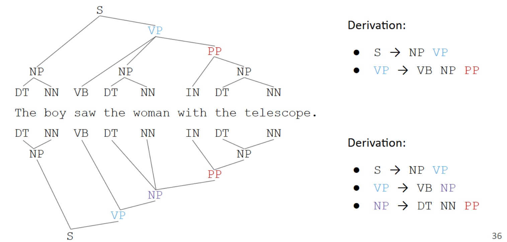

## Constituency parsing [++]

a parse tree (or derivation tree) is an ordered rooted tree that graphically represents the syntactic information of a string derived from a (context-free) grammar. There are twoo different approaches to generate a parse tree.

Top-down approach:

- Starts with the starting symbol S
- Iteratively moves down towards tree leaves using production ru;es
- Problem: Explores options that won't lead to a full parse

Bottom-up approach

- Starts from tree-leaves (= tokens)
- Proceeds upward to the root (= the starting symbol S)
- Problem: Explores options that don't match the full sentence(-> backtracking)

## Leftmost Derivation[+]

Leftmost derivation is not a specific algorithm, but rather a class of Algorithms (further reading: see "LL parsers"). It is designed for restricted context free grammars (e.g., programming languages) and does not work perfectly on natural language.

Leftmost derivation is an example of top-down parsing

Algorithm outline:

- Starts with S
- In each step, apply a production rule to the leftmost non-termial symbol
- Produce the observed terminal symbols (= tokens)
- Terminates once all observed words have been created.
Example: 
- S
- [S -> NP VP]
- [NP - > DT NN] VP
- [DT -> The] NN VP
- The [NN -> apple] VP
- The apple [VP -> ...]

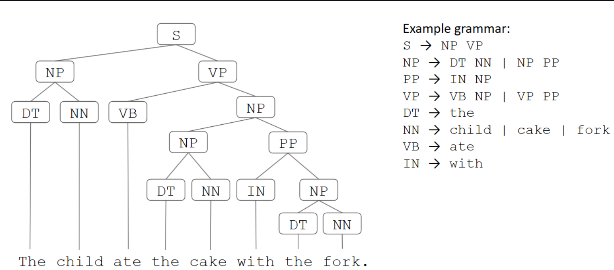

## Shift Reduce Parser[++]

A shift reduce parser is effectively a pushdown automaton that uses a stack of recognizing a context free language. It is an example of bottom-up parsing

Algorithm outline:

- SHIFT operation: Push a word from the input sentence onto the stack
- REDUCE operation: if the top n words on the top of the stack match the right hand side of a production rule, then they are popped and replaced by the left hand side of the production.
- STOPPING condition: The process stops when the input has been processed and S have been popped from the stack

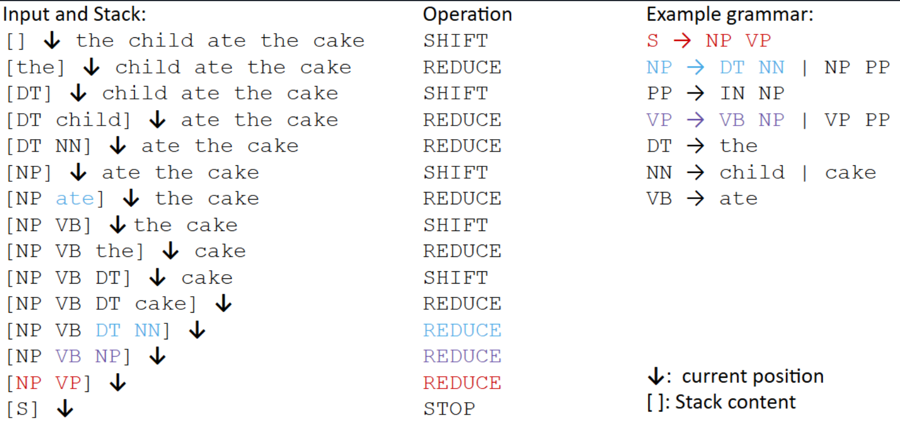

## CKY parser[+]

The Cocke-Kasami-Younger parser uses dynamic programming. it is an example of a bottom-up parser.

Core idea:

- Cache indermediate results
- For building a parse for a sequence [i,j], keep track of all parser of subsequences [i,k] and [k,j] that are included in it (i <= k <= j).

Advantage:

- Backtracking: if the parser gets stuck, we can easily go back to a previous alternative

Downside:

- Required a binarized grammar
- The grammar must be in Chomsky Normal Form

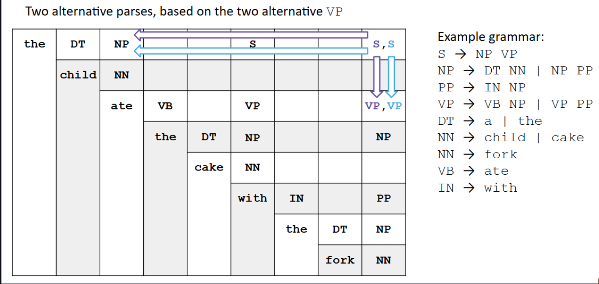

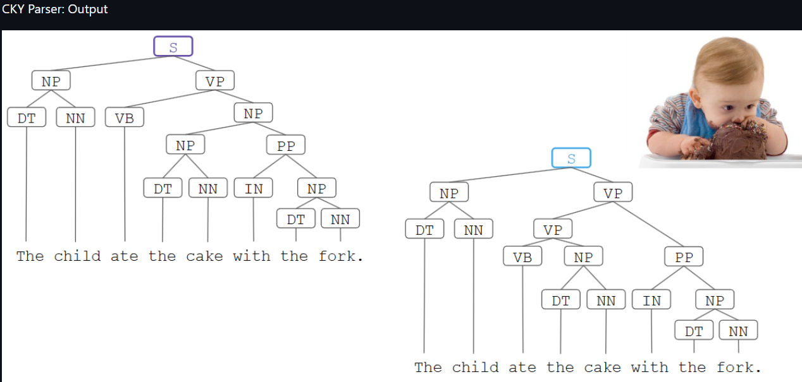

## Statistical parsing [-]

How can we resolve ambigous parse trees?

Core idea:

- Use a grammar that attaches a probaility to a production rule: probabilistic context free grammar (PCFG)
- All probabilities p of identical left hand side symbols in rules must sum up to 1
- The probability of a parse tree is the product of all used production rules
- Probabilities can be learned from a lebeled training corpus(treebank): p (S -> NP VP) = count (S -> NP VP) / count (S)

## Lexicalized Parsing [-]

Using corpus statistics, we can go even further and construct a parse that takes lexical relations into account to compute probabilities.

Core idea: 

- we dont just check the probability of rules, e.g. VP -> VP PP
- Instead, we also check the Probabilities of terminals, e.g. VP[ate] -> VP[ate] PP [with]
- We can better model whether a specific PP belongs to a VP or NP

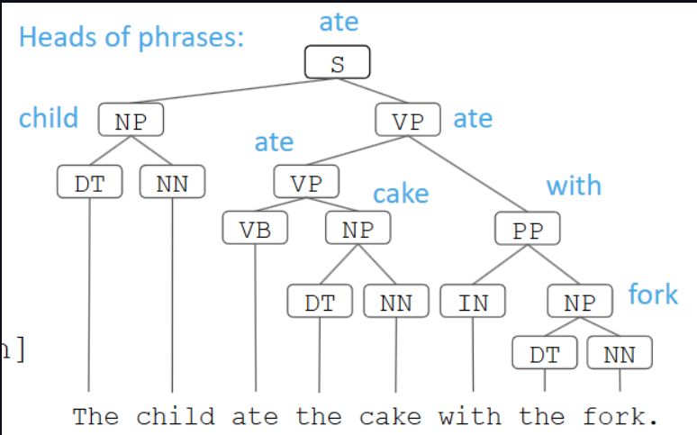

## Dependency parsing [--]

Dependency grammar assumes that syntactic structure consists only of dependencies between tokens,

- Dependencies are (labeled) asymmetric binary between two token
- Dependencies typically from a tree with a single head (the root)

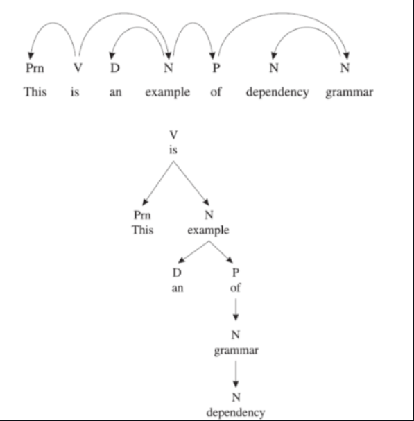

Dependency parsing vs. Constituency parsing

Dependency parsing:

- Models natural language via a dependency grammar
- Create linguistic structure from the dependencies of tokens
- Useful when we are interested in relations between words

Constituency parsing:

- Models natural language as a context free grammar
- Breaks text down into a phrase structure (constituents)
- Constructs the syntactic structure from constituents
- Useful when we are interested in phrases

# Named Enity Recognition and Linking 

## Events [--]

The 5 Ws of Journalism

Who was involved? What happend? When did it happen? Where did it happen? Why did it happen?

## Named Entity types[-]

Common types of named Entities

The core set:

- Persons
- Locations
- Organizations

Further useful named entity types:

- Dates
- Times
- Numeric expressions

Domain-specific entity types:

- Chemicals
- Genes
- Stock symbols
- Laws 
- URLs
- etc

## The NER Task [++]

Goal:

- identify named entities in a document and tag them with a type.

Applications:

- Named entity in a text can be indexed, linked to external databases, etc
- Sentiment can be attributed to companies or products
- Identify relations between named entites
- In question answering: answers are often named entities
- Google knowledge graphs answers
- etc...

## Sequence Labeling for NER[+]

via Machine Learning

Training:

1. Collect set of representative training documents
2. Manually label each token for its entity class (PER, LOC, ORG, etc.) or other (O)
3. Design appropriate feature extractors for the text and classes
4. Train a sequence classifier to predict the labels from the data

Testing / Classification:

- For a set of new. unlabeled input documents:
    - Run the sequence model in inference mode to label each token
    - Output the recognized entities

In practice:

- Inside-Outside (IO) encoding is less precise
- Inside-Outside-Begging(IOB) encoding is more precise but requires a larger tagset (2c + 1 classes vs, c+ 1 classes in IO encoding)
- But: the benefit is limited in practice, so IO is often used

## Features for NER[+]

Token-level features

- Current token
    - Effectively, this is dictionary learning
    - Example: Barbara is typically (part of) a name
- Previous/ next word (token)

Tag-level features

- Inferred linguistic classification (e.g. POS tags)

Label-level features:

- Previous (and perhaps next) named entity label in the current sequence
- Example: Jon [PER] Snow [PER]

Many types of named entities have characteristics name structures in which substrings increase the likelihood for a certain type of entity:

- Substring "oxa" in drug names

- Substring field in location names

- Special characters like a colon(:) in movie titles

Some named entity names tend to follow patterns that can be mapped to a simplified representation based on attributes such as:

- Token length
- Capitalization
- Numerals
- Greek letter
- Internal punctuation
- etc. 

## Named entity disambiguation[+]

Named entity ambiguity - The Tesla chief executive.... Who? Company? Person? Unit?

Normalization: Reducing or rewriting something to a common (normal) form. Example:

- Mathematics: normalizing a fraction
    - 1 / 2 = 2 / 4

- Mathematics: normalizing a vector to unit length
    - v' = v / |v|

- Formal grammars:
    - Chomsky Normal Form for CFGs

- Databases:
    - 1NF, 2NF, 3NF, EKNF, etc.

- Person names:
    - Donald Trump, also known as: Donald J. Trump, POTUS, 45-47, President Trump...

## Named Entity Linking [+]

How can we match entity mentions in a text to identities in a knowledge base? This is often modeled as a ML prediction task: Given an entity mention in a text, predict the most likely corresponding entity in a knowledge base.

Core steps:
    - Mention detection (= named entity recognition)
    - Candidate generation (= string matching to knowledge base entries)
    - Candidate ranking using features:
        - Context features: tokens around the entity ,entions
        - Knowldege graph structural features (e.g. graph centratility)
        - Unambiguous entity mentions in the context
        - Heuristic features (e.g., overall popularity of an entity)

Drawbacks:

- Engineering the strcuture of a knowledge graph(an ontology) is difficult and subjective, but directly affects how useful it is. 

Examples:

- Places categories in Wikidata: Are they populated places or levels in an organizational hierarchy? 
- Jesus in Wikidata: A person? God? A prophet? Real or fictional?

## Normalizing temporal expressions [-]

For temporal expressions, we can use a rule-based normalization tather than tlinking them to a knowldege graph. For example:

January 12, 2022 at 2 pm -> 2022-01-12 14:00 UTC

But different types of temporal expressions require different rules for normalization:

- Absolute temporal expressions:
    - January 12, 2022; International Worker's day 1997; during the Council of Conctance

- Relative temporal expressions
    - yesterday; this afternoon; the day before

For relative temporal expressions, a reference time is necessary, which requires domain knowledge to retrieve.

News-style texts: Use publicatin metadata

- Elon-Musk revealed on Thursday that...
- New article published on Saturday, 16.04.2022
- Thursday -> 2022-04-14

Narrative texts: use preceding information in paragraph

- Keep track of last mentioned date
- Use as reference for normalization

## NE-based Application:

implicit Network vs. Knowledge graph

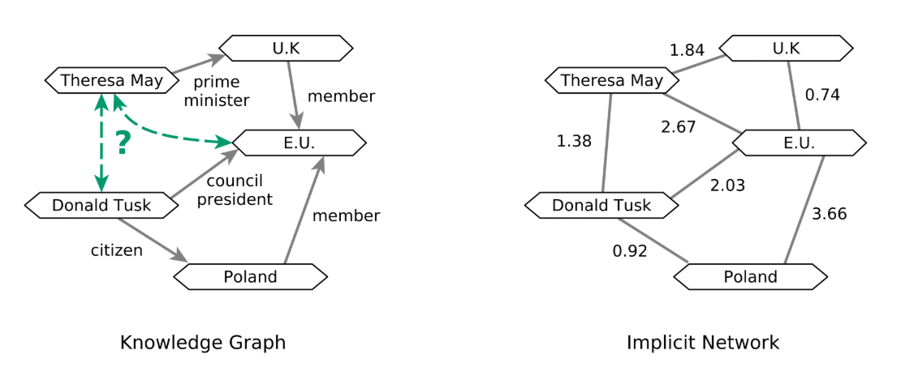

Generating Implicit networks from a corpus

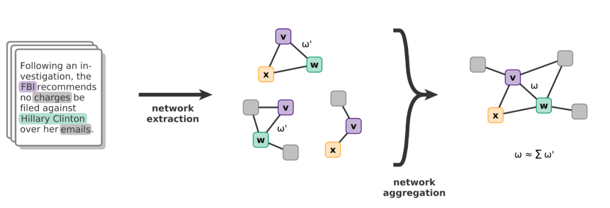

implicit Networks: Pipeline Architecture

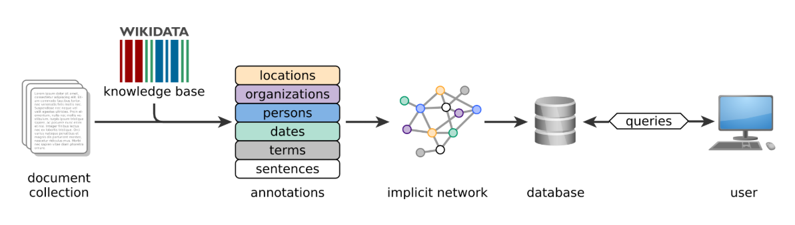

Extracting implicit entity relations

problem: How can we discover complex relations for a (a set of) entities? Query ⟨Location | Barack Obama, Hillary Clinton⟩

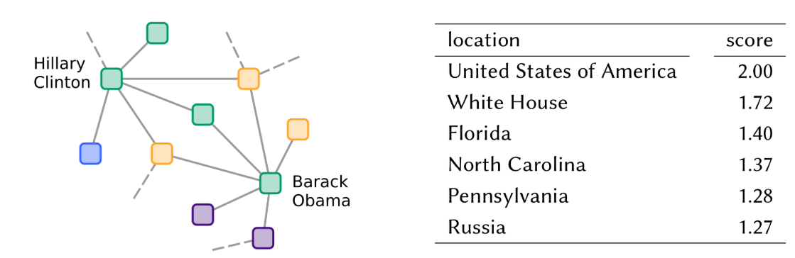

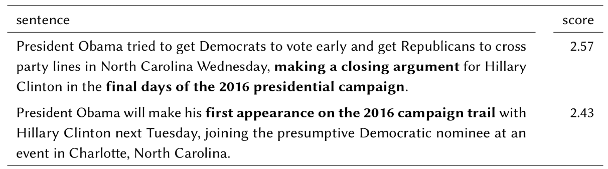

# Similarity and Search

## Types of word similarity[+]

Surface form similarity:

- Phonological similarity (e.g. brake | break)
- Morphological similarity (e.g. respect | resctful)
- Spelling similarity (e.g. theater | theather)

Semantic similarity:

- Synonymy (e.g. verbose | wordy)
- Hypernymy, Hyponymy (e.g. color | red)

Content similarity:

- Sentence similarity (e.g. paraphrases)
- Document similairy (e.g. two news stories on the same event)

## Phonological similarity[-]

Words with the similar pronunciation are encoded to the same representation so they can be mathced despite minor differences in spelling.

## Soundex algorithm [--]

Idea:

- Turn every tokeninto a 4-character reduced form
- Build an index on the reduced forms
- Apply the same encoding to query terms(= tokens in the query)
- Search the index for phonetically similar tokens that have some encoding

Algorithm:

1. Retain the first character of the word
2. Replace all occurrences A, E, I, O, U, H, W, Y with digit  0
3. Characters from the following sets into digits:
    - 1 <- B,F,P,V
    - 2 <- C, G, J, K, Q, S, X, Z 
    - 3 <- D, T
    - 4 <- L
    - 5 <- M, N
    - 6 <- R
4. If two adjacent digits are identical, remove one of them
5. Remove all zeros from the string
6. Return the list four characters of the string (pad with trailing 0s if necessary)

Disadvanteges:

- Language specificness: originaly developed for English
- Homophonous names starting with a different character
    - Craft (C613)
    - Kraft (K613)
- Unable to discriminate between long words (4-character limit)
- Conflation of unrelated family names:
    - Saint (S530)
    - Sand  (S530)
    - Snead (S530)
    - Sunday (S530)

## Morphological similarity [+]

?

## Levenstein distance [++]

Idea benind the Levenstein Distance (also called edit distance): Given two strings s1 and s2, count the minimum number of basic operations to convert one string to the other.

Basic-operations are typically character-level:

- Insert
- Delete
- Replace (i.e., subsitute)

Example:

- The edit distance between rain and shine is 3
- We need to replace two characters and insert one character

Wagner-Fischer Algorithm

Step 1: Setup and parameters

Set n to be the length of string s \
Set  m to be the length of string t \ 
If n = 0, return m and exit \
If m = 0, return n and exit. \
Construct a matrix containing 0...m rows and 0...n columns. 

Step 2: Initialization

initialize the zeroth row to 0..n \
initialize the zeroth column to 0..m 

Step 3: iteration

For i from 1 ... m // iterate over rows \
For j from 1...n // iterate over columns

if s[i] = t[j] then SubCost:= 0 // retain character \
if s[i] != t[j] then SubCost := 1 // replace character 

d[i,j] := minimum (d[i - 1, j] + 1), // Deletion \
d[i, j - 1] + 1, // Insertion \
d[i - 1, j - 1] + subCost) //substitution

return d[m,n]

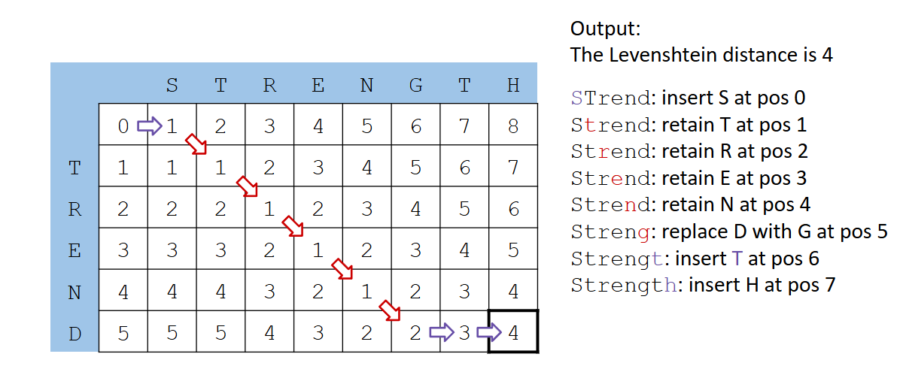

## Semantic relations [+]

Synonymy: 

- Different words with similar meaning (e.g., big | large)
- Synonyms differ in their frequency of use and the context

Antonymy:

- Words that are near opposites (e.g., raise | lower)

Hypernymy:

- Supertype of a words (e.g., red is a color)

Hyponymy:

- Subtype of a word (inverse of hypernymy)

Meronymy:

- A word is part of lager whole (e.g. a flock of sheep includes a sheep)

## WordNet[-]

WordNet is a database of words and semantic relations between them. The main relation is hypernymy, so the overall structure is tree-like.

Parent hierarchy of the different meanings of bar:

- Barroom, bar → room → area → structure → artifact ...
- Bar → counter → table → furniture → ... → artifact ...
- Bar → implement → instrumentation → artifact ...
- Bar → musical notation → notation → writing → ...

However:

- Not all words share the same root
- WordNet has multiple roots
- WordNet is a forest, not just a tree

In principle, the higher distance the lower the similarity! But there are problems:

- A specific word may not be in any tree
- Hypernymy edges are not all equally apart in similarity space
- Many more detailed graph-based semantic similarity measures have been developed

## The vector space model [++]

Boolean retrieval

The simpliest information retrieval system:

- Create an index of all words in the documents
- Represent queries as Boolean Expressions (Caesar AND Brutus)
- The retriecal engine returns all documents that match the expression
- Stemming and Lemmatization can help to improve recall

Indexing and retrieval:

- Create a matrix of the document collection that contains all distinct terms
- Set the value to 1 if the corresponding document contains the given term
- Return all documents that have a value of 1 in all cells corresponding to query terms

Scoring for ranked retrieval

But what happens if many documents match?

-> we want to return the documents in an order that is likely to be useful to the searcher

How can we rank (= order) the documents in the collection with respect to a query?

- Assign a score to each document (typically in the range [0,1])
- The score measures how well the document and the query "match"
- We need a way to assign (similarity) score to a query/document pair

## TF - IDF [+++]

Term friquency matrix

To have data for a scoring function, term frequency informatoin is helpful:

- We can store term frequency counts instead of binary values in the matrix
- Each document is now represented by a count vector
- Note: word order is nor retained in a vector. This approach is called bag of words(BOW)

Term frequency

The term frequency tf_(t,d) of document d is defined as the number of times that t occurs in d.

- A document with 10 occurences if the term Hamlet is more relevant for a query containing Hamlet than a document with just one occurence
- But probably not 10 times more relevant

-> Relevance does not increase proportionally with term frequency

Rarity of Terms

Rare terms:

- Consider a term in the query that is rare in the corpus
- A document containing this term is very likely to be highly relevant -> We want large positive weights for rare terms.

Frequent terms:

- Consider a term in the query that is frequent in the corpus
- A document containing this term is more likely to be relevant than a document that does not, but it is less of an indicator of relevance

-> We want positive weights for frequent terms (but lower than for rare terms)

Inverse Document Frequency

The document frequency df_t of term t is defined as number of documents in the corpus which t occurs.

- We can use df_t to account for the rarity of t when computing the matching score
- The document frequency is an inverse measure of the informativeness of a term -> We need to invert it

The inverse document frequency idf_t is a measure of the informativeness of the term. We define the idf_t weight of term t as:

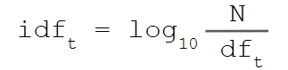

Where N is the number of documents. We use log N/df_t instead of N/df_t as a heuristic to "dampen" the effect of the inverse document frequency.

Term Frequency-Inverse Document Frequency (TF-IDF)

We combine the term frequency and the inverse document frequency to assign tf-idf weight w to each term t in each document d:

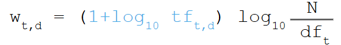

The weight:

- Increase with the number of occurences of a term within a document
- Increase with the rarity if the term in the collection

Note: We use log-scaling of term frequencies and assume tf_(t,d) > 0 (otherwise, we set w_(t,d)). Other approaches are possible and there is no rigorous formal reasoning behind this choice. In practice, experiments help to determine suitable scaling methods.

TF-IDF weight matrix

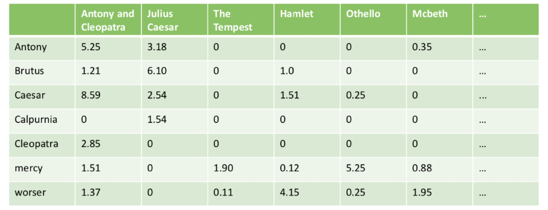

Each document is now represented by a real-valued vector of tf-idf weights

- Weights encode frequency information of terms in documents
- Frequencies of terms in a documents are normalized by the number of documents inwhich the term occurs

## Document Similarity[++]

Documents as vectors

Each document is now represented by a real-valued vector of tf-idf weights

- Terms are dimension (= axes) of the corresponding vector space
- Document are points or vectors in this space
- The vector space is very high-dimensional due to vocabulary size: Tens of millions of dimensions when building a search engine at web scale
- Individual vectors are very sparse: most entries are zero

How is this helpful in quering?

- Idea: Find documents vectors that are similar to the query vector in this space -> Finding close points in a vector space is a well-researched

Measuring Distances in Vector space

Intuitively: Use Euclidean distance between query vector and document vector

- The Euclidean distance between query and document will be large.
- This is true even if the distribution of terms in the query and the ditribution of terms in the document are very similar
- Reason: Euclidean distance is large for vectors with mismatching components -> Curse of dimensionality

Curse of dimensionality

Problem:
- When the dimensionality increases, the volume of the space increases exponentially
- Word vector spaces have very high dimensionality

Using Angular Similarity

Solution: 
- Rank documents according to their angular distance from the query

Thought expeiment:

- Take a document d and append it to itself. Call this document d'
- "Semantically" d and d' have exactly the same content
- The angle between the two documents is 0°, corresponding to maximal similarity
- But: the Euclidean distance between d and d' scales with the number of tokens in document d

## Cosine Similarity[+++]

Since cosine is monotonically decreasing function for the interval [0°, 180°], the following two notions are equivalent:

- Ranking documents in decreasing order of the angle between query and document
= Ranking documents in increasing order of cosine(query, document)

# Language Models

What are language Models[+]

Language model:

A lnaguage model is a probability distribution over sequences of words.

By using a language model, we can assign probabilities to words, given a sequence of other words. That is, we can predict the occurence of words.

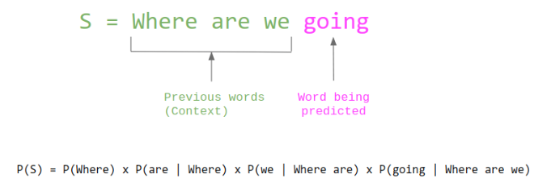

Language model examples:

- n-grams
- Static embeddigns
    - Word2Vec
    - GloVe
    - FastText
    - etc
- Contextualized word embeddings
    - Bert 
    - Llama
    - GPT-2/ GPT-3 / GPT-4
    - DeepSeek R1
    - Etc.

## Limitations of discrete models of language[+]

A core NLP task: Word similarity

Many applications in text processing and information retrieval rely on word similarity as a core task that needs to be solved

- Spell chekcing
    - Similarity between individual words
- Search
    - Similarity between a sentence and the content of a document
- Duplicate Detection
    - Similarity between two documents
- Summarization
    - Removal of redudant (= similar) sentences in a document
- Translation
    - Finding a similar words in a different language

A similarity between sentences or documents can often be derived from word similarities

Word similarity in manually created models

models like WordNEt are a great resource that can be used to compute word similarities. But:

- WordNet is missing nuance
- WordNet is missing new meanings of words until they are added
- WordNet is subjective and biased by the annotators' perspective
- Requires constant human labor to create and update

One-Hot Vector Encodings

In the vector space model, we are using a localist representation:

- The dimension of the vector space is equal to the vocabulary size
- Each word (or lemma, or stem) corresponds to exactly on dimension
- A single word is encoded by a one-hot vector:
    - All but one vector components an equal to 0 (these components are "cold")
    - Only the component in the dimension that corresponds to the owrd itself has a value of 1 (the component is "hot")
- Individual word vectors are othogonal by definition 
- There is no notion of word similarity in the vector space model

Fundamental  limitations of the Vector Space Model

The vector space model is designed to compare sequences of text based on the words they contain. But even that is problematic.

Historical solution in information retrieval: Query expansion

- Keep a dictionary of similar words and use it to expand the queries
- E.g., if a user searches for motel, also add hotel to the query

Query expansion is a (set of) heuristic(s) specifically designed to work around the inability of the vector space model to represent semantic meaning.

Dense word Vector representations

In theory:

Instead of a term-document matrix, we want a term-concept matrix, in which each word is ranked according to the strength of its relation to a semantic concept.

- hotel and motel are very similar and differ mostly in room price and the quality of service/
- They are both similary low on a scale that rates the relevance for teaching, while an university is higher on that scale.

The rows of such matrix could then be used as vector representations of the words. Similar words would have similar vectors.

## Word embeddings [+]

Word Embeddings: Definitions

Embedding of words:

Given a training corpus, the embedding of words is the process of assigning a vector (in a latent space) to each word, based on the content of the corpus (by using some algorithm)

Word Embedding:

The vector that is assigned to a word as the result of the above process is often called the embedding of the word.

Latent Space

A latent space(also called embedding space) is a vector space in which items are placed in such a way that similar items are placed in proximity. Typically (but not always), latent spaces have a lower rank (dimensionality) than the original space of the data.

Embedding Spaces for Words

For creating word embedding, the embedding algorithm should:

- Place similar and/or related words in close proximity in the latent space
- Use word (co-)occurence information from the corpus
- Work without supervision (labeling data at this scale is infeasible)

Embedding Pipeline:

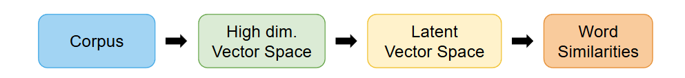

## Latent Semantic Analysis(LSA)[--]

Dimensional reduction of Term-Document Matrices

Core idea: Use dimensionality reduction techniques to reduce the corpus dimension to a manageable size (e.g., n = 300) but leave the vocablary dimension as it is. The resulting row vectors are dense and capture information regarding the occurence of words in the documents.

Formal approach:

- Compute a singular value decomposition A = UDV of the term-document matrix A
- Reduce the number of dimensions to retain only the k most important dimensions
- Use the row vectors of U_k as word embeddings

Disadvanteges of LSA:

Latent semantic analysis has a few downsides:

- It works sorely based on global cooccurrence statistics (it only knows whether words occur in the same documents)
- It does not enable us to use compostional semantics

## Word2Vec[++]

The cloze Task:

The cloze test is a fill-in-the-blank style examination task. For example, we can esaily fill in this blank:

Natural language processing is all about _____ models.

When using word2vec to create word embeddings, we are essentially training a computer to solve this task on two variations:

- Given some context, learn to predict a missing word. (this is called continous bag of words or CBOW).
- Given a word, learn to predict the context (this is skipgram)

From a corpus to training: skipgram

We generate training data by:

- Iterating over the corpus step-by-step with a fixed window size
- Extracting pairs of the input word in the center of the window and one target word

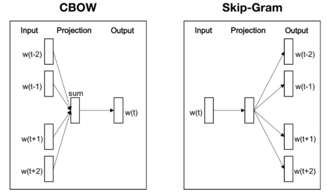

Generating training data for CBOW works the same way, except input and target words are reversed.

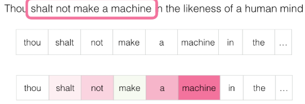

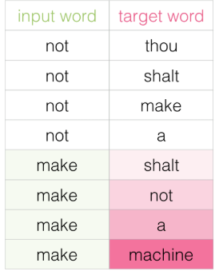

We have so far generated only positive example(words that actually do cooccur)

- Training a classifier only on this data would be pointless!
- Learning nothing and always predicting cooccurrence would result in perferct accuracy -> We need to add negative examples by picking random output words

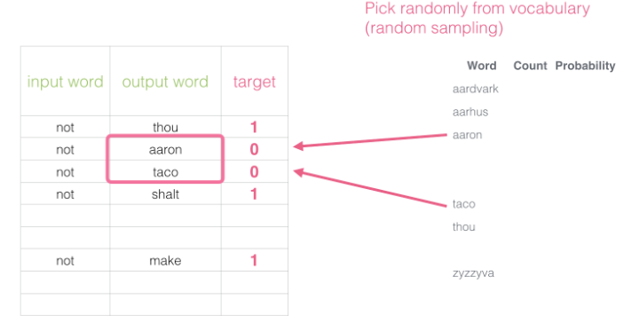

word2vec: model initialization

word2vec is a shallow network architecture with just two layers. The layers are an embedding layer (used for learning representations of the input words) and a context layer (used for learning representations of the output words).

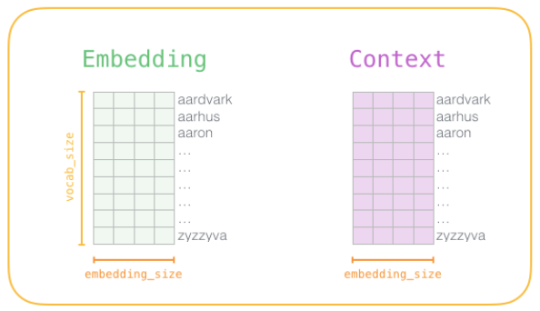

When training word2vec, we repeatedly itertate over the trainind data.

- For each input word, we find the corresponding row in the embedding matrix and retrieve the current embedding
- For the positive and negative output words, we find the corresponding rows in the context matrix and retrieve the current embeddings

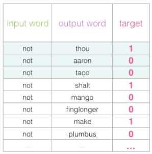

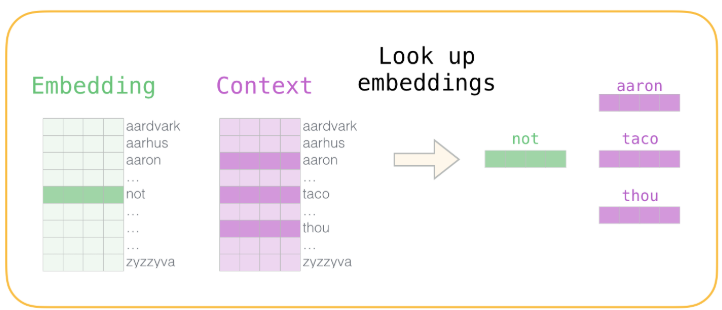

For each embedding-context pair, we compute the dot product(~ cosine similarity)

- The similarity is used to predict the likelihood of the targer occuring in the context
- We use the error to update the embeddings in both matrices
- This process is repeated for multiple cycles over all data points until it converges

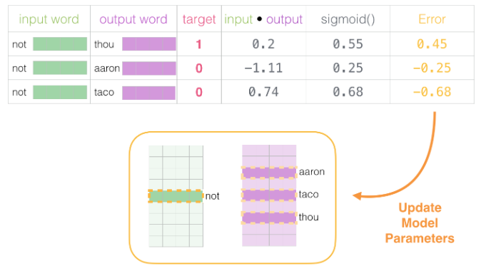

Word2vec: output

After convergence is reached, we discard the context matrix and use the embedding matrix for our word embeddings. Each row contains the embedding of the corresponding word in the vocabulary.

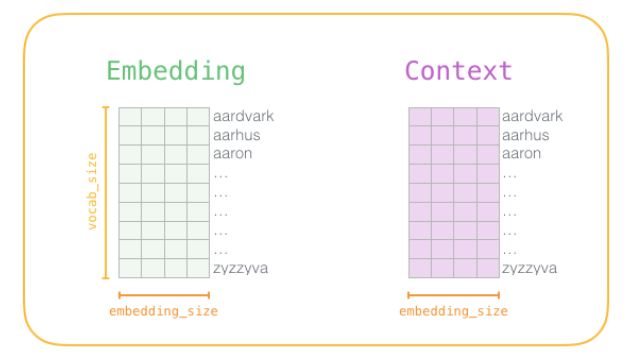

How word2vec: works intuitively

Why does word2vec produce word embeddings that produce meaningful word similarity?

- During initialization, each word starts at a random location in the latent space
- During training, each word is pulled closer towards frequently cooccuring words
- During trainind, each word is pushed away from non-cooccuring words
- Words end up in the proximity of other words that occur in similar contexts
- Think of it as similutaneous hign-dimensional tug-of-war

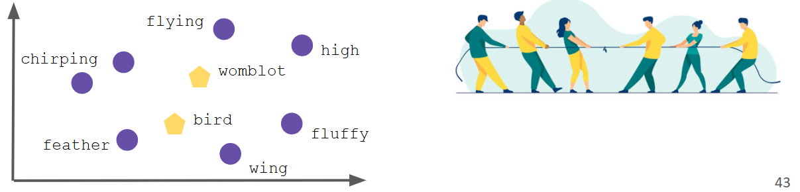

## Compositional Semantics [+]

Additive compositionality

Word2vec was created with the idea of supporing arithmetic sultion of analogy tasks:

king - man + woman = queen

Compositional semantics in a Nutshell

The idea behind compostional semantics:

- Common semantic concepts are implicity encoded as directions in the latent space
    - Gender
    - Verb tenses
    - Country/capital relations
    - etc.

- The relevance of this is hard to overstate: Being able to arithmetically solve semantic challenges on data from an unsupervised model is a huge step towards machine intelligence!

Word of Caution: Similarity != Relatedness

Word embeddings can be used for many downstream applications. Make sure that the assumptions used when applying them match the assumptions made during training.

# Contextual Language models

## Polysemy and contextualization [+]

Embedding polysemous words

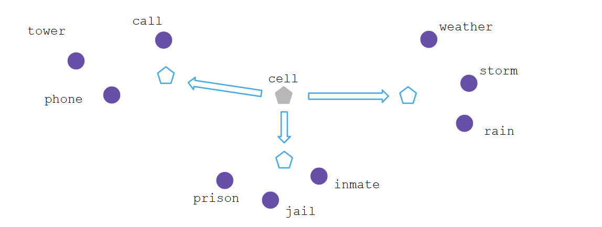

Polysemous words are common. A single embedding per words is unsufficient

How (not) to handle polysemy

Naive approach:

- Perform word sense disambiguation on the entire corpus
- Create embeddings of the disambiguated words

Problems of the naive approach:

- Error propagation (word sense disambiguation is hard)
- Requires labeled training data (unlike the embedding methods)
- The vocabulary size explodes
- We also need word sense information when using the embeddings

## Machine translation [-]

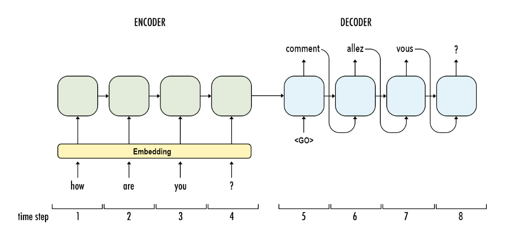

## Seq2seq learning with RNNs/ LSTMs [+]

Recurrent Neural Networks (RNN)

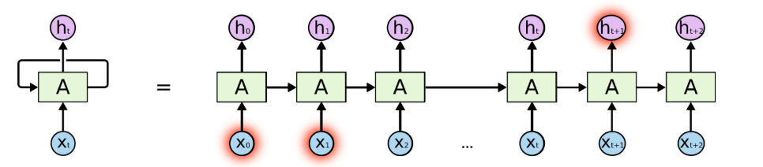

Sequence to sequence learning with an RNN:

- At each time step t, the neural netowrk A looks at some input x_t and outputs h_t
- Information from step t is passed to step t + 1 in a loop
- The number of iterations of the loop depend on the length of the sequence
- The loop notation can be unrolled into individual steps
- The more iterations, the more likely the model will forget previously seen information

RNN architecture 

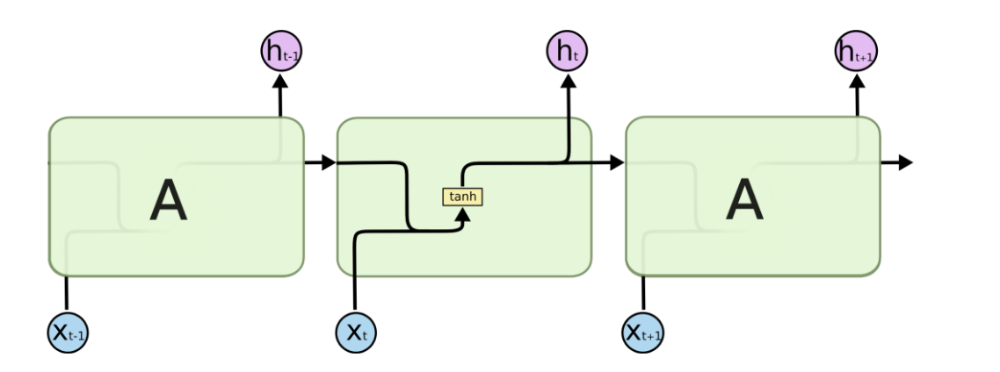

Long Short-Term Memory Networks (LSTM)

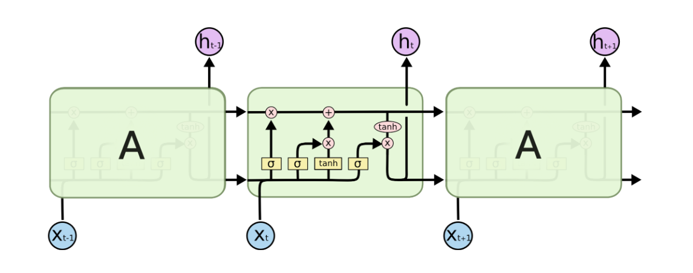

Intermediate Context Vectors 

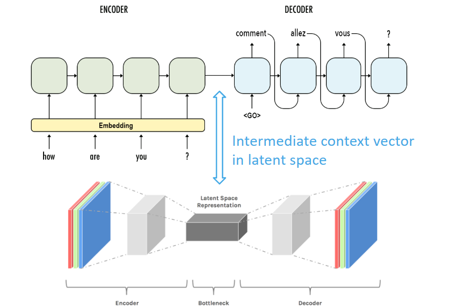

From a translator to Sentence Embeddings

Seq2seq learning for translation:

- Words in the input sentence are encoded as word embeddings
- Word embeddings are fed sequentially into a RNN / LSTM model
- In each step, the input is used to update an internal context vector
- A memory mechanism is used to keep track of relevant prior information
- The combination criteria for input, memory,  and context vector are learned
- To generate the translation, the steps are "reserved" by a decoder

Sentence representations from translations:

- The context vector that is passed form encoder to decoder lies in a latent space
- The context vector contains the semantic information of the input sentence
- A translation LSTM without a decoder is a sentence embedder

Embeddings words in context

Consider two english input sentences:

- The couple lives in a house in a forest
- The couple lives in a house in a desert

The encoder creates a context vector for these sentences. An English - German decoder would generate German words one by one and "update" the context vector:

- Das Paar lebt in einem Haus in [location]

The context vector and memory in the final generation step retain the semantic information for forest or desert (since we have generated all other words already)

Under the assumption that our model supports some kind of compositionality, we now have an intuition how to encode a word and its context in a single vector. -> We have the building blocks to contextualize word embeddings.

The problem with memory and LSTMs

Downsides of using memory:

- Forgetting is still a oroblem, even for LSTMs
- We cannot "remember" the future
- ... but sentence ordering is flexible in many languages

Downsides of LSTMs/ RNNs

- Sentence are read sequentially
    - Good for dealing with varying sentence lengths
    - Bad for paralleliztion (for example in GPU)
- Processing a sentence word by word without the ability of backtracking is defferent from natural human reading behavior

Example:

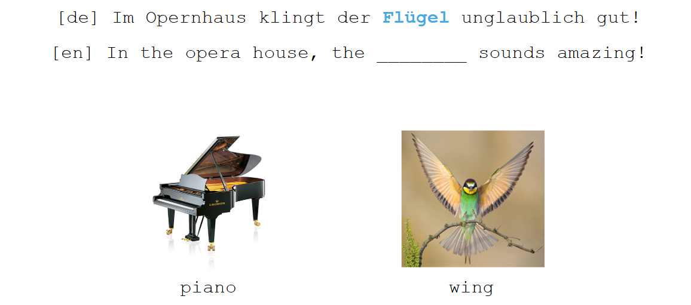

## Attention [+]

As an alternative approach to memory, we can consider attention mechanisms:

- We process all words of a sentence concurrently (instead of sequentially)
- Instead of learning to remember, we learn how to pay attenrion to the parts of a sentence that are important to a given word
- This is called self-attention since we focus on other words in the same input sentence.
- Grounded in syntactic/semantic relations in natural language

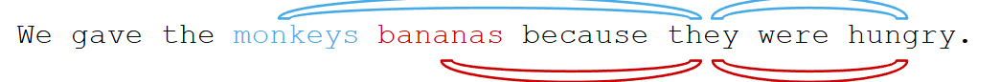

How attention works in principle:

- All words in a sentence are encoded as vectors (e.g. pre-trained word embeddings)
- All words are fed into the model in parallel, each word in its own "lane".
- For each word, the model learns weights that are used to determine how important other words in the sentence are. (show for hte word: they)

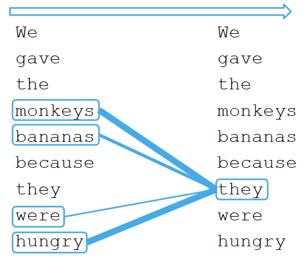

## Transformers [+]

The transformer model:

- Originally designed for machine translation
- Input: Sentence in language A
- Output: Sentence in language B
- Encoder:
    - Processes all words of the input sentence in parallel
    - Uses attention to determine word relations
    - Outputs one vector per input word
- Decoder:
    - Sequentially processes vectors created by encoder (similar to LSTM decoder) but has access to all vectors
    - Predict output words one at a time.

Data processing

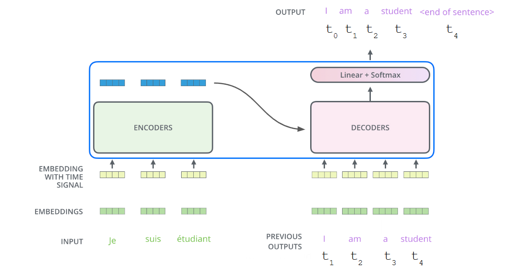

## BERT[++]

BERT - Bidirectional Encoder Representations from Transformers

BERT is a contextual language model, based on transformers:

- it uses only encoders (12 transformer layers)
- Bidirectional links connecting the "lanes" between layers
- Trained on ~3.3 Billion words (Wikipedia & Google Books corpus)
- Created with transfer learning in mind:
    - trained on 2 simple unsupervised tasks
    - Can be fine-tuned for numerous complex tasks (for which few labeled data are available)
- Due to the transformer's attention mecahnism, we get contextualization "for free"

Training data for BERT

BERT uses two tasks for training, which can be generated from arbitary texts without manual labelling or supervision:

- Masked language modeling (MLM)
    - this is the cloze taks we already know
    - Example: Today is a good day to [MASK]
    - Unlike word2vec, BERT uses the signal from all other words in the context simultaneously for this prediction(using attention to determine weights)
- Next sentence prediction (NSP)
    - Given a sentence, the model has to predict the next sentence
    - Modeled as a classification problem: Given a sentence A and B, does B follow A?

Bert Input representation

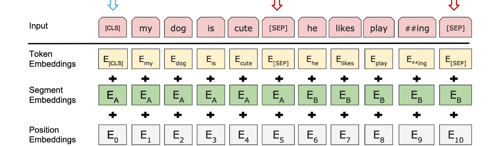

BERT accepts input in a fixed-length window of at most 512 tokens:

- Input starts with a special [CLS] token
- Input may contain two separate sentences which are separated by a [SEP] token.
- The second sentence is optional

Training setup

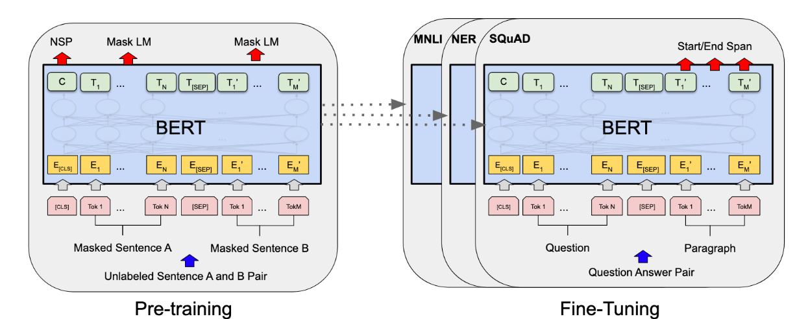

Contextualized embeddings: Bert encoder layers

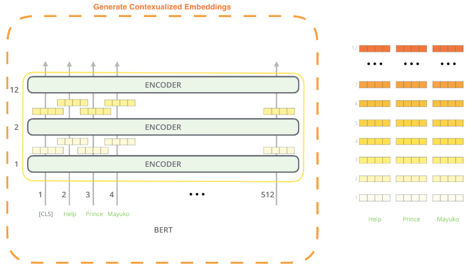

in principle. feature vectors from any layer can be used as embeddings, depending on the task at hand

BERT produces feature vectors for each token in each of its 12 transformer layers. Due to the attention mechanism, they capture different aspects of the input tokens.

Tasks supported by BERT (via Transfer Learning)

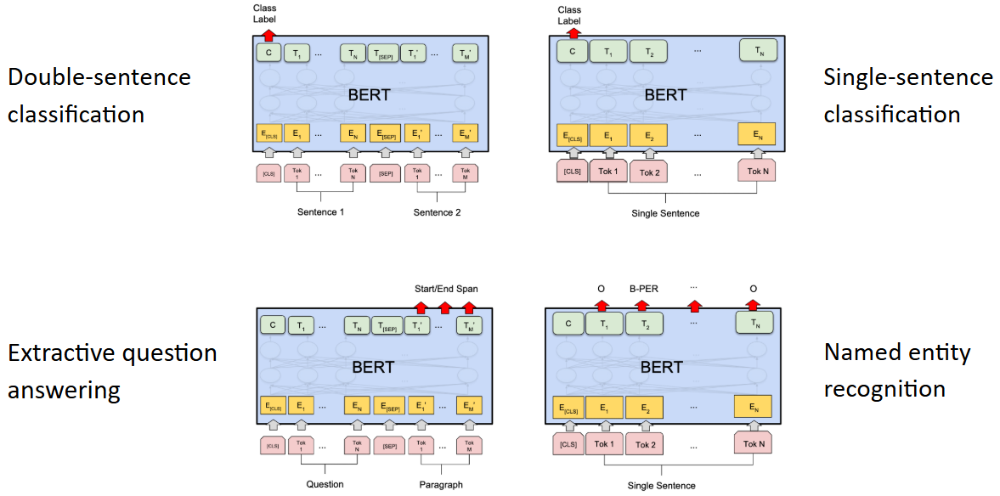

Word-piece Tokenization: Token != Word

- Most languages have millions of words
- Most words are very rare
- Using a large vocabulary increases the size of the model

In practice, contextual language models use word piece tokenization:

- Think of it like morphological decomposition...
- ... but driven by statistics, not linguistic insight

-> keep this in mind when extracting word embeddings from BERT!

# Text mining 

## Text classification [+]

Text classification: Given a set of documents (a corpus) D and a set of classes C, assign  a class c ∈ C to each document d ∈ D. Classification is superveised learning task(we need labels)

Example applications:

- Tracking and filtering of news articles by topic
- Organizing web pages into category hierarchies
- Sorting scientific articles on arxiv,rog by discipline
- Encoding patient records using international insurance categories
- E-mail message filtering (aka spam detection)
- Categorizing DocAna lecture context into (exam relevant) and (I'll maybe read it later...)
- Etc.

## Typical text classification tasks [+]

Manually created rules(hand-coded):

- Rules are typically based on combinations of words or other features
    - Spam detection example: black-list-address OR (dollars AND you won)
    - Author gender: fraction(pronouns) > 0.058
- Advantage:
    - Easy to achive high precision if rules are carefully defined by experts
- Disadvanteges:
    - Recall tends to be low since rules are not comprehensive
    - Creating and maintaining these rules is expensive

The (very typical) solution: we instead train a classifier on a labeled training corpus (i.e., supervised learning)

## Naive Bayes Classifier [++]

Naive Bayes Classifier:

- A simple yet efficient word-based classifier for documents
- Relies on a simple bag-of-words representation of documents
- Naive relates to the underlying assumption of independce:
    - We assume that features (here: words) are statistically independent of each other
    - This is obviously a strong simplification (e.g., consider the relation between determiners and nouns)
- Based on Bayes rule:

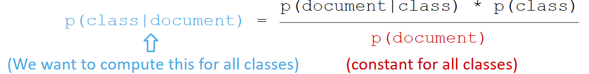

Overview

Training input:

- A collection of N documents
- A set C of classes c_k ∈ C for k = 1,2, ..., |C|
- The vocabulary V of all words w_i ∈ V for i = 1,2, ..., |V|

Input at prediction time:

- A new document d consisting of words w_1, w_2, ..., w_n

Desired output:

- The most likely class class(d) of document d

Class porbability

To determine the most likely class for document d, we want to find:

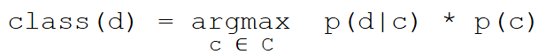

But how do we obtain p(d|c) and p(c)?

Computing p(c) from our training data for all classes c is simple: it is overall frequency of each class in our training data. Thus:

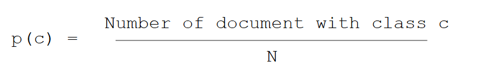

To compute p(d|c), we rewrite p(d|c) = p (w1, w2, ..., w_n|c) since d consists of these words (bag-of-words assumption). Then we use the independence assumption to further rewrite:

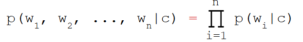

Computing the individual p(w_i|c) from our training data is also simple: It is overall frequency of word w_i in all documents with class c.

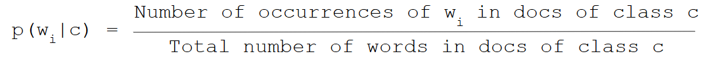

Putting the components together

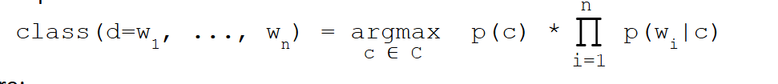

, where:

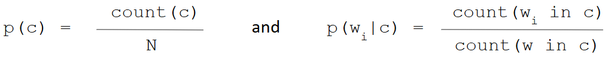

are estimated on the training corpus, with:

- N: number of documents
- w_i: a specific word occuring in document d
- w: any word in the training corpus
- c: a specific class from C

Laplace smoothing

The algorithm has one major weakness: What happens if a new document d contians a word w_i that never occurs in even a single class in the training corpus?

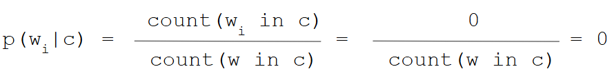

And thus:

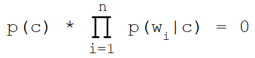

To avoid this, we add a small constant and normalize accordingly:

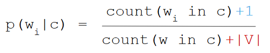

Update Version:

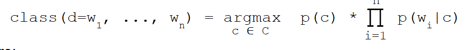

where:

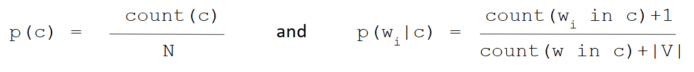

are estimated on the training corpus, with:

- N: number of documents
- w_i: a specific word occuring in document d
- w: any word in the training corpus
- c: a specific class from C
- |V|: size of vocabulary of the training corpus

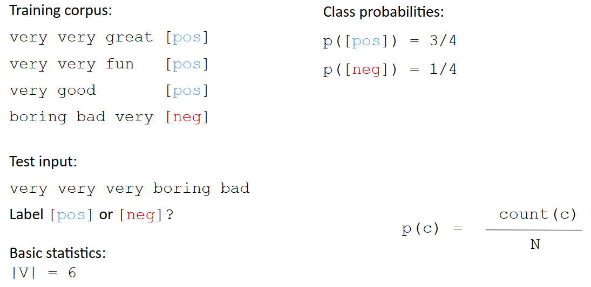

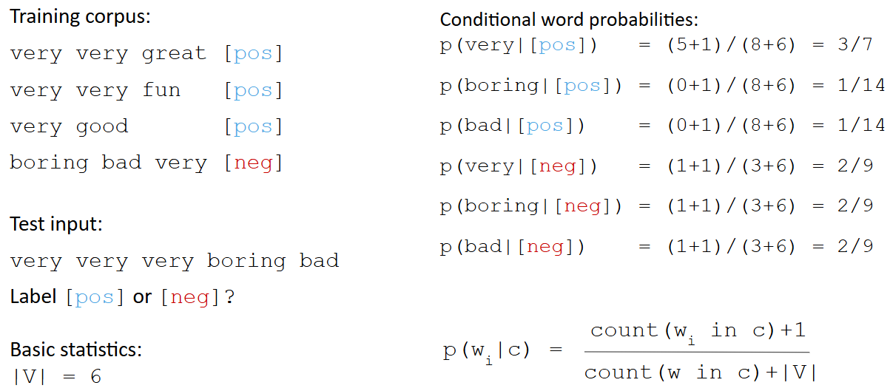

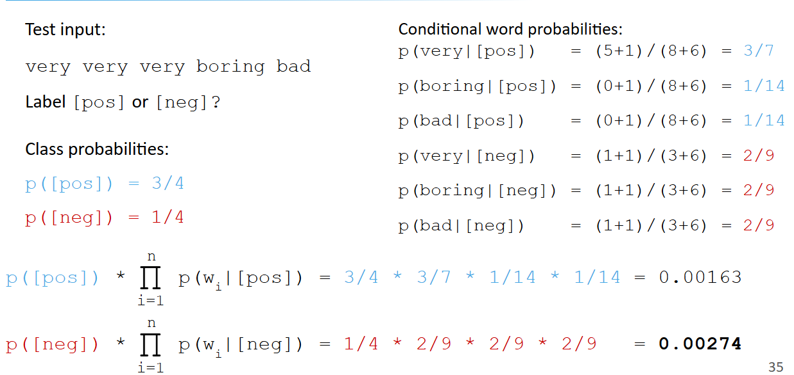

Using General classification Algorithms for Text

There are plenty of classification algorithms available ...

- Decision Trees
- Random Forests
- Support Vector Machine (SVM)
- Gradient Boosting
- Deep Learning

But they don't work out of the box. We need features to represent the documents. Typically, features are vectors, so we can use:

- Word counts
- TF-IDF vectors
- Word/ sentence / document embeddings
- Etc. 

## Features for text classification/ clastering [+]

Many further features can be extracted:

- Word counts
- Casing
- Word/character n-grams
- Punctuation
- POS tags

Non-linguistic features

- Document formating
- Encoding sequences (e.g., &lt)
- Metadata

Some feature may be more useful than others, depending on the class labels:

- Readability
- Writing style
- Sentiment
- Trustworthiness of news articles
- Suitability for children
- Language detection
- ...

Even modern deep learning methods suffer from bad feature selection and lack of good pre-processing. Garbage in, garbage out!

Classification with contextual language models

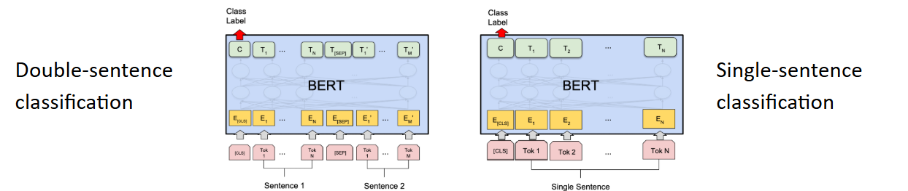

Transformers-based language models are designed for transfer-lerning

- The final layer can be replaced or adapted
- Arbitary classification tasks are possible(in thoery)
- Fine-tuning on labeled data imporves the classification performance

Text clustering:

Given a set of documents (a corpus) D, clustering is the task of separating the documents d ∈ D into clusters such that documents in the same cluster are similar and documents in different clusters are dissimilar. Clustering is an unsupervised learning task(no labels)

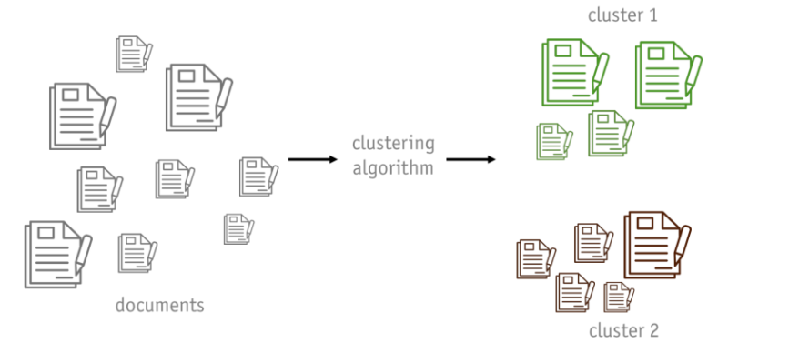

Clustering algorithms and features for text

Many clustering algorithms can be applied to text:

- k-means
- DBSCAN
- Hierarchial agglomerative clustering
- Spectral clustering
- Guassian mixiture models
- ...

Features for clustering:

- Clustering typically works on vector data
- All the cavears of feature selection we  discussed for classification apply

Which algorithm and features you should use depends on the use case (as usual):

- Do you know how many clusters there are in the data?
- Do you want to create a hierarchial grouping of documents?
- What semantic differences/similarities should exist between clusters?

## Topic modeling[+]

Text clustering vs. Topic modeling 

If we use appropriate features and similary metric, clustering can be used to identify groups(= clusters) of documents that have similar content (= talk about hte same things).

- What is the problem with that output?
- We don't know what the documents are about!

Topic models:

Statistical methods that analyze the words of the documents to discover common themes and how these themes are connected to each other.

Application of Topic Models

Topic models can be used, for example, to:

- Uncover themes(= topics) in document collections:  Detect common topics in the documents(e.g., genres in books)
- Recommender systems:  Determine topical realtions to recommend articles with a similar topic structure to a reader
- Semantic drift analysis: Detrmine how the co-usage of words changes over time.
- Etc.

Topic models are based on two basic assumptions:

- Each document consists of distribution over topics
- Each topic consists of a distribution over words

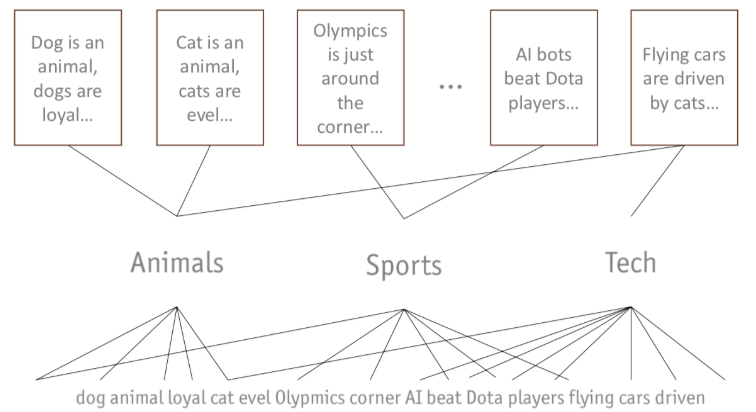

Probabilistic Topic Modeling Algorithms

While there are many algorithms, probabilistic models are the most common:

- LDA(Latent Dirichlet Allocation) is the most widely used model
- LSA or LSI: latent semantic analysis or latent semantic indexing
- NMF: Non-Negative Matrix factorization

## Matrix factorization [--]

?

## Latent Dirichlet Allocation (LDA)[-]

Assumptions:

- The order of words in the document does no matter (bag-of-words)
- The order of documents does not matter
- The number of topic is known and fixed

Topic assigment alogrithm (using Gibbs sampling):

- Assume there are k topics across all documents d
- Assign each word occurence (= tokens) w to a topic at random
- For each token w in document d,
    - Assume its topic is wrong (but every other assigment in d is correct)
    - Probabilistic assign token w a new topic based on:
        - The topic of other in d
        - How often occurrences of word w in other documents have been assigned a particular topic
- Repeat this process for each document until it converges

# Relation extraction and Sentiment analysis

## Relation extraction task[+]

?

## Relation extraction methods [+]

Intuition for a simple, rule-based relation extraction framework:

If the mention of a hyponym and hyperonym in a sentence are connected in a cleraly distinguishable pattern, we can construct a rule to extract the relation.

Example:

- Agar is a substance prepared from a mixture of red algae, such as Gelidium, for laboratory or industrial use.
- A human can easily answer the question: What is Gelidium?
- We can create a rule: ... X, such as Y ... -> Y is a type of X

Hand-written rules for hyponym extraction

We can expand the set of patterns to cover similar linguistic constructs and create a set of extraction rules:

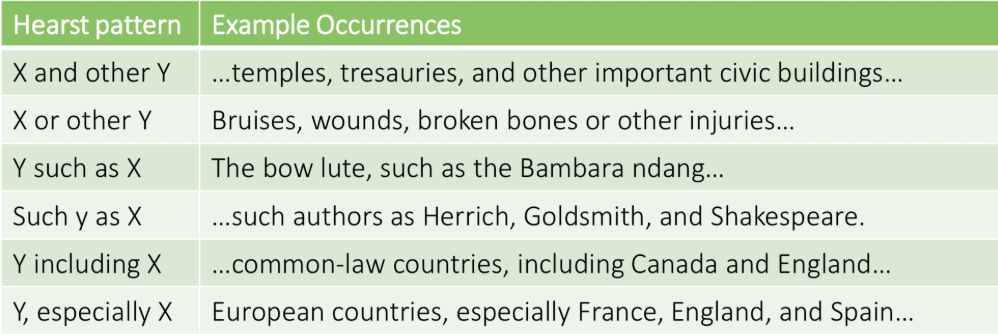

Advanteges:

- Manually curated rules tend to have a high precision
- Can be tailored to specific domains

Disadvanteges:

- Manually curated rules often havelow recall
- A lot of manual work is required to maintain rulesets

In other words:

- The usual caveats apply
- How can we improve this approach?

Sidebar: Bootstrapping

Bootstrapping:

A self-starting process that continues and/or grows without further external input.

-  The name is derived from the idea of "pulling oneself up by one's won bootstraps", describing an impossible task.
- Similar idea to the story of Baron Munchausen, who pulled himself (and his horse) out of a swamp by his hair.

Similar concept in statistics:

Bootstrap sampling to simulate having multiple different data sets (although you only have one) by repeatedly sub-sampling a single data set, for example to derive confidence intervals.

Leveraging Named entities for pattern discovery

In a knowledge base, relations are typically encoded as triples:

- [Alan Turing] (PER) was employed by the [University of Manchester] (ORG)
- We can use such templates to identify patterns in which relation may oocur in a corpus: [PER] was employed by [ORG] -> entity types can help us create pattern templates

Distantly supervised Relation Extraction

Intuition:

Starting with a few seed entites, find cooccurrences of these entites to identify patterns. Use the patterns as templates for discovering new enitites. Repeat.

Example:

- Seed entitites: [Alan Turing] (PER) and [Univeristy of Manchester] (ORG)
- Matching cooccurence in a corpus:  [Alan Turing] (PER) was employed by the [UOM] (ORG)
- Extracted pattern:  [PER] was employed by [ORG]
- Finding other occurences of the pattern in the corpus: [Richard Feymann] (PER) was employed by [Cornell University] (ORG)
-  New entities: Richard Feyman and Cornell University

Distantly supervised relation extraction in a Nutshell

Advanteges:

- We only need minimal input (a few seed enitites or patterns) -> semi-supervised approach (also called distant supervision)
- System learns to extract new relations on its own
- Improved recall

Disadvanteges:

- A trade-off between precision and recal becomes necessary: when do we stop mining for more rules?
- Recall is still not perfect - not all realtions (always) occur in obvious patterns

Supervised methods can be used for relation extraction by following the usual approach.

Setup and desing:

- Define a set of relations for extraction
- Selection a set of relevant named entities

Data:

- Compiling a representative training corpus
- Labeling named entities in the corpus
- Annotating relations between these entites (manually or pattern-based)

Training classifier:

- Naive Bayes
- SVM
- ...

Feature examples for supervised relation extraction

Example sentence: american airlines, a unit of AMR, immediately matched the move, spokesman Tim Wagner said.

Enity-based features:

- Entity 1, type - ORG
- Entity 1, head - airlines
- Entity 2, type - PER
- Entity 2, head - Wagner
- Concatenated type -  ORGPER

Word-based features:

- Between-entity bag-of-words {a, unit, of, AMR, immediately, matched, the,   move, spokesman}
- Word(s) before entity 1 - None
- Word(s) after entity 2 - said

Syntactic features:

- Constituent path

NP ↑ NP ↑ S ↑ S ↓ NB

- Base syntactic chunk path

NP → NP → PP → ADVP → VP → NP → NP

- Typed dependency path

Airlines <- [subj] matched <- [comp] said [subj] -> Wagner

Neural language models for relation extraction

Pre-trained contextual language models can be used to build relation extraction pipelines by leveraging what the model has learned about word relations (e.g., via attention): 

- This is transfer learning. The model is
    - Trained on an unsupervised task, and
    - fine-tuned for relation extraction.
- Adaptation of an annotation task:
    - Given a sentence with masked entites, the model is trained to label tokens with relation types.
- Adaptation of extractive question answering:
    - Given a sentence and the question "How are entites A and B related", the model outputs begin and end token indices of the relation in the sentence.

Supervised relation extraction in a Nutshell

Advanteges:

- we can obtain high accuracy (both precision and recall) as long as we have sufficient labeled data

Disadvateges:

- Data hungry: requires a lot of labeled training data
- Often poor perfomance when adapting from one to domain to another (but transfer learning techniques can be helpful)

## Sentiment analysis applications and tasks [+]

Sentiment analysis:

Broadly speaking, sentiment analysis describes the tasks of identifying, extracting, quantifying, and studying affective states of the authors and expressed subjective information in text.

Example: positive and negative movie reviews

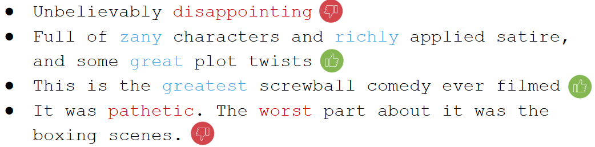

Applications

- Movies: is this review positive or negative?
- Products: what do people think about the new iPhone?
- Public sentiment: how is consumer confidence?
- Politics: what do people think about this candidate or issue?
- PredictionL predict election outcomes or market trends from sentiment
- Feedback: mine user feedback for suggestions or critisism
- etc.

Tasks:

the defenition of sentiment analysis is often vague.

Alternative names:

- Opinion extraction
- Opinion mining
- Sentiment mining
- Subjective analysis
- ...

Related detection/ classisfication tasks:

- Subjectivity
- Bias
- Stance
- Hate-speech
- Sarcasm
- Deception and betrayal
- Online trolling
- Polarization
- Politeness
- Linguistic alignment
- ...

## Scherer typology [-]

Emotion: brief organically synchronized [...] evaluation of major event

- angry, sad, joyful, fearful...  

Mood: diffuse non-caused low-intensity long-duration change in subjective feeling

- cheerful, gloomy, irritable... 

Interpersonal stances: affective stance toward another person in a specific interaction

- friendly, flirtatious, distant, cold... 

Attitudes: enduring, affectively colored beliefs, dispositions towards objects or persons

- liking, loving, hating, valuing, desiring... 

Personality traits: stable personality dispositions and typical behavior tendencies

- nervous, anxious reckless, morose...

## Features for sentiment analysis [+]

Sentiment analysis is the detection of attitudes:

- Who is the holder of the attitude
- Who is the target of the attitude
- What is typer of attitude? Type of attitude:

    - From a set of types like, love, hate, value, desire, etc.
    - More commonly: simply weighed polarity: positive, negative, neutral (together with strength)

- Text containing the attitude

    - Sentence, paragraph, or document

For sentiment classification, most classifiers can be used. As usual, the art lies in selecting and extracting good features and addressing challenges.

Challenges in extraction of features include:

- Tokenization
- Stemming
- Negation
- Subtleties (or: the limits of features that do not capture semantics)

Tokenization

Punctuation is typically removed or collapsed in preprocessing. But for sentiment analysis, it may contain valuable signals

- Repetition pf punctuation for emphasis

    An amazing movie vs. An amazing movie !1!!

- Masked for expletives i !@#$ing hate data cleaning!
- Emotions are mostly punctuation, but may carry some sentiment signal than most words.

Stemming

Stemmers heuristically identify word suffexes and strip them, with some regularization of the endings. This runs the risk of merging tokens with positive and negative connotation.

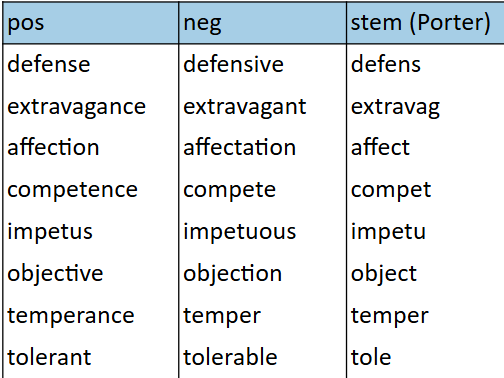

stemming can be helpful for pooling the signal, but choose the stemmer with caution!

Negation

Negation reverses the polarity of certain words:

- This move was good vs, the move was not good
- I recommend this product vs. I do not recommend this product

Wordaround: Simple negation marking,

We append a _NEG suffix to every word that occurs between a negation and the nex punctuation mark at the level of the current clause.

This movie was not good, but the popcorn was great.  This movie was_NOT good, but the popcorn was great. I do not recommend this product. I do not recommend_NOT this_NOT product_NOT.

Drawback: the vocabulary size just doubled...

## Sentiment Lexica[--]

MPQA subjectivity cues Lexicon

- 6,885 words from 8,221 lemmas

    - 2,718 positive
    - 4,912 negative
- Each word annotated for intensity (strong, weak)

- published under GNU GPL

SentiWordNet

- Extension of WordNet with sentiment valuse. All synsets automatically annotated for degrees of positivity, negativity, and objectiveness
- [estimable (J, 3)] may be computed or estimated Pos 0, Neg 0, Obj 1
- [estimable (J, 1)] deserving of respect Pos 0.75, Neg 0, Obj 0.25

Of course, pre-trained contextual language models can be fine-tuned for sentiment analysis:

- This is transfer learning. The model iis
    - Trained on an unsupervised task, and
    - fine-tuned for sentiment analysis

- Adapatation of a classification task:
    - Given a sentence determine to which sentiment class it belongs.

- Adaptation of a regression task:
    - Given a sentenve output a sentiment score

## Quotation attribution [--]

?

# Summarization and question answering

## Transfer learning and fine-tuning[++]

Pre-training:

- The model is trained on large corpus
- Labeled data is generated heuristically (for example using Cloze task)
- The task for which model is trained is typically not useful

Fine-tuning:

- The pre-trained model is re-trained with less data for a specific application task.

The concept of training a model on one task and later using/adapting it for another task is called transfer learning.

## Zero-shot and few-shot learning [++]

Zero-shot learning:

The language model is used for a task for which it has not been trained or fine-tuned.

Few-shot learning:

The language model is provided task-specific information at inference time (without fine-tuning) through specially engineered prompts that provide examples or templates for a task. This is also called in-context learning.

One-shot learning:

Special case of few-shot learning with a single example

## Prompt Tuning[-]

Prompt tuning:

- The language model's parameters are frozen (not trained anymore)
- A smaller model is trained to "translate" prompts into input vectors for the language model (soft prompts)

## Information-retrieval-based QA [+]

Information-retrieval-based QA:

- Identify suitable query terms from the question
- Retrieve suitable documents from a large text corpus
- Extract an answer from retrieved documents

Question processing

Question processing is used to extract information from the question that is needed to retrieve documents containing an answer

Steps typically include:

- Querly Formulation 
    - Selection of query keywords for the Information Retrieval system

- Answer Type Detection
    - Detection of the named entity type of the answer (person, place)

- Question Type Classification
    - Classification of questions (math questions, a list of items, etc.)

- Relation Extraction
    - Detection of relations between entities in the question

Passage retrieval

PAssage retrieval os used to retrieve snippets that may contain an answer from a large corpus of unstructured text.

Steps typically include:

- Document Retrieval
    - Information Retrieval engine is used to retrieve documents using the query terms (e.g. TF-IDF weights/ cosine similarity)

- Document Segmentation
    - Documents are segmented into shorter units (passages)

- Passage ranking
    - Passages are ranked by likelihood of containing an answer. Answer type/ Question type can be used in this step

Answer processing

Answer processing from the retrieved passages is a typical classification task. Typical approaches include:

- Rule-based answer extraction
    - Manually created rules are used to find suitable answers for a given type of question (e.g., based in named entity tags)
- Feature-based answer extraction
    - Typicall NLP features are used to train machine learning classifiers (e.g., POS tags, NER tags, etc.)
- Neural answer extraction
    - A pre-trained transformer model is fine-tuned to detect spans containing answer
    
## Knowledge-based QA[-]

Knowledge-based QA:

- Parse the questions to generate knowledge-base queries
- Retrieve an answer from a knowledge base (using automated reasoning)

Retrieveing answers from unstructed text is imprecise and makes it difficult to reason. We can instead use structured knowledge:

- Relation are extracted from texts and stored in a knowledge base
- Questions are parsed to identify entities and their relation as formal relations
- Answers are retrieved from the relations that are stored in the knowledge base
- Automated reasining and inference over multiple attributes is possible, e.g. Which institution employed Alan Turing before 1946?

Limitations: answers cannot be extracted as relations cannot be stored in a knowledge base. In practice, hybrid approaches with IR-based QA are often used.

## Generative QA[-]

Generative QA:

- Generate answers to question prompts using a generative language model

Generative language models:

- Zero-shot/ few-shot approaches to question answering are possible
- Answers are generated stochastically by the model, not retrieved from a corpus.
- Still quite error-prone

Generative QA:

Answers are generated based on the worldknowledge that is stored in the model's parameters

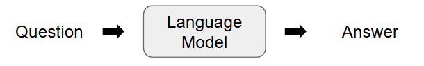

RAG:

- Questions are used to searched for an answer in a corpus
- Answers are generated by the model based on:
    - The question
    - A hidden prompt
    - The retrieved documents

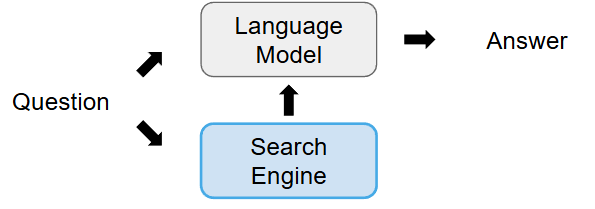

## Extractive summarization[-]

Summarization goals:

Produce an abridged version of a (long) text that contains information that is important or relevant to a user.

Aspects and applications:

- Create outlines or abstracts of a single document (e.g. a news article)
- Create summaries of multiple documents (e.g. email threads)
- Style transfer from lists to text (e.g. synopsis from bullet point notes)
- Text simplification through compression (e.g. educational texts)
- Entity-centric summarization
- Extractive question answering

Extractive summarization

In extractive summarization, sentences from an original text are selected and extracted to collate them into a summary of the text. Typical subtasks:

- Sentence splitting
- Sentence overlap detection
- Content-based ranking
- Enforcement of cohesion

Common use-case for graph-based techiques to create linear ordering of sentences.

## Abstractive summarization[-]

In abstractive summarization, a generative model is used to compress the original text into a latent space and generate summary. Typical example of zero-shot learning with transformer models.

