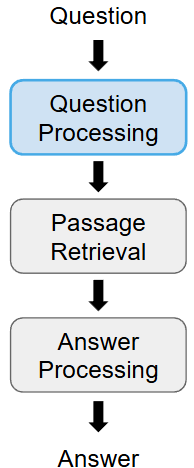
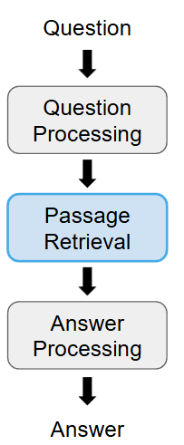
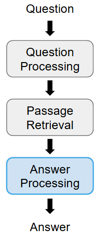
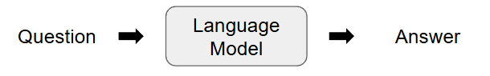
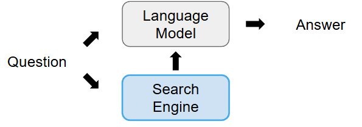

# Summariztation and Question Answering

# NLP Machine Learning Glossary

## Transfer Learning and Fine-Tuning

Pre-training:

- The model is trained on a lrage corpus
- Labeled data is generated heuristically (for example using Cloze task)
- The task for which the model is trained is typically not useful

Fine-tuning:

- The pre=trained model is re-traiend with less data for a specific apllication task.

The concept of training a model on one task and later using/adapting it for another task is called transfer learning.

## Using Language Models without Fine-tuning

Zero-shot Learning:

The language model is used for a task(here: poem writing) for which is has not been trained or fine-tuned.

## Few-Shot Learning

Few-shot Learning:

The language model is provided task-specific information at inference time(without fine-tuning) through specially engineered prompts that provide examples or templates for a task. This is also called in-context learning. 

One-shot Learning:

Special case of few-shot learning with a single example

## Prompt Tuning

Prompt tuning:

- The langauge model's parametrs are frozen (not trained anymore)
- A smaller model is trained to "translate" prompts into input vectors for the language model(soft prompts)

# Question Answering

Types of Question

Factoid questions:

- Have a simple facts as answers - often an entity
- Are often indicated by interrogative pronouns
- Exmples:
    - Who wrote the Harry Potter novels?
    - How many calories are in two slices of apple pie?

Complex (narrative) questions:

- Requires combination of multiple facts, chain of thought, and reasoning
- Exmaple:
    - What do scholars think about Thomas Jefferson's position on dealing with the Barbary pirates?

## Question Answering: Paradigms

Information-retrieval-based QA:

- Identify suitable query terms from the question
- Retrieve suitable documents from a large text corpus
- Extract an answer from the retrieved documents

Knowledge-based QA

- Parse the questions to generate knowledge-base queries
- Retrieve an answer from a knowledge base (using automated reasoning)

Generative QA:

- Generate ansers to question prompts using a generative language model

## IR-based QA: Question Processing

Question processing is used to extract information from the question that is needed to retrieve documents containing an answer.

Steps typically include:

- Querly Formulation
    Selection of query keywords for the Information Retrieval system
- Anser Type Detection
    Detection of the named entity type of the answer (person, place)
- Question Type Classification
    Classification of questions (math questions, a list of items, etc.)
- Relation Extraction
    Detection of relations between entities in the question

## IR-based QA: Passage Retrieval

Passage retrieval is used to retrieve snippets that may contain an answer from a lrage corpus of unstructured text.

Steps typically indlude:

- Document Retrieval
    Information Retrieval engine is used to retrieve documents using the query terms (e.g. TF-IDF weights/ cosine similarity)

- Document Segmentation
    Documents are segmented into shorter units (passages)

- Passage Ranking
    Passages are ranked by likelihood of containing an answer. Answer type/ Question type can be used in this step.

 

## IR-based QA: Answer Processing

Answer extraction from the retrieved passages is a typical classification task. Typical approaches include:

- Rule-based answer extraction
    Manually created rules are used to find suitable answers for a given type of question (e.g., based in named entity tags)
- Feature-based answer extraction
    Typical NLP features are used to train machine learning classifiers (e.g., POS tags, NER tags, etc.)
- Neural answer extraction
    A pre-trained transformer model is fine-tuned to detect spans containing answer

## Knowledge-based Question Answering

Retrieving answers from unstructed text is imprecise and makes is difficult to reason,
We can insted use structured knowledge:

- Relations are extracted from texts and stored in a knowledge base
- Questions are parsed to identift entities and their relation as formal relations
- Answers are retrieved from the relations that are stored in the knowledge base
- Automated reasining and inference over multiple attributes is possible,  e.g. Whic institution employed Alan Turing before 1946?

Limitations: answers cannot be extracted as relations cannot be stored in a knowledge base. In practice, hybrid approaches with IR-based QA are often used.

## Generative Question Answering

Generative language models:

- Zero-shot/ few-shot approaches to question answering are possible
- Answers are generated stochastically by the model, not retrieved from a corpus.
- Still quite error-prone

## Retrieval Augment Generation (RAG)

Generative QA:

Answers are generated based on the worldknowldge that is stored in the model's parameters.

RAG:
- Questions are used to searched for an answer in a corpus
- Answers are generated by the model based on:
    - The question
    - A hidden prompt
    - The retrieved documents

# Summarization

Summarization Goals:

Produce an abridged version of a (long) text that contains information that is important or relevant to a user.

Aspects and applications:

- Create outlines or abstracts of a single document(e.g. a news article)
- Create summaries of multiple documents (e.g. email threads)
- Style transfer from lists to text (e.g. synopsis from bullet point notes)
- Text simplification through compression (e.g. educational texts)
- Entity-centric summarization
- Extractive question answering

## Extractive Summarization

In extractive summarization, sentences from an original text are selected and extracted to collate them into a summary of the text.
Typical subtasks:
- Sentence splitting
- Sentence overlap detection
- Content-based ranking
- Enforcement of cohesion

Common use-case for graph-based techniques to create linear ordering of sentences.

## Abstractive summarization

In abstactive summarization, a generative model is used to compress the original text into a latent space and generate a summary. Typical example of zero-shot learning with transformer models.

