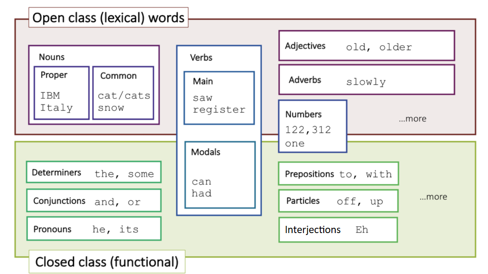
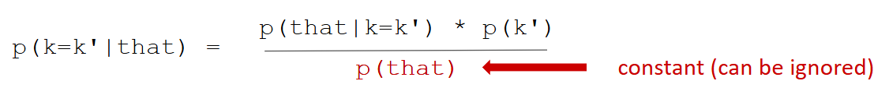
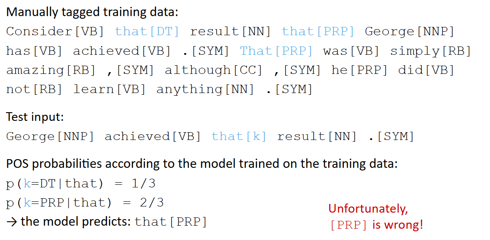
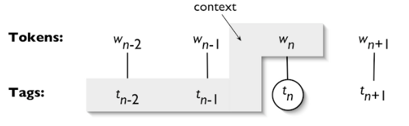
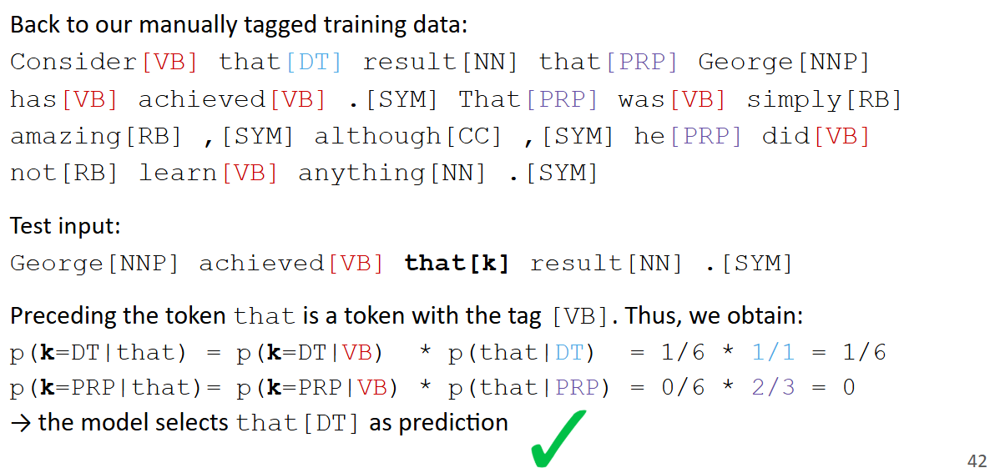

# Part of Speech Tagging (POS)

## Homonyms and Parts of Speech

The die(noun) is fair(adjective) but the house wins.

You will die(verb) at the fair(noun) if you enter...

The die is fair but the house wins.
DT  NN VBZ  JJ  CC  DT   NN   VBZ
You will die at the fair if you enter...
PRP  MD  VB  IN  DT  NN  IN PRP VBP

### Part of Speech Hierarchy

### Part of Speech tagging task

Words often have more than one POS

The POS tagging problem addresses how to determine the POS tag for a particular instance of a word in a given context

## Tagging

### The purpose of POS tagging

1. Collapsing distinctions into equivalence classes
    - All personal pronouns (You,they,etc,) tagged with PRP
2. Introducing distinctions to resolve ambiguities
    - E.g., leaves could be tagged with NN or VB
3. Helpful features in classification and prediction tasks
    - Named entity extraction
    - Machine Translation

### Terminology

Tagging
- The process of assosiating labels with each token in text
- Not limited to parts of speech

Tags
- The labels that are assigned to the tokens

Tag Set

- The collection of tags that is used for a particular task
- Tag sets are defined by linguists and not unambigouos.
- Different languages require different language-specific tag sets
-> it is difficult to compare tags between different languages

### Tagset Requirements

Informativeness-related parameters:
- The size of the tagset
- The degree of the ambiguity

Specifiability:
- Inter-annotator (inter-judge agreement should be good)

### Perfomance: How difficult is POS tagging?

How many tags can algorithms correctly predict(tag accuracy)?

- With current methods about 97.5%
- But a simple naive baseline can reach 90% already:
    - Tag every token with its most frequent tag
    - Tag unknown tokens as nouns

This simple methods performs well because:

- Many words are unambigous
- The algorithm "gets points" for unambiguous tokens, e.g.
    - Articles such as the, a, etc
    - Punctuation marks

### NLP HIERACKY 

Tokenization -> POS tagging -> Named Entity recognition -> Relation Extraction -> Question Answering
## Feature-based Tagging

Towards more Advanced POS Tagging

Probabilistic methods

- Use a corpus for training
- Obtain POS probabilities from manual annotations of the corpus
- Language-agnostic: Method can be applied to different languages

Rule-based methods

- Use linguistic knowledge to solve ambiguous cases
- Knowledge is mapped to rules
- Rules are easy to interpret
- Each language needs its own rules

## Probabilistic Tagging

### Tagging with Lexical Frequencies

Problem: How can we determine the most likely POS tag for a given token?
Solution: Derive probabilities from a large, annotated text corpus

- Count POS tag frequencies for a given token in the annotated corpus
- Select the most probable (=frequent) POS tag in new, unseen data

### Unigram tagger: A naive Prediction model

How a unigram tagger works:
- We have access to an annotated text corpus (= our training data)
- We create statistics of how many times each toke is seen with each POS tag (= the training process)
- Based on these learned frequencies, we use the training model on new, unseen text to associate with each word its most likely POS tag(= prediction)

Problem: many words might never be seen in the training data (out-of-vocabulary)
Solution: specify a default tag as "backoff"

### Unigram Tagger: THe Fundamental Problems

Why is the unigram tagger not working?

- We are not computing probabilities properly: we should use Bayes' rule instead!
  Among all possible tags k', the best choice for k = k' maximizes:

\

But, more simply: The most frequent tag is obviously not always correct!
we need to know in which sence that is being used.
We need to take the context into account.

### N-grams: Encoding Cooccurrence Context

An n-gram is a contigous sequence of n tokens from a given sample of text.

- The n stands for how many tokens are used
- n = 1: unigram, one token (0th order)
- n = 2: bigram, two tokens (1th order)
- n = 3: trigrams, three tokens (2nd order)
- etc., but using n > 5 is rare

### Using N-grams

N-grams can encode different types of contexts, e.g,

- Character based n-grams
- Token-based n-grams
- POS-based n-grams
- Combinations of the above

Ordering and context in n-grams:

- We often define to mean "adjacent", but this is not required
- We use n-grams to help us determine the context in which some linguistic phenomenon happens, e.g.
    - Words before and after a period to determine if it is the end of a sentence
    - Detecting open compound nouns (e.g., outer space)

### N-gram POS tagger

Core idea:

- Use the unigram probability for the current token (-> unigram tagger)
- Use the predicted preceding n-1 tags
- Optinoally: We could also use the preceding n-1 tokens, vut this is impractical

Bigram tagger:

- Prediction: What is the most likely tag for token n, given token n and tag n - 1?
- The tagger picks the tag which is most likely, given the context

### Backoff: Combining Multiple Taggers

To improve tagging accuracy, we should use more accurate algorithms when we can and backoff to simpler algorithms with broader coverage when needed.

- Attempt to tag the token with the 1st order tagger (e.g. bigram tagger)
- If the 1st order tagger is unable to find a tag for the token, fall back to using a 0th order tagger (e.g., unigram tagger)
- If the 0th order tagger is also unable to find a tag, use the default tagger to find a tag (e.g., feture based tagger)

Important note:

Bigram and trigram taggers need the previous tag context to assign new tags. If they see a [ na ] tag in the previous context, they will also print [ na ]. -> Error propagation

## Rule-based Tagging

Valid reasons for linguistic complaints? Yes!

Solution:

- We can use handcrafted sets of rules to tag input sentences
- For example, if a token follows a determiner, tag it as a noun

### The Brill Tagger

An example of transformation-based learning

- Core idea:
    - Use a probabilistic approach first
    - Then revise and correct it using contextual rules

- Similar to painting: sketch first, then paint properly
- Very popular 
- The rules are linguistically interpretable
- It is a supervies method and therefore requires a tagged corpus

#### The Brill Tagger: Process

Initialization:

- Tag each word with the most likely POS (as observed in the corpus)
- For words that are not in the corpus:
    - If it is capitalized: label as noun
    - For tokens that end in the same three letters as a word with known tag:
    use the tag of the known word(e.g., labeling[ VBG ])

Patching:

- Find suitable instances and apply patches to improve the result
- Example of a patch:
    - If one of the two preceding words is tagged as a detrminer,
    change the tag tokens that are tagged as a verb to noun

#### The Brill Tagger: Patch templates

- The preceding (following) token is tagged z
- The token two before (after) is tagged z
- One of the two preceding (following) tokens is tagged z
- One of the three preceding (following) tokens is tagged z
- The preceding (following) word is tagged z and the following token is tagged w
- The preceding (following) word is tagged z
  and the word two before (after) is tagged w
- The current word is (is not) capitalized
- The previous word is (is not) capitalized

#### The Brill Tagger: Patches

To generate patching rules:

- Compare initial tags with correct tags, setup a list of tagging error triples: (correct tag, incorrect tag, frequency)
- For each error triple, find the patch template whose application results in the greatest error reduction.
- For each error triple, compute the reduction in error that results frfom applying the patch (substracting the number of new errors)
- Add the patch results in the freatest improvement to the list of patches and apply it to the corpus.
- Repeat until no further improvement can be gained.
-> Result: tagging procedure(ordered list of transformations), which can be applied to new, untagged text.