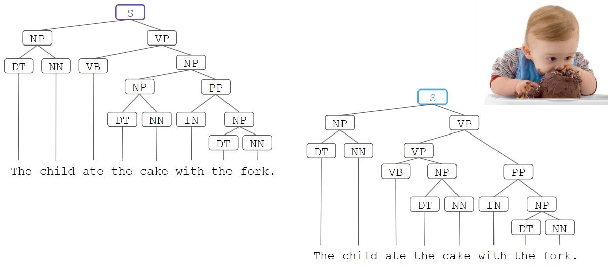

# Parsing

## What is Parsing?

Parsing is the process of determining the syntactical structure of a sentence with respect to a given grammar(from which the sentence was generated).

### Syntax

- A simple sentence includes just a subject and a predicate.
- The subject is a noun phrase and the predicate is a verb phrase:
    - Noun phrase: The cat, Samantha, She
    - Verb phrase: arrived, went away, had dinner

## Formal Grammars

A  formal grammar G = (N, T, P, S) provides a scheme for generating a formal language. if consists of:

- A finite set of non-terminal symbols N (constituents)
- A finite set of terminal symbols T (words)
- A start symbol S (a sentence)
- A finite set of production rules P of the form: left hand side -> right hand side

The grammar's language L(G) is the set of all sequences of terminal symbols that can be generated with the grammar. To generate a sentence from the language:

- Beginning with the start symbol, consecutively apply rules("derivation")
- Applying a rule replaces all symbols on the left hand side with the right hand side.
- Once only terminal symbols remain, the derivation is complete.
 

## The Chomsky Hierarchy

Four types of languages:

- Type-0 : Recursively enumerable languages
    - Rules have the form γ → α (no constraints)
- Type-1: Context-sensitive languages
    - Rules have the form:  αAβ → αγβ
- Type-2: Context-free languages
    - Rules have the form: A -> α
- Type-3: Regular languages
    - Rules have the form: A -> a or A -> aB

Where:

a is a terminal symbol. A,B are non-terminal symbols. α, β, γ are arbitary sequences of terminal / non-terminal symbols. α and β maybe empty. γ cannot be empty.

A context-free grammar (CFG), is said to be in Chomsky normal form if all of its production rules are in one of the following three forms:

- A -> BC
- A -> a
- S -> ε

Where:

- A,B,C are nonterminal symbols
- a is a terminal symbol
- S is the start symbol
- ε denotes the empty string
- Neither B nor C can be S

## Phrase Structure

### Constituency

Phrase structure organizes words into nested constituents. But what is a constituent?

- A word or a group of words that dunction as a single unit withtin a hierarchial structure.
- A constituent behaves as a unit that can appear in different places.

Example:
- Mr. Mackey talked [to the children] [about drugs].
- Mr. Mackey talked [about drugs] [to the children]. 
- *Mr. Mackey talked drugs about to the children.

A * in examples typically denotes ungrammatical or unobserved sentences.

Consider how we can generate sentences (S):

- A simple grammar for a single sentence: e.g., "Birds fly"

    - S -> NN VB
    - NN -> birds | planes | superheroes
    - VB -> fly | sing | fall
- Other sample sentences: "Birds sing", "Superheroes fly", etc.

LimitationL In the above examples, verbs are intransitive (they do not have a direct object)

- Example: superheroes save [who | what]
- We need transitive verbs and direct objects
- We need determiners, e.g. "the mayor", "the day"\

Consider an extended grammar:

- S → NP VP
- NP → DT NN
- VP → VB NP
- DT → the | a
- NN → child | firefighter | superhero
- VB → likes | sees | saves

- Example sentence: "A firefighter saves the child"
- Limitation: This grammar only allow noun phrases starting with a determiner. What about proper nouns like "Gotham City"?
- Solution: Add a rule to allow different expansions of noun phrases: NP -> NNP | DT NN

Consider the updated grammar:
- S → NP VP
- NP → DT NN
- NP → NNP
- VP → VB NP
- DT → the | a
- NN → child | firefighter | superhero
- NNP → Gotham City | New York
- VB → likes | sees | saves
Example sentence: “The superhero saves Gotham City”

### What about adjectives?

- Adjectives  modify nouns
- Wherever NN is allowed in a sentence, we could also use JJ NN, DT JJ NN, etc.
- This also works for proper nouns, e.g. "beatiful New York"

Introduce new rules:

- NP -> NNP | DT NN | JJ NN | DT JJ NN | JJ NNP
- Notation: Optional categories can be also marked using parentheses
    - NP -< (DT) (JJ) NN

### Verb Phrases

Structures of verb phrases:

- Verb phrases can be intransitive: "Samantha ran"
- Verb phrases can be intransitive with a prepositional pharse: "Samantha ran in Central Park"
- Verb phrases can contain a particle: "Samantha ran away"
- Verb phrases can be transitive: "Samantha bought a cookie"
- Verb phrases can be transitive with a prepositional phrase: "Samantha bought a cookie for John"

We can comnine the above options in an overall structure:

- VP -> VB (NP) (IN (NP)) 

[IN (NP)] - prepositional phrase (PP)

Consider the updated grammar:
- S → NP VP
- NP → (DT) (JJ) NN
- NP → (DT) (JJ) NNP
- VP → VB (NP) (IN (NP))
- DT → the | a
- NN → child | firefighter | superhero | villain
- NNP → Gotham City | New York
- VB → likes | sees | saves
- JJ → scary | fast
- IN → from | away
- Example sentence: “The superhero saves the child from the scary villain”

### Prepositional Phrases (PP)

Structures of prepositional phrases:

- Mary bought a book for John in a bookstore
- The bookstore on Main Street sells magazines
- Mary ran away
- Mary ran down the hill

Changes are needed to both NP and VP in our grammar to accommodate PP: 
- Wherever a preposition is allowed, it can be followed by a noun phrase
- Run up vs. run up the street
- NP can contain any number of PP

We need to change our grammar accordingly:
- S → NP VP
- NP → (DT) (JJ) NN (PP) (Due to recursion NP -> PP -> NP, we can produce arbitary long sentences)
- NP → (DT) JJ NNP
- VP → VB (NP) (PP)  (Due to recursion NP -> PP -> NP, we can produce arbitary long sentences)
- PP → IN (NP) (Due to recursion NP -> PP -> NP, we can produce arbitary long sentences)
- DT → the | a
- NN → child | firefighter | superhero | villain
- NNP → Gotham City | New York | U.S. | Earth
- VB → likes | sees | saves
- JJ → scary | fast
- IN → from | away | in
- Example sentence: “The superhero [from New York] [in the U.S.] [on Earth]...”

### Further Natural Language Grammar Concepts

Repetition of adjectives (JJ*)
- The Little Red Riding Hood
Nested sentences with subordinating conjunction

- VP -> VB (NP) (C S) (PP)
- I forgot whether I took the dog out

Combination of sentences with coordinating conjunctions:

- NP -> NP CC NP; e.g. apples and oranges
- PP -> PP CC PP; e.g. smart yet naive
- VP -> VP CC VP; e.g. I like walking or running

## Constituency Parsing: Task and Challenges

### Parsing: Task Definition

Given a (CFG) grammar and an input sentence, constituency parsing associates a tree structure with the phrase structure of the sentence that explains the derivation rules.

- There may be exactly one matching tree structure
- There may be many matching tree structures
- There may be none

### Parsing challenges: Syntactic Ambiguities

Syntactic ambiguities can results in semantically different but syntactically correct tree structures:

- Prepositional phrase attachment: The boy saw the woman with the telescope
- Coordination scope: Small boys and girls are playing
- Particles vs. prepositions: She ran up a larhe bill
- Gerund vs. adjectives: Frightening kids can cause trouble.

### Parsing challenges: Agreement

our "simple" grammar might already feel complex, but it is still very simplistic. In reality, we need rules to adjust for agreement:

- Number (plural, singular) : Samantha is / people are
- Person (first,second,third ...): I am / you are / Samantha is
- Tense (present, past,..): Samantha was reading / Samatha is reading

And English is quite simple. Other languages are more complex and include,e.g.: Case, Gender and so on

# Constituency Parsing ALgorithms

A parse tree(or derivation tree) is an ordered rooted tree that graphically represents the syntactic information of a string derived from a (context-free) grammar. There are two different approaches to generate a parse tree

Top-down approach:

- Starts with the starting symbol S
- Iteratively moves down towards tree leaves using production rules
- Problem : Explores options that won't lead to a full parse

Bottom-up approach

- Starts from tree leaves(=tokens)
- Proceeds upward to the root (= the starting symbol S)
- Problem: Explores options that don't match the full sentence(-> backtracking)

## Algorithm: Leftmost Derivation

Leftmost derivation is not a specific algorithm, but rather a class of Algorithms(further reading: see "LL parsers"). It is designed for restricted context free grammars (e.g., prgramming languages) and does not work perfectly on natural language.

Leftmost derivation is an example of top=down parsing.

Algorighm outline:

- Start with S
- In each step, apply a production rule to the leftmost non-terminal symbol
- Produce the observed terminal symbols (= tokens)
- Terminates once all observed words have been created.

Example:

- S 
- [S -> NP VP]
- [NP - > DT NN] VP
- [DT -> The] NN VP
- The [NN -> apple] VP
- The apple [VP -> ...]

Example:

## Algorithm: Shift Reduce Parser

A shift reduce parser is effectively a pushdown automaton that uses a stack for recognizing a context free language. It is an example of bottom-up parsing.

Algorithm outline:

- SHIFT operation: Push a word from the input sentence onto the stack
- REDUCE operation: if the top n words on the top of the stack match the right hand side of a production rule, then they are popped and replaced by the left hand side of the production.
- STOPPING condition: The process stops when the input has been processed and S has been popped from the stack

## Algorithm: CKY Parser

The Cocke-Kasami-Younger parser (CKY parser, sometimes CYK parser) uses dynamic programming. It ois an example of a bottom-up parser.

Core idea:

- Cache intermediate results
- For building a parse for a sequence [ i,j ], keep track of all parses of subsequences [ i,k ] and [ k,j ] that are included in it (i <= k <= j).

Advantage:

- Backtracking: if the parser gets stuck, we can easily go back to a previous alternative

Downside:

- Requires a binarized grammar
- The grammar must be in Chomsky Normal Form

CKY Parser: Output

## Statistical Parsing

How can we resolve ambigous parse trees?

- Many parse trees are possible
- Some are more likely than others (very few people eat forks...)
- Let's use corpus statistics to determine probable parse trees!

Core idea:

- Use a grammar that attaches a probability to a production rule: probabilistic context free grammar (PCFG)
- All probabilities p of identical left jand side symbols in rules must sum up to 1 
- The probability of a parse tree is the product of all used production rules
- Probabilities can be learned from a lebeled training corpus (treebank): p (S -> NP VP) = count (S -> NP VP) / count (S)

## Lexicalized Parsing

Using corpus statistics, we can go even further and construct a parser that takes lexical relations into account to compute probabilities.

Core idea:

- We dont just check the probability of rules, e.g. VP -> VP PP
- Instead, we also check the Probabilities of terminals, e.g. VP[ ate ] -> VP[ ate ] PP [ with ]
- We can better model whether a specific PP belongs to a VP or NP

## Dependency Parsing

Dependemcy grammar assumes that syntactic structure consists only of dependencies between tokens.
- Dependemcies are (labeled) asymmetric binary between two token 
- Dependencies typically from a tree with a single head (the root)

### Dependency Parsing vs. Constituency Parsing

Dependency parsing:

- Models natural language via a dependency grammar
- Create linguistic structure from the dependencies of tokens
- Useful when we are interested in relations between words

Constituency parsing:

- Models natural language as a context free grammar
- Breaks text down into a phrase structure (constituents)
- Constructs the syntactic structure from constituents
- Useful when we are interested in phrases