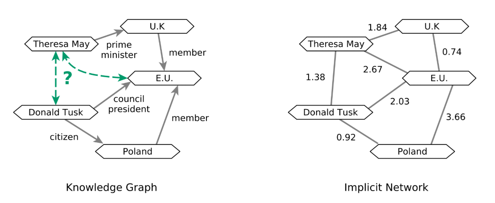
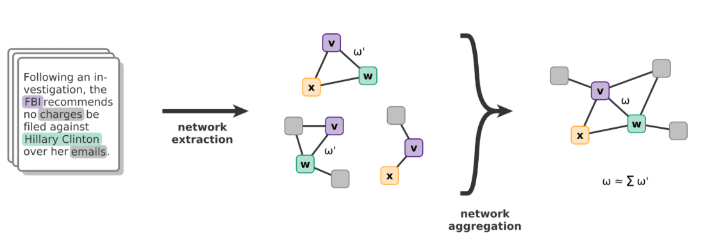
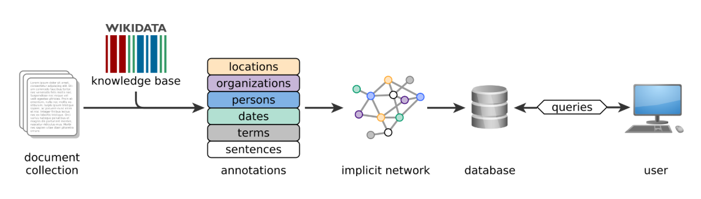
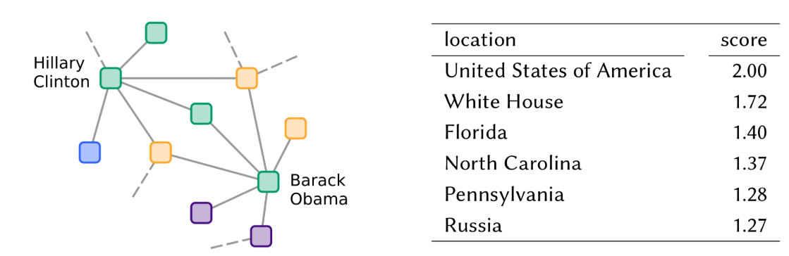
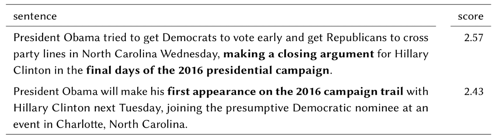

# Named Entity Recognition and Linking

## Named Entites & Information Extraction

The 5 Ws of Journalism

Who was involved?
What happend? 
When did it happen?
Where did it happen?
Why did it happen?

## Definitions: Entities and Named Entites

Entity:
- Philosophically: A thing that exists as itself, either concretely or abstractly
- Pragmatically: A physical object

Named Entity:

- A unique entity that is Identified by its name
- Examples:
    - Lake Constance (but not: water)
    - University of Konstanz(but not: university)
    - Elon Musk(but not: people)
    - Excalibur(but not: sword)

## Common Types of Named Entites

The core set:

- Persons
- Locations
- Organizations

Further useful named entity types:

- Dates
- Times
- Numeric expressions

Domain-specific entity types:

- Chemicals
- Genes
- Stock symbols
- Laws
- URLs
- etc

## Information Extrraction (IE) Systems

Goals:

- Identify and understand relevant parts of texts
- Gather, collate, and link information within and between documnets in the corpus
- Produce a structured representation of relevant information
- Organize information so that it is useful to people
- Store information in a semantically precise format that is usable by algorithms

IE pipeline:

- Recognition of named Entities
- Extraction of relations between entities 
- Knowledge base population

# Named Entity Recognition

The goal:

- Identify named entites in a document and tag them with a type.

Applications:

- Named entities in a text can be indexed, linked to external databases,etc
- Sentiment can be attributed to companies or products
- Identify relations between named entities 
- In question answering: answers are often named entites
- Google knowledge graphs answers
- etc...

## NER: Sequence Labeling via Machine Learning

Training:

1. Collect set of representative training documents
2. Manually label each token for its entity class(PER, LOC, ORG, etc.) or other (O)
3. Design appropriate feature extractors for the text and classes
4. Train a sequence classifier to predict the labels from the data

Testing / Classification:

- For a set of new, unlabeled input documents:
    - Run the sequence model in inference mode to label each token
    - Output the recognized entities

In practice:

- Inside-Outside (IO) encoding is less prercise
- Inside-Outside-Beginning (IOB) encoding is more precise but requires a larger tagset (2c + 1 classes vs. c + 1 classes in IO encoding)
- But: the benefit is limited in practice, so IO is often used

## Token Features for NER Sequence Labeling

Token-level features

- Current token
    - Effectively, this is dictionary learning
    - Example: Barbara is typically (part of) a name
- Previous/next word (context)

Tag-level features

- Inferred linguistic classification (e.g. POS tags)

Label-level features:

- Previous (and perhaps next) named entity label in the currenct sequence
- Exmple: Jon [PER] Snow[PER]

Many types of named entities have characteristic name structures in which sunstrings increase the likelihood for a certain type of entity:

- Substring oxa in drug names
    - Ofloxacin, Cotrimoxazole, Oxazepam

- Substring field in location names:
    - Cloverfield, Bloomfield, Wakefield

- Special characters like a colon(:) in movie titles
    - Terminator 2: Judgment Day

Some named entity names tend to follow patterns that can be mapped to a simplified representation based on attributes such as:

- Token length
- Capitalization
- Numerals
- Greek letter
- Internal punctuation
- etc.

## Models for Named Entity Extraction

We can use many different kinds of sequence models for NER:

- Markov Models

    - Conditional Markov Models make a single decision at a time, conditioned on evidence from observations and previous decisions

- Conditional Random Fields

    - A whole-sequence conditional model, rather than a chain of local models

- Deep learning models

    - Bidirectional Long Short Term Memory models
    - Transformers

# Named Entity Disambiguation and Linking

## Named Entity Ambiguities

The Tesla chief executive ..... Who? Company? Person? Unit?

## Handing Ambiguity: Normalization

Normalization: Reducing or rewriting something to a common (normal) form. Example:

- Mathematics: normalizing a fraction
    - 1/2 = 2/4

- Mathematics: normalizing a vector to unit length

    - v' = v / |v|

- Formal grammars:
    - Chomsly Normal Form for CFGs

- Databases:
    - 1NF, 2NF, 3NF, EKNF, etc.

- Person names:
    - Donald Trump, also known as: Donald J. Trump, POTUS, 45-47, President Trump...

## Named Entity LInking: Algorithmic Approach

How can we match entity mentions in a text to identidiers in a knowledge base? This is often modeled as a ML prediction task: Given an entity mention in a text, predict the most likely corresponding entity in a knowldege base.

Core  steps:

- Mention detection  (= named entity recognition)
- Candidate generation (= string matching to knwoledge base entries)
- Candidate ranking using features:
    - Context features: tokens around the entity mentions
    - Knowledge graph context: text features frfom the knowledge graph
    - Knowldge pgraph strcutural features (e.g. graph centratility)
    - Unambiguous entity mentions in the contex
    - Heuristic feautres (e.g., overall popularity of an entity)

## Drawbacks of Knowledge Graphs

Engineering the structure of a knowledge graph(an ontology) is difficult and subjective, but directly affects how useful it is. Examples:

- Place categories in Wikidata: Are they populated places or levels in an organizational hierarchy?
- Jesus in Wikidata: A person? God? A prophet? Real or fictional?

## Normalization of Temporal Expressions

For temporal expressions, we can use a rule-based normalization rather than linking them to a knowledge graph. For example:

January 12, 2022 at 2pm → 2022-01-12 14:00 UTC

But different types of temporal expressions require different rules for normalization:

- Absolute temporal expressions
    - January 12, 2022; International Worker’s Day 1997; during the Council of Constance
- Relative temporal expressions
    - yesterday; this afternoon; the day before

## Domain Dependence of Temporal Expressions

For relative temporal expressions, a reference time is necessary, which requires domain knowledge to retrieve.

News-style texts: Use publicatin metadata

- Elon Musk revelaed on Thursday that..
- New article published on Saturday, 16.04.2022
- Thursday -> 2022-04-14

Narrative texts: use preceding information in paragraph

- Keep track of last mentioned date
- Use as reference for normalization

# NE-based Application: Implicit Entity Networks

##  Implicit Network vs. Knowledge Graphs

## Generating Implicit Networks from a Corpus

## Implicit Netwoks: Pipeline Architecture

## Extracting Implicit Entity Relations

Problem: How can we discover complex relations for (a set of) emtities?
Query: ⟨Location | Barack Obama, Hillary Clinton⟩

## Demonstration: Interactive Entity-centric Search

https://evelin.ifi.uni-heidelberg.de 

