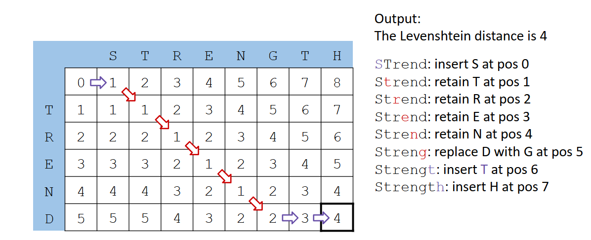
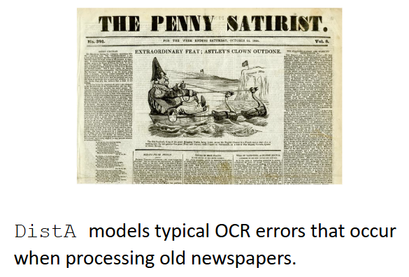
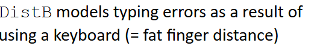

# Similarity and Search

# Word Similarity

## Types of Similarity in Language

Surface form similarity:

- Phonological similarity (e.g. brake | break)
- Morphological similarity (e.g. respect | respectful)
- Spelling similarity (e.g. theater | theather)

Semantic similiraty:

- Synonymy (e.g. verbose | wordy)
- Hypernymy, Hyponymy (e.g. color | red)

Content similarity:

- Sentence similarity (e.g. paraphrases)
- Document similarity (e.g. two news stories on the same event)

# Surface From Similarity

## Soundex Algorithm: Outline

Soundex is a class of heuristics for expanding a query into phonetic equivalence classes. It is mainly used for names and is labguage-specific. Words with similar pronunciation are encoded to the same representation so they can be matched despite minor differences in spelling.

Idea:

- Turn every token into a 4-character reduced form
- Build an index on the reduced forms
- Apply the same encoding to query terms (= tokens in the query)
- Search the index for phonetically similar tokens that have the same encoding

## Soundex Algorithm

1. Retain the first character of the word.
2. Replace all occurrences A, E, I, O, U, H, W, Y with digit 0
3. Characters from the following sets into digits:
    - 1 <- B, F, P, V
    - 2 <- C, G, J, K, Q, S, X, Z
    - 3 <- D, T
    - 4 <- L
    - 5 <- M, N
    - 6 <- R
4. If two adjacent digits are identical, remoce one of them.
5. Remove all zeros from the string
6. Return the list four characters of the string (pad with trailing 0s if necessary)

## Soundex: Disadvanteges

- Languages specificness: originaly developed for English
- Homophonous names starting with a different character
    - Craft (C613)
    - Kraft (K613)
- Unable to discriminate between long words (4-character limit)
- Conflation of unrelated family names:
    - Saint  (S530)
    - Sand   (S530)
    - Snead  (S530)
    - Sunday (S530)

## Spelling Similarity: Spell Checking

Principal uses

- Spell Checking suggestions
- Correcting documents in a collection to improve corpus quality
- Retrieving matching documents when the query contains a spelling error

There are two flavors of spell checking:

- Isolated words 
    - Check each word on its own for misspelling
    - Will not catch typos resulting in correctly spelled words (e.g., from and form)
- Context-sensitive
    - Look at the context provided by surrounding tokens
    - Example: I flew form Heathrow to Zurich

## Isolated Word Correction

Word similarity for word correction:

- Given a lexicon and a word w, return the words in the lexicon that are closest to w
- But what do we mean by "closet"?

Instead of similarity, we often consider distance:

- Which words have the smallest distance? -> Which words are similar?
- Example: what is the distance between:
- rain and shine?
- shine and train?

## Levenstein Distance

Idea behind the Levenstein Distance (also called edit distance): Given two strings s1 and s2, count the minimum number of basic operations to convert one string to the other.

Basic operations are typically character-level:

- Insert
- Delete 
- Replace(i.e., substitute)

Example:

- The edit distance between rain and shine is 3
- We need to replace two characters and insert one character

## Levenshtein Distance: Wagner-Fischer Algorithm

Step 1: Setup and parametets

Set n to be the length of string s \
Set m to be the length of string t \
If n = 0, return m and exit \
In m = 0, return n and exit. \
Construct a matrix containing 0...m rows and 0...n columns. \

Step 2: Initailization \
Initialize the zeroth row to 0..n \
Initialize the zeroth column to 0..m \

Step 3: Iteration

For i from 1...m //iterate over rows
For j from 1...n // iterate over columns

if s[i] = t[j] then subCost := 0 // retain character
if s[i] != t[j] then subCost := 1 //replace character

d[i,j] := minimum (d[i - 1, j] + 1, // Deletion
                   d[i, j-1] + 1, // Insertion
                   d[i - 1, j - 1] + subCost) //substituion

return d[m, n]

Example:

## Weigheted Edit Distance

Core idead:

- Different costs for insert / delete operations
- Cost matrices to encode individual cost for replace operations
- Can use domain-specific knowledge

Damerau modification:

- Swaps of two adjacent characters also have a cost of 1
- Example:

    - Lev (cats, cast) = 2
    - Dam (cats, cast) = 1

## Specialized Edit Distances

Consider these edit distances. Why (or where) could they make sence?

DistA(sit down, sit clown) = 1

DistB (qeather, weather) = 1
DistB (leather, weather) = 2

