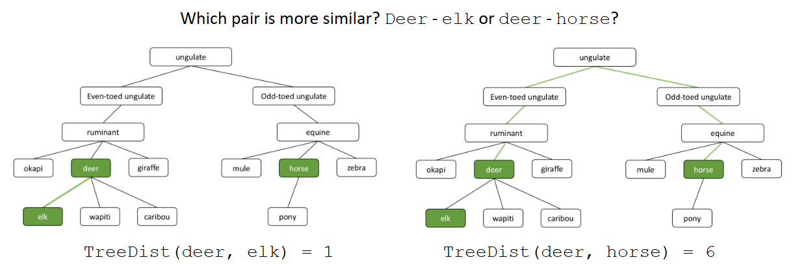

# Similarity and Search

# Word Similarity

## Types of Similarity in Language

Surface form similarity:

- Phonological similarity (e.g. brake | break)
- Morphological similarity (e.g. respect | respectful)
- Spelling similarity (e.g. theater | theather)

Semantic similiraty:

- Synonymy (e.g. verbose | wordy)
- Hypernymy, Hyponymy (e.g. color | red)

Content similarity:

- Sentence similarity (e.g. paraphrases)
- Document similarity (e.g. two news stories on the same event)

# Surface From Similarity

## Soundex Algorithm: Outline

Soundex is a class of heuristics for expanding a query into phonetic equivalence classes. It is mainly used for names and is labguage-specific. Words with similar pronunciation are encoded to the same representation so they can be matched despite minor differences in spelling.

Idea:

- Turn every token into a 4-character reduced form
- Build an index on the reduced forms
- Apply the same encoding to query terms (= tokens in the query)
- Search the index for phonetically similar tokens that have the same encoding

## Soundex Algorithm

1. Retain the first character of the word.
2. Replace all occurrences A, E, I, O, U, H, W, Y with digit 0
3. Characters from the following sets into digits:
    - 1 <- B, F, P, V
    - 2 <- C, G, J, K, Q, S, X, Z
    - 3 <- D, T
    - 4 <- L
    - 5 <- M, N
    - 6 <- R
4. If two adjacent digits are identical, remoce one of them.
5. Remove all zeros from the string
6. Return the list four characters of the string (pad with trailing 0s if necessary)

## Soundex: Disadvanteges

- Languages specificness: originaly developed for English
- Homophonous names starting with a different character
    - Craft (C613)
    - Kraft (K613)
- Unable to discriminate between long words (4-character limit)
- Conflation of unrelated family names:
    - Saint  (S530)
    - Sand   (S530)
    - Snead  (S530)
    - Sunday (S530)

## Spelling Similarity: Spell Checking

Principal uses

- Spell Checking suggestions
- Correcting documents in a collection to improve corpus quality
- Retrieving matching documents when the query contains a spelling error

There are two flavors of spell checking:

- Isolated words 
    - Check each word on its own for misspelling
    - Will not catch typos resulting in correctly spelled words (e.g., from and form)
- Context-sensitive
    - Look at the context provided by surrounding tokens
    - Example: I flew form Heathrow to Zurich

## Isolated Word Correction

Word similarity for word correction:

- Given a lexicon and a word w, return the words in the lexicon that are closest to w
- But what do we mean by "closet"?

Instead of similarity, we often consider distance:

- Which words have the smallest distance? -> Which words are similar?
- Example: what is the distance between:
- rain and shine?
- shine and train?

## Levenstein Distance

Idea behind the Levenstein Distance (also called edit distance): Given two strings s1 and s2, count the minimum number of basic operations to convert one string to the other.

Basic operations are typically character-level:

- Insert
- Delete 
- Replace(i.e., substitute)

Example:

- The edit distance between rain and shine is 3
- We need to replace two characters and insert one character

## Levenshtein Distance: Wagner-Fischer Algorithm

Step 1: Setup and parametets

Set n to be the length of string s \
Set m to be the length of string t \
If n = 0, return m and exit \
In m = 0, return n and exit. \
Construct a matrix containing 0...m rows and 0...n columns. \

Step 2: Initailization \
Initialize the zeroth row to 0..n \
Initialize the zeroth column to 0..m \

Step 3: Iteration

For i from 1...m //iterate over rows
For j from 1...n // iterate over columns

if s[i] = t[j] then subCost := 0 // retain character
if s[i] != t[j] then subCost := 1 //replace character

d[i,j] := minimum (d[i - 1, j] + 1, // Deletion
                   d[i, j-1] + 1, // Insertion
                   d[i - 1, j - 1] + subCost) //substituion

return d[m, n]

Example:

## Weigheted Edit Distance

Core idead:

- Different costs for insert / delete operations
- Cost matrices to encode individual cost for replace operations
- Can use domain-specific knowledge

Damerau modification:

- Swaps of two adjacent characters also have a cost of 1
- Example:

    - Lev (cats, cast) = 2
    - Dam (cats, cast) = 1

## Specialized Edit Distances

Consider these edit distances. Why (or where) could they make sence?

DistA(sit down, sit clown) = 1

DistB (qeather, weather) = 1
DistB (leather, weather) = 2

# Semantic Similarity

## Semantic Relations

Synonymy:

- Different words with similar meaning (e.g., big| large)
- Synonyms differ in their frequency of use and the context

Antonymy:

- Words that are near opposites (e.g., raise | lower)

Hypernymy:

- Supertype of  a words (e.g., red is a color)

Hyponymy

- Subtype of a word (inverse of hypernymy)

Meronymy:

- A word is part of lager whole (e.g. a flock of sheep includes a sheep)

## WordNet

WordNet is a database of words and semantic relations between them. The main relation is hypernymy, so the overall structure is tree-like.

Parent hierarchy of the different meanings of bar:

- Barroom, bar → room → area → structure → artifact ... 
- Bar → counter → table → furniture → ... → artifact ... 
- Bar → implement → instrumentation → artifact ... 
- Bar → musical notation → notation → writing → ...

However:

- Not all words share the same root
- WordNet has multiple roots
- WordNet is a forest, not just a tree

In principle, the higher the distance the lower the similarity! But there are problems:

- A specific word may not be in any tree
- Hypernymy edges are not all equeally apart in similarity space
- Many more detailed graph-based semantic similarity mesaures have been developed

# The Vector Sapce Model

## Boolean Retrieval

The simpliest information retrieval system:

- Create an index of all words in the documents
- Represent queries as Boolean Expressions (Caesar AND Brutus)
- The retriecal engine returns all documnets that match the expression
- Stemming and lemmatization can help to improve recall

## Term-Document incidence Matrix

Indexing and retrieval:

- Create a matrix of the document collection that contains all distinct terms
- Set the value to 1 if the corresponding document contains the given term
- Return all documents that have a value of 1 in all cells corresponding to query terms

## Scoring for Ranked Retrieval

But what happens if many document match?

-> we want to return the documents in an order that is likely to be useful to the searcher=

How can we rank (= order) the documents in the collection with respect to a query?

- Assign a score to each document (typically in the range [ 0,1 ])
- The score measures how well the document and the query "match"
- We need a way to assign (similarity) score to a query/document pair

## Term frequency Matrix

To have data for a scoring function, term frequency information is helpful:

- We can store term frequency counts instead of binary values in the matrix
- Each document is now represented by a count vector
- Note: word order is not retained in a vector. This approach is called bag of words.

### Term frequency

The term frequency tf_(t,d) of document d i defined as the number of times that t occurs in d.

- A document with 10 occurrences of the term Hamlet is more relevant for a query contatining Hamlet than a document with just one occurrence
- But probably not 10 times more relevant

-> Relevance does not increase propotionally with term frequency

## Rarity of Terms

Rare terms:

- Consider a term in the query that is rare in the corpus 
- A document contining this term is very likely to be highly relevant
-> We want large positive weights for rare terms.

Frequent terms:

- Consider a term in the query that is frequent in the corpus
- A document contining this term is more likely to be relevant than a document that does not, but it is less of an indicator of relevance

-> We wnat positive weights for frequent terms (but lower than for rare terms)

