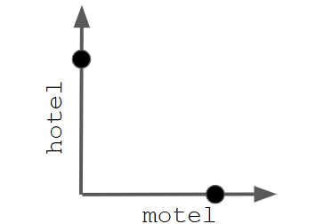

#  Language Models

## Turing test

Can a machine pretend to be a human well enough in a (blind) conversation to fool a human into thinking it is a human?

## Applications of Language Models

- Natural language understanding (NLU)
    - Question answering systems
    - Chatbots
- Natural language generation (NLG)
    - Text summarization
    - Automated journalism
    - Chatbots
- Machine translation
- Text classification
- Named entity recognition
- Opinion mining
- Sentiment analysis
- ...

## Language models: Definition

Language model:

A language model is a probability distribution over sequences of words.

By using a language model, we can assign probabilities to words, given a sequence of other words. That is, we can predict the occurence of words.

Language model examples:

- n-grams
- Static embeddings
    - Word2vec
    - GloVe
    - FastText
    - etc
- Contextualized word embeddings
    - BERT
    - Llama
    - GPT-2/ GTP-3/ GPT-4
    - DeepSeek R1
    - etc.

# Limitaions of Discrete models of language

## A core NLP task: Word Similarity

Many applications in text processing and information retrieval rely on word similarity as a core task that needs to be solved.

- Spell checking 
    - Similarity between individual words
- Search
    - Similarity between a sentence and the content of a document
- Duplicate Detection
    - Similarity between two documents
- Summarization
    - Removal of redundant (= similar) sentences in a document
- Translation
    - Finding a similar words in a different language

A similarity between sentences or documents can often be derived from word similarities.

## Word similarity in manually created models

We already know that manually curated models of language like WordNet are a great resouce that can be used to compute word similarities. But:

- WordNet is missing nuance
- WordNet is missing new meanings of words until they are added
- WordNet is subjective and biased by the annotators' perspective
- Requires constant human labor to create and update

## Similarity in the Vector Space Model

We also know how to compute similaritites between a query sentence and a document in the vector space model:

- Represent the query as a tf-idf encoded vector
- Represent each document as a tf-idf encoded vector
- Compute cosine similarities between query and documents

Can we use this to handle word similarities? Not really...

- Word 1: Hotel, w1 = [0, 0, 0, 0, 1, 0, 0]
- Word 2: Hotel, w2 = [0, 0, 0, 1, 0, 0, 0]
- CosineSim(w1,w2) = 0
- Normalizing the values of w1 and w2 with tf-idf does not change this "similarity". 

## One-Hot Vector Encodings

In the vector space model, we are using a localist representation:

- The dimension of the vector space is equal to the vocabulary size
- Each word (or lemma, or stem) corresponds to exactly on dimension
- A single word is encoded by a one-hot vector:
    - All but one vector components are equal to 0 (these components are "cold")
    - Only the component in the dimension that coresponds to the word itself has a value of 1 (the component is "hot")
- Individual word vectors are orthogonal by definition 
- There is no notion of word similarity in the vector space model

## Fundamental limitations of the Vector Space Model

The vector space model is designed to compare sequences of text based on the words they contain. But even that is problematic.

Historical solution in information retrieval: Query expansion

- Keep a dictionary of similar words and use it to expand the queries
- E.g., if a user searches for motel, also add hotel to the query

## Towards Sematically Meaningful Word representations

Query expansion is a (set of) heuristic(s) specifically designed to work around the inability of the vector space model to represent semantic meaning.

## Dense word vector representations

In theory:

Instead of a term-document matrix, we want a term-concept matrix, in which each word is ranked according to the strength of its relation to a semantic concept.

- hotel and motel are very similar and differ mostly in room prices and the quality of service.
- They are both similarly low on a scale that rates the relevance for teaching, while an university is higher on that scale.

The rows of such a matrix could then be used as vector representations of the words. Similar words would have similar vectors.

In practice:

How can we create such a matrix? Manual curation is entirely infeasible:

- How do we decide on the values?
- How do we choose the concepts? 
- We still have to update the model with new words
- The also have to update in case of semantic shifts

-> We need a way of learning dense vector representations from data.

# Word Embeddings

## Word Embeddings: Definitions

Embedding of words:

Given a training corpus, the embedding of words is the process of assigning a vector (in a latent space) to each word, based on the content of the corpus (by using some algorithm)

Word Embedding:

The vector that is assigned to a word as the result of the above process is often called the embedding of the word.

## Latent Space

A latent space(also called embedding space) is a vector space in which items are placed in such a way that similar items are placed in proximity. Typically (but not always), latent spaces have a lower rank (dimensionality) than the original space of the data.

## Embedding Spaces for Words

For creating word embedding, the embedding algorithm should:

- Place similar and/or related words in close proximity in the latent space
- Use word (co-)occurrence information from the corpus
- Work without supervision (labeling data at this scale is infeasible)

Embedding Pipeline:

# Latent Semantic Analysis

## Dimensionality Reduction of Term-Document Matrices

Core idea: Use dimensionality reduction techniques to reduce the corpus dimension to a manageable size (e.g., n = 300) but leave the vocabulary dimension as it is. The resulting row vectors are dense and capture information regarding the occurence of words in the documents.

## Latent Semantic Analysis (LSA)

Formal approach:

- Compute a singular value decomposition A = UDV of the term-document matrix A 
- Reduce the number of dimensions to retain only the k most important dimensions
- Use the row vectors of U_k as wprd embeddings 

## Disadvanteges of LSA

Latent Semantic Analysis has a few downsides:

- It works solely based on global cooccurrence statistics (it only knows whether words occur in the same documents)
- It does not enable us to use compositional semantics 

## Distibutional Semantics

Distributional Semantics:

- The meaning of words is indicated by the context in which they occur
- So let's use the context of a word to represent it!
-> we are using word coocurence inforamtion.

Word embeddings derived from principle are called distributed representations (in contrast to localist represenations)