# Polysemy and Contextualization

## Embedding Polysemous Words

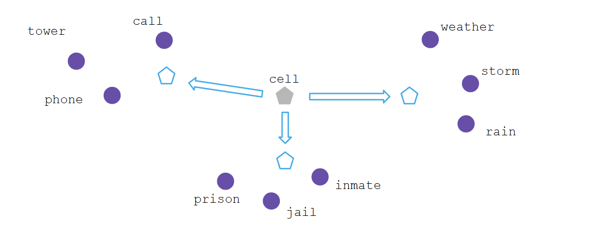

Polysemous words are common. A single embedding per words is unsufficient.

## How (not) to handle polysemy

Naive approach:

- Perform word sense disambiguation on the entire corpus
- Create embeddings of the disambiguated words

Problems of the naive approach:

- Error propagation(word sense disambiguation is hard)
- Requires lebeled training data (unlike the embedding methods)
- The vocabulary size explodes
- We also need word sense information when using the embeddings

## Context-dependent Word Embeddings

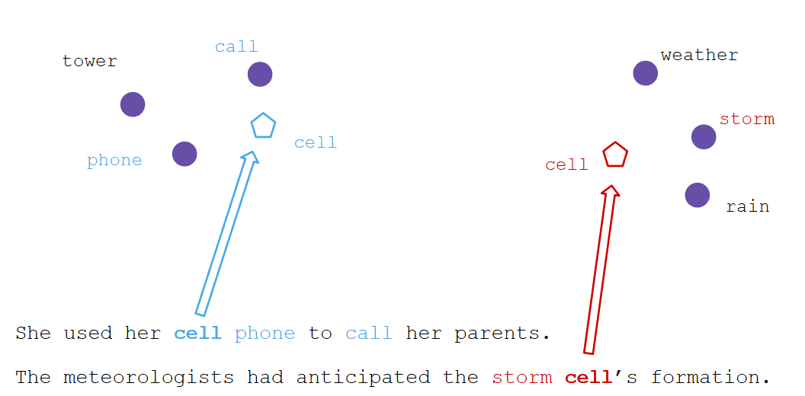

# Machine Translation and Sentence Embeddigs

## Sequence to Sequence Learning (seq2seq)

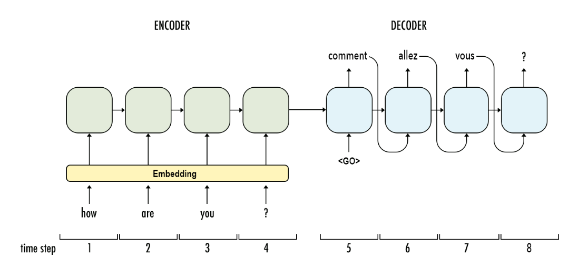

## Recurrent Neural Networks (RNN)

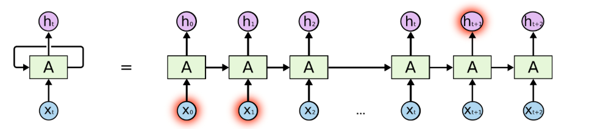

Sequence to sequence learning with an RNN:

- At ecah time step t, the neural network A looks at some input x_t and outputs a value h_t
- Information from step t is passed to step t + 1 in a loop
- The number of iterations of the loop depend on the length of the sequence
- The loop notation can be unrolled into individual steps
- The more iterations, the more likely the model will forget previously seen information

## RNN architecture 

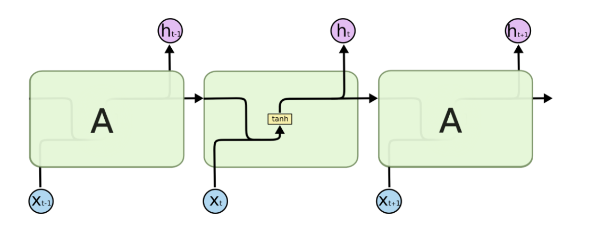

## Long Short-Term Memory Networks (LSTM)

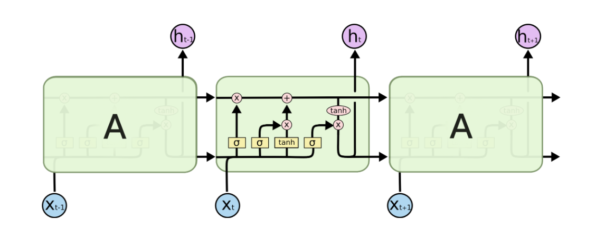

## Intermediate Context Vectors

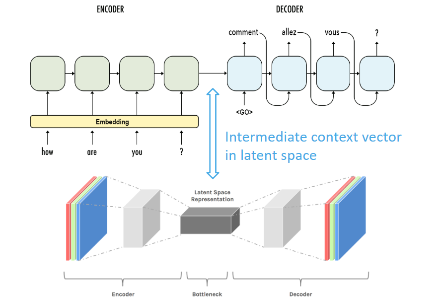

## Recap: From a Translator to Sentece Embeddings

Sequence to sequence learning for translation:

- Words in the input sentence are encoded as word embeddings
- Word embeddings are fed sequentially into a RNN / LSTm model
- In each step, the input is used to update an internal context vector
- A memory mechanism is used to keep track of relevant prior information
- The combination criteria for input, memory, and context vector are learned
- To generate the translation, the steps are "reserved" by a decoder

Sentece representations from translations:

- The contex vector that is passed from encoder to decoder lies in a latent space
- The context vector contains the semantic information of the input sentence
- A translation LSTM without a decoder is a sentece embedder

## Embedding Words in Context

Consider two English input sentences:

- The couple lives in a house in a forest
- The couple lives in a house in a forest

The encoder creates a context vector for these sentences. An English - German decoder would generate German words one by one and "update" the context vector:

- Das Paar lebt in einem Haus in [location]

The context vector and memory in the final generation step retain the semantic information for forest or desert (since we have generated all other words already)

Under the assumption that our model supports some kind of compositionality, we now have an intuition how to encode a word and its context in a single vector.
-> We have the building blocks to contextualize word embeddings.

# Transformers 

## The problem with Memory and LSTms

Downsides of using memory:

- Forgetting is still a problem, even for LSTMs
- We cannot "remember" the future..
- ... but sentence ordering is flexible in many languages

Downsides of LSTMs/RNNs

- Sentence are read sequentially 
    - Good for dealing with varying sentence lengths
    - Bad for parallelization (for example in a GPU)
- Processing a sentence word by word without the ability of backtracking is different from natural human reading behavior

### Translation Example

Consider the following translation:

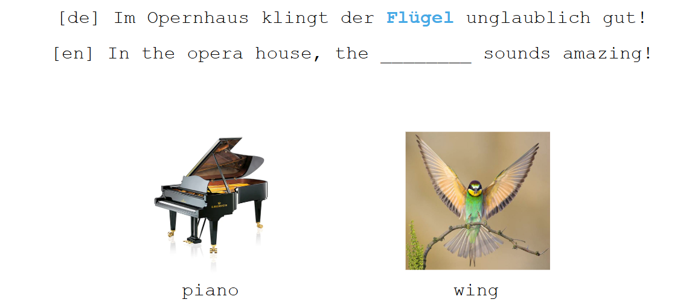

## Attention!

As an alternative approach to memory, we can sonsider attention mechanisms:

- We process all words of a sentence concurrently (instead of sequentially)
- Instead of learning to remember, we learn how to pay attention to the parts of a sentence that are important to a given word
- This is called selt-attention since we focus on other words in the same input sentence.
- Grounded in syntactic / semantic relations in natural language 

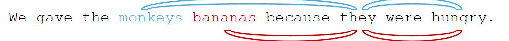

## Self attention visualized 

How attention works in principle:

- All words in a sentnce are encoded as vectors (e.g. pre-trained word embeddings)
- All words are fed into the model in parallel, each word in its own "lane".
- For each word, the model learns weights that are used to determine how important other words in the sentence are. (shown for the word: they)

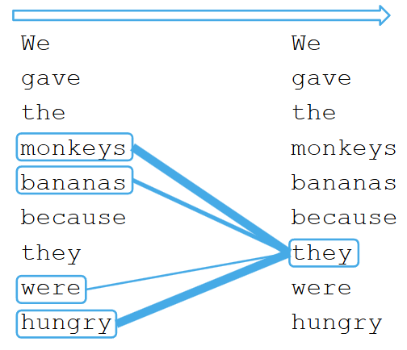

## Transformer model: Overview

The transformer model:

- Originally designed for machine translation
- Input: Sentence in language A
- Output: Sentence in language B
- Encoder:
    - Processes all words of the input sentence in parallel
    - Uses attention to determine word relations
    - Outputs one vector per input word

- Decoder:
    - Sequentially processes vectors created by encoder (similar to LSTM decoder) but has access to all vectors.
    - Predict output words one at a time.

## Transformer: Data Processing

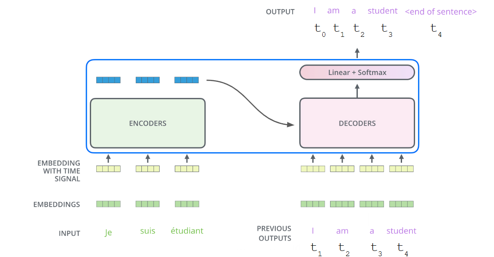

# BERT (and Contextual Language Models)

## BERT: Didirectional Encoder Representations from Transformers

BERT is a contextual language model, based on transformers:

- It uses only encoders (12 transformer layers)
- Bidirectional links connecting the "lanes" between layers
- Trained on ~ 3.3 Billion words (Wikipedia & Google Books corpus)
- Created with transfer learning in mind:
    - Trained on 2 simple unsupervised tasks
    - Can be fine-tuned for numerous complex tasks(for which few labeled data are available)
- Due to the transformer's attention mecahnism, we get contextualization "for free"

## Back to the roots: training data for BERT

BERT uses two tasks for training, which can be generated from arbitary texts without manual labelling or supervision:

- Masked language modeling (MLM)
    - This is the cloze task we already know:
    - Example: Today is a good day to [MASK].
    - Unlike word2vec, BERT uses the signal from all other words in the context simultaneously for this prediction (using attention to determine weights)
- Next sentence prediction (NSP)
    - Given a sentence, the model has to predict the next sentence.
    - Modeled as a classification problem: Given a sentences A and B, does B follow A?

## BERT Input representation
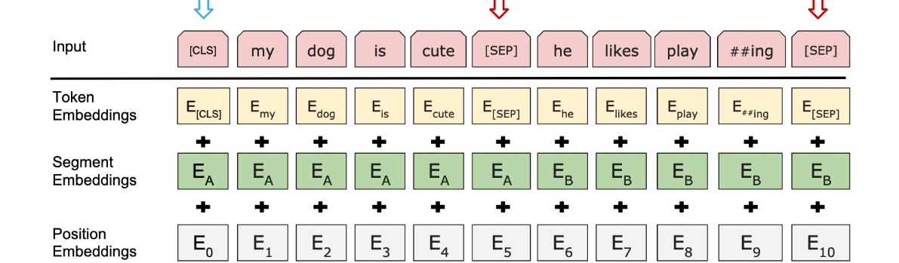

BERT accepts input in a fixed-width window of at most 512 tokens:

- Input starts with a special [CLS] token
- Input may contain two separate sentencesm whic are separated by a [SEP] token.
- The second sentence is optional

## BERT: Training Setup

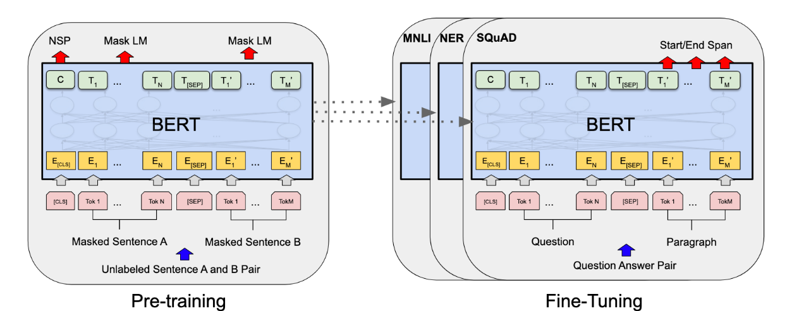

## Contextualized Embeddings: BERT Encoder Layers

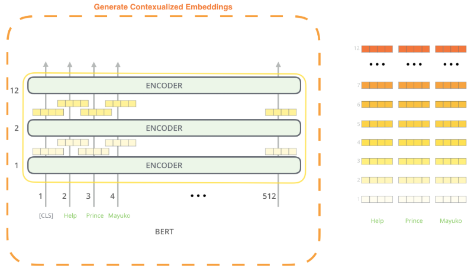

In principle, feature vectors from any layer can be used as embeddings, depending on the task at hand

BERT produces feature vectors for each token in each of its 12 transformer layers. Due to the attention mechanism, they capture different aspects of the input tokens.

## Tasks Supported by BERT (via Transfer Learning)

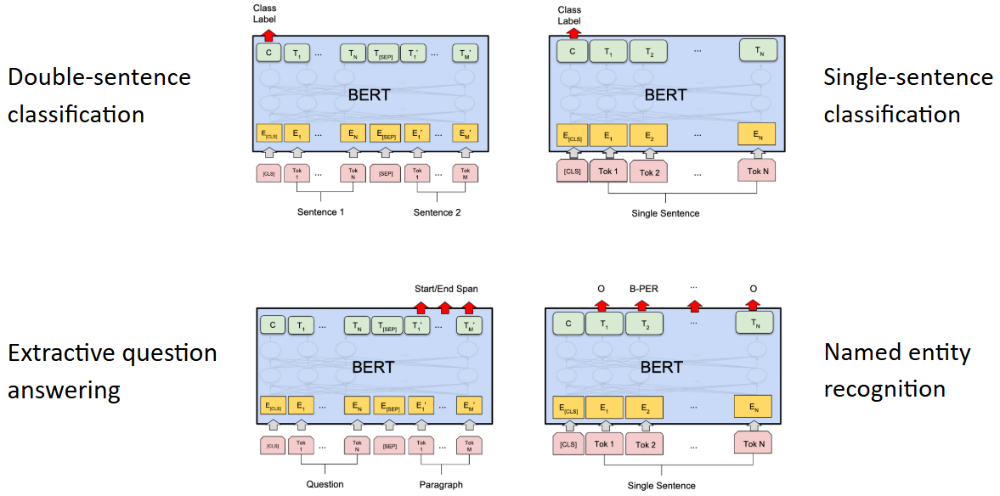

## Word-piece Tokenization: Token != Word

- Most languages have millions of words
    - The English Wikipedia has ~ 800,000 headwords alone... 
- Most words are very rare
- Using a large vocabulary increases the size of the model

In practice, contextual language models use word piece tokenization:

- Think of it like morphological decomposition...
- ... but driven vy statistics, not linguistic insight

-> Keep this in mind when extracting word embeddings from BERT!
