# Text Mining

# Text Classification

Text classification: Given a set of documents (a corpus) D and a set of classes C, assign a class c ∈ C to each document d ∈ D. Classification is supervised learning task(we need labels)

Example applications:

- Tracking and filtering of news articles by topic
- Organizing web pages into category hierarchies
- Sorting scientific articles on arxiv.org by discipline
- Encoding patient records using international insurance categories
- E-mail message filtering (aka spam detection)
- Categorizing DocAna lecture context into (exam relevant) and ( I'll maybe read it later...) 
- Etc.

## Text classification Methods

Manually created rules(hand-coded):

- Rules are typically based on combinations of words or other features
    - Spam detection example: black-list-address OR (dollars AND you won)
    - Author gender: fraction(pronouns) > 0.058
- Advvantage:
    - Easy to achive high precision if rules are carefully defined by experts
- Disadvanteges:
    - Recall tends to be low since rules are not comprehensive
    - Creating and maintaining these rules is expensive

The (very typical) solution:
We instead train a classifier on a labeled training corpus (i.e., supervised learning)

## Naive Bayes Text Classification

Naive Bayes Classifier:

- A simple yet efficient word-based classifier for documents
- Relies on a simple bag-of-words representation of documents
- Naive relates to the underlying assumption of independence:
    - We assume that features (here: words) are statistically independent of each other
    - This is obviously a strong simplification(e.g., consider the relation between determiners and nouns)
- Based on Bayes rule:

## Naive Bayes Overview

Training input:

- A collection of N documents
- A set C of classes c_k ∈ C for k = 1, 2, ..., |C|
- The vocabulary V of all words w_i ∈ V for i = 1, 2, ..., |V|

Input at prediction time:

- A new document d consisting of words w_1, w_2, ..., w_n

Desired output:

- Tht most likely class class(d) of document d

## Naive BAyes Computation: Class Probability

To determine the most likely class for document d, we want to find:

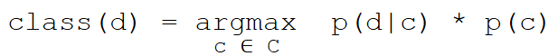

But how do we obtain p(d|c) and p(c)?

Computing p(c) from our training data for all calsses c is simple: it is the overall frequency of each class in our training data. ThusL

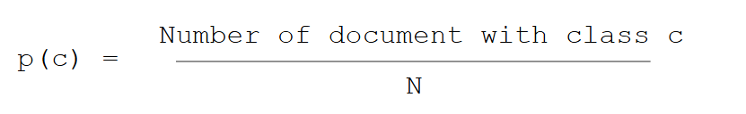

To compute p(d|c), we rewite p(d|c) = p (w1, w2, ..., w_n|c) since d consists of these words (bag-of-words assumption). THen we use the independence assumption to further rewrite:

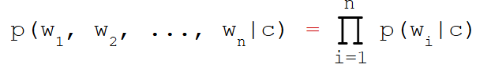

Computing the individual p(w_i|c) from our training data is also simple: It is overall frequency of word w_i in all documents with class c.

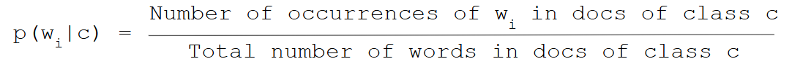

## Naive Bayes: Putting the Components Together

We compute: 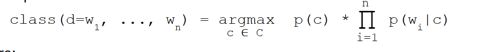

where: 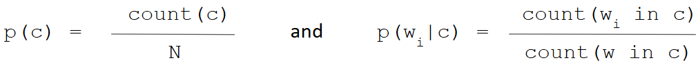

are esrimated on the training corpus, with:

- N: number of documents
- w_i: a specific word occuring in document d
- w: any word in the training corpus
- c: a specific class from C

## Naive Bayes: Laplace Smoothing

The algorithm has one major weakness: What happens if a new document d contains a word w_i that never occurs in even a single class in the training corpus?

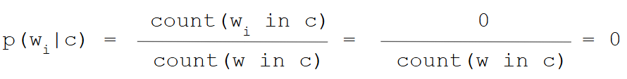

And thus:

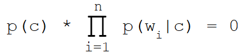

To avoid this, we add a small constant and normalize accordingly.

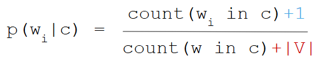

## Naive Bayes: Update Version
We compute:

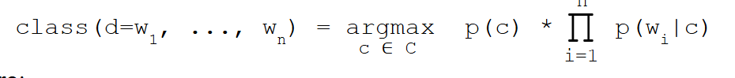

where:

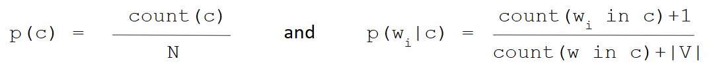

are estimated on the training corpus, with:

- N: number of documents
- w_i: a specific word occuring in document d
- w: any word in the training corpus
- c: a specific class from C
- |V|: size of the vocabulary of the training corpus

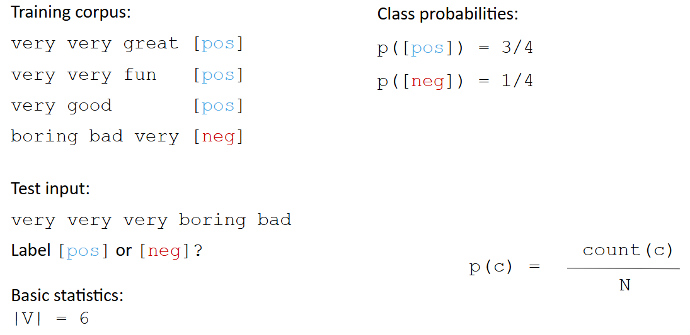

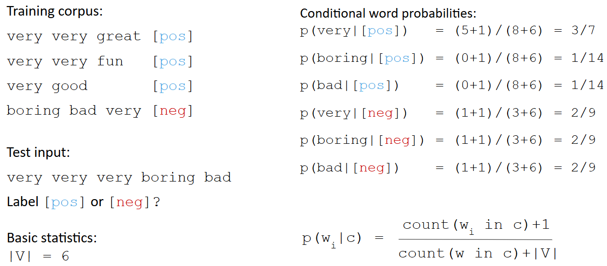

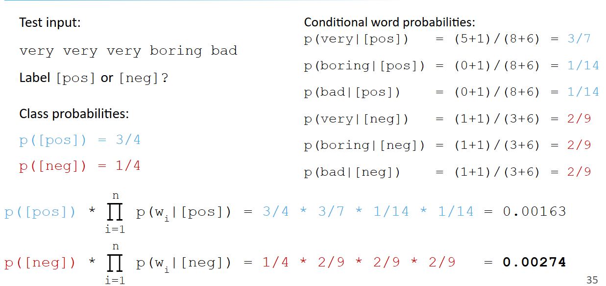

## Using General Classification Algorithms for Text

There are plenty of classification algorithms available...

- Decision Trees
- Random Forests
- Support Vector Machines (SVM)
- Gradient Boosting
- Deep Learning

But the don't work out of the box. We need features to represent the documents. Typically, feautures are vecrots, so we can use:

- Word counts
- TF-IDF vectors
- Word / sentence / document embeddings
- Etc.

## Features and Labels for Text classification

Many further features can be extracted:

- Word counts
- Casing
- Word/character n-grams
- Punctuation
- POS tags

Non-linguistic features

- Document formating
- Encoding sequences (e.g. &lt)
- Metadata

Some feature may be more useful than others, depending on the class labels:

- Readability
- Wiriting style
- Sentiment 
- Trustworthiness of news articles
- Suitability for children
- Language detection
- ...

Even modern deep learning methods suffer from bad feature selecrion and a lack of good pre-processing. Garbage in , garbage out!

## Classification with contextual language models

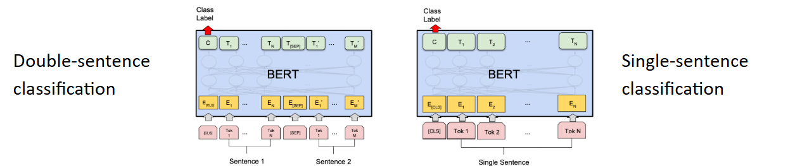

Transformer-based language models are designed for transfer-learning

- The final layer can be replaced or adapted
- Arbitary classification tasks are possible(in theory)
- Fine-tuning on labeled data improves the classification performance

# Text Clustering

Text Clustering:

Given a set of documemts (a corpus) D, clustering is the task of separating the documents d ∈ D intpo clusters such that documetns in the same cluster are similar and documetns in different clusters are dissimilar. Clustering is an unsupervised learning task(no labels).

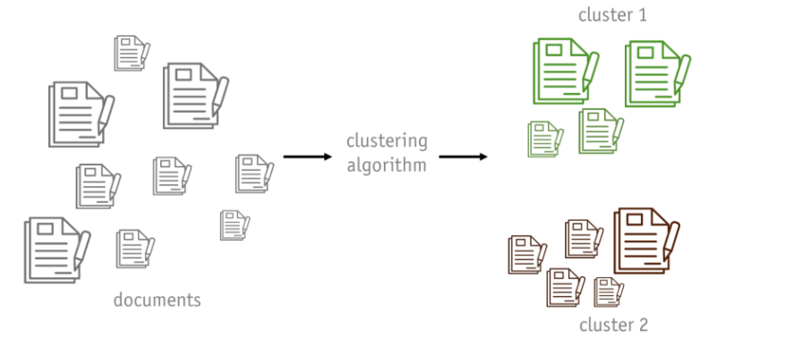

## Clustering Algorithms and Features for Text

Many clustering algorithms can be applied to text:

- k-means
- DBSCAN
- Hierarchial agglomerative clustering
- Spectral clustering
- Gaussian mixiture models
- ...

Features for clustering:

- Clustering typically works on vector data
- All the cavears of feature selection we discussed for classification apply

Which algorithm and features you should use depends on the use case (as usual):

- Do you know how many clusters there are in the data?
- Do you want to create a hierarchical grouping of documents?
- What semantic differences/similarities should exist between clusters?

# Topic Modeling

## Text clustering vs. Topic Modeling

If we use appropriate features and similarity metrics, clustering can be used to identify gropus (=clusters) of documents that have similar content (= talk about the same things).

- What is the problem with that output?
- We don't know what the documents are about!

Topic models:

Statistical methods that analyze the words of the Documents to discover common themes and how these themes are connected to each other.

## Application of Topic Models

Topic models can be used, for example, to:

- Uncover themes(=topics) in document collections
    Detect common topics in thex documents(e.g., genres in books)
- Recommender systems
    Determine topical relations to recommend articles with a similar topic structure to a reader
- Text classification
    Improve classification results by grouping similar words together in topics rather than using each word as a feature
- Semantic drift analysis
    Determine how the co-usage of words changes over time.
- Etc.

## Topic Modeling Fundamentals

Topic models are based on two basic assumptions:

- Each document consists of distribution over topics
- Each topic consists of a distribution over words

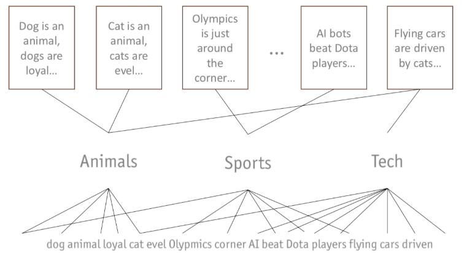

