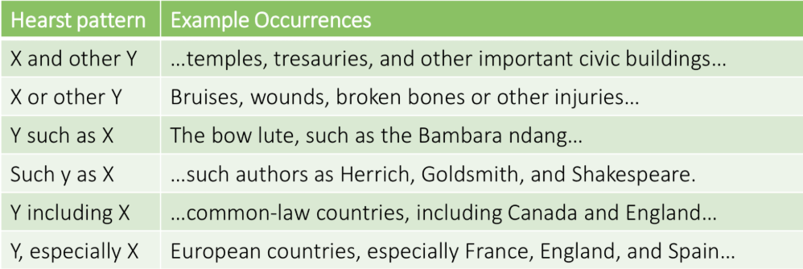
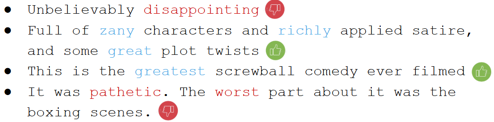
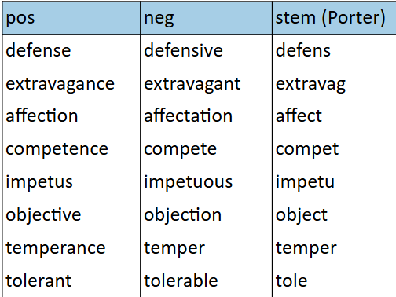

# Relation Extraction & Sentiment Analysis

# Relation Extraction

## Rule-based Relation Extraction

Intuition for a simple, rule-based relation extraction framework:

If the mention of a hyponym and a hyperonym in a sentence are connected in a clearly distnguishable pattern, we can construct a rule to extract the relation.

Example:

- Agar is a substance prepared from a mixture of red algae, such as Gelidium, for laboratory or industrtial use.
- A human can easily answer the question: What is Gelidium?
- We can create a rule:
    ... X, such as Y ... -> Y is a type of X

## Hand-Written Rules for Hyponym Extraction

We can expand the set of patterns to cover similar lingistic constructs and create a set of extraction rules:

## Hand-written Rules in a Nutshell

Advantages:
- Manually curated rules tend to have a high precision
- Can be tailored to specific domains

Disadvanteges:
- Manually curated rules often have low recall
- A lot of manual work is required to maintain rulesets

In other words:

- The usual caveats apply
- How can we uimprove this approach?

## Sidebar: Bootstrapping

Bootstrapping:

A self-starting process that continues and/or grows without further external input.

- The name is derived from the idea of "pulling oneself up by one's own bootstraps", describing an impossible task.
- Similar idea To the story of Baron Munchausen, who pulled himself(and his horse) out of a swamp by his hair.

Similar concept in statistics:

Bootstrap sampling to simulate having multiple different data sets (although you only have one) by repeatedly sub-sampling a single data set, for example to derive confidence intervals.

## Leveaging Named Entities for Pattern Discovery

In a knowledge base, relations are typically Encoded as triples:

- [Alan Turing] (PER) was employed by the [University of Manchester] (ORG)
- We can use such templates to identify patterns in which relations may occur in a corpus: [PER] was employed by [ORG]
-> Entity types can help us create pattern templates.

## Distantly Supervised Relation Extraction

Intuition:

Starting with a few seed entities, find cooccurrences of these entites to identify patterns. Use the patterns as templates for discovering new entities. Repeat.

Example:

- Seed entities: [Alan Turing] (PER) and [Univeristy of Manchester] (ORG)
- Matching cooccurence in a corpus: [Alan Turing] (PER) was employed by the [ UOM ] (ORG)
- Extracted pattern: [ PER ] was employed by [ ORG ]
- Finding other occurences of the Pattern in the corpus: [ Richard Feymann ] (PER) was employed by [ Cornell University ] (ORG)
- New entities: Richard Feyman and Cornell Univeristy

## Distantly Supervised Relation Extraction in a Nutshell

Advantages:

- We only need minimal manual input ( a few seed entites or patterns ) -> semi-supervised approach (also called distant supervision)
- System learns to extract new relations on its own
- Improved recall 

Disadvantages: 

- A trade-off between precision and recall becomes necessary: when do we stop mining for more rules?
- Recall is still not perfect - not all relations (always) occur in obvious patterns

##  Supervised Relation Extraction

Supervised methods can be used for relation extraction by following the usual approach.

Setup and design:

- Define a set of relations for extraction
- Selecting a set of relevant named entities 

Data:

- Compiling a representative training corpus
- Labeling named entities in the corpus
- Annotating relations between these entities (manually or pattern-based)

Training classifier

- Naive Bayes
- SVM
- ...

## Feature Examples For Supervised Relation Extraction

Example Sentence: 
American Airlines, a unit of AMR, immediately matched the move, spokesman Tim Wagner said.

Enitity-based features:

- Entity 1, type - ORG
- Entity 1, head - airlines
- Entity 2, type - PER
- Entity 2, head - Wagner
- Concatenated type - ORGPER

Word-based features:

- Between-entity bag-of-words {a, unit, of, AMR, immediately, matched, the, move, spokesman}
- Word(s) before Entity 1 - None
- Word(s) after Entity 2  - said

## Feature Exmaples for Supervised Relation Extraction

Example Sentence:

American Airlines, a unit of AMR, immediately matched the move, spokesman Tim Wagner said.

Syntactic features:

- Constituent path

NP ↑ NP ↑ S ↑ S ↓ NB

- Base syntactic chunk path 

NP → NP → PP → ADVP → VP → NP → NP 

- Typed dependency path 

Airlines <- [ subj ] matched <- [ comp ] said [ subj ] -> Wagner

## Neural Language Models for Relation Extraction

Pre-trained contextual language models can be used to build relation extraction pipelines by leveraging what the model has learned about word relations(e.g. via attention):

- This is transfer learning. The model is
    - Trained on an unsupervised task, and
    - fine-tuned for relation extraction.

- Adaptation of an annotation task:
    - Given a sentence with masked entites, the model is trained to label tokens with relation types.

- Adaptation of extractive question answering:
    - Given a sentence and the question "how are entites A and B related", the model outputs begin and end tokens indices of th relation in the sentence.

## Supervised Relation Extraction in a Nutshell

Advantages:

- We can obtain high accuracy (both precision and recall) as long as we have sufficient labeled data

Disadvanteges:

- Data hungry: requires a lot of labeled training data 
- Often poor perfomance when adapting from one to  domain to another (but transfer learning techniques can be helpful)

# Sentiment Analysis

Sentiment Analysis:

Broadly speaking, sentiment analysis describes the tasks of identifying, extracting, quantifying, and studying affective states of the authors and expressed subjective information in text.

Example: positive and negative movie reviews

## Sentiment Analysis Applications

Some applications of sentiment analysis:

- Movies: is this review posititve or negative?
- Products: what do people think about the new Iphone?
- Public sentiment: how is consumer confidence?
- Politics: what do people think about this candiate or issue?
- Prediction: predict election outcomes or market trends from sentiment
- Feedback: mine user feddback for suggestions or critism
- etc.

## Sentiment Analysis and Related Tasks

The definition of sentiment analysis is often vague.

Alternative names:

- Opinion extraction
- Opinion mining
- Sentiment mining
- Subjectivity analysis
- ...

Related detection / classification tasks:

- Subjectivity
- Bias
- Stance
- Hate-speech
- Sarcasm
- Deception and betrayal
- Online trolling
- Polarization
- Politeness
- Linguisitic alignment
- ...

## Schrer Typology of Affective States

Emotion: brief organically synchronized [...] evaluation of major event
- angry, sad, joyful, fearful....
Mood: diffuse non-caused low-intensity long-duration change in subjective feeling
- cheerful, gloomy, irritable....
Interpersonal stances: affective stance toward another person in a specific interaction
- friendly, flirtatious, distant, cold...
Attitudes: enduring, affectively colored beliefs, dispositions towards objects or persons
- liking, loving, hating, valuing, desiring...
Personality traits: stable personality dispositions and typical behavior tendencies
- nervous, anxious, reckless, morose...

## Sentiment Analysis: method Overview

Sentiment analysis is the detection of attitudes:

- Who is the holder of the attitude
- Who is the target of the attitude
- What is type of attitude?
    Type of attitude:
    - From a set of types Like, love, hate, value, desire, etc.
    - More commonly: simple weighed polarity: positive, negative, neutral (together with strength)

- Text containing the attitude
    - Sentence, paragraph, or document

## Constructing a Sentiment Classifier

For sentiment classification, most classifiers can be used. As usual, the art lies in selecting and extracting good features and addressing challenges.

Challenges in extraction of features include:

- Tokenization
- Stemming
- Negation
- Subtleties (or: the limits of features that do not capture semantics)

## Sentiment Features: Tokenization

Punctuation is typically removed or collapsed in preprocessing. But for sentiment analysis, it may contain valuable signals.

- Repetition of punctuation for emphasis
    An amazing movie. vs. An amazing movie !1!!
- Masked of expletives
    i %^&*ing hate data cleaning!
- Emotions are mostly punctuation, but may carry more sentiment signal than most words.

## Sentiment Features: Stemming

Stemmers heuristically identify word suffixes and strip them, with some regularization of the endings. This runs the risk of merging tokens with positive or negative connotation.

Stemming can be helpful for pooling the signal, but choose the stemmer with caution!

## Sentiment features: Negation

Negation reverses the polarity of certain words:

- This movie was good vs. this movie was not good
- I recommend this product vs. I do not recommend this product

Wordaround: Simple neagtion marking,

We append a _NEG suffix to every word that occurs between a negation and the next punctuation mark at the level of the current clause.

This movie was not good, but the popcorn was great.
This movie was not good_NOT, but the popcorn was great.
I do not recommend this product.
I do not recommend_NOT this_NOT product_NOT.

Drawback: The vocabulary size just doubled...

Sentiment Lexica

Some words or phrases can be clearly identified as carriers of a strong sentiment signal:

- Positive: beautiful, wonderful, good, amazing...
- Negative: bad, poor, terrible, cost someone an arm and a leg(idiom)
- Context dependent: long charging time vs. long battery lifespan

List of such words are instrumental resources for sentiment analysis and opinion mining.
They are typically compiled
- manually in a dictionary, or
- automatically from a corpus.

## Sentimaent Lexica Resources

MPQA subjectivity Cues Lexicon
- 6,885 words from 8,221 lemmas
    - 2,718 positive
    - 4,912 negative

- Each word annotated for intensity (strong, weak)
- published under GNU GPL

SentiWordNet

- Extension of WordNet with sentiment valuse. All synsets automatically annotated for degrees of positivity, negativity, and objectiveness
- [estimable (J, 3)] may be computed or estimated Pos 0, Neg 0, Obj 1
- [estimable (J, 1)] deserving of respect Pos 0.75, Neg 0, Obj 0.25

## Sentiment Analysis with Neural Language Models

of course, pre-trained contextual language models can be fine-tuned for sentiment analysis:

- This is transfer learning. The model is
    - trained on an unsupervised task, and
    - fine-tuned for sentiment analysis.
- Adaptation of a classification task:
    - Given a sentence dtermine to which sentiment class it belongs.
- Adapatation of a regression task:
    - Given a sentence output a sentiment score.

    