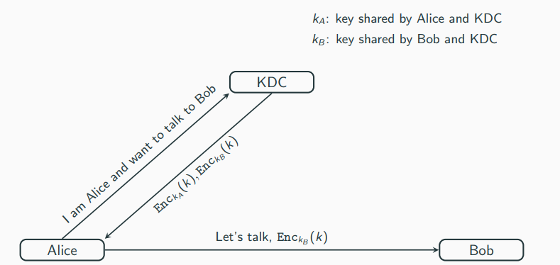
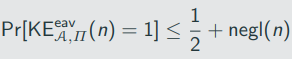
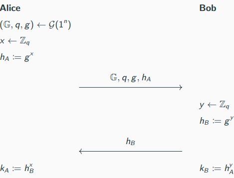
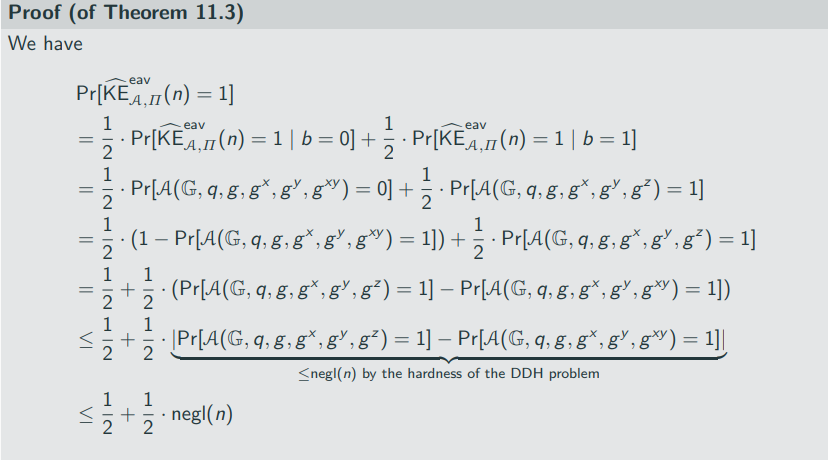
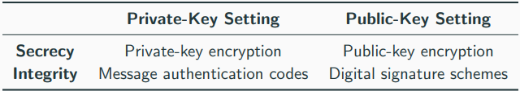

# Key managment and the Public-Key Revolution

## Key distribution and Key Managment

We have discussed various aspects of private-key cryptography:

- private-key encryption
- message authentication codes
- authenticated encryption

THroughout, we always assumed that Alice and Bob have a secret key tha only they know
Open question that we left unanswered so far:

"How can Alice and Bob share a secret key in the first place?"

Clearly, the key cannot be sent via an insecure channel as an attacker would learn the key

In some cases, Alice and Bob might have access to an secure channel:

1. in-person meeting
2. Trusted couriers

Note that access to a secure channel does not render privat-key cryptogtraphy obsolete as the secure channel might...

- ... not always be available (case 1 above)
- ... be too slow/expensive (case 2 above)

Even if keys can be shared securely, those keys also have to be stored securely

For a group of N persons that might need to communicate securely with one another, every persons needs to store N - 1 keys
-> this problem persists also for a single key but storing more keys makes it harder to protect them all
-> get even worse when considering not all communication partners are person but also services

A typical solution is to store key on a store key on secure hardware such as a smartcard
-> limited storage

The problem so far can (at least theoretically) be addressed in "closed" systems, i.e., when there is a well-defined population of users who are willing to follow certain policies for distributing and storing keys

The problems pesists in "open" systems, where users cannot meet to exchange a key ahead of time (users might not even know of each others existence before the communication)

-> sending credit-card information to a merchant where you have never purchased anything
-> sending an email to someone you have never met

Summary of the "problems" of private-key cryptography:

1. key distibution
2. storing/managing large numbers of secret keys
3. inapplicability of private-key cryptography to open systems

# A partial sultion: Key-Distribution Centers

Some of the problems can be solved using a key distribution center (KDC)

Consider the scenario of a large corporation where all pairs of empolyees must be able to communicate securely

We can assume that the employees trust some entity, e.g., the system administrator - at least regarding work-related communication

This trusted party can act as a KDC:

- whenever a new employee joins the corporation, it receives a key shared between the employee and the KDC
- when an employee wants to communiczte with another employee, it can request a (session) key from the KDC

Advantages:
1. Each employee needs to store only one long-term key (the one shared with the KDC); session keys are short-term that can be erased after the session
2. For each new employee only that employee must set up a key with the KDC; no other employee needs to do anything

Disadvantages:

1. The KDC is a high-value target: a successful attack on the KDC will result in a complete break of the system
2. The KDC is a single point of failure: if the KDC is offline, secure communication is themporarily impossible
-> KDC is a high-value

# Key Exchange and the Diffie-Hellman Protocol

In 1976. Whitfield Diffie and Martin Hellman published a paper with the title

"New directions in Cryptography"

Diffie and Hellman observed that there is a lot of asymmetry in our world:

- padlocks can easily be locked but not opened with the key
- breaking a vase is easy; putting it back together is much harder

From a more algorithmically perspective: multiplying two primes is easy recovering the factors from the product is hard (factoring problem)

Diffie and Hell proposed a protocol for Alice and Bob to securely exchange a key via a public but authenticated channel (an attacker cannot interfere with their communication)

- Alice and Bob send messages to one another
- By the end of the protocol, Alice and Bob both know the same secret (a key k)
- An adversary can observe the entire communication between Alice and Bob, called the transcript trans(which consists of all messages being sent as part of the protocol)

We will prove security of the protocol against an eavsdropping adversary
-> this provides relatively weak security guarantees
-> in practice, key-exchange protocols must satisfy stronger notions of security

Before we describe the actual protocol, we define security of a key-exchange protocol

## The key-exchange experiment 

1. Two parties holding 1^n execute protocol П. This results in a transcript trans containing the messages sent by the parties, and a key k output by each of the parties
2. A uniform bit b ∈ {0,1} is chosen. If b = 0, set k^:= k, and if b = 1 then choose uniform k^ ∈ {0,1}^n.
3. A is given trans and k^, and outputs a bit b'/
4. The output of the experiment is defined to be 1 if b' = b, and 0 otherwise. (in case  = 1, we say that A succeeds)

A key-exchange protocol is secure in the presence of an eavesdropper if for all probabilistic polynomial-time adversaries A there is a negligible finction negl such that

Diffie-Hellman key-exchanging protocol

Diffie and Hellman did not prove security of the protocol - the relevant security notions did not exist yet!

They observed that hardness of the discrete-logarithm problem is necessary
-> if the discrete-logarithm problem is easy, an attacker can extract the secret values of one party from the transcript an then compute the shared key using this value
-> hardness of the discrete-logarithms problem is not sufficient as they might be other ways of computing the key without explicity computing x and y

Hardness of the CDH problem guarantees that it is hard to compute the entire key from the transcript
-> this is also not sufficient to prove security

Definition 11.1 requires that the shared key g^(xy) to be indistinguishable from uniform for any adversary given g, g^x, g^y (the transcript)
-> this is exactly the DDH problem

Let  be a modified version of , where if b = 1, k^ os chosen uniformly form G rather than from {0,1}^n

If the decisional Diffie-Hellman problem is hard relative to G, then the Diffie-Hellman key-exchange protocol П is secure in the presence of an eavsdropper (with respect to the modeified experiment )

## Uniform group elements vs. uniform bit-strings
- Alice and Bob can apply a key-derivation function to their shared secret g^(xy) to obtain a bit-string that is indistinguishable from random to be used as a key for subsequent cryptographic application

## Active adversaries

- We stress that the Diffie-Hellman protocol in the presented variant is only secure against eavsdropping adversaries
- It is completely insecure against man-in-the-middle attack

## Diffie-Hellman key-exchange in practice

- The basic protocol serves as a first demonstration of asymmetric techniques (and problems from number theory) to solve the problem of key distribution
- The protocol- with proper modifications to withstand also man-in-the-middle attacks - is widely used today

# The public-key Revolution

Diffie and Hellman additional introduced the concept of public-key (or asymmetric) cryptography in their worl

In public-key cryptography, a party generates a pair of keys:

- a public key pk that is widely disseminated, e.g., putting it on a website
- a private key sk that is kept secret

## Public-key encryption

- everyone with the public key can encrypt
- decryption is only possible with the private key
- security holds even agains adversaries that know the public key for encryption

## Digital signature schemes

- analogue of message authentication codes in the asymmetric setting
- using the private key, one can generate a signature of a message
- the public key allows to verify a message-signature pair
- digital signature schemes provide so-called non-repudiation (which MACs do not): one can present a message-signature pair by Alice to a judge who can verify that Alice indeed signed the message

## Summary

Public-key cryptography...

1. ... allows key distribution over public (but authenticated) channels
2. ... reduces the need to store many secret keys
3. ... is suitable for open enviroments where parties have never previously interacted with each other

-> public-key cryptography addresses the aforementioned problems of private-key cryptography

The invention of public-key cryptography shifted the usage from intelligence and military usage to the widespread usage we see nowadays

It should be clear that public-key cryptography is strictly stronger than private-key cryptography

Natural question:

Why study private-key cryptography in the first place?

Answer:

Private-key cryptography is much more efficient than public-key cryptography and should be used whenever the setting allows it.
