# Message Authentication Codes

## Message Integrity

Secrcecy vs. Integrity

Basic suctiry goal of cryptography: secure communication

What does secure communication mean?

So far we considered "secrecy" by showing that an eavsdropper cannot learn anything about the communicated messages

-> the adversary to be passive

There are other examples where one is not concerned with secrecy and aversaries are not mecessarily passive

Messag eintegrity against active adversaries is equally important
-> active adversaries can send and modify messages

Consider the scenario where Alice communicated with her bank over the Internet. When the bank recieves a request to transfer 1.000$ from Alice to Boob, there are two things for the bank to consider:

- Is the request authentic,i.e., did it come from Alice and not from someone else(for instance Bob)?
- If the request is authentic, is the content (e.g., the amount of money to be transfered) unaltered?

Standart error-correction methods do not apply to handle the second point

Secrecy and integrity are often confused and interwined
-> encryption does not (in general) provide integrity

We have seen encryption schemes using
- stream ciphers (OFB and CTR)
- block ciphers (ECB abd CBC)

None of them provide integrity

Encryption using stream ciphers: c = y xor m

- Flipping any bit of the ciphertext result in the corresponding bit of the message being flipped
- Considering the example of transfering money, one can modify the amount by flipping the bits indicating the amount to be transfered

Encryption using block ciphers:

- Not as trivial as for stream ciphers as a single bit fkips on the ciphertext typically affect more than a single bit of the message 
-> But there is still an predictable effect

- For ECB, flipping a bit in the ith ciphertext block only affect the ith block
-> the fact that ECB does not even achiebe secrecy does not matter right now

- For CBC, flipping the jth bit of the IV affects only the jth bit of the first message block 
-> the first block can be modified arbitrarily

# Message Authentication Codes (MACs) - Definitions

We have seen that private-key encryption does not solve the problem of message integrity

To achieve message integrity, we introduce a new cryptographic primitive called message authentication codes (MACs)

The setting is similar to private-key encryption, in the sence that Alice and Bob share some secret key but rather the goal is to achive messag integrity rather than secrecy

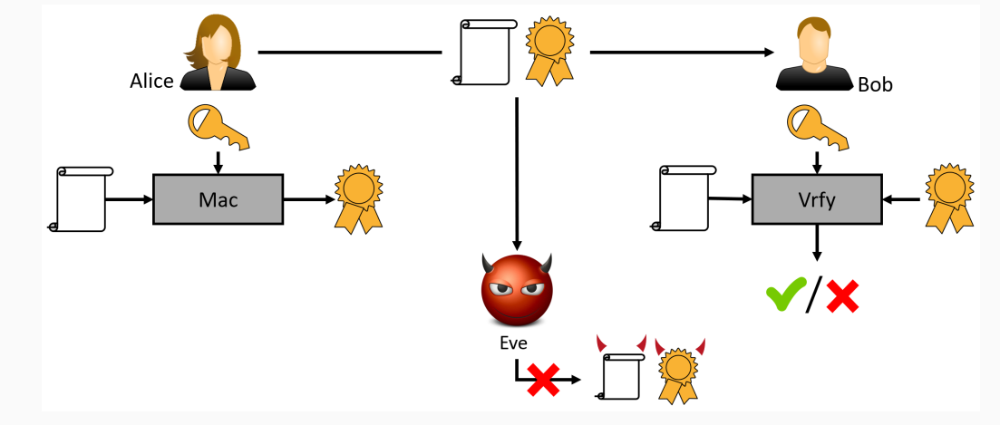

A message authentication code (or MAC) consis of three probabilistic polynomial-time algorithms (KGen, Mac, Vrfy) such that:

1. The key-generation algorithm KGen takes as input the sectuiry parameter 1^n and outputs a key k with |k|>= n.

2. The tag-generation algorithm Mac and a message m ∈ {0,1}*, and outputs a tag t. Since this algorithm may be randomized, we wirte this as t <- Mac_k(m)

3. The deterministic verification algorithm Vrfy takes as input a key k, a messag m, and a tag t. It outputs a bit b, with b = 1 meaning valid and b = 0 meaning invalid. We wite this as b:= Vrfy_k(m,t)

It is required that for every n, every k putput by KGen (1^n), and every m ∈ {0,1}*, it holds that Vrfy_k(m, Mac_k(m)) = 1.

If there is a function l such that for every key k output by KGen(1^n), algorithm Mac_k is only defined for messages m ∈ {0,1} ^ (l(n)), then we call the scheme a fixed-length MAC for messages of length l(n).

As with private-key encryption, KGen(1^n) almost always output a uniform k ∈ {0,1}^n

For deterministic MACs (meaning Mac is deterministic), canonical verification works by letting Vrfy re-compute the tag and compare. More preciselym Vrfy_k(m, t):

    1. computes t' := Mac_k(m)
    2. Outputs 1 if t' = t

What does it mean for a MAC to be secure?

Intuitive idea: no efficient adversary should be able to generate a valid tag for any "new" message that was not previously sent (and authenticated) by the communicating parties

What about the "previously authenticated" message? How are they chosen?
-> we allow the adversary to choose these message to model the case that adversarial actions might influence the messages authenticated by Alice and Bob
-> similar to how the adversary can influence the messages that are encrypted (chosen-plaintext attack)

The adversarial indistinguishability experiment 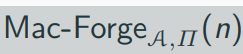:

1. A key k is generated by running KGen(1^n).
2. The adversary A is given input 1^n and oracle access to Mac_k(·). The adversary eventually outputs (m, t). Let Q denote the set of all queries that A submitted to its oracle.
3. A succeeds if and only if

    1. Vrfy(k,m,t) = 1 and
    2. m !∈ Q
    In that case the output of the experiment is defined to be 1.

A message authentication code П = (KGen, Mac, Vrfy) is existentially unforgeable under an adaptive chosen-message attack, or just secure, if for all probabilistic polynomial-time adversaries A there is a negligible function negl such that

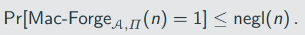

One might object that the definition is too strong:

1. the adversary can ask for tags for any messag eof its choice
2. the adversary succeeds if it find a tag for any previously inauthenticated message.

What about scenarious where users only authenticate "meaningful" messages?

The observation is that what is considered "meaningful" depends entirely on the application

Making the definition as strong as possible (as we were doing) guarantees that secure MACs can be widely deployed

## Replay Attacks

The above definition does not protect against replay attacks, where an adversry sends again ("replays") previosuly authenticated messages

This does not mean that replay attacks are not a security concern

- Assume that Alice issues a transaction sending 1.000$ to Bob
- Bob cannot modify the amount to 10.000$(this is a new message and would require breaking the MAC according to the above definition)
- Bob can, however, just repeat the messag ea total of ten times. From point of view of the bank, it looks like Alice wants to transfer 1.000$ to Bob ten times

Crucial observation: since verification is stateless, every valid pair (m,t) will always result in Vrfy_k(m, t) outputting 1

Security against replay attacks has to be hadled on the application leve
-> one commons method is to use timestamps

## Strong Unforgeability

Existential unforgeability ensures that an adversary which received message-tag pair (m1, t1), ...,(m_q, t_q) cannot generate a valid tag for a new message m' !∈ {m1,...,m_q}

It does not rule out that an attack can find a different tag for a previously authenticated message, i.e., t'_i != t_i with Vrfy(m_i, t'_i) = 1

In standard applications, this is not a concern; in some other, one might one to rule out this possibility

We can define the experiment Mac-sForge_(A,П) similar to Mac-Forge_(A,П) with the difference that Q stores pairs of oracle queries and responses and the final check is modified to (m,t) !∈ Q, for (m,t) the output of A.

## Message Authentication Codes (MACs) - Definition

A message authentication code П = (KGen, Mac, Vrfy) is strongly secure, if for all probabilistic polynomail-time adversaries A there is a negligible function negl such that 

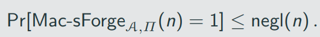

It is easy to see that secure MACs using canonical verification are also strongly secure:

Let П = (KGen, Mac, Vrfy) be a secure (deterministic) MAC that uses canonical verification. Then П Is strongly secure.

# Construction Secure Message Authenctication Codes

A fixed-length MACs

Pseudorandom functions are a natural tool for constructing secure MACs
Idea:

- Tags are obtained by applying a pseudorandom functions
- Forging a tag requires to guess the output on a "new" input
- Probability of guessing the output of a random function is 2^ (-n)
- Probability for a pseudorandom functioncan only be negligibly larger

Let F be a (length preserving) pseudorandom function. Define a fixed-length MAC for messages of length n as follows:

- Mac: on input a key k ∈ {0,1}^n and a message m ∈ {0,1}^n, output the tag t:= F_k(m).
- Vrfy: on input a key k ∈ {0,1}^n, a message m ∈ {0,1}^n, and a tag t ∈ {0,1}^n, output 1 if and only if t = F_k(m)

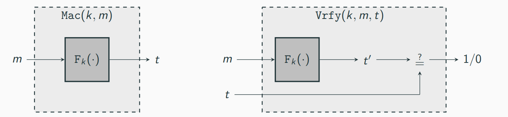

If F is a pseudorandom function, then this construction is a secure fixed-length MAC for messages of length n.

## Distinguisher D

D is given input 1^n and access to Oracle O: {0,1}^n -> {0,1}^n, and words as follows:

1. Run A(1^n). Whenever A queries its MAC oracle on a message m(i.e., whenever A request a tag on a message m), answer this query in the following way:

Query O with m and obtain response t; return t to A.

2. When A outputs (m,t) at the end of its execution, do:

    2.1 Query O with m and obtain response t'.
    2.2 If (1) t' = t and (2) A never queried its MAC oracle on m, the output 1; otherwise, output 0.

## Domain Extension for MACs

Construction shows a general paradigm for message authentication codes form pseudorandom functions

Limirations: only messages of fixed-length can be handled, which is unacceptable for most apllications

Next step: Construct a MAC handling arbitary-length messages from a fixed-length MAC 
-> the construction is not very effictient

Let П' = (Mac', Vrfy') be a secure  fixed-length MAC for messages of length n

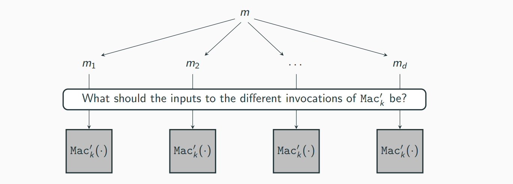

1. Split m into block and authenticate each block individually:

m = m1, ...,m_d -> ⟨t1, ..., t_d⟩, with t_i = Mac'_k(m_i)

- Problem: block re-ordering attack
- If ⟨t1,t2⟩ is a valid tag for message m1, m2(with m1 != m2), then ⟨t2,t1⟩ is a valid tag for message m2,m1

2. Add a block index to each block to prevent the block re-ordering attack:

t_i = Mac'_k(i || m_i) (note that |m_i| < n)

    - Problem: truncation attack
    - Adversary can simply drop blocks from the end of the message and tag

3. Authenticate the message length to prevent the truncation attack:

t_i = Mac'_k (l||i||m_i) (where l is the length of the message)

- Problem: "mix-and-match" attack
- Tags ⟨t1, . . . ,td ⟩ and ⟨t'1, . . . ,t'd ⟩ for message m1,...,md and m'1, ..., m'd, respectively -> ⟨t1, t'2, t3, t'4⟩ is a valid tag for message m1, m2', m3, m4', ...

-> We need to add a random "message identifier" r in each block to prevent the "mix-and=match" attack, which leads to Construction

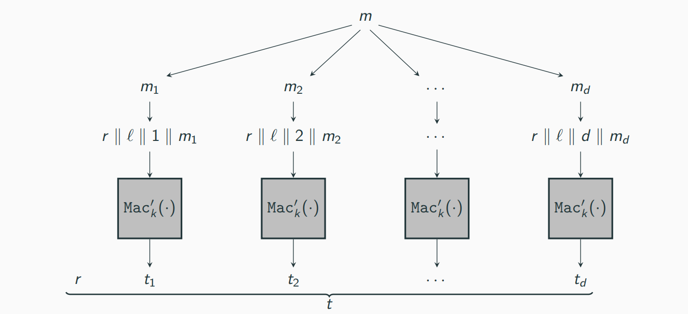

Let П' = (Mac', Vrfy) be a fixed-length MAC for messages of length n. Define a MAC as follows:

- Mac: on input a key k ∈ {0,1}^n and a message m ∈ {0,1}* of (nonzero) length l < 2^(n/4), parse m as d blocks m1, ..., m_d, each of length n/4. (The final block is padded with 0s of necessary.) Choose a uniform message identifier r ∈ {0,1}^(n/4). For i = 1, ..., d, compute t_i <- Mac'_k (r || l || i || m_i), where i, l are encoded as strings of length n/4. Output the tag t:= ⟨r,t1, . . . ,td⟩.

- Vrfy: on input a key k ∈ {0, 1}^n, a message m ∈ {0, 1}* of nonzero length l < 2^(n/4), and a tag t:= ⟨r,t1, . . . ,td′⟩, parse m as d block m1, ..., md, each of length n/4. (The final block is padded with 0s if necessary.) Output 1 if and only if d' = d and Vrfy'_k(r || l || i || m_i,t_i) = 1 for 1<= i <= d.

If П' is a secured fixed-length MAC for messages of length n, then Construction 4.7 is a secure MAC (for arbitary-length messages).

## CBC-MAC

Thereome 4.6 and Theorem 4.8 show that we can construct MACs for arbitrary-length messages from pseudorandom functions

The constructions, however, are extremely inefficient: messages of length d_n require 4d block cipher evaluations and have tags longer than 4dn bits

Fortunately, there are much more efficient constructions like CBC-MAC
-> CBC-MAC was the first standardized message authentication code

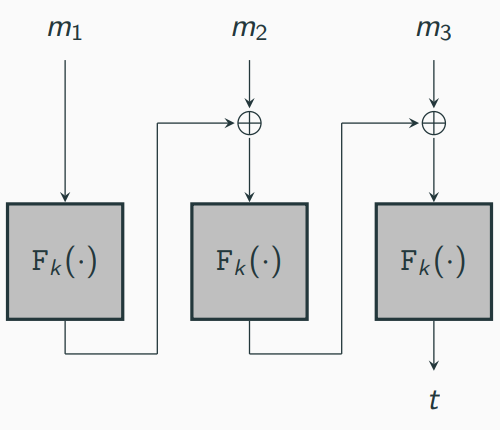

Let F be a pseudorandom function, and fix a length function l(n) > 0. The basic CBC-MAC construction is as follows:

- Mac: on input a key k ∈ {0, 1} ^ n and a message m of length l(n) * n, do the following (set l = l(n) in what follows):

    1. Parse m and m = m1, ..., m_l where each m_i is of length n.
    2. Set t_0 := 0^n. Then, for i = 1 to l, set t_i:= F_k(t_(i-1) xor m_i)

    Outputs t_l as the tag.

- Vrfy: on input a key k ∈ {0, 1} ^ n, a message m, and a tag t, do: If m is not of length l(n) * n then output 0. Otherwise, output 1 if and only if t = Mac_k(m).

Let l be a polynomial. If F is pseudorandom function, then Construction 4.9 is a secure MAC for messages of length l(n) * n.

Compare to Construction 4.5, basic CBC-MAC can handle longer messages (though still fixed-length)

Compared to Construction 4.7, basic CBC-MAC is much more efficient: only d block-cipher evaluations for a message of length dn a tag of length n (compared to 4d block cipher evaluations and tags of length mpre than 4dn)

## CBC-MAC vs. CBC-mode encryption

Basic CBC-MAC is similar to the CBC mode of operation but there are crucial differences:

1. CBC-mode encryption uses a ranom IV, which is crucial for security. CBC-MAC uses no IV (can be viewed as constant IV iv = 0^n), which is also crucial security.
2. In CBC-mode encryption the intermediate values (t_i in CBC-MAC) are output as part of the ciphertext. CBC-MAC only outputs the final value t_l.

Secure CBC-mAC for arbitary-length messages

Two variants to modify Basic CBC-MAC to handle arbitary-length messages (for simplicity, we assume that the messages have length a multiple of n):

1. Prepend the message m with its length |m| (encoded as an n-bit string), and then compute basic CBC-MAC on the result.

-> Caveat: appending |m| to the end and then computing CBC-MAC is not secure

2. Use two independent keys k1, k2 ∈ {0, 1}^n. Compute basic CBC-MAC of m using k_1 and let t be the result; output 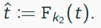

-> Advantage: message length is not required in advance (when starting to compute the tag)
-> Disadvantage: two keys needed
-> Trade-off: store only one key k and compute 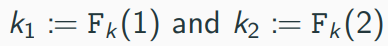 (smaller key but more computation cost)

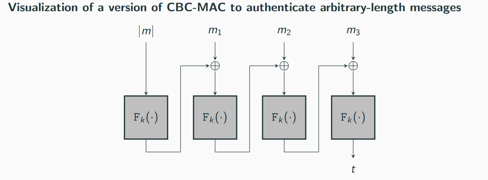