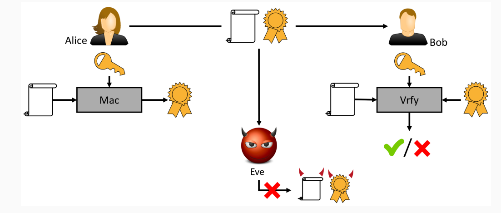

# Message Authentication Codes

## Message Integrity

Secrcecy vs. Integrity

Basic suctiry goal of cryptography: secure communication

What does secure communication mean?

So far we considered "secrecy" by showing that an eavsdropper cannot learn anything about the communicated messages

-> the adversary to be passive

There are other examples where one is not concerned with secrecy and aversaries are not mecessarily passive

Messag eintegrity against active adversaries is equally important
-> active adversaries can send and modify messages

Consider the scenario where Alice communicated with her bank over the Internet. When the bank recieves a request to transfer 1.000$ from Alice to Boob, there are two things for the bank to consider:

- Is the request authentic,i.e., did it come from Alice and not from someone else(for instance Bob)?
- If the request is authentic, is the content (e.g., the amount of money to be transfered) unaltered?

Standart error-correction methods do not apply to handle the second point

Secrecy and integrity are often confused and interwined
-> encryption does not (in general) provide integrity

We have seen encryption schemes using
- stream ciphers (OFB and CTR)
- block ciphers (ECB abd CBC)

None of them provide integrity

Encryption using stream ciphers: c = y xor m

- Flipping any bit of the ciphertext result in the corresponding bit of the message being flipped
- Considering the example of transfering money, one can modify the amount by flipping the bits indicating the amount to be transfered

Encryption using block ciphers:

- Not as trivial as for stream ciphers as a single bit fkips on the ciphertext typically affect more than a single bit of the message 
-> But there is still an predictable effect

- For ECB, flipping a bit in the ith ciphertext block only affect the ith block
-> the fact that ECB does not even achiebe secrecy does not matter right now

- For CBC, flipping the jth bit of the IV affects only the jth bit of the first message block 
-> the first block can be modified arbitrarily

# Message Authentication Codes (MACs) - Definitions

We have seen that private-key encryption does not solve the problem of message integrity

To achieve message integrity, we introduce a new cryptographic primitive called message authentication codes (MACs)

The setting is similar to private-key encryption, in the sence that Alice and Bob share some secret key but rather the goal is to achive messag integrity rather than secrecy

A message authentication code (or MAC) consis of three probabilistic polynomial-time algorithms (KGen, Mac, Vrfy) such that:

1. The key-generation algorithm KGen takes as input the sectuiry parameter 1^n and outputs a key k with |k|>= n.

2. The tag-generation algorithm Mac and a message m ∈ {0,1}*, and outputs a tag t. Since this algorithm may be randomized, we wirte this as t <- Mac_k(m)

3. The deterministic verification algorithm Vrfy takes as input a key k, a messag m, and a tag t. It outputs a bit b, with b = 1 meaning valid and b = 0 meaning invalid. We wite this as b:= Vrfy_k(m,t)

# 140