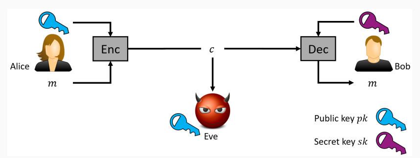
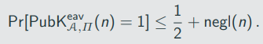
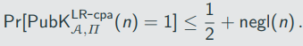
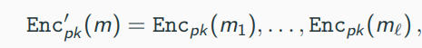
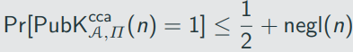
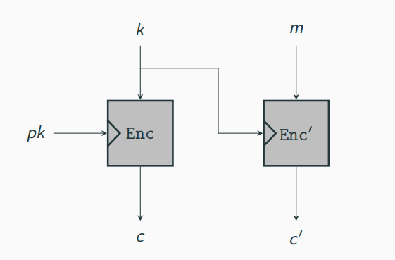
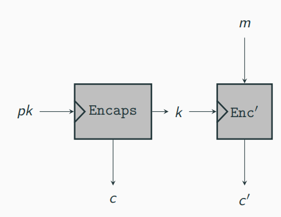
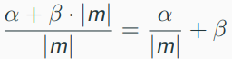
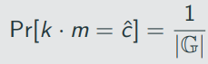
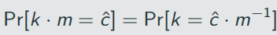

`# Public-Key Encryption

# Public-Key Encryption - An Overview

## Comparison to Private-Key Encryption

1. Secret of keys:
    - Private-key encryption requires secrecy of the key k
    - Public-key encryption requires only for the secret key sk - not the public key pk
    -> the impact is huge: when in the same room, Bob can simply "shout" his public key across the room for Alice to learn it
    -> Bob can publish his public key on his website

2. Usage of keys:
- Private-key encryption schemes use the same key for both encryption and decryption
- Public-key encryption schemes use different keys for encryption and decryption
    -> public-key encryption schemes allow only unilateral communication: Alice can only encrypt for Bob

Main disadvantage of public-key encryption: it is rougly 2-3 orders of magnitude slower than private-key encryption
-> exact number are hard as it depends on many variable (schemes, implementation details, hardware, etc.)

## Secure Distribution of Public Keys

What about an active attacker Eve that can tamper with the communication?

-> when Bob sends his public key pk_b to Alice, Eve can replace it with its own public key pk_E
-> in the aforementioned discussion, this was excluded by assuming an authenticated channel
-> if Alice and Bob do not share any information in advance (or rely on some trusted third party), preventing such an attack is impossible

Such active attacks are a real threat in practice to be dealt with
-> we will return to this problem later
-> throughout this chapter, we assume key distribution, i.e. that the sender receives a legimate copy of the receiver's public key

## Definitions

A public-key encryption scheme consists of three porbabilistic polynomial-time algorithms (KGen, Enc, Dec) such that:

1. The key-generation algorithm KGen takes as input 1^n and outputs a pair of key (pk, sk). We refer to the first of these as the public key and the second as the private key. We assume  for convernience that pk and sk each has length at least n, and that n can be determined from pk, sk. The public key pk defines a message space M_pk.

2. The encryption algorithm Enc takes as input a public key pk and message m ∈ M_pk, and outputs a ciphertext c; we denote this by c <- Enc_pk(m). (Looking ahead, Enc will need to be probabilistic in order to achieve meaningdul security.)

3. The decryption algorithm Dec takes as input a private key sk and a ciphertext c, and outputs a message m or a special symbol ⊥ denoting failure. We write this as m:= Dec_sk(c).

It is required that, except with negligible porbability over the randomness of KGen and Enc, we have Dec_sk(Enc_pk(m)) = m for any message m ∈ M_pk

The following security definition is the "natiral" counterpart of Definition 3.8 in the public-key setting

The eavesdropping indistinguishability experiment :

1. KGen(1^n) is run to obtain keys (pk, sk)
2. Adversary A is given pk, and outputs a pair of equal-length messages m0,m1 ∈ M_pk
3. A uniform bit b ∈ {0,1} is chosen, and then a ciphertext c <- Enc_pk (m_b) is computed and given to A. We call c the challenge ciphertext.
4. A outputs a bit b'. The output of the experiment is 1 if b' = b, and 0 otherwise. if b' = b we say that A succeds

A public-key encryption scheme П = (KGen, Enc, Dec) has indisnguishable encryptions in the presence of an eavesdropper if for all probabilistic polynomial-time adversaries A there is a negligible fucntion negl such that, for all n,

The probability above is taken over the randomness used by A and the randomness used in the experiment (for chosing the key and the bit b, as well as any randomness used by Enc).

The above definition is very similar to Definition 3.8(for private-key encryption)

Main difference: A receives the public key pk as input
-> additional implication: A can choose the messages m0 and m1 based on this public key

This arguably small change has huge impact: having access to the public key essentially grants access to an encryption oracle for free
-> having pk, A can simply compute Enc_k(m) for arbitrary m(recall that Enc is public)

The upshot is that Definition 12.2 is equivalent to CPA-security (analogously defined to Definition 3.21 except that A gets the public key):

If a public-key encryption scheme has indistinguishable encryptions in the presence of an eavesdropper, it is CPA-secure.

This is a significant difference to the private-key encryption setting, where Proposition 3.19 states that these security properties are not equivalent!

## Impossibility of perfecrly secret public-key encryption

A definition of perfectly secret public-key encryption is obtained by extending Definition 12.2 to all adversaries (not just PPT ones) and removing the negligible function in the upper bound

Recall that perfectly secret private-key encryption is possible (one-time pad)

In contrast, perfectly secret public-key encryption is impossible

## Insecurity of deterministic public-key encryption

For private-key encryption, we noted that no deterministic encryption scheme can be CPA-secure

The same holds for public-key encryption:

No deterministic public-key encryption scheme is CPA-secure

Theorem 12.4 is neither a simple artefact of the definition nor an indicator that the definition is too strong

A problematic scenario is when set of possible messages is small:

-> assume that you will receive your final grade of the course encrypted using your public key, i.e. a ciphertext c:= Enc_pk(m), where m is your grade

-> since m ∈ {1.0, 1.3, 1.7, 2.0, 2.3, 2.7, 3.0, 3.3, 3.7, 4.0, 5.0} anyone can compute the 11 candidate ciphertexts and compare with the one sent to identify your grade

## Multiple Encryptions

We again ask the question what happens when a key (in this case a public key pk) is used multiple times

Let LR_pk,b(·, ·) be a "left-or-right" oracle, which on input two equal-length message m0 and m1 computes and returns the ciphertext c <- Enc_pk(m_b)

The LR-oracle experiment :

1. KGen(1^n) is run to obtain keys (pk,sk)
2. A uniform bit b ∈ {0, 1} is chosen
3. The adversary A is given input pk and oracle access to LR_(pk, b) (·, ·)
4. The adversary A outputs a bit b'.
5. The output of the experiment is defined to be 1 if b' = b, and otherwise. If , we say that A succeeds.

A public-key encryption scheme П = (KGen, Enc, Dec) has indistinguishable multiple encryptions if for all probabilistic polynomial-time adversaries A there is a negligible function negl such that:

Similar to the private-key setting, any CPA-secure scheme also has indistinguishable multiple encryptions:

If public-key encryption scheme П is CPA-secure, then it also has indistinguishable multiple encryptions

Consequence of Theore,e 12.6: a CPA-secure encryption scheme for fixed-length messages implies a public-key encryption scheme for arbitary-length messages.

Let П = (KGen, Enc, Dec) be an encryption scheme for 1-bit messages (etreme case).
Construct a new ecnryption scheme П' = (KGen', Enc', Dec') with message space {0,1}* by defining Enc' as follows:

where m = m1, ..., m_l 

Let П and П' be as above. If П is CPA-secure, then so in П'

We have covered three security definitions for public-key encryption:

1. indistinguishable encryption in the presence of an eavesdropper
2. CPA-security
3. indistinguishable multiple encryptions

Since these are equivalent, we will follow the usual convertion from cryptographic literature and use the term "CPA-security" in the following

## Security against Chosen-Ciphertext Attacks

Consider the case where an eavesdropper A observers a viphertext c sent from a sender S to a receiver R. There are two ways how A might mount a chosen-ciphertext attack:

1. A might send a modified ciphertext c' to R on behalf of S
-> in case of ecnrypted email, A might construct an ecnrypted email c' and forge the "From" field to make  it look like it originates from S
-> subsequent behavior of R might reveal some information about m' wjich in turn might reveal something about the original message m
2. A might send a modified ciphertext c' to R in its own name
-> A might learn the entire decryption m' of c' if R responds directly to A (think of R responding to the email quoting the initial message)

The second class of attacks is specific to public-key encryption schemes- there is no private-key encryption counterpart 

The CCA indistinguishable experiment :

1. KGen(1^n) is run to obtain keys (pk,sk)
2. Adversary A is given pk and access to a decryption oracle Dec_sk(·). It outputs a pair of messages m0, m1 ∈ M_pk of the same length.
3. A uniform bit b ∈ {0,1} is chosen, and then a ciphertext c <-  Enc_pk(m_b) is computed and given to A.
4. A continues to interact with the decryption oracle, but may no request a secryption of c itself. Finally, A outputs a bit b'.
5. The output of the experiment is 1 if b' = b, and otherwise.

A public-key encryption scheme П = (KGen, Enc, Dec) has indistinguishable encryptions under a chosen-ciphertext attack (or is CCA-secure) if for all porbabilistic polynomial-time adversaries A there is a negligible function negl such that

The natural analogue of Theorem 12.6 holds for CCA-security: if a scheme has indistinguishable encryptions under a chosen-ciphertext security then it has indistinguishable multiple encryptions under a chosen-ciphertext attack (defined appropriately)

The analogue of Claim 12.7 does not hold for CCA-security

An analogue of authenticated ecnryption

For private-key encryption, we defined authenticated encryption which was even stronger than CCA=security

This notion cannot ne translated directly to the context of public-key ecnryption
-> for private-key encryption schemes, a key is used only by two parties (sender and receiver)
-> for public-key encryption schemes, the same public ley is used by many senders (sending to the same receiver holding the private key)

Nevertheless, one can consider an analogue of authenticated encryption in the public-key setting: so-called signcryption

# Hybrid Ecnryption and the KEM/DEM Paradigm

Claim 12.7 showed that we can expand the message space of a public-key encryption scheme:

Enc'_pk(m) = Enc_pk(m_1), ..., Enc_pk(m_l)

-> we need l invocations of the original scheme and the ciphertext length increases by a multiplicative factor of l as well

Better approach: use private-key encryption in tandem with public-key encryption, so-called hybrid encryption

Illustration of hybrid encryption:

Let Enc denote a public-key encryption and Enc' denote a private-key encryption

In a direct implementation, the sender would share k by

1. choosing a uniform value k and
2. encrypt k using a public-key encryption scheme

A more direct approach is to use a public-key primitive called a key-encapsulation mechanism (KEM) which does these two steps "in one shot".

A key-encapsulation mechanism (KEM) is a tuple of probabilistic polynomial-time algorithms (KGen, Encaps, Decaps) such that:

1. The key-generation algorithm KGen takes as input the security parameter 1^n and outputs a public-/private-key pair (pk, sk). We assume pk and sk each has length at least n, and that n can be determined from pk.
2. The ecnapsulation algorithm Encaps takes as input a public key pk (which implicity defined n). It outputs a ciphertext c and a key k ∈ {0,1} ^(l(n)), where l is key length. We write this as (c,k) <- Encaps_pk(1^n).
3. The deterministic decapsulation algorithm Decaps takes as input a private key sk and a ciphertext c, and outputs a key k or a special symbol ⊥ denoting failore. We write this as k:= Decaps_sk(c).

It is required that with all but negligible probability over the randomness of KGen and Encaps, if Encaps_pk(1^n) outputs (c, k) then Decaps_pk(c) outputs k.

Any public-key encryption scheme trivially gives a KEM: choose random k and encrypt it
-> dedicated construction, however, can be mroe efficient

Using a KEM, we can implement hybrid encryption via the KEM/DEM approach (DEM: data-encapsulation mecahnism)

Let П = (KGen, Encaps, Decaps) be a KEM with key length n, and let П' = (KGen, Enc', Dec') be a private-key encryption scheme. Construct aa public-key encryption scheme П^(hy) = (KGen^(hy), Enc^(hy), Dec^(hy)) as follows:

- Kgen^(hy): on input 1^n run KGen(1^n) and use the public and private key (pk, sk) that are output.

- Enc^(hy): on input a public key pk and a message m ∈ {0, 1}* do:

    1. Compute(c, k) <- Encaps_pk(1^n).
    2. Compute c' <- Enc'_k(m).
    3. Output the ciphertext ⟨c, c′⟩
- Dec^(hy): on input a private key sk and a ciphertext ⟨c, c′⟩ do:
    1. Compute k:= Decaps_sk(c)
    2. Output the message m:= Dec'_k(c').

What is the efficiency of the hybrid encryption scheme П^(hy)?

For fixed n, let...
- ... α denote the cost of encapsulating an n-bit key using Encaps
- ... β denote the cost (per bit of plaintext) of ecnryption using Enc'

Assume |m| > n(which is the interesting case)

Then the cost, per bit of plaintext, of ecnrypting a message m using П^(hy) is

This term approaches β for sufficiently long messages.
-> we achieve the functionality of public-key encryption at the efficiency of private-key encryption (at least for sufficiently long messages)

We will not formalize security for KEMs but - similar to public-key encryption - one can define CPA-security and CCA-security for KEMs

Regarding the security of П^(hy), one can show:

- If П is a CPA=secure KEM and the private-key encryption scheme П' is EAV-secure, the П^(hy) is CPA-secure public-key encryption scheme
    -> notice that П' requires only a weaker form of security (EAV-security) which does not imply CPA-security; the (intuitive) reason is that each message is ecnrypted using a fresh uniform key k (output by П)
- If П is a CCA-secure KEM and П' is a CCA-secure private-key encryption scheme, the П^(hy) is CCA-secure public-key ecnryption scheme

# CDH/DDH- Based Encryption

## ElGamal Encryption

In 1985 Taher ElGamal observed that the Diffie-Hellman key-exchange can be transformed into a public-key encryption scheme

Diffie-Hellman key-exchange: Alice sends a message, Bob responds with a message, and afterwards they sahre a key k (some element of the froup G)

-> If Bob sends k*m (for some m ∈ G), Alice - using her knowledge of k - can recover ,

That ElGamal encryption scheme requires a slight change of perspective:

- We view Alice's message as her public key
- We view Bob's response (together with k * m) as the ciphertext

The following lemma is an important result for the ElGamal encryption scheme

Let G be a finite group, and let m ∈ G be arbitary. Then choosing uniform k ∈ M and setting c:= k * m, results in a uniformly distributed c ∈ G, Put  differentlym dir any c^ ∈ G, we have

where the probability is taken over uniform choice of k ∈ G

Let c^ ∈ G be arbitary. Then 

Since k is uniform, the probability that k is equal to the fixed element c^ * m^(-1) is exacly 1/|G|

## 355