# Digital Signature Schemes

# Digital Signature - An Overview

Piblic-key encryption schemes can be used to achieve secrecy in the public-key setting

Signature schemes can be used to achieve integrity (or authenticity) in the public-key setting
-> similar to messages authentication codes in the private-key setting but there are important differences

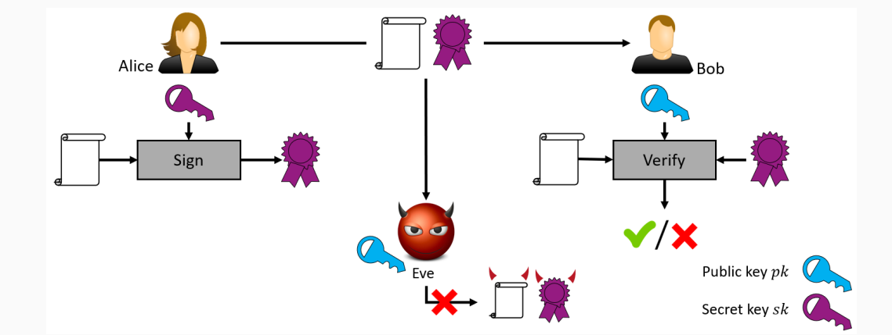

Example use-case: software updates
-> a signature allows to verify that the intended update (instead of malware) was downloaded

Signature schemes are unilateral just as discussed for public-key encryption:

- Alice can only sign messages
- Bob can only verify signatures

Signature schemes allow everyone (subject to having the public key) to verify a signature

- if Bob receives a message-signature pair of Alice, he can present it to a judge who can verify that Alice indeed signed the message
- signature schemes provide so-called non-repudiation, meaning that Alice cannot deny having signed a message
- this property is not achieved by message-authentication codes

## Relation to Public-Key Encryption

A common misconception: signatures are the inverse of public-key encryption (merely swapping the roles of sender and receiver)

Historically,  it has been suggested that one gets a signature σ by first decrypting a message m and then verifying that encrypting the signature σ equals the message m
-> this undoubtably originates fron RSA, which gives the impression that this might work
-> this suggestion is completely unfound: either it is simply not applicable or the resulting schemes are insecure

# Definitions

A (digital) signature scheme consists of three probabilistic polynomail-time algorithms (KGen, Sign, Vrfy) such that:

1. The key-generation algorithm KGen takes as input a security parameter 1^n and outputs a pair of key (pk, sk). These are called the public key and private key, respectively. We assume that pk and sk has length at least n, and that n can be determined from pk or sk.

2. The signing algorithm Sign takes as input a private key sk and a message m from some message space (that may depend on pk). It outputs a signature σ, and we write this as σ <- Sing_sk(m)

3. The deterministic verification algorithm Vrfy takes as input a public key pk, a message m, and a signature σ. It outputs a bit b, with b = 1 meaning valid and b = 0 meaning invalid. We write this as b:= Vrgy_pk(m, σ)

It is required that except with negligible probability over (pk, sk) output by KGen(1^n), it holds that Vrfy_pk(m, Sign_sk(m)) = 1 for every (legal) message m.

If there is a function l such that for every (pk, sk) output by KGen(1^n) the message spce is {0,1}^(l(n)), then we say that (KGen, Sign, Vrfy) is a signature scheme for messages of length l(n)

We again - just as we did for public-key schemes - assume that Bob can obtain a legimate copy of Alice's public key

Q: Why bother with signature schemes at all if Alice can send an authentic copy of her public key to Bob? Why not simply send the message instead?
-> recall that we do not want secrecy for the message

A: Secure dictibution of the public key may be difficult and expensive but it needs to be done only once; afterwards Alice can send an aribtary number of messages that she signed

Furthermore, signature schemes itself are used to ensure the secure distributive other public keys
-> we discuss that later on the context of public-key infrastructures

## Security of signature schemes

Q: How should the security experiment be defined?

The signature experiment Sig-Forge_(A,П)(n):

1. KGen(1^n) is run to obtain key (pk, sk)
2. Adversary A is given pk and acces to an oracle to Sign_sk(·). The adversary then outputs (m, σ). Let Q denote the set of all queries that A asked its oracle.
3. A succeeds if and only if 
    (1) Vrfy (pk, m, σ) = 1 and
    (2) m !∈ Q.
    In that case the output of the experiment is defined to be 1

## Definition 13.2

A signature scheme П = (KGen, Sign, Vrfy) is existentially unforgeable under an adaptive chosen-message attack, or just secure, if for all probabilistic polynomial-time adversaries A there is a negligible function negl such that:

Pr[Sig-Forge_(A,П)(n) = 1] <= negl(n)

Strong security can be defined analogously to Definition 4.3 for MACs

## The Hash-and-Sign Paradigm

Recall that public-key encryption is significatly less efficent than private-key encryption

The same holds for signature schemes when compared to MACs

Just as we did for hybrid ecnryption, we can obtain the functionality of signature schemes at the asymptotic cost of private-key operations
-> Hash-and-Sign

Visualization of Hash-and-Sign 

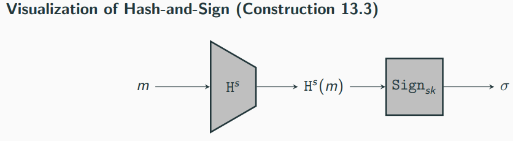

Signing: hash the message, followed by signing the hash value
Verification: hash the message, followed by verifying if the signature is valid for the hash valued

## Construction 13.3

Let П = (KGen, Sign, Vrfy) be a signature scheme for messages of length l(n), and let H = (KGen_H, H) be a hash function with output length l(n). Construct a signature scheme П' = (KGen', Sign', Vrfy') as follows:

- KGen': on input 1^n, run KGen(1^n) to obtain (pk, sk) and run KGen_H(1^n) to obtain s; the public key is ⟨pk,s⟩ and the private key is ⟨sk,s⟩
- Sign' : on input a private key ⟨sk,s⟩ and a message m ∈ {0, 1}*, output σ <- Sing_sk(H^s(m))
- Vrfy' : on input a public key ⟨pk,s⟩, a message m ∈ {0, 1}∗, and a singature σ, output 1 if and only if Vrfy_pk(H^s(m), σ) = 1

## Theorem 13.4

If П is a secure singature scheme for messages of length l(n) and H is collision resistant, then Construction 13.3 is a secure signature scheme (for arbitary-length messages)

Proof (intuition)

There are two possibilities regarding message m* !∈ Q for which A forges a signature:

1. There exists a message m ∈ Q such that H^s(m*) = H^s(m)
-> Then A has found a collisionj, contradicting the collsion resitance of H

2. For every m ∈ Q we have H^s(m*) != H^s(m)
-> then A has forged a signature for the "new message" H^s(m*) with respect to the fixed-length signature scheme П, contracdicting that П is secure

# RSA-Based Signatures

## Plain RSA Signatures

We start with a simple (yet insecure) signature scheme based on RSA
-> remember that sk = ⟨N, d⟩ and pk = ⟨N, e⟩

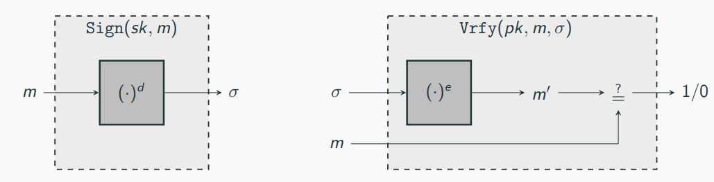

Construction 13.5 (Plain RSA Signature)

Let GenRSA be as before. Define a signature scheme as follows:

- KGen: on input 1^n run GenRSA(1^n) to obtain (N, e, d). The public key is ⟨N, e⟩ and the private key is ⟨N, d⟩.
- Sign: on input a private key sk = ⟨N, d⟩ and a message m ∈ Z*_N, compute the signature
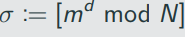
- Vrfy: on input a public key pk = ⟨N, e⟩, a message m ∈ Z*_N, and a signature σ ∈ Z*_N, output 1 if and only if 

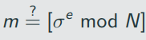

Correctness: 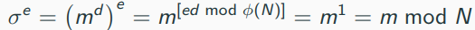

## Attacks against Plain RSA signatures

No-Message-Attack:

1. choose σ ∈ Z*_N
2. compute m := [σ^e mod N]
3. output (m, σ)

Verification: obvious

Attack might look less critical, as the adversary obtains singatures for "random" messages
-> irrelevant for our definition of security
-> by trying multiple, uniform σ, the adversary can find a message m with a few bits set is a specific way

Forgery for arbitary message m:

1. Choose m1, m2 ∈ Z*_N distinct from m such that m = m1*m2 mod N
2. get signatures σ1 and σ2 for m1 and m2, respectively (-> two queries to oracle Sign)
3. output σ:= [σ1, σ2 mod N] as a signature of m

Verification: σ^e = (σ1 * σ2) ^ e = (m1^d * m2^d) ^ e = m1^(de) * m2^(de) = m1 * m2 = m mod N

-> obtaining signatures for m1 and m2 is not so hard in practice, making this a devastating attack!

-> generalization: having signatures on q messages M = {m1, ..., m_q} allows to generate valid singatures for any combination of messages in M

To avoid this attack (and the no-message attack from before), we can apply some transformation to the message before singing them
-> this yields RSA full-domain hash (RSA-FDH)

Visualization of RSA-FDH

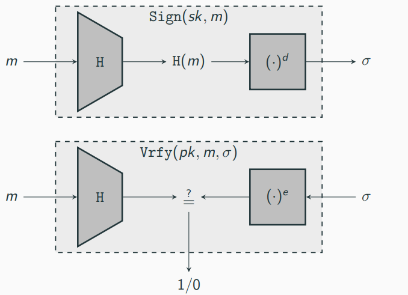

## Consturction 13.6 (RSA-FDH)

Let GenRSA be as before, and construct a siganture scheme as follows:

- KGen: on input 1^n run GenRSA(1^n) to obtain (N, e, d). The public key is ⟨N, e⟩ and the private key is ⟨N, d⟩. As part of key generation, a function H: {0, 1}* -> Z*_N is specified, but we leave this implicit.
- Sign: on input a private key sk = ⟨N, d⟩ and a message m ∈ Z*_N, compute

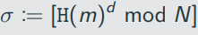

- Vrfy: on input a public key pk =  ⟨N, e⟩, a message m ∈ Z* _N, and a singature σ ∈ Z*_N, output 1 if and only if 

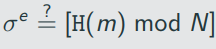

What properties does H has to specify for RSA-FDH to be secure?

1. H has to be hard to invert
-> absence of this enables the first attack discussed above
2. H must not admit "multiplicative relations", meaning it should be hard to find m, m1, m2 with H(m) = H(m1) * H(m2) mod N
-> absence of this enables the second attack discussed above
3. H must be collision resistant
-> absence of this allows for forgery attacks as colliding messages have the same signatures

There is no known way of choosing H such that Construction 13.6 can be proven secure

It is, however, possible to prove security if H is modeled as a random oracle
-> try to convince yourself that a random function satisfies the three requirements above

## Theorem 13.7

If the RSA problem is hard relative to GenRSA and H is modeled as a random oracle, then Construction 13.6 is secure.

# Certificates and Public-Key Infrastructures

So far we have assumed that Alice and Bob can obtain legitimate copies of their respective public keys

Now we discuss how public-key cryptography itself can be used to solve the problem of secure key distribution

At first glance this might sound circular but it is not
-> if we can manage to securely distribute the public key of a trusted party once, we can use this key to "bootstrap" the secure distribution of arbitarily many other public keys

The solution are so-called digital certificates
-> signatures binding a public key to an identity

Assume we have two parties Bob and Charlie with their respective key-pairsL

- Bob's key-pair: (pk_B, sk_B)
- Charlie's key-pair: (pk_C, sk_C)

If Charlie knows Bob's public key, Charlie can compute the signature

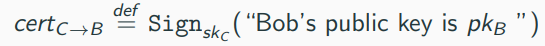

and give it to Bob
cert_(C -> B) is a ceritificate issued by Charlie, starting that pk_B belongs to Bob

Assume that Bob want to communicate with Alice, who knows Chralie's public key pk_C

Bob can send (pk_B, cert_(C-> B)) to Alice

If Alice trust Charlie, she might accept pk_B as Bob's legitimate public key

This is only a high-level idea which omits many details:

- How does Charlie know that pk_B is Bob's public key?
- What does it mean for Alice to trust Charlie?
- ...

Specifying these details (and more) defines a public-key infrastructure (PKI)
-> here we only discuss the gist of PKIs but not the details

## A single certification autority

Simplest PKI: a single certification authority (CA) who everyone trusts
-> not a single person but a company

How to get the public key of the CA?
-> for instance by physical means: go there and obtain a USB stick with the key

Nowadays: public keys of CAs are hardwired into the code
-> example: web browser softwares have public keys of CAs hardcoded into it

## Multiple certification authorities

A single CA is simple and appealing, but ...

- ... it is unlikely that everyone trusts this CA
-> does not have to mean that the CA is corrupt; maybe Alice simply finds the CA's verification process to be insufficient
- ... this CA is a single point of failures (similar to KDC) 

Instead, Bob can obtain multiple certificates (from different CAs) and Alice can decide based on whether there is a certificate from any CA that she trusts

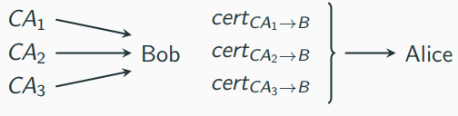

## Deligation and certificate chains

Certification chains can alleviate the burden of a single CA 

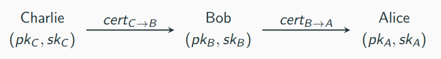

Assume Alice want to talk to Dave who ...
- ... knows Charlie's public key pk_c
- ... does not know Bob's public key pk_B

Alice can send pk_A, cert_(B -> A), pk_B, cert_(C -> B) to Dave
-> Dave can first verify Bob's public key and afterwards verify Alice's public key
-> if Dave trusts Charlie to only issue certificates to trustworthy people, then Dave might accpet pk_A as Alice's public key

This is a certification chain of length 2 which easily extends to longer chains

The idea of certificate chains can be used to build a PKI via a hierarchical structure

A CA-based PKI can consist of a "root" CA and n "second-leve" CAs CA1, ..., CAn
-> the root CA can issue certificates for the second=level CAs
-> the second=level CAs can then issue certificates for users

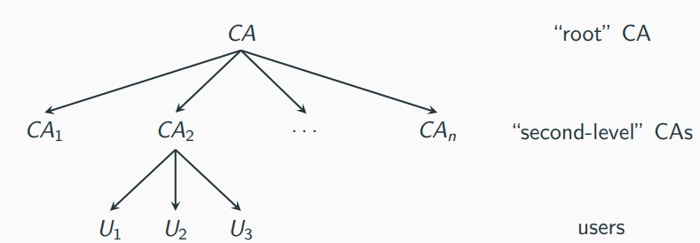

## Invalidating Certificates

Certificates should not be valid indefinitely
-> employees might leave the company after which they should no longer receive encrypted communication from others
-> private keys might be stolen (obviously requires a user to be aware of the theft)

We briefly discuss two relatively simple ideas how to deal with these problems:

1. Expiration
2. Revocation

-> real-world approaches can vary and are typically more complex

## Invalidating Certificates: Expiration

A certificate issued by Charlie for Bob will be of the form

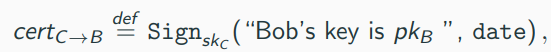

where date is some date in the future at which points the certificate becomes invalid

Alice would now need to check both the validity of the signature and that the expiration date has not passed yet

## Invalidating Certificates: Revocation

A certificate will contain a serial number ####, i.e., it will be of the form

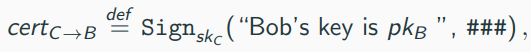

where #### is a unique serial number

To revoke certificate, the CA can sign a so-called certificate revocation list (CRL) which contains the serial number of all revoked certificates, which are published on a regular basis, say, daily

Alice would now need to check both the validity of the signature and that the serial number does not appear on the most recent CRL of the CA

# Putting it All Together - TLS

The Transport Layer Security (TLS) protocol is used each time you visit a website using https

TLS...

- ... is based on a precursor called SSL (Secure Sockets Layer) from the 90s
- ... version 1.0 was released 1999
- ... version 1.1 was released 2006
- ... version 1.2 was released 2008
- ... version 1.3 was released 2018

We discuss the core of TLS 1.3 (focusing on the key points and omitting seceral details)

The TLS protocol allwos a client (e.g., a web browser) and a server (e.g., a website) to agree on a set of shared keys, followed by using them for subsequent communication

The TLS protocol consists of two components:

1. a handshake protocol
2. a record-layer protocol

TLS technically allows for mutual authentication
-> primary usage: only the server authenticates to the client (the reason is that typically only the servers have certificates)
-> client-to-server authentication can be done afterwards, e.g., by logging in with a password

## The handshake protocol

Client C holds a set of CAs' public keys {pk1, ...., pk_n}; the server S holds a key-pair (pk_S, sk_S) of a signature scheme and a certificate cert_(i-> S) on pk_S(a certificate issued by one of the CAs)

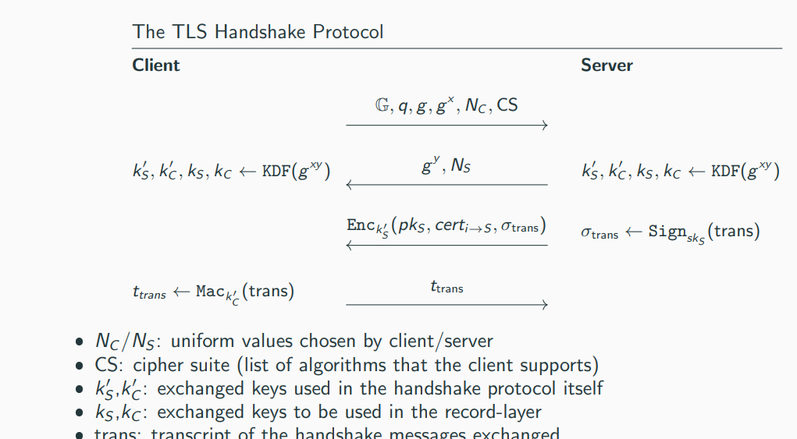

Security (intuition):

- Certificate cert_(i -> S) allows the client to be sure that it received the correct public key from the intended server
- Signature σ_trans convinves that the client ensures that the signed message (the transcript) has high entropy to protect agains replay attacks
- Signature σ_trans also guarantees that the message form the Diffie-Hellman key-exchange were not modified in transit
-> this excludes man-in-the-middle attacks
- Security of the Diffie-Hellman protocol ensures that an observing adversary learns nothing about the exchanged keys k'_S, k'_C, k_S, k_C

## The record layer-protocol

Having key k_C and k_S from the handshake protocol, client C and server S use those for an authenticated encryption to encrypt and authenticate their subsequent communication:
- Key k_C is used for messages C to S
- Key k_S is used for messages S to C
- Sequence numbers are used to prevent replay attacks

