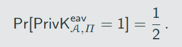
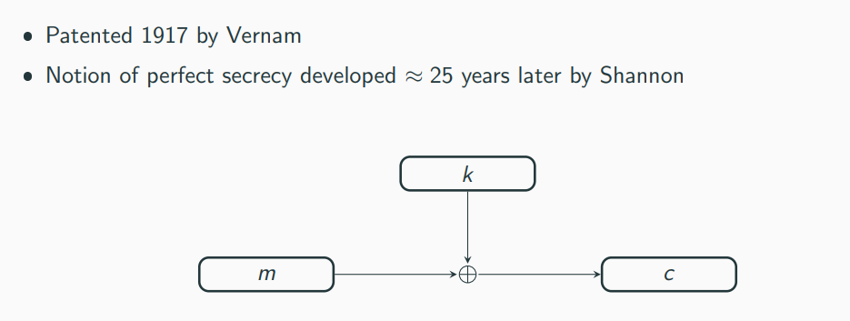

# Perfectly Secret Encyption

## A note on Randomness

Random-number generation:
1. Collect a pool of high-entropy data (entropy as measure of unpredictibility)
2. Extract a squence of nearly independent and unbiased bits from the high-entropy data

A simple idea for the second step of random-number generation:

- Assume that the high-entropy pool consists of a squence of biased, but independent bits: \
  1 and 0 occur with probability p and 1 -p, respectively
- To extract uniform bits, consider the biased sequence in pairs:
  - 1 followed by 0 -> output 0
  - 0 followed by 1 -> output 1
  - 0 followed by 0 -> output nothing
  - 1 followeb by 1 -> output nothing

- Probability of outputting 0: p * (1 - p)
- Probability of outputting 1: (1 - p) * p
- We obtain a uniformly distributed output from iur high-entropy pool

# Perfect correctness 

We assume perfect correctness, meaning that, for all k ∈ K, and m ∈ M, we have

Pr[Dec(k, Enc(K,m)) = m] = 1

Perfect correctness implies that decryption is deterministic (without loss of generality), as Dec(k,c) must return the same output every time

Let K be the random varible denoting the value of the key output by KGen, i.e., for any k ∈ K, Pr[K = k] denotes the probability that the output of KGen is k

Similary, let M be the random varible denoting the message being encrypted, so Pr[M = m] is the probability that message m is encrypted

- M is independent of the encryption scheme
- M reflects the likehood of different messages being sent, given the adversary's prior knowledge
- E.g., Pr[M = attack today] = 0.7 and Pr[M = don't attack] = 0.3

K and M are required to be independent , i.e. what is communicated must be independet of the used key

Fixing an encryption scheme(thereby fixing a distribution over keys) and distribution over the message space \ 
determines a distribution over the ciphertext space C. \
Let C be the resulting random varible

Consider the shift cipher \

K = {0,...,25} with Pr[K = k] = 1/ 26 for each k ∈ K \

Say the distribution over M is as follows \

Pr[M = a] = 0.7 and Pr[M = z] = 0.3

Probability that the ciphertext is B? There are two possibilites: either M = a and K = 1, or M = z and K = 2 \

By independence of K and M, we have \

Pr[M = a ^ K = 1] = Pr[M = a] * Pr[K = 1] = 0.7 * 1/26 

Similary, we have

Pr[M = z ^ K = 2] = Pr[M = z] * Pr[K = 2] = 0.3 * 1/26

Therefore 

Pr[C = B] = Pr[M = z ^ K = 2] + Pr[M = a ^ K = 1] = 0.7 * 1/26 + 0.3 * 1/26 = 1/26

What is the probability that message a was encrypted, given that we observe ciphertext B?

Pr[C = c] = sum(Pr[M = m ^ K = k])

What is the probability that message ann was encrypted, given that we observe ciphertext DQQ? Using Bayes’ Theorem yields

Pr [M = ann | C = DQQ] = (Pr[C = DQQ | M = ann] * Pr[M = m]) / Pr [C = DQQ] = ( 1 * 1/26 * 0.2) / (1/52) = 0.4

# Perfect Secrecy (informal and formal)

Informal: "Regardless of any prior information the attacker has about the plaintext, the ciphertext should leak no additional information about the plaintext"

Attacker's information about the plaintext: attacker-known distribution of M \
Perfect secrecy means that onserving the ciphertext should not change the attacker's knowledge about the distibution of M

Formal:

An encryption scheme (KGen, Enc, Dec) with message space M is perfectly secret if for every probability distribution for M, every message m ∈ M, \
and every ciphertext c ∈ C for which Pr[C = c] > 0: \

Pr [M = m | C = c] = Pr[M = m]

The distribution of M doest not change conditioned on observing the ciphertext
 

Equivalent formulation of perfect secrecy:

Pr[Enc(k,m) = c] = Pr[Enc(k,m') = c]

# Perfect (adverarial) indistinguishability experiment 

1. The adversary A outputs a pair of messages m0,m1 ∈ M.
2. A key k is generated using KGen, and a uniform bit b ∈ {0,1} is chosen. Ciphertext c <- Enc_k(m_b)
3. A outputs a bit b'
4. The output of the experiment is defined to be 1 if b' = b, and 0 otherwise. We write  = 1 if the output of the experiment is 1 and in this case we say that A succeeds.

Encryption Scheme П = (KGen, Enc, Dec) with message space M is perfectly indistinguishable if for every A it holds that

Encryption scheme П = (KGen, Enc, Dec) is perfectly secret if an only if it is perfectly indistinguishable.

# The One-Time pad

Construction

Fix an integer l > 0. The message space M, key space K, and ciphertext space C are all equal to {0,1}^l(the set of all binary strings of length l).

KGen: the key-generation algorithm chooses a key from K = {0,1}^l according to the uniform distribution (i.e., each of the 2^l string in the space is chosen as key with probability exactly 2^-l)
Enc: given a key k ∈ {0,1}^l and a message m ∈ {0,1}^l, the encryption algorithm outputs the ciphertext c:= k ⊕ m
Dec: given a key k ∈ {0,1}^l and a ciphertext c ∈ {0,1}^l, the decryption algorithm outputs the message m:= k ⊕ c

Problems/limitations of the OTP

- key is as long as the message
- Only secureif the key is used once
  - of m and m' are encrypted using k, yielding c and c', respectively, then
    c ⊕ c' = (m ⊕ k) ⊕ (m' ⊕ k) = m ⊕ m'

# Limitations of Perfect Secrecy

- The previous downsides are not specific to the one-time pad
- These downsides are inherent limitations of perfect secrecy
- Any perfect secret encryption scheme must have a key space that is at least as large as the message space

If (KGen, Enc, Dec) is a perfectly secret encryption scheme with message space M and key space K, then |K| >= |M|

# Shannon's Theorem

- Shannon also provided a characterization of perfectly secret encryption schemes
- This characterization (under certain conditions) says that
  1. KGen must choose the key uniformly at random form the set of all keys (as in one-time pad) and
  2. for every message m and ciphertext c there must be a unique key mapping m to c (again as in the one-time pad)
- The following theorem assumes |M| = |K| = |C|
  - We have already seen that perfect secrecy requires |K| >= |M|
  - Correct decryption requires |C| >= |M|
- In some sence |M| = |K| = |C| is "optimal"

Let (KGem, Enc, Dec) be an encryption scheme with message space M, for which |M| = |K| = |C|. This scheme is perfectly if and only if:

1. Every key k ∈ K is chosen with (equal) probability 1 / |K| by KGen.
2. For every m ∈ M and every c ∈ C, there is a unique key k ∈ K such that Enc_k(m) outputs c.