# Computational Security

- Perfect secrecy:
    - adversary with unlimited computation power learns nothing
    - worthwhile goal but unncessairly strong

- Computational security:

1. Security is only guaranteed against adversaries that run for some feasible amount of time
 -> with enough time, the adversary may be able to violate security

2, Adversaries can potentionally succeed (break security) with some very small probability

There are two approaches for computational security:

1. The concrete approach
2. The asymptotic approach

Quantify security of a cryptographic scheme by explicity bounding the maximum success probability of an adversary rrunning in some specified amount of time

a definition of concrete security takes the following form:

A scheme is (t, ϵ)-secure if any adversary running for time at most t succeeds in breaking the scheme with probability at most ϵ.

Let PPT denote "probabilistic polynomal-time". A definition of asymptotic security takes the following form:

A scheme is secure if any PPT adversary succeeds in breaking the scheme with at most negligible probability.

Negligable success probability

A negligible function is one that is asymptotically smaller than any inverse polynomial function

A function f: N -> R is negligible if for every polynomial p there is an N such that for all n > N it holds that f(n) < 1/p(n)

The functions 2 ^ (-n), 2 ^ (-sqrt(n)), n ^ (- log n) are all negligible

Let negl1 and negl2 be negligible functions. Then,
1. The function negl3(n) = negl1(n) + negl2(n) is negligible
2. For any polynomial p, the function negl4(n) = n(n) * negl1(n) is negligible

# Defining Computationally Secure Encryption

A private-key encryption scheme sonsists of three probabilistic polynomial-time algorithms (KGen, Enc, Dec) such that:

1. The key-generation algorithm KGen takes as input 1^n and outputs a key k; we write  k <- KGen(1^n) (KGen is a randonized algorithm). We assume without loss of generality that any key k output by KGen(1^n) satisfies |k| >= n.
2. The encryption algorithm Enc takes as input a key k and a plaintext message m ∈ {0,1}*, and outputs a ciphertext c. Since Enc may be randomized, we write this as c <- Enc_k(m).
3. The decryption algorithm Dec takes as input a key k and a ciphertext c, and outputs a message m ∈ {0,1}* or an error. We denote a generic errror by the symbol ⊥.

It is required for every m, every k output be KGen(1^n), and every m ∈ {0,1}*, it holds that Dec_k(Enc_k(m)) = m.
If (KGen, Enc, Dec) is such that for k output by KGen (1^n), algorithm Enc_k is only defined for messages m ∈ {0,1} ^ l(n), then we say that (KGen, Enc, Dec) is a fixed-length private-key encryption scheme for messages of length l(n).

Differences to before:
1. explicity take security parameter n into account
2. Message space is the set of (finite length) bit strings by default
3. Dec might output an error in case of invalid ciphertexts

The adversarial indistinguishability experiment 

1. The adversary A is given input 1^n, and outputs a pair of messages m0, m1 with |m0| = |m1|.
2. A key k is generated by running KGen(1^n), and a uniform bit b ∈ {0,1} is chosen. Ciphertext c <- Enc_k(m_b) is computed and given to A. We refer to c as the challenge ciphertext.
3. A outputs a bit b'.
4. The output of the experiment is defined to be 1 if b' = b, and 0 otherwise. We write  if the output of the experiment is 1 and in this case we say that A succeeds.

A private-key encryption scheme П = (KGen, Enc, Dec) has indistiguishable encryptions in the presence of an eavsdropper, or is EAV-secure, if for all robabilistic polynomal-time adversaries A there is a negligible function negl such that, for all n,
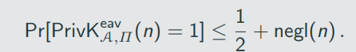

The probability above is taken over the randomness used by A and the randomness used in the experiment(for choosing the key and the bit b, as well as any randomness used by Enc)

A private=key encryption scheme П = (KGen, Enc, Dec) has indistinguishable encryptions in the presence of an eavesdropper if for all PPT adversaries A there is a negligible function negl such that

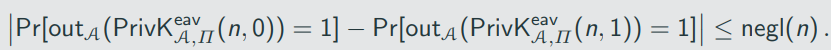

# Constructing an EAV-Secure Encryption Scheme

Important building block: pseudorandom generators (PRGs)

- A deterministic algorithm transforming a short, uniform string (called a seed) into a longer, "uniform-looking" (or "pseudorandom") output string

Let G be a deterministic polynomial-time algorithm such that for any n and any input s ∈ {0,1}^n, the result G(s) is a string of length l(n). G is a pseudorandom generator if the following conditions hold:

1. (Expansion.) For every n it holds that l(n) > n.
2. (Pseudorandomness.) For any PPT algorithm D, there is a negligible function negl such that 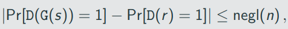

Where the first probability is taken over uniform choice of s ∈ {0,1}^n and the randomness of D, and the second probability is taken over uniform choice of r ∈ {0,1} ^ (l(n)) and the randomness of D.

We call l(n) the expansion factor of G.

Proofs by reduction

If problem X is harrd then construction П is secure.

Proof by reduction: show that an adversary A that breaks П can be turned into an algorithm A' that solves problem X
-> we reduce solving X to breaking П

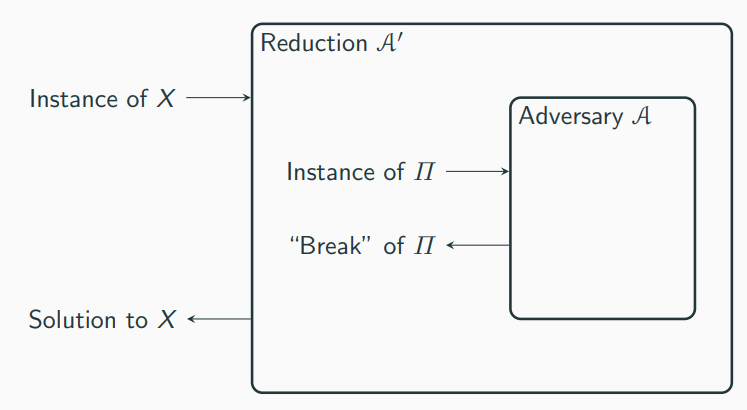

## Pseudorandom OTP

Let G be a pseudorandom generator with expansion dactor l(n). Define a fixed-length private-key encryption scheme for messages of length l(n) as follows:

- KGen: in input 1^n, choose uniform k ∈ {0,1} ^ n and output it as the key.
- Enc: on input a key k ∈ {0,1} ^ n and a message m ∈ {0, 1} ^ l(n), output the ciphertext

c:= G(k) xor m

Dec: on input a key k ∈ {0,1} ^ n and a ciphertext c ∈ {0,1} ^ l(n), output the ciphertext

m:= G(k) xor c

If G is a pseudorandom generatotm then Construction 3.17 is an EAV-secure, fixed-length private-key encryption scheme for length l(n).

## Distinguisher D

D receives as input w ∈ {0,1} ^ l(n):

1. Run A (1 ^ n) to obtain two messages m0,m1 ∈ {0,1} ^ l(n)
2. Choose a uniform bit b and compute c: = w xor m_b
3. Give c to A and obtain b'. Output 1 if b' = b, and 0 otherwise

# Stronger Security Notions

The security definitions so far consider the scenario that Alice and Bob exchange a single encrypted message

In practice Alice and Bob probably want ot exchange more messages(all enctypted using the same key) and an adversary might observe all of them

In the following we describe security experiment which allows the adcersary to onserve the encryption of multiple messages

A private=key encryption scheme П = (KGen, Enc, Dec) has indistinguishable multiple encruptions in the presence of an eavesdropper if for PPT adversaries A there is a negligible function negl such that

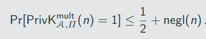

An encryption scheme that has indistinguishable multiple encryption clearly also has indistinguishable encryption as the latter is a special case of the former where the lists of messages have length 1

There is a private-key encryption scheme that has indistinguishable encryptions in the presence of an eavsdropper, but not indiguishable multiple encryptions in the presence of an eavsdropper.

If П is a encryption scheme in which Enc is a deterministic function of the key and the message, then П cannot have indistinguishable multiple encryptions in the presence of an eavesdropper.

Recall: chosen-plaintext attacks allow the adversary to obtain ciphertexts for plaintext of its choice

Below, Enc_k(.) denotes an "oracle" that A can query. When queries on m, Enc_k will compute and return c <- Enc_k(m)

The adversarial indistinguishability experiment 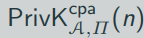:

1. A key k is generated by running KGen(1^n)
2. The adversary A is given input 1^n and oracle access to Enc_k(.), and outputs a pair of messages m0,m1 of the same length
3. A uniform bit b ∈ {0,1} is chosen, and then a ciphertext c <- Enc_k(m_b) is computes and given to A.
4. The adversary A continues to have oracle access to Enc_k(.), and outputs a bit b'
5. The output of the experiment is defined to be 1 if b' = b, and 0 otherwise. In the former case, we say that A succeeds.

A private-key encryption sheme П = (KGen, Enc, Dec) has indistiguishable encryptions under a chosen-plaintext attack, or is CPA-secure, if for all PPT adversaries A there is a negligible function negl such that

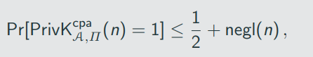

where the probability is taken over the randomness used by A, as well as the randomness used in the experiment

We use a slightly different approach here, which allows the adversary to adaprtively choose pairs of plaintexts to be encrypted

"Lefr-or-Right" oracle LR_k,b(.,.): on input a pair of equal-lenth messages m0,m1, the oracle computes c <- Enc_k(m_b) and returns c

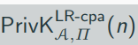

1. A key k is generated by running KGen(1^n)
2. A uniform bit b ∈ {0,1} is chosen.
3. The adversary A is given input 1^n and oracle access to LR_k,b(.,.) as defined above.
4. The adversary A outputs a bit b'
5. The output of the experiment is defined to be 1 if b' = b, and 0 otherwise. In the former case, we say that A succeeds.

Any private-key encryption scheme that is CPA-secure is also CPA-secure for multiple encryptions.

# Constructin a CPA-Secure Encryption Scheme

## Pseudorandom Functions

- A keyed ducntion F: {0,1}* x {0,1}* -> {0,1}* is a two input function, where the first input is the key
- F is efficient if there is a polynomal-time algorithm than computes F(k,x) given k and x
- The security parameter will dictate the lenth of key, input, and output, i.e,

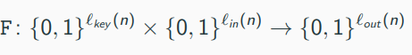

- We cannot give D a description of F_k or f because the latter is exponential, meaning that D could not read its entire input
- Instead, we allow the distinguisher to examine the input/output behavior of the cuntion by giving access to an oracle O which is either F_k or f

An efficient, length preserbing, keyed function F: {0,1}* x {0,1}* -> {0,1}* is a pseudorandom function if for all probabilistic polynomal=time distinguishers D, there is a negligible function such that: 

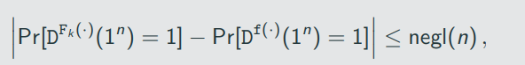

where the first probability is taken over uniform choice of k ∈ {0, 1} ^ n and the randomness of D, and the second probability is taken over uniform choice of f ∈ Func_n and the randomness of D.

Note that D does not het hte key k.

## Pseudorandom Permutations

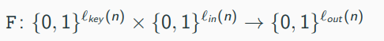

is a permutation, i.e., (one-to-one), which implies that l_in(n) - l_out(n)
Similar to the Dunction case, we will typically consider l_key(n) = l_in(n) = l_out(n) = n
Security is defined very similar to pseudorandom functions with the difference that it should be indistinguishable from a random permutation (instead of a random function)

Let F: {0,1}* x {0,1}* -> {0,1}* be an efficient, length preserving, leyed permutation. F is a strong pseudorandom permutation if for all probabilistic polynomal-time distinguishers D, there exists a negligible function negl such that:

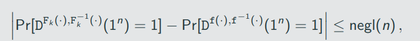

where the first probability is taken over uniform choice of k ∈ {0,1}^n and the randomness of D, and the second probability is taken over uniform choice of f ∈  Perm_n and the randomness of D.

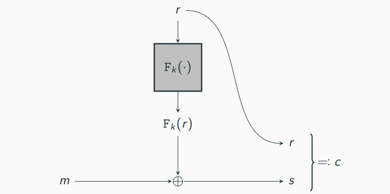

Let F be a pseudorandom fucntion. Define a fixed-length private-key encryption scheme for messages of length n as follows:

- KGen: on input 1^n, choose uniform k ∈ {0,1} ^ n and output it.
- Enc: on input a key k ∈ {0,1} ^ n and a message m ∈ {0,1}^n, choose uniform r ∈ {0,1}^n and output the ciphertext
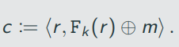
- Dec: on input a key k ∈ {0,1}^n and a ciphertext 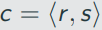, output the ciphertext

m:= F_k(r) xor s

If F is a pseudorandom function, then construction is a CPA-secure, fixed-length private-key encryption scheme for messages of length n.

## Distinguisher D

D receives as input 1^n and access to an oracle O:  {0,1}^n -> {0,1}^n

1. Run A (1^n). When A queries its encryption oracle on a message m ∈ {0, 1}^n:
    1. Choose unifrom r ∈ {0, 1}^n
    2. Query O(r) and obtain response y
    3. Return ciphertext 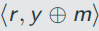 to A

2. When A outputs m0,m1 ∈ {0, 1} ^ n, choose a uniform bit b ∈ {0, 1} and: 
    1. Choose uniform r ∈ {0, 1} ^ n
    2. Query O(r) and obtain response y
    3. Return ciphertext 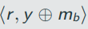 to A

3. Choose a unifrom bit b and compute c:= w xor m_b
4. When A outputs a bit b', outputs 1 if b' = b, and 0 otherwise

# Modes of Operation and Encryption in Practice

Formally, a stream cipher is a pair of deterministic algorithm(init, Next) where:

- Init takes as input a seed s and an optional initialization vector (IV) iv, and outputs some initial state st
- Next takes as input a current state st and outputs a bit y along with an updates state st'.

Starting from some initial state st_0, we can generate any number of bits by repeatedly calling Next

A shorthand, we define an algorithm GetBits which takes as input an initial state st0 and the desired output length 1^l and does the following:

1. For i = 1 to l, compute(y_i, st_i) := Next(st_(i-1))
2. Return the l-bit string y = y_1, ..., y_l as well as the final state st_l.

We write GetBits_1 for the algorithm that runs GetBits and only outputs the generated bits, i.e., y = y_1...y_l

Visualization of a stream cipher (without an IV):

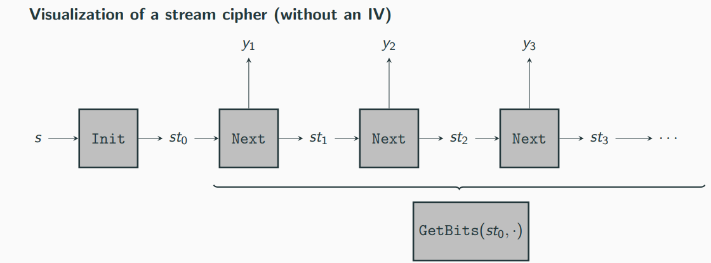

A stream cipher without an IV is a basically a pseudorandom generator with a more flexible interface:
-> running Init on a uniform seed s to obtain st_0 and then generating any (polynomal) number of bits using GetBits_1, the result is pseudorandom

Given a stream cipher (Init, GetBits) and a parameter l = l(n) > n. define

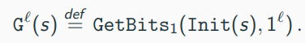

Then the stream cipher is secure if G^l is a pseudorandom generator for any polynomial l.

Security of a stream cipher that does tak an IV can be defined in multiple ways

Specificallym consider the case where uniform seed s is chosen and Init(s, .) is run repeadedly for different ic; the requirment is that runnign GetBits_1 using the different initial states should producestreams that appear independently uniform

Given a stream cipher (Init, GetBits) and a parameter l = l(n) > n, define

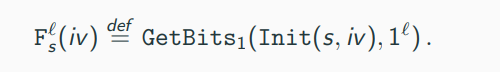

Then the stream cipher is secure if F^l is a pseudorandom function for any polynomial l

Stream cipher from a pseudorandom function

Let F be a pseudorandom function. Define a stream cipher(Init, Next) as follow, where Init accepts a 3n/4-bit initializtion vector and Next outputs n bits in each call:

- Init: on input s ∈ {0, 1}^n and iv ∈ {0, 1}^(3n/4), output st = (s,iv,0).
- Next: on input st - (s, iv, i), output 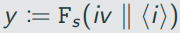 and updated state st' = (s, iv, i + 1) 

Stream cipher modes of operation

How to encrypt arbitary long messages using a stream cipher (Init, Next)?

We discuss two modes:

1. Synchronized mode
2. Unsynchronized mode

## Synchronized mode

Consider a sender S and a receiver R. Furhermore, assume that all messages arrive in order and no messages are lost. The following method allow the sender to encrypt a series of messages from S to R:

1. Both parties call Init(k) to obtain the initial state st_0
2. Let st_s be the current state of the sender S. To encrypt m, the sender:
    1. computes (y, st') := GetBits (st_s, 1 ^ |m|) and updates the state st_s to st_s'
    2. sends c:= m xor y to R.
3. Let st_R be the current state of the receiver R. To decrypt a ciphertext c, the receiver:
    1. computes (y, st_R') := GetBits(st_r, 1^ |c|) and updates the state st_r to st_r'
    2. computes m := c xor y

This method can be extended to bidirecational communication by using a second shared key for which the roles are flipped

## Unsynchronised mode

Let (Init, Next) be a stream cipher that takes an n-bit IV. Define a private-key encryption scheme for arbitary-length messages as follow:

- KGen: on input 1^n, choose uniform k ∈ {0, 1}^n and output it.
- Enc: on input a key k ∈ {0, 1}^n and a message m ∈ {0, 1}*, choose uniform iv ∈ {0, 1}^n, and output the ciphertext

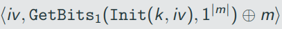

- Dec: on input a key k ∈ {0, 1}^n and a ciphertext c = ⟨ iv, c ⟩, output the message

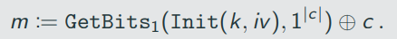

## Block Ciphers and Block-Cipher Modes of Operation

A block cipher is simply a different name for a pseudorandom permutation
-> main distinction block ciphers typically only support a specific set of key/block length

We have seen that we construct a stream cipher from a block cipher, which means we can construct the stream-cipher modes of operation discussed above

Here we discuss four block-cipher modes of operations and discuss thier security:

1. Electronic Code Book (ECB) mode
2. Cipher Block Chaining (CBC) mode
3. Output Feedback (OFB) mode
4. Couter (CTR) mode

In the following, we assume all messages m to have length a multiple of n and write m = m1,m2,...,m_l, where m_i are the individual message blocks

### Electronic COde Book (ECB) mode

Encryption:

1. For i = 1 to l, compute c_i := F_k(m_i)
2. Set c := F_k(m1), F_k(m2), ..., K_k(m_l)

- A naive mode of operation
- Encryption is ddeterministic and hence not CPA-secure
    -> repeated plaintext blocks result in repeated ciphertext blocks

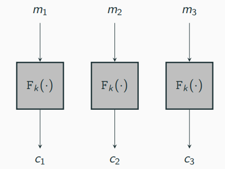

### Cipher Block Chaining (CBC) mode

Encryption:

1. Choose ic uniformly at set c0:= iv
2. For i = 1 to l, compute 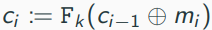
3. Set c:= iv, c1,...,c_l

- CBC encryption is rrandomized and one can show:

If F is a pseudorandom permutation, then CBC mode is CPA-secure.

Disadvantage of CBC mode: ciphertext blocks have to be computed sequentially (not parrallelizable)

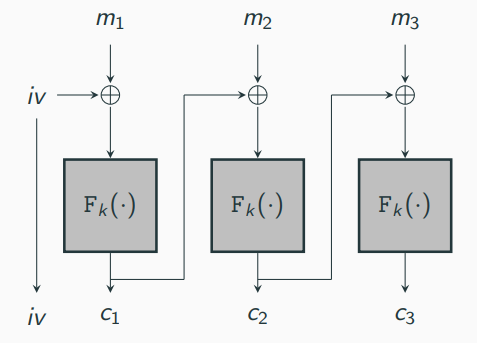

### Chained CBC mode

- A stateful variante of CBC mode (used in SSL 3.0 and TLS 1.0)
- Use the last block of previous ciphertext block as IV for the next message
- It appears to be as secure as CBC mode, but it is not CPA-secure

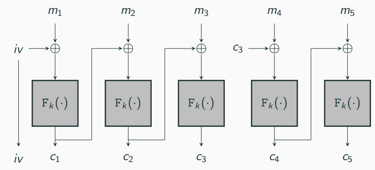

### Output Feedback (OFB) mode

Encryption:

1. Choose ic uniformly at set y_0 := iv
2. For i = 1 to l, compute y_i := F_k(y_(i-1))
3. For i = 1 to l, compute c_i := y_i xor m_i
4. Set c := iv, c1,...,c_l

- For OFV, F does not need to be a permutation
- Stateful variant of OFB is secure (y_L is used as IV for next message)
- Encryption is again sequentially but the coslty part (evaluating F) can be done independent of the message

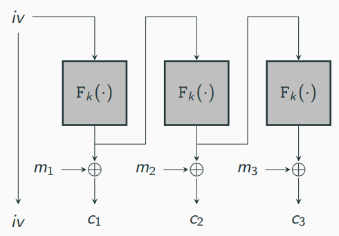

### Couter (CTR mode)

Encryption:

1. Choose iv uniformly from {0,1} ^ (3n/4)
2. For i = 1 to l, compute y_i := F_k (iv ∥ ⟨i⟩)
3. For i = 1 to l, compute c_i := y_i xor m_i
4. Set c:= iv, c1,...,c_l

Ctr mode is fully parallelizable

If F is a pseudorandom function, then CTR mode is CPA-secure for multiple encryptions.

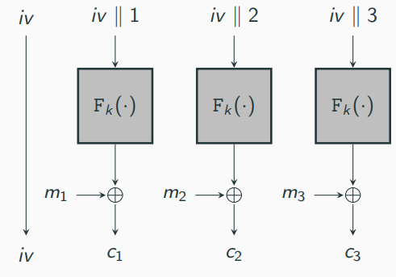

