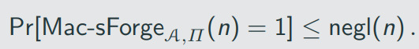

# Exercise 1

A secure deterministic MAC Π = (Gen, Mac, Vrfy) that uses canonical verification is strongly secure.

Canonical verification

t' = Mac_k(m)
if t = t'

So the idea here is to find tag t* = t, but m* != m

Since the scheme is deterministic, that means that t = Mac_k(m)

probability to find a new pair (m',t') <= negl(n) and old one we can use due to Q, that stores every previous pair

# Exercise 2

Assume secure MACs exist. Prove that there exists a MAC that is secure but not strongly secure.

in this case we can store in Q, not the pairs of (m,t) but only t, it will make our Mac secure, but not strongly secure

# Exercise 3 

nothing changes, because of f is PRP, then Pr[Mac-forgeA,Π(n) = 1] <= negl(n)

# Exercise 4

