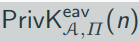
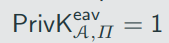
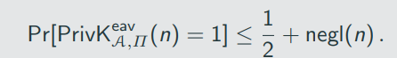
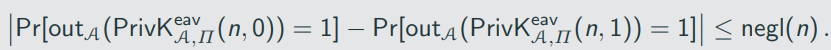
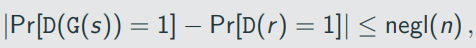
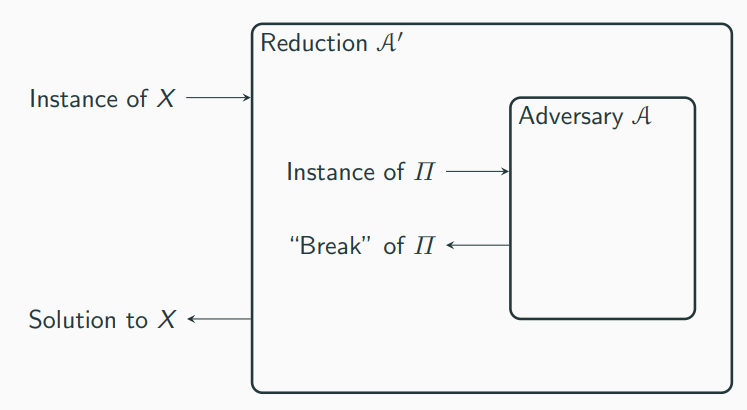
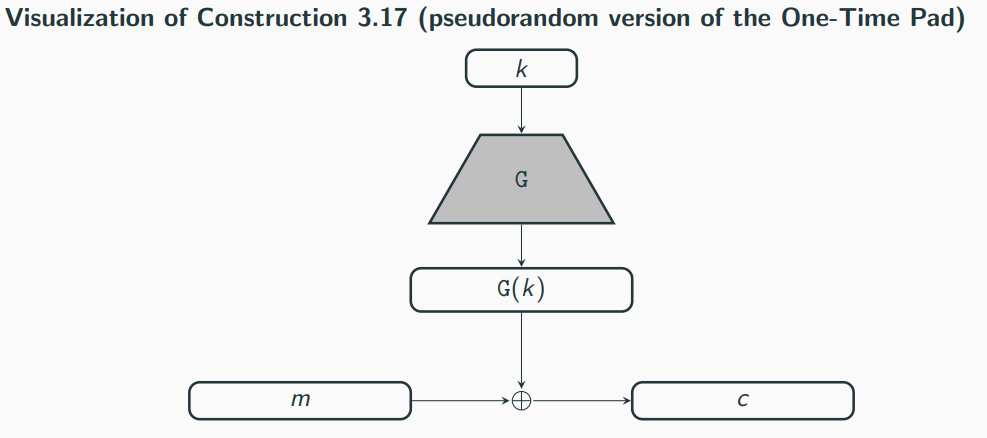

# Computational Security

- Perfect secrecy:
    - adversary with unlimited computation power learns nothing
    - worthwhile goal but unncessairly strong

- Computational security:

1. Security is only guaranteed against adversaries that run for some feasible amount of time
 -> with enough time, the adversary may be able to violate security

2, Adversaries can potentionally succeed (break security) with some very small probability

There are two approaches for computational security:

1. The concrete approach
2. The asymptotic approach

Quantify security of a cryptographic scheme by explicity bounding the maximum success probability of an adversary rrunning in some specified amount of time

a definition of concrete security takes the following form:

A scheme is (t, ϵ)-secure if any adversary running for time at most t succeeds in breaking the scheme with probability at most ϵ.

Let PPT denote "probabilistic polynomal-time". A definition of asymptotic security takes the following form:

A scheme is secure if any PPT adversary succeeds in breaking the scheme with at most negligible probability.

Negligable success probability

A negligible function is one that is asymptotically smaller than any inverse polynomial function

A function f: N -> R is negligible if for every polynomial p there is an N such that for all n > N it holds that f(n) < 1/p(n)

The functions 2 ^ (-n), 2 ^ (-sqrt(n)), n ^ (- log n) are all negligible

Let negl1 and negl2 be negligible functions. Then,
1. The function negl3(n) = negl1(n) + negl2(n) is negligible
2. For any polynomial p, the function negl4(n) = n(n) * negl1(n) is negligible

# Defining Computationally Secure Encryption

A private-key encryption scheme sonsists of three probabilistic polynomial-time algorithms (KGen, Enc, Dec) such that:

1. The key-generation algorithm KGen takes as input 1^n and outputs a key k; we write  k <- KGen(1^n) (KGen is a randonized algorithm). We assume without loss of generality that any key k output by KGen(1^n) satisfies |k| >= n.
2. The encryption algorithm Enc takes as input a key k and a plaintext message m ∈ {0,1}*, and outputs a ciphertext c. Since Enc may be randomized, we write this as c <- Enc_k(m).
3. The decryption algorithm Dec takes as input a key k and a ciphertext c, and outputs a message m ∈ {0,1}* or an error. We denote a generic errror by the symbol ⊥.

It is required for every m, every k output be KGen(1^n), and every m ∈ {0,1}*, it holds that Dec_k(Enc_k(m)) = m.
If (KGen, Enc, Dec) is such that for k output by KGen (1^n), algorithm Enc_k is only defined for messages m ∈ {0,1} ^ l(n), then we say that (KGen, Enc, Dec) is a fixed-length private-key encryption scheme for messages of length l(n).

Differences to before:
1. explicity take security parameter n into account
2. Message space is the set of (finite length) bit strings by default
3. Dec might output an error in case of invalid ciphertexts

The adversarial indistinguishability experiment 

1. The adversary A is given input 1^n, and outputs a pair of messages m0, m1 with |m0| = |m1|.
2. A key k is generated by running KGen(1^n), and a uniform bit b ∈ {0,1} is chosen. Ciphertext c <- Enc_k(m_b) is computed and given to A. We refer to c as the challenge ciphertext.
3. A outputs a bit b'.
4. The output of the experiment is defined to be 1 if b' = b, and 0 otherwise. We write  if the output of the experiment is 1 and in this case we say that A succeeds.

A private-key encryption scheme П = (KGen, Enc, Dec) has indistiguishable encryptions in the presence of an eavsdropper, or is EAV-secure, if for all robabilistic polynomal-time adversaries A there is a negligible function negl such that, for all n,

The probability above is taken over the randomness used by A and the randomness used in the experiment(for choosing the key and the bit b, as well as any randomness used by Enc)

A private=key encryption scheme П = (KGen, Enc, Dec) has indistinguishable encryptions in the presence of an eavesdropper if for all PPT adversaries A there is a negligible function negl such that

# Constructing an EAV-Secure Encryption Scheme

Important building block: pseudorandom generators (PRGs)

- A deterministic algorithm transforming a short, uniform string (called a seed) into a longer, "uniform-looking" (or "pseudorandom") output string

Let G be a deterministic polynomial-time algorithm such that for any n and any input s ∈ {0,1}^n, the result G(s) is a string of length l(n). G is a pseudorandom generator if the following conditions hold:

1. (Expansion.) For every n it holds that l(n) > n.
2. (Pseudorandomness.) For any PPT algorithm D, there is a negligible function negl such that 

Where the first probability is taken over uniform choice of s ∈ {0,1}^n and the randomness of D, and the second probability is taken over uniform choice of r ∈ {0,1} ^ (l(n)) and the randomness of D.

We call l(n) the expansion factor of G.

Proofs by reduction

If problem X is harrd then construction П is secure.

Proof by reduction: show that an adversary A that breaks П can be turned into an algorithm A' that solves problem X
-> we reduce solving X to breaking П

## Pseudorandom OTP

Let G be a pseudorandom generator with expansion dactor l(n). Define a fixed-length private-key encryption scheme for messages of length l(n) as follows:

- KGen: in input 1^n, choose uniform k ∈ {0,1} ^ n and output it as the key.
- Enc: on input a key k ∈ {0,1} ^ n and a message m ∈ {0, 1} ^ l(n), output the ciphertext

c:= G(k) xor m

Dec: on input a key k ∈ {0,1} ^ n and a ciphertext c ∈ {0,1} ^ l(n), output the ciphertext

m:= G(k) xor c

If G is a pseudorandom generatotm then Construction 3.17 is an EAV-secure, fixed-length private-key encryption scheme for length l(n).

## Distinguisher D

D receives as input w ∈ {0,1} ^ l(n):

1. Run A (1 ^ n) to obtain two messages m0,m1 ∈ {0,1} ^ l(n)
2. Choose a uniform bit b and compute c: = w xor m_b
3. Give c to A and obtain b'. Output 1 if b' = b, and 0 otherwise

# Stronger Security Notions

The security definitions so far consider the scenario that Alice and Bob exchange a single encrypted message

In practice Alice and Bob probably want ot exchange more messages(all enctypted using the same key) and an adversary might observe all of them

In the following we describe security experiment which allows the adcersary to onserve the encryption of multiple messages

89