# CCA-Security and Authenticated Encryption

## Chosen-Ciphertext Attacks and CCA-Secutiry

So far:

- passive attacks with respect to secrecy
- active attacks with respect to integrity

Now:

- active attacks with respect to secrecy

    -> chosen-ciphertext attacks
    -> adversary can inject ciphertexts into communication
    -> if A modifies c (encryption of m) to c' which decrypts to m', what can A learn about m from learning m' (for instance by observing subsequent behaviour of the communicating parties)

Padding-Oracle Attacks

Scenario:

- Client sends messages encrypted using CBC-mode to a server
- adversary can impersonate client and send ciphertexts to the server
- adversary can tell if decrypted messages are valid or not (by response of the server)

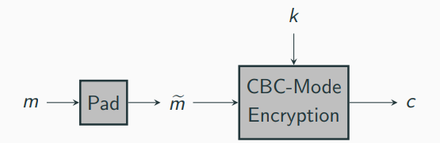

Pad encodes (unambigously) the m to what we call encoded data m~ (a message of correct length for CBC-mode encryption)

If padding verification fails, an error "bad padding" is returned

A popular padding scheme: PKCS #7 standard:

- Let L be the block length (in bytes) if the block cipher
- Let b > 0 be the number of bytes that have to be appended to reach the block length
- The padding appends 0xb (b represents in one byte) b times

Example:

- one byte needed: append 0x01
- four bytes needed: append 0x04 0x04 0x04 0x04

In our scenario: decryption first decrypts using CBC-mode, followed by verifying that the endcoded data m~ is padded correctly, i.e. read the final byte value b and check that the last b bytes all have value b

The server acts as a padding oracle for the adversary (it revelas whether the decryption message was correctly padded or not)

This - seemingly meaningless - information allows to recover the message for any ciphertext!

For simplicity, consider a 3-block ciphertext iv, c1, c2 for encoded data m1, m2

if holds that 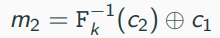

We further know that m2 ends in 0xb...0xb(b times) 

- What happens when we change the ith byte of c1 (let c1' be the result) and let it dectypt?
    - 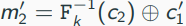, i.e. differs from m2 only in the ith byte
    - (the value of m1' is unpredictable but we do not care about this one)
- More generally, for c1' = c1 xor delta for any delta, decryption of iv, c1', c2 yiels m1', m2' with m2' = m2 xor delta

-> An attacker has significant control over the last block of encoded data (the padded one)

Warmup: learn the value b, which reveals the length of the message

Recall: server check the last byte value b and verifies that the last b bytes have value 0xb

Idea: find the first byte of the padding by modifing individual bytes and check if the server returns "bad padding"

- Modify the first byte of c1; if decryption fails, the padding checks all bytes, hence b =L
- Otherwise, continue with the second byte and so on until decryption return the first time "bad padding"; this byte reveal the value b

Next: having b, the attacker can learn the bytes of the message one-by-one

Idea: "overwrite" the last message byte, which we denote as M, to make it look like it is part of the padding (also requiers to change the padding bytes)

- For 0 <= i <= 2 ^ 8 define

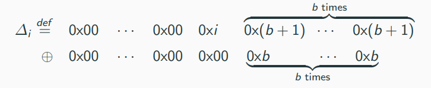

- If the attackers submits iv, c1 xor delta_i, c2, the server checks the final b + 1 bytes of the encoded data which equals 

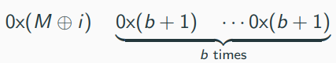

Server response will be "bad padding" unless 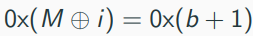; after at most 2 ^ 8 values, the attacker learns M

Defining CCA-Security

What does it mean for an encryption scheme to be secure against chosen-ciphertext attacks?

We follow our general blueprint, i.e., specifying an attacker's goal and a threat model

- Attacker's goal: similar to the prior notions we give the adversary a challenge ciphertext
- Threat model: additionally to the encryption oracle Enc_k(·) (as in chosen-plaintext attacks) we grant the adversary also a decryption oracle Dec_k(·)

## The CCA indistinguishability experiment 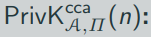:

1. A key k is generated by running KGen(1^n).
2. The adversary A is given input 1^n and oracle access to Enc_k(·) and dec_k(·). It outputs a pair of equal-length messages m0, m1.
3. A uniform bit b ∈ {0, 1} is chosenm and then a challenge ciphertext c <- Enc_k(m_b) is computed and given to A.
4. The adversary A continues to have oracle access to Enc_k(·) and Dec_k(·), but is not allowed to query the latter on the challenge ciphertext itself. Eventually, A outputs a bit b'
5. The output of the experiment is defined to be 1 b' = b, and 0 otherwise. If the output of the experiment is 1, we say that A succeeds.

A private-key encryption scheme  П = (Kgen, Enc, Dec) has indisnguishable encryptions under a chosen-ciphertext attack, or is CCA-secure, if for all probabilistic polynomial-time adversaries A there is a negligible function negl such that

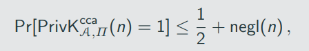

where the probability is taken over the randomness used by A, as well as the randomness used in the experiment

For completeness: security extends to multiple encryptions as well 

The experiment is again very strong by giving the adversary the entire result of the decryption

- In real-word setting, less information might be available
- In the attack above, the adversary only learns whether decryption failed or not
- We follow the general approach of making the definitions as strong as possible and the worst-case assumption is that the adversary learns everything

None of the enctyption schemes we have discussed is CCA-secure

Consider the encryption scheme based on a pseudorandom functio: ⟨r, m ⊕ Fk (r)⟩

ADversary A in the CCA experiment:

1. choose m0 = 0 ^ n and m1 = 1 ^ n
2. receive c = ⟨r,s⟩
3. flip the first bit of s and ask for a decruption of the resulting ciphertext c' -> (this query is allowed as c' !=c )
4. The response is either 10 ^ (n-1) (if m0 was encrypted) or 01 ^ (n - 1) (if m1 was encrypted)

CCA-security is a very strong requirement
-> Any encryption scheme where ciphertext can be "manipulated" in a contolled way cannot be CCA-secure

# Authenticated Encryption

Until now we have considered secrecy and integrity separately 

- secrecy for encryption schemes (CPA-security and CCA-security)
- integrity for message authenticated codes

Authenticated encryption is defined to achieve both simultaneously 

We start by defining authenticated encryption via two notions (one for secrecy and one for integrity)
-> For secrecy, we already have CCA-security (remember that we need this because we assume active adversaries)

-> for integrity, we define unforgeability similar as done for MACs (we need a new definition because of the different syntax for encryption shemes for MACs)

The unforgable ecryption experiment 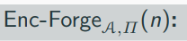:

1. A key k is generated by running KGen(1^n)
2. The adversary A is given input 1 ^ n and access to an encryption oracle Enc_k(·). The adversary eventually outputs a ciphertext c. Let m:= Dec_k(c) and let Q denote the set for all queries that A submitted to its oracle.
3. A succeeds if and only if (1) m != ⊥ and (2) m !∈ Q. In that case the output of the experimatn is defined to be 1.

A private-key encryption scheme П is unforgeable if for all probabilistic polynomial-time adversaries A there is a negligible function negl such that

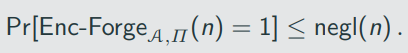

Definition for authenticated encryption is now straightforward:

A private-key encryption scheme is an authenticated encryption (AE) scheme if it os CCA-secure and unforgeable.

One can also define authenticated encryption via a single experiment

Idea: adversary is in either of two worlds and receives two oracles:

1. In the "real world", the adversary receives an encryption oracle Enc_k(·) and a decryption oracle Dec_k(·)
2. In the "ideal world", the adversary receives an encryption oracle 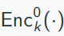 and a decryption oracle 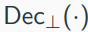, where
- 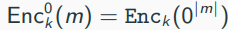, i.e. it always encrypts the zero string
- 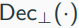 always returns ⊥

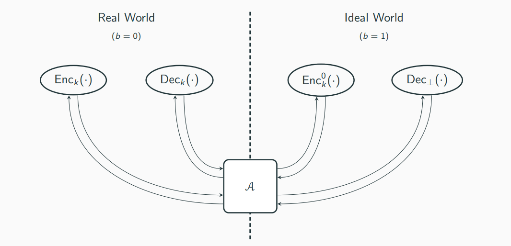

The authenticated-encryption experiment 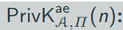:

1. A key k is generated by running KGen (1^n).
2. A uniform bit b ∈ {0, 1} is chosen,
3. The adversary A is given input 1 ^ n and access to two oracles:
    3.1. if b = 0, then A is given access to 
    3.2. if b = 0, then A is given access to 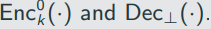
    A is not allowed to query a ciphertext c to its second oracle that it previosuly received as the responce from its first oracle.

4. The adversary outputs a bit b'.
5. The output of the experiment is defined to be 1 if b' = b, and 0 otherwise, In the former case, we say that A succeeds.

A provate-key encryption scheme is an authenticated encryption (AE) sheme if for all probabilistic polynomial-time adversaries A there is negligible function negl such that

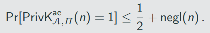

We now have two definitions (Definition 5.3 and Definiton 5.4), which are in fact equivalent:

A private-key Encryption scheme satisfies Definition 5.3 of and only if it satisfies Definition 5.4.

CCA Security vs. Authenticated Encryption 

Clearly, any authenticated encryption is also CCA-secure; the converse is not true

Is most applications, we require authenticated encryption and most constructions of CCA-security encryption scheme satisfy also the definition of authenticated encryption

An example where CCA-security is needed but authenticated encryption is not: key transport

- Server provides user with a tamper-proof hardware token which stores a long-term key k
- To share a freshm short-term key k' with the token (that remains concealed to the user), the server sends Enc_k(k') to the user, who provides the ciphertext to the token
- Clearly, the user can mount a chosen-ciphertext attack
- However, there is no problem if the user can generate a valid ciphertext that makes the token ise another key k_u' that is unrelated to k'

# Authenticated Encryption Schemes

Generic Constructions

Idea: any reasonable combination of CPA-secure encryption sheme and a secure message authentication code should result in an authenticated encryption sheme

There are three approaches on how to combine a CPA-secure encryption П_E = (Enc, Dec) and a secure message authentication code П_M = (Mac, Vrfy):

1. Encrypt-and-authenticate
2. Authenticate-then-encrypt
3. Encypt-then-authenticate

For all variants, we assume that independent keys are used, i.e., k_E is used for П_E while k_M is used for П_M

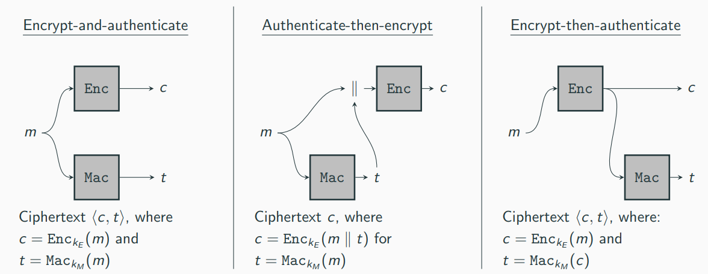

Encrypt-and-authenticate

Secure? No. Reason: Tag t might reveal the entire message

Authenticate-then-encrypt

Secure? No. Reason: Padding Oracle Attack. Assume that there are different error messages for padding errors and authentication errors: Dec'_(k_E, k_M)(c):

1. Compute m~:= Dec_k_E(c). If an error in the padding is detected, return "bad padding" amd abort
2. Parse m~ as M || t. IF Vrfy_k_M (m,t) = 1, return m; else, return "authentication failure".

Encrypt-then-authenticate

Secure? Yes

Let П_E be a CPA-secure private-key encryption scheme, and let П_M be a strongly secure message authentication code. Then construction Encrypt-and-authenticate is an authenticated encryption scheme.

# 191