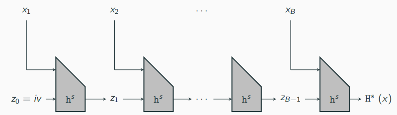
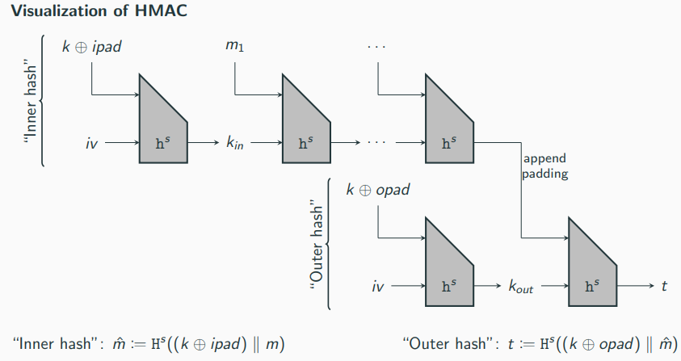
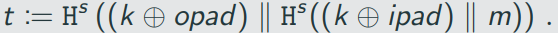
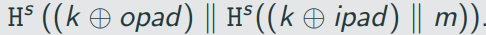
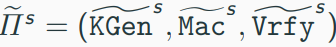
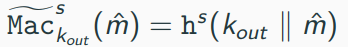
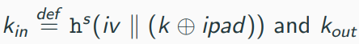
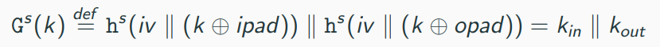
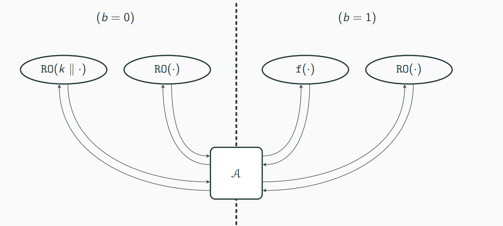

# Hash functions and Applications

## Definitons

Hash function take inputs of some length and compress them into short,fixeed-length outputs
Classical use-case (non-cryptographic hash functions): data structures

- Store elements in a table based on their hash value
- To look for an enry x, one needs only to probe row H(x) of the hash table
- A 'good' hash functions has few collisions (which increase look-up time)

Collison-resistant hash functions (cryptographic hash functions) are similar, but with fundamental differences:

- collisions need to be avoided (rather than minimized)
- Adversaries can select inputs with the sole purpose to cause collisions

A hash functions (with output length l(n)) is a pair of probabilistic polynomial-time algorithms H = (KGen, H) satisfying the following:

- KGen is a probabilistic algorithm that takes as input a security parameter 1^n and outputs a key s. We assume that n is implicit in s.
- H is a deterministic algorithm that takes as iput a key s and a string x ∈ {0,1}* and outputs a string H^s(x) ∈ {0,1}^l(n) (where n is the value of security paramater implicit in s).

If H^s is defined only for input x of length l'(n) > l(n), when we say that (KGen, H) is a fixed-length function for inputs of length l'(n). In this case, we also call H a compression function.

We write the key s as a superscript to inidicate that it is public (unlike for symmetric encryption schemes and message authentication codes)

The collision-finding experiment Hash-coll A,H(n)

1. A key s is generated by running KGen(1^n)
2. The adversary A is given s, and outputs x, x'. (If H is a fixed-length hash function for inputs of length l'(n), then we require x,x' ∈ {0, 1}^(ℓ′(n)))
3. The output of the experiment is defined to be 1 if and only if x != x' and H^s(x) = H^s(x'). In such a case we say that A has found a collision

A hash function H = (KGen, H) is collision resistant if for all probabilistic polynomial-time adversaries A there is a negligible function negl such that

## Unkeyed hash functions

In practice, cryptographic hash functions are generally unkeyed

Problematic from a theoretical point of view 
-> there is always a constant-time algorithm that outputs a collsion for H: Algorithm that has a colliding pair hardcoded and simply outputs it

In practice still sufficient because colliding pairs for real-world hash functions are hard to find.

## Weaker Notions of Security

In some applications, weaker forms of security can be sufficient
Other security notions that are considered sometimes:

Second-preimage resistance: Informally, a hash function is said to be second-preimage resistant if given s and a uniform x it is infeasible for a PPT adversary to find x' != x such that H^s(x') = H^s(x)

Preimage resistance: Informally, a hash function is preimage resistant if given s and y = H^s(x) for a uniform x, it is infeasible for a PPT adversry to find a value x' (whether equal to x or not) with H^s(x') = y.

Implications:

- Collision resistance -> second-preimage resistance
- Second-preimage resistance -> preimage resistance (under additional requirements)

## Domain-Extension: The Merkle-Damgard Transform

In many applications, we require hash functions accepting very long or even arbitary long inputs 

It is not immediately clear how we can construct such functions

It is easier to construct a fixed-length hash function (a compression function)

The Merkle-Damgard transforms converts a compression function into a hash function

### Visualization of the Merkle-Damgard transform

construiction 6.3.
Let (KGen, h) be a compression function for inputs of length n + n' >= 2n with output length n. Fix l <= n' and iv ∈ {0,1}^n. Construct hash function (KGenm H) as follows:

- KGen: remains unchanged
- H: on input a key s and a string x ∈ {0,1}* of length L < 2^l, do:

    1. Append a 1 to x, followed by enough zeros so that the length of the resulting string is l less than a multiple of n'.  Then append L, encoded as an l-bit string. Parse the resulting string as the sequence of n'-bit blovks x1,...,x_B.
    2. Set z_0 := iv
    3. 
    4. output z_B.

If (KGen, h) is collision resistant, then so is (KGen, H) from construction 6.3

# Message Authentication Using Hash Functions

# Visualization of Hash-and-Mac

Security (Intuition):

- Security of the MAC prevents the adversary from finding a tag for any new hash value
- Security of the hash function prevents the adversary from finding a message that hashes to a previously authenticated hash value

Construction 6.5:

Let П = (Mac, Vrfy) be a MAC for messages of length l(n), and let H = (KGen_H, H) be a hash function with output length l(n).
Constuct a MAC П'= (KGen, Mac', Vrfy) for arbitary-length messages as follows:

- KGen': on input 1^n, choose uniform k ∈ {0,1}* and tun KGen_H(1^n) to obtain s; output the key (k,s).
- Mac': on input a key (k,s) and a message m ∈ {0,1}*, output t <- Mac_k(H^s(m)).
- Vrfy': on input a key (k,s), a message m ∈ {0,1}*, and a tag t, output 1 if and only if vrfy_k(H^s(m), t) = 1

If П is a secure MAC for messages of length l(n) and H is collision resistant, then Construction 6.5 is a secure MAC (for arbitary-length messages)

## HMAC

One can instantiate the Hash-and-MAC approach with the fixed-length MAC from Chapter 4 (Construction 4.5) with an arbitary hash function

However, there are two downsides:

1. It requires two primitives: a hash function and a block cipher 
-> think of constrained devices, where the implementation of cryptographic schemes should be as small as possible
2. The more fundamental problem: trere is often a mismatch between the output length of a hash function (>= 256) and the block length of block ciphers(typically 128)

The problems led to the development of HMAC
-> a MAC that can be based on any hash function constructed using the Merkle-Damgard transform applied to a compression function

Let (KGen_H, H) be a hash function constructed by applying the Merkle-Damgard transform to a compression function (KGen_h, h) that takes input of length n + n' > 2n + log n + 2 and generates outputs of length n. Fix distinct constants opad, ipad ∈ {0 ,1} ^n'. Define a MAC as follows:

- KGen': on input 1^n run KGen_H(1^n) to obtain a key s. Also choose a uniform k ∈ {0 ,1} ^ (n'). Output the key (s,k).
- Mac' : on input a key(s, k) and a message m ∈ {0,1}*, output 

    
- Vrfy': on input a key (s,k), a message m ∈ {0, 1}*, and a tag t, output 1 if and only if t = 

HMAC can be viewed as an instantiation of Hash-and-MAC:

- Inner hash corresponds to the hash function, hashing , to fixed-length m -> we ciew k_in as the IV for the hash function
- Outer hash corresponds to a fixed-length MAC , where 

We need "computational independence" of . 

Define 

Assume G^s is a pseudorandom generation П^s is a secure fixed-length MAC for messages of length n', and (KGEn_H, h) is collision resistant. Then HMAC is a secure MAC (for arbitary-length messages)

Why bother with k_in in the first place?

-> Hash-and-MAC requires the hash to be collision resistant which does not require a secret key

By including the key in the inner hash, HMAC can be proven secure using the assumption that the hash function is only weakly collision resistant.
-> informally, an attacker needs to find a collision for a secretly keyed hash function
-> this is a weaker assumption and potentially easier to achive

Advantage of this design stratefy: when the hash function MD5 was discovered to be not collision resistant, HMAC-MD5 was not affected as the attack did not break weak collisiom resistance of MD5
-> nevertheless, HMAC-MD5 should no longer be used due to weaknesses in MD5

# Generic Attacks on Hash Functions

The birthday problem 

if q people are in room, what is the probability that two of them share the same birthday?

A more specific question:

How many people do you need in a room, such that with a probability of at least 50%, two of them share the same birthday?

-> 23 people are required
-> with 70 people, the probability is 99.97%

Recall: brute-force attacks

-> attacks that apply to any scheme
-> for symmetric-key primitives: an attacker can enumerate all 2^n keys to find the right one
-> if we want to achieve security against attackers running in time 2^n, we need keys of length at least n.

What are brute-force attacks for hash functions?

-> Disclaimer: using a birthday attack(related to the bitthday problem), we can show that for any hash function with l-bi output, one can find collisions in time ~ 2^(l/2)
-> we need twice the length of secret keys to achieve comparable security

Let H: {0,1}* -> {0,1}^l be a hash function

By the pigeonhole principle: evaluating q = 2^l + 1 distinct inputs guarantees a collision 
-> trivial collision attack in time O(2^l)

Generakization using parameter q:

1. pick q distinct inputs x1,...,x_q
2. Compute outputs y1,...,y_q as y_i := H(x_i)
3. check if any of the {y_i} are equal

From the above we know that a collision is guaranteed if q > 2^l

Now the above we know that a collision is guaranteed if q <= 2^l
-> Collisions are no longer guaranteed 
-> Collisions have clearly a nonzero probability

Problem: hard to analyze when H is arbitary

Workaround: we treat H as a random function
-> for each i, we assume that y_i is uniform and independent from the other values {y_j}_j != i (recall that the {x_j} are distinct)
-> this is the worst case (collisions are more likely when H is more biased)

We can now rephrase our question as follows:

if we generate uniform y1,..., y_q ∈ {0, 1}^ℓ, what is the probability that three exist distinct i,j with y_i = y_j?

This is the birthday problem
-> Evaluating q = O(2^(l/2)) hash inputs yields a collsion with probability ~ 1/2

When using 129-bit keys for symmetric encryption, we need at least 256-bit hash outputs to achieve the same level of security
-> note that this is a necessary condition, not a sufficient one

What about meaningful collisions? (So far we picked the inputs x_i randomly)

Assume Alice wants to find two messages x and x' such that H(x) = H(x'), where x should be a negative letter (why she was fired) while x' should be a flattering letter of recommendation
-> if  the employer authenticates x, Alice can create a forgery for x'

Alice can perform a birthday attack by generating q = O(2^(l/2)) messages of the first type and messages of he second type, followed by looking for collisions between the two (which again happens with probagbility roughly 1/2)
-> note that the birthday attack requires the inputs to be distinct but not random

How to generate so many messages? Synonyms!

It is hard/difficult/challenging/impossible to imagine/believe that we will find/locate/hire another employee/person having similar abilities/skills/character as Alice. She has done a great/super job.

The above sentences can be written in 4 * 2 * 3 * 2 * 3 * 2 = 288 different ways, all the same meaning

Having a text with 64 words with one synonym each, we get 2 ^ 64 variants of the same text

# The Random-Oracle Model

There are many exapmles of constructions that cannot be proven secure based on the collision resistance of hash functions

In many cases it appears that there is no simple and reasonable assumption regarding the hash function that is sufficient

What to do in this case?

- Look for schemes that can be proven secure under reasonable assumptions
-> good approach, but what until such construction are found
-> these construction are typically less efficient

- Use cryptosystems that have no justification than unsuccesful attacks
-> goes agains everything we have talked so far

- The "middle ground" approach: introduce idealized models
-> A popular example is the random-oracle model

In the random-oracle model, there exists a publicm random function RO-called a random oracle-to which everyone has access

This function can only be evaluated by "querying" the oracle

No one claims that random oracle exist; the random-oracle model is a methodolgy used to design and validate cryptographic schemes:

1. A scheme is designed adn proven secure in the random-oracle model
-> security experiment is enhanced by a random oracle to which everyone (experiment itself, adversary, and reduction) have access to
2. To use the scheme in the real world (where do not have random oracles), one instantiates RO with an appropriately designed cryptographic hash function H. This means that each time a party should query the random oracle on input x, the party instead computes H(x) on its own

The idea: if the hash function in the second step is "sufficiently good" at emulating a random oracle, the security proof from the first step will carry over to the real-workd instantiation

Three properties of security proofs in the random-oracle model: 

1. if x has not been queries to RO, thrn the value of RO(x) is uniform
2. If A queries x to RO, the reduction can see this query and learn x -> this is called "extractability"
3. The reduction can set the value of RO(x) (i.e., the responce to query x) to a value of its choice, as long as this value is correctly distrivuted, i.e., uniform -> this is called "programmability"

The first property might looks very similar to the guarantees of a pseudorandim generator, but it is actually much stronger

- G(x) is pseudorandom as long as x uniform and completely unknown to A
- RO(x) is truly uniform as long as x has not been queried
- Assume that x is an n-bit string and that the first half is known:
    - G(x) might be easy to distinguish from random
    - RO(x) looks still random

## Simple Illustration of the random-oracle Model

Let RO: {0,1}^(l_in) -> {0,1}^(l_out) be a random oracle, where l_in, l_out > n (the security parameter)

It is easy to constuct a pseudorandom function in the random-oracle model

Suppose l_in(n) = 2n and l_out(n) = n, and define F_k(x) = RO(k||x), where |k| = |x| = n

One can show that any PPT A succeeds in the following experiment with probability at most 1/2 + negl (n):

1. A function RO and values k ∈ {0, 1}^n and b ∈ {0, 1} are chosen uniformly.
2. If b = 0, the adversary A is given access to an oracle for F_k(·) = RO(k||·). IF b = 1, then A is given access to a random function mapping g-bit inputs to n-bit outputs. (This randim function is independent of RO.)

3. A outputs a bit b', and succeeds if b' = b

Advantages and disadvantages of the random-oracle model

Disadvantages:

- There is no such thing as a public function that "is random"
- There are known counterexamples

Advantages:

- No example of a "natural" scheme secure in the random-oracle model being attacked in the real world
- If an attack is found, simply replace the hash function
- A proof in the random-oracle model is better than no proof at all
-> provides evidence that design principle is sound
