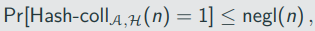

# Hash functions and Applications

## Definitons

Hash function take inputs of some length and compress them into short,fixeed-length outputs
Classical use-case (non-cryptographic hash functions): data structures

- Store elements in a table based on their hash value
- To look for an enry x, one needs only to probe row H(x) of the hash table
- A 'good' hash functions has few collisions (which increase look-up time)

Collison-resistant hash functions (cryptographic hash functions) are similar, but with fundamental differences:

- collisions need to be avoided (rather than minimized)
- Adversaries can select inputs with the sole purpose to cause collisions

A hash functions (with output length l(n)) is a pair of probabilistic polynomial-time algorithms H = (KGen, H) satisfying the following:

- KGen is a probabilistic algorithm that takes as input a security parameter 1^n and outputs a key s. We assume that n is implicit in s.
- H is a deterministic algorithm that takes as iput a key s and a string x ∈ {0,1}* and outputs a string H^s(x) ∈ {0,1}^l(n) (where n is the value of security paramater implicit in s).

If H^s is defined only for input x of length l'(n) > l(n), when we say that (KGen, H) is a fixed-length function for inputs of length l'(n). In this case, we also call H a compression function.

We write the key s as a superscript to inidicate that it is public (unlike for symmetric encryption schemes and message authentication codes)

The collision-finding experiment Hash-coll A,H(n)

1. A key s is generated by running KGen(1^n)
2. The adversary A is given s, and outputs x, x'. (If H is a fixed-length hash function for inputs of length l'(n), then we require x,x' ∈ {0, 1}^(ℓ′(n)))
3. The output of the experiment is defined to be 1 if and only if x != x' and H^s(x) = H^s(x'). In such a case we say that A has found a collision

A hash function H = (KGen, H) is collision resistant if for all probabilistic polynomial-time adversaries A there is a negligible function negl such that

## Unkeyed hash functions

In practice, cryptographic hash functions are generally unkeyed

Problematic from a theoretical point of view 
-> there is always a constant-time algorithm that outputs a collsion for H: Algorithm that has a colliding pair hardcoded and simply outputs it

In practice still sufficient because colliding pairs for real-world hash functions are hard to find.

## Weaker Notions of Security

In some applications, weaker forms of security can be sufficient
Other security notions that are considered sometimes:

Second-preimage resistance: Informally, a hash function is said to be second-preimage resistant if given s and a uniform x it is infeasible for a PPT adversary to find x' != x such that H^s(x') = H^s(x)

Preimage resistance: Informally, a hash function is preimage resistant if given s and y = H^s(x) for a uniform x, it is infeasible for a PPT adversry to find a value x' (whether equal to x or not) with H^s(x') = y.

Implications:

- Collision resistance -> second-preimage resistance
- Second-preimage resistance -> preimage resistance (under additional requirements)

## Domain-Extension: The Merkle-Damgard Transform

In many applications, we require hash functions accepting very long or even arbitary long inputs 

It is not immediately clear how we can construct such functions

It is easier to construct a fixed-length hash function (a compression function)

The Merkle-Damgard transforms converts a compression function into a hash function

### Visualization of the Merkle-Damgard transform

construiction 6.3.
Let (KGen, h) be a compression function for inputs of length n + n' >= 2n with output length n. Fix l <= n' and iv ∈ {0,1}^n. Construct hash function (KGenm H) as follows:

- KGen: remains unchanged
- H: on input a key s and a string x ∈ {0,1}* of length L < 2^l, do:

    1. Append a 1 to x, followed by enough zeros so that the length of the resulting string is l less than a multiple of n'.  Then append L, encoded as an l-bit string. Parse the resulting string as the sequence of n'-bit blovks x1,...,x_B.
    2. Set z_0 := iv
    3. 
    4. output z_B.

If (KGen, h) is collision resistant, then so is (KGen, H) from construction 6.3

# Message Authentication Using Hash Functions

# Visualization of Hash-and-Mac

Security (Intuition):

- Security of the MAC prevents the adversary from finding a tag for any new hash value
- Security of the hash function prevents the adversary from finding a message that hashes to a previously authenticated hash value

Construction 6.5:

Let П = (Mac, Vrfy) be a MAC for messages of length l(n), and let H = (KGen_H, H) be a hash function with output length l(n).
Constuct a MAC П'= (KGen, Mac', Vrfy) for arbitary-length messages as follows:

- KGen': on input 1^n, choose uniform k ∈ {0,1}* and tun KGen_H(1^n) to obtain s; output the key (k,s).
- Mac': on input a key (k,s) and a message m ∈ {0,1}*, output t <- Mac_k(H^s(m)).
- Vrfy': on input a key (k,s), a message m ∈ {0,1}*, and a tag t, output 1 if and only if vrfy_k(H^s(m), t) = 1

If П is a secure MAC for messages of length l(n) and H is collision resistant, then Construction 6.5 is a secure MAC (for arbitary-length messages)
