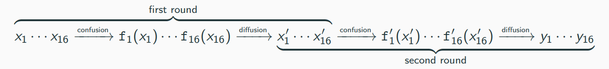
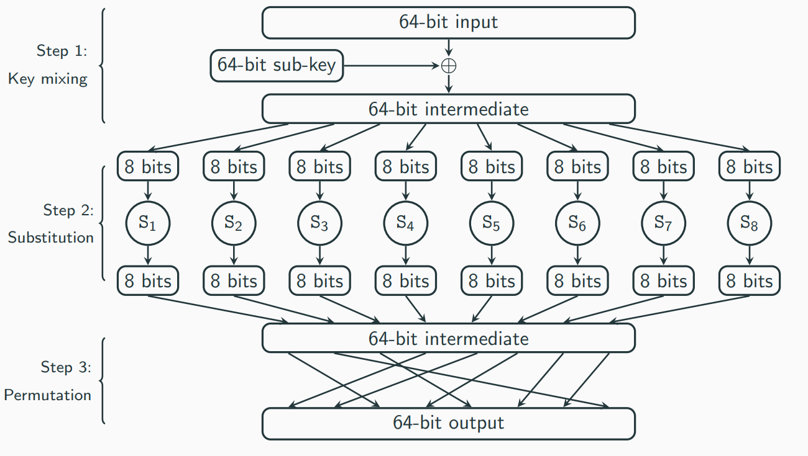
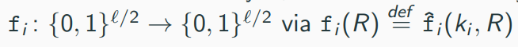

# Practical Constructions of Symmetric-Key Primitives

# Block Ciphers

The confusion-diffusion paradigm

Assume we want a block cipher F with 128-bit block length

The key k for F will specify 16 permutations f1,..., f_16, each with 8-block length

Given x ∈ {0,1}^(128), parse it as 16 bytes x1...x16 and set

F_k(x) = f1(x1)||...||f16(x16)

The round functions {f_i} introduce confusion into F

Clearly, F is not pseudorandom

-> if x and x' differ only in the first byte, then F_k(x) and F_k(x') only differ in the first byte

A diffusion step is added that "mixes" the output bits using a mixing permutation
-> idea: local changes should spread through the entire block

The confusion/diffusion steps(together called a round) are repeated multiple times 

Example(two-round block cipher):

## Substitution-Permutation Networks

A substitution-permutation network (SPN) can be viewed as an implementation of the confustion-diffusion paradigm

Instead of letting the key specify a permutation f, we fix a public "substitution function" S, called an S-box and let f_k(x) = S(k ⊕ x)
-> if f takes 8-bit inputs, the number of possibilities redices from 2^8! to 2^8

Consider an example using 64-bit block length with 8-bit S-boxes S1,..., S8

Evaluating the cipher proceeds in a series of rounds, each of which consists of the following sequence of operations to the input x of that round:

1. Key mixing: Set x := x xor k, where k is the current-round sub-key;
2. Substitution: Set x:= S1(x1)|| ... || S8(x8), where x_i is the ith byte of x;
3. Permutation: Permute the bits of x to obtain the output of the round.

Input to the cipher is the input to the first round

Output of a round is the input to the next round

After the final round, a final key-mixing step is applied and the result is the output of the cipher
-> without this, step 2 (substitution) and step 3(permutation) of the last round do not provide more security as they can be inverted without the key
-> By Kerckhoffs' principle, the S-boxes and mixing permutation(s) are assumed to be public

Each round uses different sub-keys (or round keys)

The key of the block cipher is often called the master key

Round keys are derived from the master key according to a key schedule

The key schedule is often simple, e.g., use different subsets of the bits of the master key
-> more complex key schedules can also be defined

An r round SPN has:

- r rounds of key mixing, S-box substitutions, and applications of a mixing permutations
- l (final) key mixing step

This means that r+1 sub-keys are used

An SPN is invertible (given the key):

- If each round is invertible, one can invert the whole SPN round-by-round
- Inverting each round:
    - (Step 3) Mixing permutation can easaily be inverted as it just shuffles the bits
    - (Step 2) S-boxes are permutations, hence also invertible
    - (Step 1) XORing the correct sub-key then yields the original input

Let F be a keyed function defined by an SPN in which S-boxes are all permutations. Then regardless of the key schedule and the number of rounds, F_k is a permutation for any k.

## The avalanche effect

Idea: small changes in the input must "affect" every bit of the output

How can we ensure the avalanche effect in a substitution-permutation network?

Ensure that the following two properties hold (and sufficiently many rounds are used):

1. The S-boxes are designed so that changing a single bit of the input to an S-box changes at least two bits in the output of the S-box
2. The mixing permutations are designed so that the bits output by any given S-box affect the input to multiple S-boxes in the next round

For a 129-bit block length, at least 7 rounds are needed to guarantee that all output bits are "affected"

-> only a lower bound; if less than 7 rounds are used there are some output bits that are not affected by a single-bit change in the input (which implies that ine can distinguish the cipher from a random permutation)

## Feistal Networks

A substitution permutation networks constructs a permutation from invertible components

A Feistel network constructs a permutation from non-invertible components

In a (balanced) Feistel network with l-bit block length, the ith round function f_i takes as input a sub-key k_i and an l/2-bit input and outputs an l/2-bit output

When some master key k, which defines sub-keys k_i for each round, is chosen, define 

The ith round of a Feistel network works as follows:

1. the l-bit input is split into two halves denoted by L_(i-1) and R_(i-1)
2. the output is (L_i, R_i), where L_i:= R_(i-1) and R_i:= L_(i−1) ⊕ f_i(R_(i−1))
