# Number Theory and Cryptographic Hardness Assumptions

## Preliminaries and Basic Group Theory

### Primes and Divisibility

For a,b ∈ Z, we write a | b if there exists c ∈ Z such that ac = b and a ∤ b if no such c exists

If a | b and a is positive: a is a dicisor of b; If additionaly a !∈ {1,b}, a is a nontrivial divisor or a factor of b

A positive p > 1 is prime if it has no factors

A positive integer greater than 1 that is not prime is composite

A fundamental theorem of arithmetic states that every integer greater than 1 can be expressed uniquely as a product of primes (up to ordering)

-> Any integer N > 1 can be written as , where the {p_i} are distinct primes and e_i >= 1

-> Example: N = 45 = 3^2 * 5, i.e. p_1 = 3, p_2 = 5, e_1 = 2, and e_2 = 1

The following proposition formalizes the concept of divison with remainder

#### Proposition 9.1
Let a be an integer and let b be a positive integer. Then there exist unique integers q,r for which a = qb + r and 0 <=  r < b

The greatest common divisor of integers a and b, denotes by gcd(a,b), is the largest integer c such that c  | a and c | b
-> if p is prime then gcd(a,p) is either 1 or p
-> if gcd(a,b) = 1 we say that a and b are relatively prime

Let a,b be potitve integers. Then there exists integers X, Y such that Xa+Xb = gcd (a,b). Furthermore, gcd (a,b) is the smallest positive integer that can be expressed this way

For instance, if a = 5 and b = 3, we have gcd (5,3) = 1 as well as X = 2 and Y = -3

The Euclidean algorithm computes gcd(a,b) in polinomial time

The extended Euclidean algorithm computes X, Y in polynomial  time

Two more results:

If c | ab and gcd (a,c) = 1, then c | b. Thus, if p prime and p | ab then either p | a or p | b

-> "If c dicides the product of a and b but c does not divide a, then c must divide b"

If a | N, b | N, and gcd(a,b) = 1, then ab |  N

-> If both a and b divide N and are relative prime, then their product divides N

For instance, a = 3, b = 4, and N = 24

### Modular Arithmetic

Let a,b,N ∈ Z with N > 1

By proposition 9.1., there exist q, r such that a = qN + r with 0 <= r < N; we define [a mod N] to be this r

Mapping a to [a mod N] is called reduction modulo N

We say that a and b are congruent modulo N (written as a = b mod N), if

[a mod N] = [b mod N]

-> Note that a = b mod N if and only if N | (a-b)

Congruence modulo N is an equivalence relation, i.e.,

- it is reflexive (a = a mod N);
- it is symmetric (a = b mod N implies b = a mod N);
- it is transitive (if a = b mod N and b = c mod N, then a = c mod N)

As a consequence, we can "reduce then add/multiply" instead of "add/ multiply then reduce"

Compute 1093028 * 190301 mod 100. It holds that 1093028 = 28 mod 100 and 190301 = 1 mod. 

Thus, 1093028 * 190301 = [1093028 mod 100] * [190301 mod 100] = 28 * 1 = 28 mod 100

Conguerence modulo N does not (in general) respect division

- if a = a' mod N and b = b' mod N then it is not necessarily true that a/b = a'/b' mod N (a/b mod N  might not even be well-defined)
- Specific example: ab = cb mod N does not imply a = c mod N

Consider N = 24. Then 3 * 2 = 6 = 15 * 2 mod, but 3 != 15 mod 24.

If for given b, there exists c such that bc = 1 mod N, then b is invertible modulo N and c is called a (multiplicative) inverse of b

-> we write b^(-1) for the inverse in {1, ..., N-1}

"Division by b modulo  N"  is multiplication by b^(-1)

Natural question: which integers are invertible? (0 is never invertible)
-> division by b is only defined when b is invertible

#### Proposition 9.7

Let b, N be integers, with b>= 1 and N > 1. Then b is invertible modulo N if and only if gcd(b,N) = 1

gcd(2, 24) =2, i.e. 2 is not invertible modulo 24

### Groups

Let G be a set. A binary opertation ◦ on G is simply function ◦(·, ·) that maps two elements of G TO another element of G. If g,h ∈ G then we write g ◦ h insted of ◦(g, h) 

A group is a set G along with a binary operation ◦ for which the following conditions hold:

- (Closure:) For all g,h ∈ G, g ◦ h ∈ G
- (Existence of an identity:) There exists an identity e ∈ G such that for all g ∈ G, e ◦ g = g = g ◦ e.
- (Existence of inverses:) For all g ∈ G there exists an element h ∈ G such that g ◦ h = e = h ◦ g. Such an h is called an inverse of g.
- (Associativity:) For all g1,g2,g3 ∈ G, (g1 ◦ g2) ◦ g3 = g1 ◦ (g2 ◦ g3) 

When G has a finite number of elements, we say that G is finite and let |G| denote the order of the group  (that is, the number of elements in G).

A group G with operation ◦ is abelian if the following holds:

- (Commutativity:) For all g,h ∈ G, g ◦ h = h ◦ g

We will always consider finite, abelian groups

One can show:
- The identity element in a group is unique, i.e., we can refer to the identity of a group 
- Each element of G has a unique inverse

If G is a group, a set H ⊆ G is a subgroup of G if H itself forms a group under the same operation associated with G

-> to check this, one needs to verify closure, existence of identity and inverses, and associativity
-> Every group G always has the trivial sungroups G and {1}
-> H is called a strict subgroup of G if H != G

We will moslty use additive notation or multiplicative notation, depending on the group in discussion

Additive notation:

- The group operation applied to elements g,h denotes by g + h
- The identity is denotes by 0;
- The inverse of an element g is denoted by -g (and h - g is written instead h + (-g))

Multiplicative notation:

- The group operation applied to elements g,h is denotes by g · h or simply gh;
- The identity is denoted by 1;
- The inverse of an element g is denoted by g ^(-1) ( and often h/g is witten instead of hg ^ (-1))

Examples:

A set may be a group under one operation, but not another. For example Z is an abelian group under addition (identity is 0 and every integer g has inverse -g); On the other hand, Z is not a group under multiplication (integer 2 has no inverse in the integers).

The set of real Numbers R is not a group under multiplication (0 has multiplicative inverse). The set of nonzero real number, however, is an abelian group under multiplication with identity 1.

Let N > 1 be an integer. The set {0, ..., N - 1} with respect to addition modulo N (i.e. where a + b = [a + b mod N]) is an abelian group of order N.

Closure is obvious: associativity and commutativity follow them from the fact that the integers satisfy these properties; the identity is 0; and, since a + (N - a) = 0 mod N, it follows that the inverse of any element a is [(N - a) mod N]

We denote this group by Z_w. (We will also sometimes use Z_w to denote the set {0, ..., N - 1} without regard to any particullar froup operation.)

### Group Exponentiation

Often useful to describe the group operation applied m times to a fixed element g

When using additive notation, we write

mg = m * g  = g + ...(m times)... + g

-> note that here m is an integer and g is a group element
-> the notation "behaves as it should", e.g. if g ∈ G and m, m' ∈ Z, then (mg) + (m'g) = (m + m')g, m (m'g) = (mm')g, and 1 * g = g

when using multiplicative notion, we write

g^m = g...(m times)...g

-> fimilar rules of exponentiation hold: 

When using additive notation, we define
- 0 * g = 0
-> note that the left 0 is an integer while right 0 is the identity of the group

- (-m) * g = m * (-g)
-> Here, -g is the inverse of g and (-m)g = -(mg)

When using multiplicative notation, we define

#### Corollary 9.15
Let G be a finite group with m = |G|, the order of the group. Then for any element g ∈ G, it holds that g^m = 1

Let G be a finite group with m = |G| > 1. Then for any g ∈ G and any integer x, we have g ^ x = g ^ [x mod m]

Written additively, Corollary 9.15 says that if g is an element in a group of order m, then x * g = [x mod m] * g.

As an example, consider the group Z_15 of order m = 15 and g = 11. 

152 * 11 = [152 mod 15] * 11 = 2 * 11 = 11 + 11 = 22 = 7 mod 15

#### Corollary 9.17

A useful corollary for cryptographic applications:

Let G be a finite group with m = |G| > 1. Let e > 0 be an integer, and define the function f_e: G -> G by f_e(g) = g ^ e. If gcd(e,,m) = 1, then f_e is a permuutation (i.e., a bijection). Moreover,, if d = e ^ (-1) mod m then f_d is the inverse of f_e.

The set Z_N = {0, ..., N - 1} is a group under addition modulo N

Next, we define a group with respect to multiplication modulo N

-> we have to eliminate all elements that are not invertible 
-> 0 has no multiplicative inverse and needs to be eliminated
-> Nonzero element might also not be invertible

the invertible elements b ∈ {1, ..., N - 1} satisfy gcd(b, N) = 1

Hence, the set 

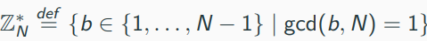

consists of the integers that are relatively prime to N

Let N > 1 be an integer. Then  is an abelian group under multiplication modulo N.

The group 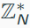

define ϕ(N) = || (Euler phi function); what is the value of ϕ(N) (order of )?

First case: N = p is prime

-> All elements in {1, ..., p-1} are relatively prime to p, hence 

Second case: N = pq, where p and q are distinct primes

-> if a ∈ {1, ..., N - 1} is not relatively prime to N, then either p | a or q | a
-> There are q - 1 elements divisible by p: p, 2p, ..., (q-1)p
-> There are p - 1 elements divisible by q: q, 2q, ..., (p-1)q
-> Thus, the remaining elements (neither divisible by p nor q) are

(N - 1) - (q - 1) - (p - 1) = pq - p - q + 1 = (p - 1)(q - 1)

-> ϕ(N) = (p - 1)(q - 1)

The general result:

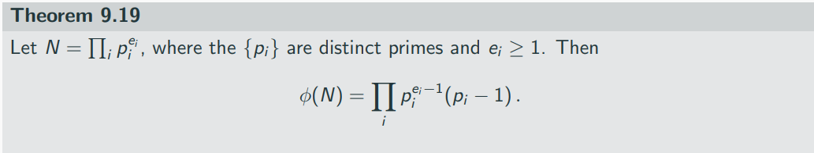

Take N = 15 = 5 * 3. Then Z*_15 ={1,2,4,7,8,11,13,14} and |Z *_15| = 8 = 4 * 2 = ϕ(15). The inverse of 8 in Z *_15 is 2, since 8 * 2 = 16 = 1 mod 15

The following two results follown from Theorem 9.14 and Corollary 9.17:

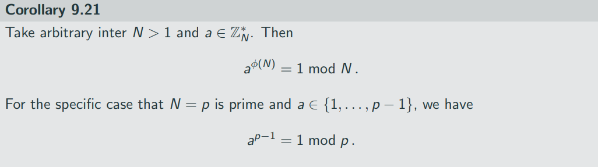

# Primes, Factoring, and RSA 

One fundamental problem from number theory that is conjectured to be hard: integer factorization or simply factoring:

- Given a composite integer N, find p, q > 1 such that N = pq

The problem can solved in exponential time  via trial division:

- Check if p divides N for p  = 2, ..., 
- sqrt(N) many division, each taking polygon(N) = |N|^c time for some constant c
- While the largest factor can be as N / 2, the smallest factor can be at most 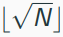

As of today, no polynomial - time (classical) algorithm for factoring exists
-> Shor's algorithm solves factoring in polynomail-time on a quantum computer

The weak factoring experimatn w-Factor_A(n):
1. Choose two uniform n-bit integers x1, x2.
2. Compute N = x1 * x2.
3. A is given N, and outputs x1', x2' > 1.
4. The output of the experiment is defined to be 1 if x1' * x2' = N, and 0 otherwise.

Given that factoring as assumed to be hard, does this imply that Pr[w-Factor_A (n) = 1] for any PPT A?
-> No

With probability 3/4, N will be even (occurs when either x1 or x2 is even); in this case, A can output x'1 = 2 and x'2 = N / 2

Factoring is hard for numbers that have only large factors
-> we need to refine the experiment such that x1 and x2 are n-bit primes rather than integers
-> for this, we need to efficiently generate primes, which is the next topic

The distribution of primes

The prime number theorem gives a fairly precise bound on the fraction of primes

For any n > 1, the factoring of n-bit integers that are prime is at least 1/3^n.

if we set t = 3n^2, the probability that Algorithm 3.21 never chooses a prime ()

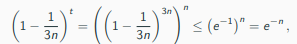

which is negligible

Testing primality 

First efficient algorithms for this problem were developed in the 1970s

Nowadays primality testing: Miller-Rabin algorign

-> Input: an integer p and a parameter t
-> Output: "prime" or "composite"
-> Monte-Carlo algotrithm, i.e. randomized algorithm that has a certain probability of returning a wrong output; tha value t determines the error probability

Theorem 9.33

If p is prime, then the Miller-Rabin test always outputs "prime". If p is composite, the algorithm outputs "composite" except with probability at most 2 ^ (-t).

Primes of a particular form

Sometimes one wants primes of a certain form, e.g.,

- p =  2q + 1, where q is also prime(safe prime)
- p = 3 mod 4

In case of a safe prime, we can first generate a prime q (of length n - 1) and then check if p is also prime
-> this works well in practice but theoretical analyses rely on assumptions

We can now define a refined experiment for which we introduce a generic algorithm GenModulus:

Let GenModulus be a PPT algorithm which on input 1^n outputs (N, p, q), where N = pq and p and q are n-bit primes (except with negligible probability)
-> this is effectively the result from the previous discussion of generating primes

The factoring experiment Factor_A,GenModulus(n):

1. Run GenModulus (1^n) to obtain (N, p, q).
2. A is given N, and outputs p', q' > 1.
3. The output of the experiment is defined to be 1 if p' * q' = N, and 0 otherwise.'

-> note that if the output is 1, then {p', q'} = {p, q}, unless p or q itself are composite (which happens with negligible probability)

Factoring is hard relative to GenModulus if for all probabilistic polynomial-time algorithm A there exists a negligible function negl such that

Pr[Factor_A,GenModulus(n) = 1] <= negl(n)

The factoring assumptions does not directly yield a practical cryptosystem
-> there are, however, constructions based on problems that are equivalent to factoring, e.g., Rabin encryption scheme

In 1978, Rivest, Shamir, and Adleman introduced a new problem that is now called RSA problem
-> "computing roots modulo N"

Given a modulus N and an integer e>2 relatively prime to ϕ(N), Corollaru 9.22 shows that exponentiation to the eth power modulo N is a permutation

The inverse of e modulo ϕ(N) describes the inverse permutation
-> raising to the dth power modulo N corresponds to computing the eth root modulo N

The algorithm generates a composite number N along with two integers e and d that describe a permutation and its inverse
-> looking ahead, e will be (part of) the public key while d will be the private key

The RSA experiment essentially asks an adversary to compute eth root of a given element

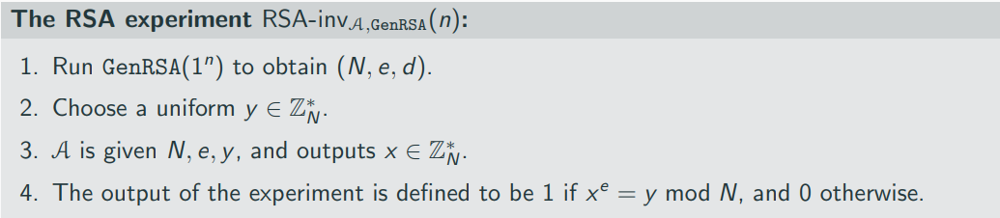

The RSA problem is hard relative to GenRSA if for all probabilistic polynomail-time algorithms A there exists a negligible function negl such that

Pr[RSA-inv_A,GenRSA(n) = 1] <= negl(n)

The RSA assumption states that computing eth roots modulo N is hard

Computing eth roots modulo N is easy, if one knows....

- ... d
- ... ϕ(N), or
- ... the factorization of N

-> having either one of these allows to compute the others 

This assymetry is the basis for public-key cryptography based on the RSA problem

Hardness of factoring RSA problem?

- Hardness of the RSA problem implies hardness of factoring
- The other direction is an open problem

## On the choice of e

We did not discuss how e is chosen

Popular choices are e = 3 end e ^ 16 + 1 = 65537

-> the former comes with the problem of "low-exponent attacks" which can affect the security of poorly implemented schemes based on the RSA problem
-> the latter has the advantage of having low Hamming weight which allows for faster exponentiation

One could also switch the order by first choosing d and then compute e as the inverse of d
-> note that choosing d "small" (in the snece as done above for e) is a bad idea as an attacker can them simply brute-force search for d exploiting that d is chosen
-> for similar reasons, one also wants to avoid d with small Hamming weight

# Cryptographic assumptions in Cyclic groups

## Cyclic groups and generators

Let  G be a finite group of order m. For any g ∈ G, consider the set

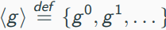

By Theorem 9.14, we have g^m = 1. Let i <= m be the smallest positive integer such taht g^i = 1. Then the above sequence repeats after i terms, hence

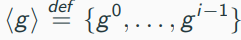

⟨g⟩ is a subgroup of G, called the subgroup generated by g. The order of the subgroup is called the order of g:

Definition 9.52

Let G be a finite group and g ∈ G. The order of g is the smallest positive integer i with g ^ i = 1

Some additional results:

Let G be a finite group, and g ∈ G an element of order i. Then for any integer x, we have g ^ x = g ^ [x mod i]

Let G be a finite group, and g ∈ G an element of order i. Then g ^ x = g ^ y if and only if x = y mod i

The identity of any group is the only element of order 1 which generates the group

⟨1⟩ = {1}

If there is an element g ∈ G that has order m (order of G), then ⟨g⟩ = G
-> we call G a cyclic group and g is a generator of G
-> note that a group can have multiple generators

Elements of the same group can have different orders but the order always divides the order of the group:

### Proposition 9.55

Let G be a finite group of order m, and say g ∈ G has order i. Then i | m

The power of this result:

If G is a group of prime order p, then G is cyclic. Furthermore, all elements of G except the identity are generator of G.

Proof

By proposition 9.55, the only possible orders of elements in G are 1 and p. Only the identity has order 1, and so all other elements have order p and generate G.

Another important cyclic group is Z*_p

If p is prime then Z*_p is a cyclic group of order p - 1.

For p > 3, Z*_p does not have prime order, so this theorem does not follow immediately from the previous results

Consuder the additive group Z_15.

Element 1 is a generator of this group as ⟨1⟩ = {0,1,2,3,4,5,6,7,8,9,10,11,12,13,14}

Another generator of the group is 2, since ⟨2⟩ = {0,2,4,6,8,10,12,14,1,3,5,7,9,11,13}

Element 3 is not a generator of Z_15, since ⟨3⟩ = {0,3,6,9,12}
-> Element 3 has order 5
-> Element 3 generates a subgroup (of order 5) of Z_15 under addition modulo 15.

Element 10 is also not a generator of Z_15, since ⟨10⟩ = {0, 10, 5}
-> Element 10 has order 3
-> Element 10 generates a subgroup (of order 3) of Z_15 under addition modulo 15.

Note that the order of the two dubgroups (5 and 3) divide |Z_15| as required by Proposition 9.55

Consider the (multiplicative) group Z*_15 of order (5 - 1)(3 - 1) = 8

We have ⟨2⟩ = {1,2,4,8}, and so the order of 2 is 4.

As required by Proposition 9.55, 4 (order of element 2) divides 8 (order of the group Z*_15).

Consider the (additive) group Z_p of prime order p.

This group is cyclic but Corollary 9.56 tells us more: every element except 0 (the identity of the group) is a generator

For any h ∈ {1, ..., p -1} and i > 0, we have ih = 0 mod p if and only if p | ih.

By proposition 9.3, then either p | h or p | i has to hold.
-> the former cannot occur since h < p
-> the smallest integer where the latter occurs is i = p

Hence, any nonzero elemnt h has order p, i.e. generates Z_p, in accordance with Corollary 9.56

Consider the (multiplicative) group Z*_7, which is cyclic by Theorem 9.57.

We have ⟨2⟩ = {1,2,4}, meaning that 2 is not a generator.

But ⟨3⟩ = {1,3,2,6,4,5} = Z*_7, meaning that 3 is a generator of Z*_p

This example shows that for Z*_p with p>3, not every element(different from the identity) generates the group (in contrast to Corollary 9.56)

The Discrete-Logarithm/Diffie-Hellman Assumprions

Let G be a generic, polynomail-time group generation algorithm
-> on input 1^n, it outputs a description of a cyclic group G, its order q (with ||q|| = n) and a generator g ∈ G

How to sample a uniform h ∈ H?
-> Choose uniform x ∈ Z_q and compute h:= g^x

For (G, q, g) <- G(1^n), {g^0, g^1, ..., g^(q-1)} = G
-> equivalently: for every h ∈ G, there existits a unique x ∈ Z_q such that g^x = h
-> we call x the discrete logarithm of h with respect to g, written as x = log_g (h)
-> we call them "discrete" because they are integer values (in contrast to "standart" logarithms)

The discrete-logarithm problems asks to find log_g h for a random h

The discrete-logarithm experiment DLog_(A,G) (n):
1. Run G(1^n) to obtain (G, p, g), where G is a cyclic group of order q (with ||q|| = n), and g is a generator of G.
2. Choose a uniform h ∈ G.
3. A is given G, q, g, h, and outputs x ∈ Z_q
4. The output of the experiment is defined to be 1 if g^x = h, and 0 otherwise.

Definition 9.63

We say the discrete-logarithm problem is hard relative to G if for all probabilistic polynomial-time algorithms A there exists a negligible function negl such that

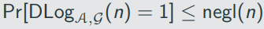

## The Deffie-Hellman problems

There are two variants:

1. THe computational Diffie-Hellman (CDH) problem
2. The decisional Diffie-Hellman (DDH) problem

-> both are related to the discrete-logarithm problem

Fix a cyclic group G and a generator g ∈ G. Given h1, h2 ∈ G, define

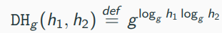

-> if h1 = g ^ x1 and h2 = g ^ x2, then DH_g(h1, h2) = g^(x1x2) = h1 ^ x2 = h2 ^ x1

The CDH problem is to compute DH_g(h1, h2) for uniform h1 and h2

- If the discrete-logarithm problem is easy, then the CDH problem is too. Why?
- If the discrete-logarithm problem is hard, it is unclear whether the CDH problem is hard as well

The DDH problem, roughly speaking, is to DH_g(h1, h2) from a uniform group element, when h1 and h2 are uniform, when h1 and h2 are uniform

We say the DDH problem is hard relative to G if for all probabilistic polynomial-time algorithms A there is a negligible function negl such that

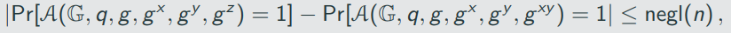

where in each case the probabilities are taken over the experiment in which G(1^n) outputs (G,q,g) and then x,y,z ∈ Z_q are chosen, (Note that when z is uniform in Z_q, then g^z is uniformly distributed in G.)

Relation CDH and DDH:

- If the CDH problem is easy, then the DDH problem is easy
- The converse does not appear to be true. There are groups for which the CDH problem is believed to be hard while the DDH problem is easy.

