# Main definitions:

## Kerkchoff's principle

The cipher method must not be required to be secret, and it must be able to fail into the hands of the enemy without inconvenience

## Sufficient Key-Space principle

Any secure encryption scheme must have a key space that is sufficiently large to make an exhaustive-search attack infeasible.

## Threat model:

Ciphertext-only attack: The adversary just observes ciphertexts. This is the threat model we have been implicity assuming thus far

Known-plaintext attack: The adversary can learn some plaintext-ciphertext pairs and aims to deduce information of a plaintext underlying some other ciphertext

Chosen-plaintext attack: The adversary can obtain plaintext-ciphertext pairs, as above, for plaintexts of its choice

Chosen-cipher attack: The adversary is additionally able to obtain the decryption of ciphertext of its choice

## Principle of Modern Cryptography

### Principle 1: Formal definitions

1. A security guarantee (from view of attacker an attacker's goal that constitutes a break of the scheme)
2. A threat model (describing what the adversary is capable of)

#### Attacker's goal:

- It should be impossible for an attacker to recover the key
- It should be impossible for an attacker to recover the plaintext from the cipher text
- It should be impossible for an attacker to recover any character of the plaintext from the ciphertext

### Principle 2: Formal definitions

Most modern cryptographic constructions cannot be proven secure uncoditionally

Importance of clear assumptions:

1. Validation of assumptions
2. Comparison of assumptions
3. Understanding the necessary assumptions

### Principle 3: Proofs of security

- Provide a rigorous proof that a construction satisfies a given definition under certain specified assumprions
    - Provides an iron-clad guarantee - relative to our definition and assumptions!
- Without a proof, we are left with our intuition
    - Experience shows that intuition about security is often disastrous
    - Countless examples of unproven schemes that were broken; sometimes immediately and sometimes years after deployment

## Perfect Correctness

We assume perfect correctness, meaning that, for all k ∈ K, and m ∈ M, we have

Pr[Dec(k, Enc(K,m)) = m] = 1

Perfect correctness implies that decryption is deterministic (without loss of generality), as Dec(k,c) must return the same output every time

## Perfect Secrecy

Informal: "Regardless of any prior information the attacker has about the plaintext, the ciphertext should leak no additional information about the plaintext"

Formal:

An encryption scheme (KGen, Enc, Dec) with message space M is perfectly secret if for every probability distribution for M, every message m ∈ M, and every ciphertext c ∈ C for which Pr[C = c] > 0: 

Pr [M = m | C = c] = Pr[M = m]

The distribution of M doest not change conditioned on observing the ciphertext

Equivalent formulation of perfect secrecy:

Pr[Enc(k,m) = c] = Pr[Enc(k,m') = c]

### Limitations of Perfect Secrecy

- The previous downsides are not specific to the one-time pad
- These downsides are inherent limitations of perfect secrecy
- Any perfect secret encryption scheme must have a key space that is at least as large as the message space

If (KGen, Enc, Dec) is a perfectly secret encryption scheme with message space M and key space K, then |K| >= |M|

## Shannon's Theorem

- Shannon also provided a characterization of perfectly secret encryption schemes
- This characterization (under certain conditions) says that
    1. KGen must choose the key uniformly at random form the set of all keys (as in one-time pad) and
    2. for every message m and ciphertext c there must be a unique key mapping m to c (again as in the one-time pad)
- The following theorem assumes |M| = |K| = |C|
    - We have already seen that perfect secrecy requires |K| >= |M|
    - Correct decryption requires |C| >= |M|
- In some sence |M| = |K| = |C| is "optimal"

Let (KGem, Enc, Dec) be an encryption scheme with message space M, for which |M| = |K| = |C|. This scheme is perfectly if and only if:

1. Every key k ∈ K is chosen with (equal) probability 1 / |K| by KGen.
2. For every m ∈ M and every c ∈ C, there is a unique key k ∈ K such that Enc_k(m) outputs c.

## Computational Security

1. Security is only guaranteed against adversaries that run for some feasible amount of time -> with enough time, the adversary may be able to violate security
2. Adversaries can potentionally succeed (break security) with some very small probability

There are two approaches for computational security:

1. The concrete approach
2. The asymptotic approach

Quantify security of a cryptographic scheme by explicity bounding the maximum success probability of an adversary rrunning in some specified amount of time

a definition of concrete security takes the following form:

A scheme is (t, ϵ)-secure if any adversary running for time at most t succeeds in breaking the scheme with probability at most ϵ.

Let PPT denote "probabilistic polynomal-time". A definition of asymptotic security takes the following form:

A scheme is secure if any PPT adversary succeeds in breaking the scheme with at most negligible probability.

Negligable success probability

A negligible function is one that is asymptotically smaller than any inverse polynomial function

A function f: N -> R is negligible if for every polynomial p there is an N such that for all n > N it holds that f(n) < 1/p(n)

The functions 2 ^ (-n), 2 ^ (-sqrt(n)), n ^ (- log n) are all negligible

Let negl1 and negl2 be negligible functions. Then:

1. The function negl3(n) = negl1(n) + negl2(n) is negligible
2. For any polynomial p, the function negl4(n) = n(n) * negl1(n) is negligible

## Constructing an EAV-Secure Encryption Scheme

Important building block: pseudorandom generators (PRGs)

- A deterministic algorithm transforming a short, uniform string (called a seed) into a longer, "uniform-looking" (or "pseudorandom") output string

Let G be a deterministic polynomial-time algorithm such that for any n and any input s ∈ {0,1}^n, the result G(s) is a string of length l(n). G is a pseudorandom generator if the following conditions hold:

(Expansion.) For every n it holds that l(n) > n.
(Pseudorandomness.) For any PPT algorithm D, there is a negligible function negl such that

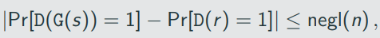

Where the first probability is taken over uniform choice of s ∈ {0,1}^n and the randomness of D, and the second probability is taken over uniform choice of r ∈ {0,1} ^ (l(n)) and the randomness of D.

We call l(n) the expansion factor of G.

## Proofs by Reduction:

If problem X is harrd then construction П is secure.

Proof by reduction: show that an adversary A that breaks П can be turned into an algorithm A' that solves problem X -> we reduce solving X to breaking П

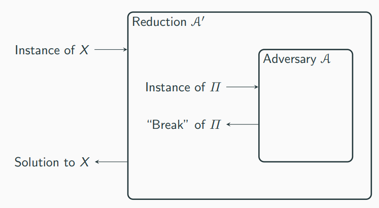

## Distinguisher D

D receives as input w ∈ {0,1} ^ l(n):

1. Run A (1 ^ n) to obtain two messages m0,m1 ∈ {0,1} ^ l(n)
2. Choose a uniform bit b and compute c: = w xor m_b
3. Give c to A and obtain b'. Output 1 if b' = b, and 0 otherwise

## Stronger Security Notions

The security definitions so far consider the scenario that Alice and Bob exchange a single encrypted message

In practice Alice and Bob probably want ot exchange more messages(all enctypted using the same key) and an adversary might observe all of them

In the following we describe security experiment which allows the adcersary to onserve the encryption of multiple messages

A private=key encryption scheme П = (KGen, Enc, Dec) has indistinguishable multiple encruptions in the presence of an eavesdropper if for PPT adversaries A there is a negligible function negl such that

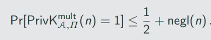

An encryption scheme that has indistinguishable multiple encryption clearly also has indistinguishable encryption as the latter is a special case of the former where the lists of messages have length 1

There is a private-key encryption scheme that has indistinguishable encryptions in the presence of an eavsdropper, but not indiguishable multiple encryptions in the presence of an eavsdropper.

If П is a encryption scheme in which Enc is a deterministic function of the key and the message, then П cannot have indistinguishable multiple encryptions in the presence of an eavesdropper.

Recall: chosen-plaintext attacks allow the adversary to obtain ciphertexts for plaintext of its choice

Below, Enc_k(.) denotes an "oracle" that A can query. When queries on m, Enc_k will compute and return c <- Enc_k(m)

## Pseudorandom Functions

- A keyed ducntion F: {0,1}* x {0,1}* -> {0,1}* is a two input function, where the first input is the key
- F is efficient if there is a polynomal-time algorithm than computes F(k,x) given k and x
- The security parameter will dictate the lenth of key, input, and output, i.e,

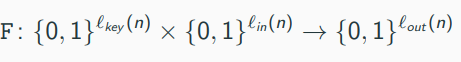

- We cannot give D a description of F_k or f because the latter is exponential, meaning that D could not read its entire input
- Instead, we allow the distinguisher to examine the input/output behavior of the cuntion by giving access to an oracle O which is either F_k or f

An efficient, length preserbing, keyed function F: {0,1}* x {0,1}* -> {0,1}* is a pseudorandom function if for all probabilistic polynomal=time distinguishers D, there is a negligible function such that:

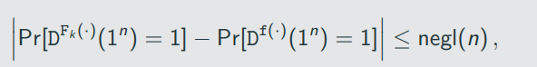

where the first probability is taken over uniform choice of k ∈ {0, 1} ^ n and the randomness of D, and the second probability is taken over uniform choice of f ∈ Func_n and the randomness of D.

Note that D does not het hte key k.

## Pseudorandom Permutations

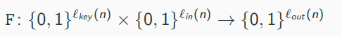

is a permutation, i.e., (one-to-one), which implies that l_in(n) - l_out(n) Similar to the Dunction case, we will typically consider l_key(n) = l_in(n) = l_out(n) = n Security is defined very similar to pseudorandom functions with the difference that it should be indistinguishable from a random permutation (instead of a random function)

Let F: {0,1}* x {0,1}* -> {0,1}* be an efficient, length preserving, leyed permutation. F is a strong pseudorandom permutation if for all probabilistic polynomal-time distinguishers D, there exists a negligible function negl such that:

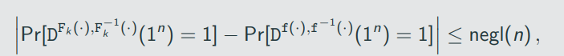

where the first probability is taken over uniform choice of k ∈ {0,1}^n and the randomness of D, and the second probability is taken over uniform choice of f ∈ Perm_n and the randomness of D.

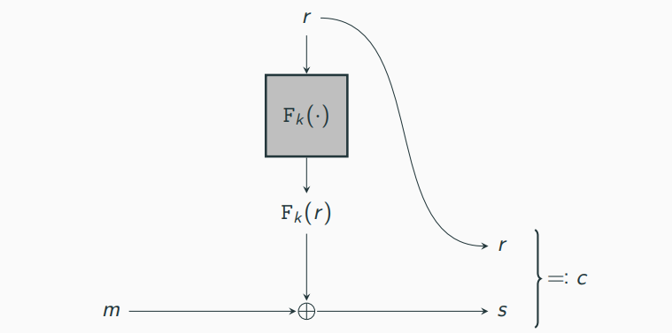

Let F be a pseudorandom fucntion. Define a fixed-length private-key encryption scheme for messages of length n as follows:

- KGen: on input 1^n, choose uniform k ∈ {0,1} ^ n and output it.
- Enc: on input a key k ∈ {0,1} ^ n and a message m ∈ {0,1}^n, choose uniform r ∈ {0,1}^n and output the ciphertext 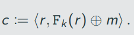
- Dec: on input a key k ∈ {0,1}^n and a ciphertext 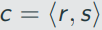, output the ciphetext

m:= F_k(r) xor s

If F is a pseudorandom function, then construction is a CPA-secure, fixed-length private-key encryption scheme for messages of length n.

## Distinguisher D 

D receives as input 1^n and access to an oracle O: {0,1}^n -> {0,1}^n

1. Run A (1^n). When A queries its encryption oracle on a message m ∈ {0, 1}^n:

    i. Choose unifrom r ∈ {0, 1}^n
    ii. Query O(r) and obtain response y
    iii. Return ciphertext alt text to A
2. When A outputs m0,m1 ∈ {0, 1} ^ n, choose a uniform bit b ∈ {0, 1} and:

    i. Choose uniform r ∈ {0, 1} ^ n
    ii. Query O(r) and obtain response y
    iii. Return ciphertext alt text to A
3. Choose a unifrom bit b and compute c:= w xor m_b
4. When A outputs a bit b', outputs 1 if b' = b, and 0 otherwise

## Modes of operation and encryption in practice

Formally, a stream cipher is a pair of deterministic algorithm(init, Next) where:

- Init takes as input a seed s and an optional initialization vector (IV) iv, and outputs some initial state st
- Next takes as input a current state st and outputs a bit y along with an updates state st'.
Starting from some initial state st_0, we can generate any number of bits by repeatedly calling Next

A shorthand, we define an algorithm GetBits which takes as input an initial state st0 and the desired output length 1^l and does the following:

1. For i = 1 to l, compute(y_i, st_i) := Next(st_(i-1))
2. Return the l-bit string y = y_1, ..., y_l as well as the final state st_l.
We write GetBits_1 for the algorithm that runs GetBits and only outputs the generated bits, i.e., y = y_1...y_l

Visualization of a stream cipher (without an IV):
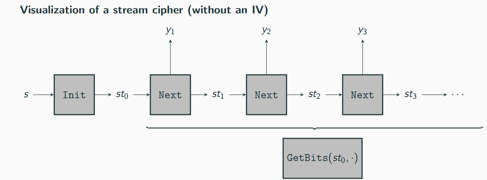

A stream cipher without an IV is a basically a pseudorandom generator with a more flexible interface: -> running Init on a uniform seed s to obtain st_0 and then generating any (polynomal) number of bits using GetBits_1, the result is pseudorandom

Given a stream cipher (Init, GetBits) and a parameter l = l(n) > n. define

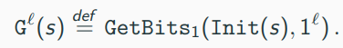

Then the stream cipher is secure if G^l is a pseudorandom generator for any polynomial l.

Security of a stream cipher that does tak an IV can be defined in multiple ways

Specificallym consider the case where uniform seed s is chosen and Init(s, .) is run repeadedly for different ic; the requirment is that runnign GetBits_1 using the different initial states should producestreams that appear independently uniform

Given a stream cipher (Init, GetBits) and a parameter l = l(n) > n, define

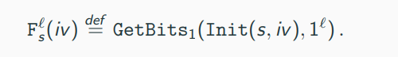

Then the stream cipher is secure if F^l is a pseudorandom function for any polynomial l

Stream cipher from a pseudorandom function

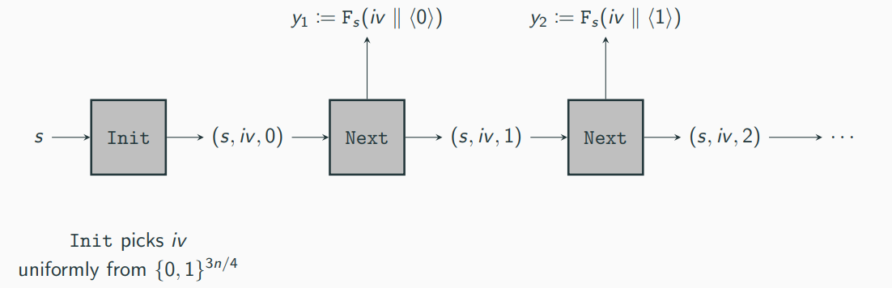

Let F be a pseudorandom function. Define a stream cipher(Init, Next) as follow, where Init accepts a 3n/4-bit initializtion vector and Next outputs n bits in each call:

- Init: on input s ∈ {0, 1}^n and iv ∈ {0, 1}^(3n/4), output st = (s,iv,0).
- Next: on input st - (s, iv, i), output 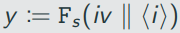 and updated state st' = (s, iv, i + 1)

Stream cipher modes of operation

How to encrypt arbitary long messages using a stream cipher (Init, Next)?

We discuss two modes:

1. Synchronized mode
2. Unsynchronized mode

## Synchronized mode

Consider a sender S and a receiver R. Furhermore, assume that all messages arrive in order and no messages are lost. The following method allow the sender to encrypt a series of messages from S to R:

1. Both parties call Init(k) to obtain the initial state st_0
2. Let st_s be the current state of the sender S. To encrypt m, the sender:
    i. computes (y, st') := GetBits (st_s, 1 ^ |m|) and updates the state st_s to st_s'
    ii. sends c:= m xor y to R.
3. Let st_R be the current state of the receiver R. To decrypt a ciphertext c, the receiver:
    i. computes (y, st_R') := GetBits(st_r, 1^ |c|) and updates the state st_r to st_r'
    ii. computes m := c xor y

This method can be extended to bidirecational communication by using a second shared key for which the roles are flipped

## Unsynchronised mode

Let (Init, Next) be a stream cipher that takes an n-bit IV. Define a private-key encryption scheme for arbitary-length messages as follow:

- KGen: on input 1^n, choose uniform k ∈ {0, 1}^n and output it.
- Enc: on input a key k ∈ {0, 1}^n and a message m ∈ {0, 1}*, choose uniform iv ∈ {0, 1}^n, and output the ciphertext

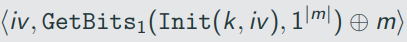

- Dec: on input a key k ∈ {0, 1}^n and a ciphertext c = ⟨ iv, c ⟩, output the message

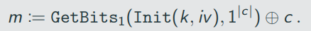

## Block Ciphers and Block-Cipher Modes of Operation

A block cipher is simply a different name for a pseudorandom permutation -> main distinction block ciphers typically only support a specific set of key/block length

We have seen that we construct a stream cipher from a block cipher, which means we can construct the stream-cipher modes of operation discussed above

Here we discuss four block-cipher modes of operations and discuss thier security:

1. Electronic Code Book (ECB) mode
2. Cipher Block Chaining (CBC) mode
3. Output Feedback (OFB) mode
4. Couter (CTR) mode

In the following, we assume all messages m to have length a multiple of n and write m = m1,m2,...,m_l, where m_i are the individual message blocks

## Message Integrity 

Secrcecy vs. Integrity

Basic suctiry goal of cryptography: secure communication

What does secure communication mean?

So far we considered "secrecy" by showing that an eavsdropper cannot learn anything about the communicated messages

-> the adversary to be passive

There are other examples where one is not concerned with secrecy and aversaries are not mecessarily passive

Messag eintegrity against active adversaries is equally important -> active adversaries can send and modify messages

Consider the scenario where Alice communicated with her bank over the Internet. When the bank recieves a request to transfer 1.000$ from Alice to Boob, there are two things for the bank to consider:

Is the request authentic,i.e., did it come from Alice and not from someone else(for instance Bob)?
If the request is authentic, is the content (e.g., the amount of money to be transfered) unaltered?
Standart error-correction methods do not apply to handle the second point

Secrecy and integrity are often confused and interwined -> encryption does not (in general) provide integrity

## Message Authentication Codes (MACs)

To achieve message integrity, we introduce a new cryptographic primitive called message authentication codes (MACs)

The setting is similar to private-key encryption, in the sence that Alice and Bob share some secret key but rather the goal is to achive messag integrity rather than secrecy

What does it mean for a MAC to be secure?

Intuitive idea: no efficient adversary should be able to generate a valid tag for any "new" message that was not previously sent (and authenticated) by the communicating parties

What about the "previously authenticated" message? How are they chosen? -> we allow the adversary to choose these message to model the case that adversarial actions might influence the messages authenticated by Alice and Bob -> similar to how the adversary can influence the messages that are encrypted (chosen-plaintext attack)
# Experiments:

## Perfect (adverarial) indistinguishability experiment  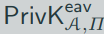

1. The adversary A outputs a pair of messages m0,m1 ∈ M.
2. A key k is generated using KGen, and a uniform bit b ∈ {0,1} is chosen. Ciphertext c <- Enc_k(m_b)
3. A outputs a bit b'
4. The output of the experiment is defined to be 1 if b' = b, and 0 otherwise. We write  = 1 if the output of the experiment is 1 and in this case we say that A succeeds.

Encryption Scheme П = (KGen, Enc, Dec) with message space M is perfectly indistinguishable if for every A it holds that

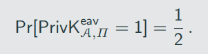

Encryption scheme П = (KGen, Enc, Dec) is perfectly secret if an only if it is perfectly indistinguishable.

## The adversarial indistinguishability experiment 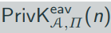

1. The adversary A is given input 1^n, and outputs a pair of messages m0, m1 with |m0| = |m1|.
2. A key k is generated by running KGen(1^n), and a uniform bit b ∈ {0,1} is chosen. Ciphertext c <- Enc_k(m_b) is computed and given to A. We refer to c as the challenge ciphertext.
3. A outputs a bit b'.
4. The output of the experiment is defined to be 1 if b' = b, and 0 otherwise. We write 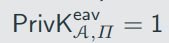 if the output of the experiment is 1 and in this case we say that A succeeds.

A private-key encryption scheme П = (KGen, Enc, Dec) has indistiguishable encryptions in the presence of an eavsdropper, or is EAV-secure, if for all robabilistic polynomal-time adversaries A there is a negligible function negl such that, for all n,

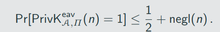

The probability above is taken over the randomness used by A and the randomness used in the experiment(for choosing the key and the bit b, as well as any randomness used by Enc)

A private=key encryption scheme П = (KGen, Enc, Dec) has indistinguishable encryptions in the presence of an eavesdropper if for all PPT adversaries A there is a negligible function negl such that

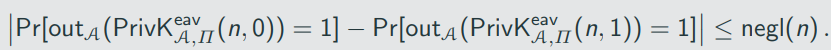

## The adversarial indistinguishability experiment  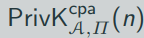:

1. A key k is generated by running KGen(1^n)
2. The adversary A is given input 1^n and oracle access to Enc_k(.), and outputs a pair of messages m0,m1 of the same length
3. A uniform bit b ∈ {0,1} is chosen, and then a ciphertext c <- Enc_k(m_b) is computes and given to A.
4. The adversary A continues to have oracle access to Enc_k(.), and outputs a bit b'
5. The output of the experiment is defined to be 1 if b' = b, and 0 otherwise. In the former case, we say that A succeeds.

A private-key encryption sheme П = (KGen, Enc, Dec) has indistiguishable encryptions under a chosen-plaintext attack, or is CPA-secure, if for all PPT adversaries A there is a negligible function negl such that

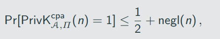

where the probability is taken over the randomness used by A, as well as the randomness used in the experiment

We use a slightly different approach here, which allows the adversary to adaprtively choose pairs of plaintexts to be encrypted

"Lefr-or-Right" oracle LR_k,b(.,.): on input a pair of equal-lenth messages m0,m1, the oracle computes c <- Enc_k(m_b) and returns c

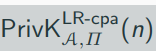

1. A key k is generated by running KGen(1^n)
2. A uniform bit b ∈ {0,1} is chosen.
3. The adversary A is given input 1^n and oracle access to LR_k,b(.,.) as defined above.
4. The adversary A outputs a bit b'
5. The output of the experiment is defined to be 1 if b' = b, and 0 otherwise. In the former case, we say that A succeeds.

Any private-key encryption scheme that is CPA-secure is also CPA-secure for multiple encryptions.

##  The adversarial indistinguishability experiment 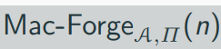:

1.  A key k is generated by running KGen(1^n).

2. The adversary A is given input 1^n and oracle access to Mac_k(·). The adversary eventually outputs (m, t). Let Q denote the set of all queries that A submitted to its oracle.

3. A succeeds if and only if

    i. Vrfy(k,m,t) = 1 and
    ii. m !∈ Q In that case the output of the experiment is defined to be 1.

A message authentication code П = (KGen, Mac, Vrfy) is existentially unforgeable under an adaptive chosen-message attack, or just secure, if for all probabilistic polynomial-time adversaries A there is a negligible function negl such that
# Private-key Encryption

## Historic Ciphers  

### Caesar's cipher
  - One of the oldest recorded cipher
  - Letters of the alphabet were shifted by 3 places orward: a was repklaced by D, b was replaced by E, and so on
  - For example: kosntanz -> NRQVWDC
  - Problem: cipher method is fixed; there is no key; fails to achieve Kerckhoffs principle

### Shift cipher
- A keyed variant of Caesar's cipher
- Key k is a number between 0 and 25
- Encryption workds by shifting letters by k places
- Decryption works by shifting letters by j places backwards

#### Example 

Consider the shift cipher 

K = {0,...,25} with Pr[K = k] = 1/ 26 for each k ∈ K 

Say the distribution over M is as follows 

Pr[M = a] = 0.7 and Pr[M = z] = 0.3

Probability that the ciphertext is B? There are two possibilites: either M = a and K = 1, or M = z and K = 2 

By independence of K and M, we have 

Pr[M = a ^ K = 1] = Pr[M = a] * Pr[K = 1] = 0.7 * 1/26

Similary, we have

Pr[M = z ^ K = 2] = Pr[M = z] * Pr[K = 2] = 0.3 * 1/26

Therefore

Pr[C = B] = Pr[M = z ^ K = 2] + Pr[M = a ^ K = 1] = 0.7 * 1/26 + 0.3 * 1/26 = 1/26

What is the probability that message a was encrypted, given that we observe ciphertext B?

Pr[C = c] = sum(Pr[M = m ^ K = k])

What is the probability that message ann was encrypted, given that we observe ciphertext DQQ? Using Bayes’ Theorem yields

Pr [M = ann | C = DQQ] = (Pr[C = DQQ | M = ann] * Pr[M = m]) / Pr [C = DQQ] = ( 1 * 1/26 * 0.2) / (1/52) = 0.4

## Mono-alphabetic substituion cipher

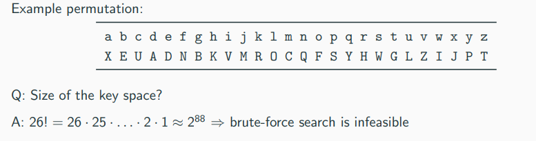

Attack possible using statical properties of the English language (we assume the encrypted text is some gramatically correct english text) The attack relies on two facts:

1. For any key, the mapping of each letter is fixed; if e is mapped to D, every appearance of e will result in an appearance of D
2. The frequency distribution of letters in English texts is known

## The Vigenere cipher 

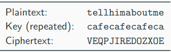

## One Time pad

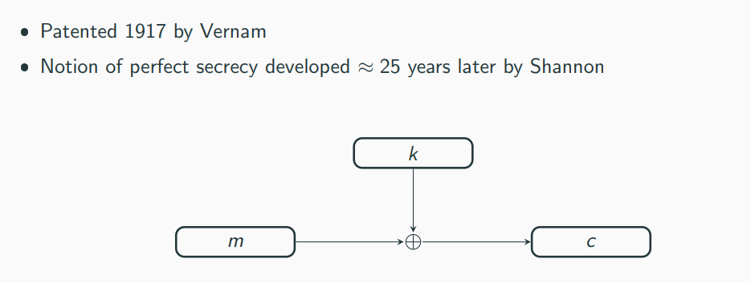

Construction

Fix an integer l > 0. The message space M, key space K, and ciphertext space C are all equal to {0,1}^l(the set of all binary strings of length l).

KGen: the key-generation algorithm chooses a key from K = {0,1}^l according to the uniform distribution (i.e., each of the 2^l string in the space is chosen as key with probability exactly 2^-l) Enc: given a key k ∈ {0,1}^l and a message m ∈ {0,1}^l, the encryption algorithm outputs the ciphertext c:= k ⊕ m Dec: given a key k ∈ {0,1}^l and a ciphertext c ∈ {0,1}^l, the decryption algorithm outputs the message m:= k ⊕ c

Problems/limitations of the OTP

- key is as long as the message
-  Only secureif the key is used once
    - of m and m' are encrypted using k, yielding c and c', respectively, then c ⊕ c' = (m ⊕ k) ⊕ (m' ⊕ k) = m ⊕ m'

## Pseudorandom OTP

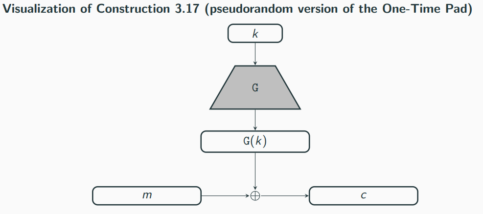

Let G be a pseudorandom generator with expansion dactor l(n). Define a fixed-length private-key encryption scheme for messages of length l(n) as follows:

- KGen: in input 1^n, choose uniform k ∈ {0,1} ^ n and output it as the key.
- Enc: on input a key k ∈ {0,1} ^ n and a message m ∈ {0, 1} ^ l(n), output the ciphertext

c:= G(k) xor m

Dec: on input a key k ∈ {0,1} ^ n and a ciphertext c ∈ {0,1} ^ l(n), output the ciphertext

m:= G(k) xor c

If G is a pseudorandom generatotm then Construction 3.17 is an EAV-secure, fixed-length private-key encryption scheme for length l(n).

## Electronic Code Book (ECB) mode

Encryption:

1. For i = 1 to l, compute c_i := F_k(m_i)
2. Set c := F_k(m1), F_k(m2), ..., K_k(m_l)
- A naive mode of operation
- Encryption is ddeterministic and hence not CPA-secure -> repeated plaintext blocks result in repeated ciphertext blocks

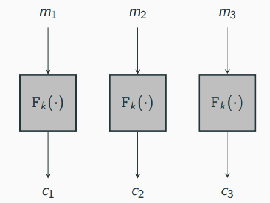

## Cipher Block Chaining (CBC) mode

Encryption:

1. Choose ic uniformly at set c0:= iv
2. For i = 1 to l, compute 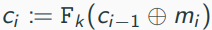
3. Set c:= iv, c1,...,c_l

- CBC encryption is randomized and one can show:

If F is a pseudorandom permutation, then CBC mode is CPA-secure.

Disadvantage of CBC mode: ciphertext blocks have to be computed sequentially (not parrallelizable)

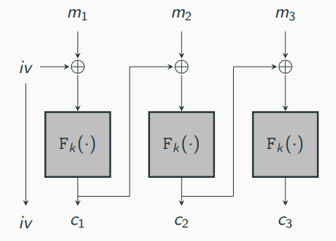

## Chained CBC mode

- A stateful variante of CBC mode (used in SSL 3.0 and TLS 1.0)
- Use the last block of previous ciphertext block as IV for the next message
- It appears to be as secure as CBC mode, but it is not CPA-secure

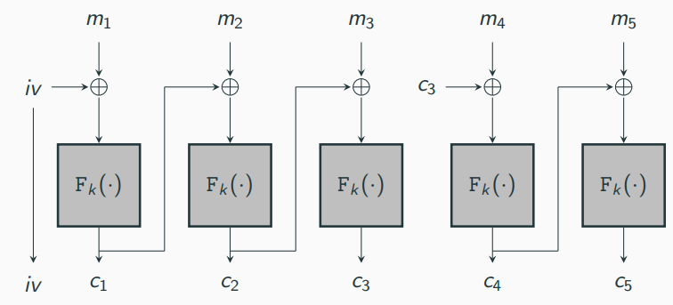

## Output Feedback (OFB) mode

Encryption: 

1. Choose ic uniformly at set y_0 := iv
2. For i = 1 to l, compute y_i := F_k(y_(i-1))
3. For i = 1 to l, compute c_i := y_i xor m_i
4. Set c := iv, c1,...,c_l

- For OFV, F does not need to be a permutation
- Stateful variant of OFB is secure (y_L is used as IV for next message)
- Encryption is again sequentially but the coslty part (evaluating F) can be done independent of the message

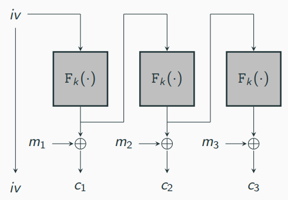

## Couter (CTR mode)

Encryption:

1. Choose iv uniformly from {0,1} ^ (3n/4)
2. For i = 1 to l, compute y_i := F_k (iv ∥ ⟨i⟩)
3. For i = 1 to l, compute c_i := y_i xor m_i
4. Set c:= iv, c1,...,c_l
Ctr mode is fully parallelizable

If F is a pseudorandom function, then CTR mode is CPA-secure for multiple encryptions.

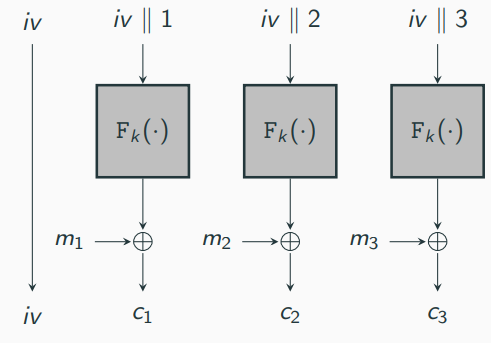

## MACs 

A message authentication code (or MAC) consis of three probabilistic polynomial-time algorithms (KGen, Mac, Vrfy) such that:

1. The key-generation algorithm KGen takes as input the sectuiry parameter 1^n and outputs a key k with |k|>= n.

2. The tag-generation algorithm Mac and a message m ∈ {0,1}*, and outputs a tag t. Since this algorithm may be randomized, we wirte this as t <- Mac_k(m)

3. The deterministic verification algorithm Vrfy takes as input a key k, a messag m, and a tag t. It outputs a bit b, with b = 1 meaning valid and b = 0 meaning invalid. We wite this as b:= Vrfy_k(m,t)

It is required that for every n, every k putput by KGen (1^n), and every m ∈ {0,1}*, it holds that Vrfy_k(m, Mac_k(m)) = 1.

If there is a function l such that for every key k output by KGen(1^n), algorithm Mac_k is only defined for messages m ∈ {0,1} ^ (l(n)), then we call the scheme a fixed-length MAC for messages of length l(n).

As with private-key encryption, KGen(1^n) almost always output a uniform k ∈ {0,1}^n

For deterministic MACs (meaning Mac is deterministic), canonical verification works by letting Vrfy re-compute the tag and compare. More preciselym Vrfy_k(m, t):

1. computes t' := Mac_k(m)
2. Outputs 1 if t' = t
