# Main definitions:

## Kerkchoff's principle

The cipher method must not be required to be secret, and it must be able to fail into the hands of the enemy without inconvenience

## Sufficient Key-Space principle

Any secure encryption scheme must have a key space that is sufficiently large to make an exhaustive-search attack infeasible.

## Threat model:

Ciphertext-only attack: The adversary just observes ciphertexts. This is the threat model we have been implicity assuming thus far

Known-plaintext attack: The adversary can learn some plaintext-ciphertext pairs and aims to deduce information of a plaintext underlying some other ciphertext

Chosen-plaintext attack: The adversary can obtain plaintext-ciphertext pairs, as above, for plaintexts of its choice

Chosen-cipher attack: The adversary is additionally able to obtain the decryption of ciphertext of its choice

## Principle of Modern Cryptography

### Principle 1: Formal definitions

1. A security guarantee (from view of attacker an attacker's goal that constitutes a break of the scheme)
2. A threat model (describing what the adversary is capable of)

#### Attacker's goal:

- It should be impossible for an attacker to recover the key
- It should be impossible for an attacker to recover the plaintext from the cipher text
- It should be impossible for an attacker to recover any character of the plaintext from the ciphertext

### Principle 2: Formal definitions

Most modern cryptographic constructions cannot be proven secure uncoditionally

Importance of clear assumptions:

1. Validation of assumptions
2. Comparison of assumptions
3. Understanding the necessary assumptions

### Principle 3: Proofs of security

- Provide a rigorous proof that a construction satisfies a given definition under certain specified assumprions
    - Provides an iron-clad guarantee - relative to our definition and assumptions!
- Without a proof, we are left with our intuition
    - Experience shows that intuition about security is often disastrous
    - Countless examples of unproven schemes that were broken; sometimes immediately and sometimes years after deployment

## Perfect Correctness

We assume perfect correctness, meaning that, for all k ∈ K, and m ∈ M, we have

Pr[Dec(k, Enc(K,m)) = m] = 1

Perfect correctness implies that decryption is deterministic (without loss of generality), as Dec(k,c) must return the same output every time

## Perfect Secrecy

Informal: "Regardless of any prior information the attacker has about the plaintext, the ciphertext should leak no additional information about the plaintext"

Formal:

An encryption scheme (KGen, Enc, Dec) with message space M is perfectly secret if for every probability distribution for M, every message m ∈ M, and every ciphertext c ∈ C for which Pr[C = c] > 0: 

Pr [M = m | C = c] = Pr[M = m]

The distribution of M doest not change conditioned on observing the ciphertext

Equivalent formulation of perfect secrecy:

Pr[Enc(k,m) = c] = Pr[Enc(k,m') = c]

### Limitations of Perfect Secrecy

- The previous downsides are not specific to the one-time pad
- These downsides are inherent limitations of perfect secrecy
- Any perfect secret encryption scheme must have a key space that is at least as large as the message space

If (KGen, Enc, Dec) is a perfectly secret encryption scheme with message space M and key space K, then |K| >= |M|

## Shannon's Theorem

- Shannon also provided a characterization of perfectly secret encryption schemes
- This characterization (under certain conditions) says that
    1. KGen must choose the key uniformly at random form the set of all keys (as in one-time pad) and
    2. for every message m and ciphertext c there must be a unique key mapping m to c (again as in the one-time pad)
- The following theorem assumes |M| = |K| = |C|
    - We have already seen that perfect secrecy requires |K| >= |M|
    - Correct decryption requires |C| >= |M|
- In some sence |M| = |K| = |C| is "optimal"

Let (KGem, Enc, Dec) be an encryption scheme with message space M, for which |M| = |K| = |C|. This scheme is perfectly if and only if:

1. Every key k ∈ K is chosen with (equal) probability 1 / |K| by KGen.
2. For every m ∈ M and every c ∈ C, there is a unique key k ∈ K such that Enc_k(m) outputs c.

## Computational Security

1. Security is only guaranteed against adversaries that run for some feasible amount of time -> with enough time, the adversary may be able to violate security
2. Adversaries can potentionally succeed (break security) with some very small probability

There are two approaches for computational security:

1. The concrete approach
2. The asymptotic approach

Quantify security of a cryptographic scheme by explicity bounding the maximum success probability of an adversary rrunning in some specified amount of time

a definition of concrete security takes the following form:

A scheme is (t, ϵ)-secure if any adversary running for time at most t succeeds in breaking the scheme with probability at most ϵ.

Let PPT denote "probabilistic polynomal-time". A definition of asymptotic security takes the following form:

A scheme is secure if any PPT adversary succeeds in breaking the scheme with at most negligible probability.

Negligable success probability

A negligible function is one that is asymptotically smaller than any inverse polynomial function

A function f: N -> R is negligible if for every polynomial p there is an N such that for all n > N it holds that f(n) < 1/p(n)

The functions 2 ^ (-n), 2 ^ (-sqrt(n)), n ^ (- log n) are all negligible

Let negl1 and negl2 be negligible functions. Then:

1. The function negl3(n) = negl1(n) + negl2(n) is negligible
2. For any polynomial p, the function negl4(n) = n(n) * negl1(n) is negligible

## Constructing an EAV-Secure Encryption Scheme

Important building block: pseudorandom generators (PRGs)

- A deterministic algorithm transforming a short, uniform string (called a seed) into a longer, "uniform-looking" (or "pseudorandom") output string

Let G be a deterministic polynomial-time algorithm such that for any n and any input s ∈ {0,1}^n, the result G(s) is a string of length l(n). G is a pseudorandom generator if the following conditions hold:

(Expansion.) For every n it holds that l(n) > n.
(Pseudorandomness.) For any PPT algorithm D, there is a negligible function negl such that

Where the first probability is taken over uniform choice of s ∈ {0,1}^n and the randomness of D, and the second probability is taken over uniform choice of r ∈ {0,1} ^ (l(n)) and the randomness of D.

We call l(n) the expansion factor of G.

## Proofs by Reduction:

If problem X is harrd then construction П is secure.

Proof by reduction: show that an adversary A that breaks П can be turned into an algorithm A' that solves problem X -> we reduce solving X to breaking П

## Distinguisher D

D receives as input w ∈ {0,1} ^ l(n):

1. Run A (1 ^ n) to obtain two messages m0,m1 ∈ {0,1} ^ l(n)
2. Choose a uniform bit b and compute c: = w xor m_b
3. Give c to A and obtain b'. Output 1 if b' = b, and 0 otherwise

## Stronger Security Notions

The security definitions so far consider the scenario that Alice and Bob exchange a single encrypted message

In practice Alice and Bob probably want ot exchange more messages(all enctypted using the same key) and an adversary might observe all of them

In the following we describe security experiment which allows the adcersary to onserve the encryption of multiple messages

A private=key encryption scheme П = (KGen, Enc, Dec) has indistinguishable multiple encruptions in the presence of an eavesdropper if for PPT adversaries A there is a negligible function negl such that

An encryption scheme that has indistinguishable multiple encryption clearly also has indistinguishable encryption as the latter is a special case of the former where the lists of messages have length 1

There is a private-key encryption scheme that has indistinguishable encryptions in the presence of an eavsdropper, but not indiguishable multiple encryptions in the presence of an eavsdropper.

If П is a encryption scheme in which Enc is a deterministic function of the key and the message, then П cannot have indistinguishable multiple encryptions in the presence of an eavesdropper.

Recall: chosen-plaintext attacks allow the adversary to obtain ciphertexts for plaintext of its choice

Below, Enc_k(.) denotes an "oracle" that A can query. When queries on m, Enc_k will compute and return c <- Enc_k(m)

## Pseudorandom Functions

- A keyed ducntion F: {0,1}* x {0,1}* -> {0,1}* is a two input function, where the first input is the key
- F is efficient if there is a polynomal-time algorithm than computes F(k,x) given k and x
- The security parameter will dictate the lenth of key, input, and output, i.e,

- We cannot give D a description of F_k or f because the latter is exponential, meaning that D could not read its entire input
- Instead, we allow the distinguisher to examine the input/output behavior of the cuntion by giving access to an oracle O which is either F_k or f

An efficient, length preserbing, keyed function F: {0,1}* x {0,1}* -> {0,1}* is a pseudorandom function if for all probabilistic polynomal=time distinguishers D, there is a negligible function such that:

where the first probability is taken over uniform choice of k ∈ {0, 1} ^ n and the randomness of D, and the second probability is taken over uniform choice of f ∈ Func_n and the randomness of D.

Note that D does not het hte key k.

## Pseudorandom Permutations

is a permutation, i.e., (one-to-one), which implies that l_in(n) - l_out(n) Similar to the Dunction case, we will typically consider l_key(n) = l_in(n) = l_out(n) = n Security is defined very similar to pseudorandom functions with the difference that it should be indistinguishable from a random permutation (instead of a random function)

Let F: {0,1}* x {0,1}* -> {0,1}* be an efficient, length preserving, leyed permutation. F is a strong pseudorandom permutation if for all probabilistic polynomal-time distinguishers D, there exists a negligible function negl such that:

where the first probability is taken over uniform choice of k ∈ {0,1}^n and the randomness of D, and the second probability is taken over uniform choice of f ∈ Perm_n and the randomness of D.

Let F be a pseudorandom fucntion. Define a fixed-length private-key encryption scheme for messages of length n as follows:

- KGen: on input 1^n, choose uniform k ∈ {0,1} ^ n and output it.
- Enc: on input a key k ∈ {0,1} ^ n and a message m ∈ {0,1}^n, choose uniform r ∈ {0,1}^n and output the ciphertext 
- Dec: on input a key k ∈ {0,1}^n and a ciphertext , output the ciphetext

m:= F_k(r) xor s

If F is a pseudorandom function, then construction is a CPA-secure, fixed-length private-key encryption scheme for messages of length n.

## Distinguisher D 

D receives as input 1^n and access to an oracle O: {0,1}^n -> {0,1}^n

1. Run A (1^n). When A queries its encryption oracle on a message m ∈ {0, 1}^n:

    i. Choose unifrom r ∈ {0, 1}^n
    ii. Query O(r) and obtain response y
    iii. Return ciphertext alt text to A
2. When A outputs m0,m1 ∈ {0, 1} ^ n, choose a uniform bit b ∈ {0, 1} and:

    i. Choose uniform r ∈ {0, 1} ^ n
    ii. Query O(r) and obtain response y
    iii. Return ciphertext alt text to A
3. Choose a unifrom bit b and compute c:= w xor m_b
4. When A outputs a bit b', outputs 1 if b' = b, and 0 otherwise

## Synchronized mode

Consider a sender S and a receiver R. Furhermore, assume that all messages arrive in order and no messages are lost. The following method allow the sender to encrypt a series of messages from S to R:

1. Both parties call Init(k) to obtain the initial state st_0
2. Let st_s be the current state of the sender S. To encrypt m, the sender:
    i. computes (y, st') := GetBits (st_s, 1 ^ |m|) and updates the state st_s to st_s'
    ii. sends c:= m xor y to R.
3. Let st_R be the current state of the receiver R. To decrypt a ciphertext c, the receiver:
    i. computes (y, st_R') := GetBits(st_r, 1^ |c|) and updates the state st_r to st_r'
    ii. computes m := c xor y

This method can be extended to bidirecational communication by using a second shared key for which the roles are flipped

## Unsynchronised mode

Let (Init, Next) be a stream cipher that takes an n-bit IV. Define a private-key encryption scheme for arbitary-length messages as follow:

- KGen: on input 1^n, choose uniform k ∈ {0, 1}^n and output it.
- Enc: on input a key k ∈ {0, 1}^n and a message m ∈ {0, 1}*, choose uniform iv ∈ {0, 1}^n, and output the ciphertext

- Dec: on input a key k ∈ {0, 1}^n and a ciphertext c = ⟨ iv, c ⟩, output the message

## Block Ciphers and Block-Cipher Modes of Operation

A block cipher is simply a different name for a pseudorandom permutation -> main distinction block ciphers typically only support a specific set of key/block length

We have seen that we construct a stream cipher from a block cipher, which means we can construct the stream-cipher modes of operation discussed above

Here we discuss four block-cipher modes of operations and discuss thier security:

1. Electronic Code Book (ECB) mode
2. Cipher Block Chaining (CBC) mode
3. Output Feedback (OFB) mode
4. Couter (CTR) mode

In the following, we assume all messages m to have length a multiple of n and write m = m1,m2,...,m_l, where m_i are the individual message blocks

## Message Integrity 

Secrcecy vs. Integrity

Basic suctiry goal of cryptography: secure communication

What does secure communication mean?

So far we considered "secrecy" by showing that an eavsdropper cannot learn anything about the communicated messages

-> the adversary to be passive

There are other examples where one is not concerned with secrecy and aversaries are not mecessarily passive

Messag eintegrity against active adversaries is equally important -> active adversaries can send and modify messages

Consider the scenario where Alice communicated with her bank over the Internet. When the bank recieves a request to transfer 1.000$ from Alice to Boob, there are two things for the bank to consider:

Is the request authentic,i.e., did it come from Alice and not from someone else(for instance Bob)?
If the request is authentic, is the content (e.g., the amount of money to be transfered) unaltered?
Standart error-correction methods do not apply to handle the second point

Secrecy and integrity are often confused and interwined -> encryption does not (in general) provide integrity

## Message Authentication Codes (MACs)

A message authentication code П = (KGen, Mac, Vrfy) is strongly secure, if for all probabilistic polynomail-time adversaries A there is a negligible function negl such that

It is easy to see that secure MACs using canonical verification are also strongly secure:

Let П = (KGen, Mac, Vrfy) be a secure (deterministic) MAC that uses canonical verification. Then П Is strongly secure.

## Strong Unforgeability

Existential unforgeability ensures that an adversary which received message-tag pair (m1, t1), ...,(m_q, t_q) cannot generate a valid tag for a new message m' !∈ {m1,...,m_q}

It does not rule out that an attack can find a different tag for a previously authenticated message, i.e., t'_i != t_i with Vrfy(m_i, t'_i) = 1

In standard applications, this is not a concern; in some other, one might one to rule out this possibility

We can define the experiment Mac-sForge_(A,П) similar to Mac-Forge_(A,П) with the difference that Q stores pairs of oracle queries and responses and the final check is modified to (m,t) !∈ Q, for (m,t) the output of A.

## Construction Secure Message Authenctication Codes

A fixed-length MACs

Pseudorandom functions are a natural tool for constructing secure MACs Idea:

- Tags are obtained by applying a pseudorandom functions
- Forging a tag requires to guess the output on a "new" input
- Probability of guessing the output of a random function is 2^ (-n)
- Probability for a pseudorandom functioncan only be negligibly larger

Let F be a (length preserving) pseudorandom function. Define a fixed-length MAC for messages of length n as follows:

- Mac: on input a key k ∈ {0,1}^n and a message m ∈ {0,1}^n, output the tag t:= F_k(m).
- Vrfy: on input a key k ∈ {0,1}^n, a message m ∈ {0,1}^n, and a tag t ∈ {0,1}^n, output 1 if and only if t = F_k(m)

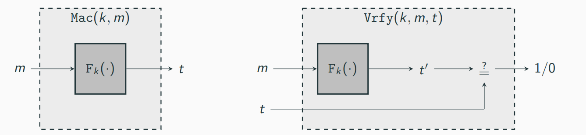

If F is a pseudorandom function, then this construction is a secure fixed-length MAC for messages of length n.

### Distinguisher D

D is given input 1^n and access to Oracle O: {0,1}^n -> {0,1}^n, and words as follows:

1. Run A(1^n). Whenever A queries its MAC oracle on a message m(i.e., whenever A request a tag on a message m), answer this query in the following way:

Query O with m and obtain response t; return t to A.

2. When A outputs (m,t) at the end of its execution, do:

2.1 Query O with m and obtain response t'. 2.2 If (1) t' = t and (2) A never queried its MAC oracle on m, the output 1; otherwise, output 0.

## Domain Extension for MACs

Construction shows a general paradigm for message authentication codes form pseudorandom functions

Limirations: only messages of fixed-length can be handled, which is unacceptable for most apllications

Next step: Construct a MAC handling arbitary-length messages from a fixed-length MAC -> the construction is not very effictient

Let П' = (Mac', Vrfy') be a secure fixed-length MAC for messages of length n

## Authenticated Encryption

A private-key encryption scheme is an authenticated encryption (AE) scheme if it os CCA-secure and unforgeable.
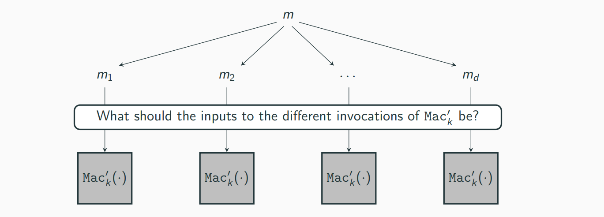

## Authenticated Encryption Schemes

1. Encrypt-and-authenticate
2. Authenticate-then-encrypt
3. Encypt-then-authenticate

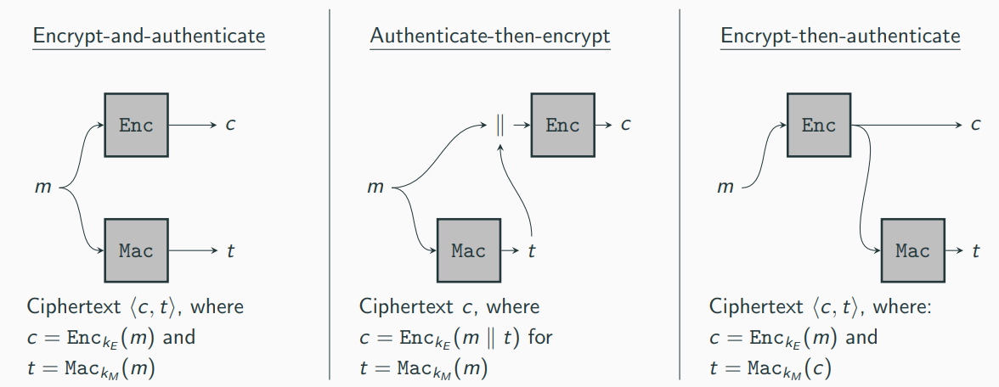

### Hash functions 

Hash function take inputs of some length and compress them into short,fixeed-length outputs Classical use-case (non-cryptographic hash functions): data structures

- Store elements in a table based on their hash value
- To look for an enry x, one needs only to probe row H(x) of the hash table
- A 'good' hash functions has few collisions (which increase look-up time)

Collison-resistant hash functions (cryptographic hash functions) are similar, but with fundamental differences:

- collisions need to be avoided (rather than minimized)
- Adversaries can select inputs with the sole purpose to cause collisions

A hash functions (with output length l(n)) is a pair of probabilistic polynomial-time algorithms H = (KGen, H) satisfying the following:

- KGen is a probabilistic algorithm that takes as input a security parameter 1^n and outputs a key s. We assume that n is implicit in s.
- H is a deterministic algorithm that takes as input a key s and a string x ∈ {0,1}* and outputs a string H^s(x) ∈ {0,1}^l(n) (where n is the value of security paramater implicit in s).

## Unkeyed hash functions 

In practice, cryptographic hash functions are generally unkeyed

Problematic from a theoretical point of view -> there is always a constant-time algorithm that outputs a collsion for H: Algorithm that has a colliding pair hardcoded and simply outputs it

In practice still sufficient because colliding pairs for real-world hash functions are hard to find.

## Weaker Notions of Security

In some applications, weaker forms of security can be sufficient Other security notions that are considered sometimes:

Second-preimage resistance: Informally, a hash function is said to be second-preimage resistant if given s and a uniform x it is infeasible for a PPT adversary to find x' != x such that H^s(x') = H^s(x)

Preimage resistance: Informally, a hash function is preimage resistant if given s and y = H^s(x) for a uniform x, it is infeasible for a PPT adversry to find a value x' (whether equal to x or not) with H^s(x') = y.

Implications:

- Collision resistance -> second-preimage resistance
- Second-preimage resistance -> preimage resistance (under additional requirements)

## The Merkle-Damgard Transform

In many applications, we require hash functions accepting very long or even arbitary long inputs

It is not immediately clear how we can construct such functions

It is easier to construct a fixed-length hash function (a compression function)

The Merkle-Damgard transforms converts a compression function into a hash function

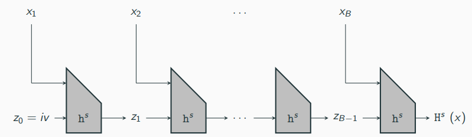

## HMAC

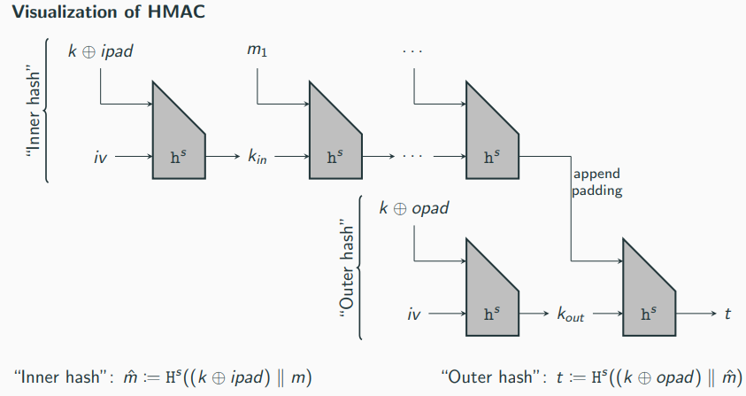

## Substitution-Permutation Networks

A substitution-permutation network (SPN) can be viewed as an implementation of the confustion-diffusion paradigm

Evaluating the cipher proceeds in a series of rounds, each of which consists of the following sequence of operations to the input x of that round:

1. Key mixing: Set x := x xor k, where k is the current-round sub-key;
2. Substitution: Set x:= S1(x1)|| ... || S8(x8), where x_i is the ith byte of x;
3. Permutation: Permute the bits of x to obtain the output of the round.

Input to the cipher is the input to the first round

Output of a round is the input to the next round

After the final round, a final key-mixing step is applied and the result is the output of the cipher -> without this, step 2 (substitution) and step 3(permutation) of the last round do not provide more security as they can be inverted without the key -> By Kerckhoffs' principle, the S-boxes and mixing permutation(s) are assumed to be public

An r round SPN has:

- r rounds of key mixing, S-box substitutions, and applications of a mixing permutations
- l (final) key mixing step

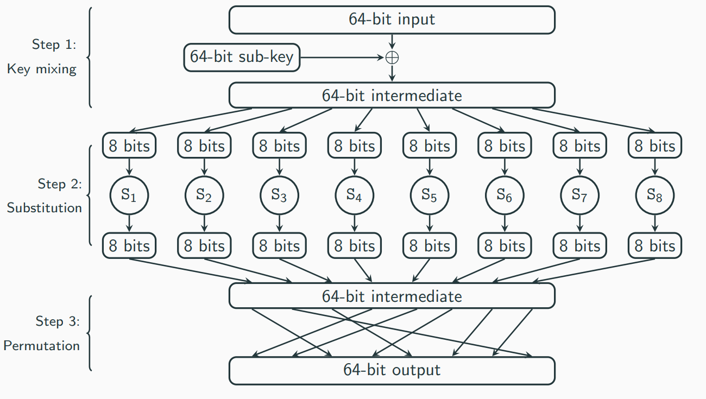

An SPN is invertible (given the key):

- If each round is invertible, one can invert the whole SPN round-by-round
- Inverting each round:
    - (Step 3) Mixing permutation can easaily be inverted as it just shuffles the bits
    - (Step 2) S-boxes are permutations, hence also invertible
    - (Step 1) XORing the correct sub-key then yields the original input

## The avalanche effect

Idea: small changes in the input must "affect" every bit of the output

How can we ensure the avalanche effect in a substitution-permutation network?

Ensure that the following two properties hold (and sufficiently many rounds are used):

1. The S-boxes are designed so that changing a single bit of the input to an S-box changes at least two bits in the output of the S-box
2. The mixing permutations are designed so that the bits output by any given S-box affect the input to multiple S-boxes in the next round
For a 129-bit block length, at least 7 rounds are needed to guarantee that all output bits are "affected"

-> only a lower bound; if less than 7 rounds are used there are some output bits that are not affected by a single-bit change in the input (which implies that ine can distinguish the cipher from a random permutation)

## Feistal Networks 

A substitution permutation networks constructs a permutation from invertible components

A Feistel network constructs a permutation from non-invertible components

In a (balanced) Feistel network with l-bit block length, the ith round function f_i takes as input a sub-key k_i and an l/2-bit input and outputs an l/2-bit output

When some master key k, which defines sub-keys k_i for each round, is chosen, define

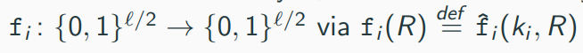

The ith round of a Feistel network works as follows:

1. the l-bit input is split into two halves denoted by L_(i-1) and R_(i-1)
2. the output is (L_i, R_i), where L_i:= R_(i-1) and R_i:= L_(i−1) ⊕ f_i(R_(i−1))

## Key-Distribution Centers

Some of the problems can be solved using a key distribution center (KDC)

Consider the scenario of a large corporation where all pairs of empolyees must be able to communicate securely

We can assume that the employees trust some entity, e.g., the system administrator - at least regarding work-related communication

This trusted party can act as a KDC:

- whenever a new employee joins the corporation, it receives a key shared between the employee and the KDC
- when an employee wants to communiczte with another employee, it can request a (session) key from the KDC

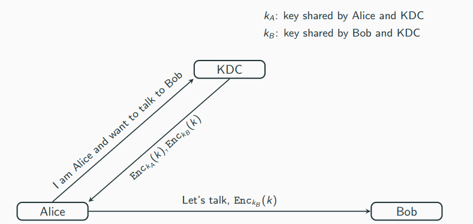

Advantages:

- Each employee needs to store only one long-term key (the one shared with the KDC); session keys are short-term that can be erased after the session
- For each new employee only that employee must set up a key with the KDC; no other employee needs to do anything

Disadvantages:

- The KDC is a high-value target: a successful attack on the KDC will result in a complete break of the system
- The KDC is a single point of failure: if the KDC is offline, secure communication is themporarily impossible -> KDC is a high-value

## ElGamal Encryption

The following lemma is an important result for the ElGamal encryption scheme

Let G be a finite group, and let m ∈ G be arbitary. Then choosing uniform k ∈ M and setting c:= k * m, results in a uniformly distributed c ∈ G, Put differentlym dir any c^ ∈ G, we have

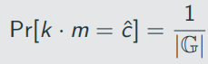

where the probability is taken over uniform choice of k ∈ G

Let c^ ∈ G be arbitary. Then

Since k is uniform, the probability that k is equal to the fixed element c^ * m^(-1) is exacly 1/|G|

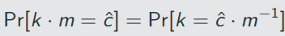

Lemma 12.15 effectively gives a perfectly secret private-key encyrption scheme:

- The key k is a uniform element k ∈ G
- To encrypt m, Alice cpmputes c:= k * m
- To decrypt c, Bob computes m:= c/k

-> the one-time pad is an instation of this, where G = {0,1} ^ l and the group operation is bit-wise XOR

The ElGamal encryption essentially adds a way for Alice and Bob to generate this shared "random-looking" value k via a public channel

Let G be as before. Define a public-key ecnryption as follows:

- KGen: on input 1^n run G(1^n) to obtain (G, q ,g). Then choose a uniform x ∈ Z_q and compute h:= g ^ x. The public key is ⟨G, q, g, h⟩ and the private key is ⟨G, q, g, x⟩. The message space is G.

- Enc: on input a public keu pk = ⟨G, q, g, h⟩ and a message m ∈ G, choose a uniform y ∈ Z_q and output the ciphertext

⟨g^y, h^y * m⟩

- Dec: on input a private key sk = ⟨G, q, g, x⟩ and a ciphertext ⟨c1, c2⟩, output
m^:= c2/ c1^x

Correctness: Let ⟨c1, c2⟩ = ⟨g^y, h^y * m⟩ with h = g^x. Then

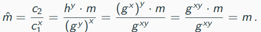

If the DDH problem is hard relative to G, then the ElGamal encryption scheme is CPA-secure.

We show that

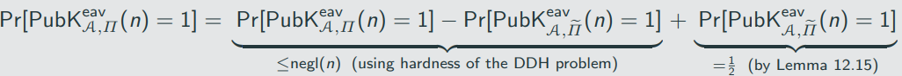

where П~ is a modified "ecnryption scheme", where a ciphertext is computed as

⟨g^y, h^y * m⟩,

for uniform y,z ∈ Z_q

(Note that П~ is not an actual ecnryption scheme as the receiver has no way if decrypting a ciphertext, which does not matter for the proof as the experiment solely depends on the key generation and encryption)

### Distinguisher D

The algorithm is given (G, q, g, h1, h2, h3) as input.

1. Set pk = ⟨G, q, g, h1⟩ and run A(pk) to obtain two messages m0,m1 ∈ G
2. Choose a uniform bit b, and set c1:= h2 and c2 := h3 * m_b
3. Given the ciphertext ⟨c1, c2⟩ to A and obtain an output bit b'. if b' = b, output 1; otherwise, output 0

Case 1: 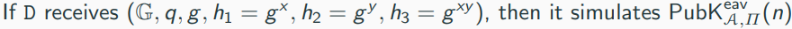

Case 2: 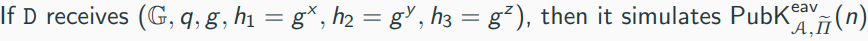

Thus we obtain the following equalities:
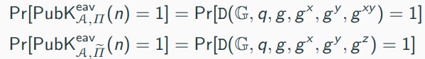

Hardness of the DDH problem then implies:

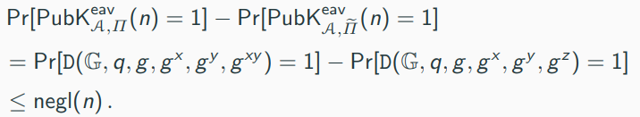

## Plain RSA encryption

We start with the so-called plain RSA encryption scheme, a simple (yet insecure) encryption scheme based on the RSA assumption

Recall GenRSA which on input security parameter 1^n outputs a moduli N (product of two primes p and q) along with e and d such that ed = 1 mod ϕ(N)

Plain RSA encryption:

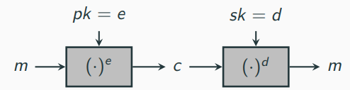

Let GenRSA be as before. Define a public-key encryption scheme as follows:

KGen: on input 1^n run GenRSA(1^n) to obtain N, e and d. The public key is ⟨N, e⟩ and ptivate key is ⟨N, d⟩.

Enc: on input a public key pk = ⟨N, e⟩ and a message m ∈ Z*_N compute the ciphertext

c:= [m^e mod N].

Dec: on input a private key sk = ⟨N, d⟩ and a ciphertext c ∈ Z*_N, output the message
m:= [c^d mod N]

Say GenRSA outputs (N, e, d) = (391, 3, 235). (Note that 391 = 17 * 23 and so ϕ = 16 * 22 = 352. Moreover, 3 * 235 = 1 mod 352) So the public key is ⟨391, 3⟩ and the private key is ⟨391, 235⟩.

To ecnrypt the message m = 158 ∈ Z*_391 using the public key (391, 3), we simply compute c:= [158^3 mod 391] = 295; this is the ciphertext, To decrypt, the receiver computes [295^235 mod 391] = 158.

# Experiments:

## Perfect (adverarial) indistinguishability experiment  

1. The adversary A outputs a pair of messages m0,m1 ∈ M.
2. A key k is generated using KGen, and a uniform bit b ∈ {0,1} is chosen. Ciphertext c <- Enc_k(m_b)
3. A outputs a bit b'
4. The output of the experiment is defined to be 1 if b' = b, and 0 otherwise. We write  = 1 if the output of the experiment is 1 and in this case we say that A succeeds.

Encryption Scheme П = (KGen, Enc, Dec) with message space M is perfectly indistinguishable if for every A it holds that

Encryption scheme П = (KGen, Enc, Dec) is perfectly secret if an only if it is perfectly indistinguishable.

## The adversarial indistinguishability experiment 

1. The adversary A is given input 1^n, and outputs a pair of messages m0, m1 with |m0| = |m1|.
2. A key k is generated by running KGen(1^n), and a uniform bit b ∈ {0,1} is chosen. Ciphertext c <- Enc_k(m_b) is computed and given to A. We refer to c as the challenge ciphertext.
3. A outputs a bit b'.
4. The output of the experiment is defined to be 1 if b' = b, and 0 otherwise. We write  if the output of the experiment is 1 and in this case we say that A succeeds.

A private-key encryption scheme П = (KGen, Enc, Dec) has indistiguishable encryptions in the presence of an eavsdropper, or is EAV-secure, if for all robabilistic polynomal-time adversaries A there is a negligible function negl such that, for all n,

The probability above is taken over the randomness used by A and the randomness used in the experiment(for choosing the key and the bit b, as well as any randomness used by Enc)

A private=key encryption scheme П = (KGen, Enc, Dec) has indistinguishable encryptions in the presence of an eavesdropper if for all PPT adversaries A there is a negligible function negl such that

## The adversarial indistinguishability experiment  :

1. A key k is generated by running KGen(1^n)
2. The adversary A is given input 1^n and oracle access to Enc_k(.), and outputs a pair of messages m0,m1 of the same length
3. A uniform bit b ∈ {0,1} is chosen, and then a ciphertext c <- Enc_k(m_b) is computes and given to A.
4. The adversary A continues to have oracle access to Enc_k(.), and outputs a bit b'
5. The output of the experiment is defined to be 1 if b' = b, and 0 otherwise. In the former case, we say that A succeeds.

A private-key encryption sheme П = (KGen, Enc, Dec) has indistiguishable encryptions under a chosen-plaintext attack, or is CPA-secure, if for all PPT adversaries A there is a negligible function negl such that

where the probability is taken over the randomness used by A, as well as the randomness used in the experiment

We use a slightly different approach here, which allows the adversary to adaprtively choose pairs of plaintexts to be encrypted

"Lefr-or-Right" oracle LR_k,b(.,.): on input a pair of equal-lenth messages m0,m1, the oracle computes c <- Enc_k(m_b) and returns c

1. A key k is generated by running KGen(1^n)
2. A uniform bit b ∈ {0,1} is chosen.
3. The adversary A is given input 1^n and oracle access to LR_k,b(.,.) as defined above.
4. The adversary A outputs a bit b'
5. The output of the experiment is defined to be 1 if b' = b, and 0 otherwise. In the former case, we say that A succeeds.

Any private-key encryption scheme that is CPA-secure is also CPA-secure for multiple encryptions.

##  The adversarial indistinguishability experiment :

1.  A key k is generated by running KGen(1^n).

2. The adversary A is given input 1^n and oracle access to Mac_k(·). The adversary eventually outputs (m, t). Let Q denote the set of all queries that A submitted to its oracle.

3. A succeeds if and only if

    i. Vrfy(k,m,t) = 1 and
    ii. m !∈ Q In that case the output of the experiment is defined to be 1.

A message authentication code П = (KGen, Mac, Vrfy) is existentially unforgeable under an adaptive chosen-message attack, or just secure, if for all probabilistic polynomial-time adversaries A there is a negligible function negl such that

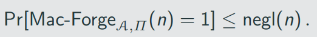

One might object that the definition is too strong:

1. the adversary can ask for tags for any messag eof its choice
2. the adversary succeeds if it find a tag for any previously inauthenticated message.

## The CCA indistinguishability experiment 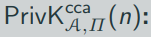:

1. A key k is generated by running KGen(1^n).
2. The adversary A is given input 1^n and oracle access to Enc_k(·) and dec_k(·). It outputs a pair of equal-length messages m0, m1.
3.  A uniform bit b ∈ {0, 1} is chosenm and then a challenge ciphertext c <- Enc_k(m_b) is computed and given to A.
4. The adversary A continues to have oracle access to Enc_k(·) and Dec_k(·), but is not allowed to query the latter on the challenge ciphertext itself. Eventually, A outputs a bit b'
5. The output of the experiment is defined to be 1 b' = b, and 0 otherwise. If the output of the experiment is 1, we say that A succeeds.

A private-key encryption scheme П = (Kgen, Enc, Dec) has indisnguishable encryptions under a chosen-ciphertext attack, or is CCA-secure, if for all probabilistic polynomial-time adversaries A there is a negligible function negl such that

Adversary A in the CCA experiment:

1. choose m0 = 0 ^ n and m1 = 1 ^ n
2. receive c = ⟨r,s⟩
3.  flip the first bit of s and ask for a decruption of the resulting ciphertext c' -> (this query is allowed as c' !=c )
4. The response is either 10 ^ (n-1) (if m0 was encrypted) or 01 ^ (n - 1) (if m1 was encrypted)

CCA-security is a very strong requirement -> Any encryption scheme where ciphertext can be "manipulated" in a contolled way cannot be CCA-secure

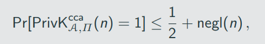

where the probability is taken over the randomness used by A, as well as the randomness used in the experiment

## The unforgable ecryption experiment 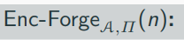:

1. A key k is generated by running KGen(1^n)
2. The adversary A is given input 1 ^ n and access to an encryption oracle Enc_k(·). The adversary eventually outputs a ciphertext c. Let m:= Dec_k(c) and let Q denote the set for all queries that A submitted to its oracle.
3. A succeeds if and only if (1) m != ⊥ and (2) m !∈ Q. In that case the output of the experimatn is defined to be 1.

A private-key encryption scheme П is unforgeable if for all probabilistic polynomial-time adversaries A there is a negligible function negl such that

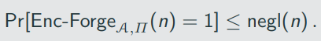

## The collision-finding experiment Hash-coll A,H(n):

1. A key s is generated by running KGen(1^n)
2. The adversary A is given s, and outputs x, x'. (If H is a fixed-length hash function for inputs of length l'(n), then we require x,x' ∈ {0, 1}^(ℓ′(n)))
3. The output of the experiment is defined to be 1 if and only if x != x' and H^s(x) = H^s(x'). In such a case we say that A has found a collision

A hash function H = (KGen, H) is collision resistant if for all probabilistic polynomial-time adversaries A there is a negligible function negl such that
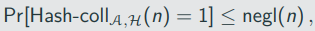

## The key-exchange experiment :

1. Two parties holding 1^n execute protocol П. This results in a transcript trans containing the messages sent by the parties, and a key k output by each of the parties
2. A uniform bit b ∈ {0,1} is chosen. If b = 0, set k^:= k, and if b = 1 then choose uniform k^ ∈ {0,1}^n.
3. A is given trans and k^, and outputs a bit b'/
4. The output of the experiment is defined to be 1 if b' = b, and 0 otherwise. (in case 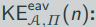 = 1, we say that A succeeds)

A key-exchange protocol is secure in the presence of an eavesdropper if for all probabilistic polynomial-time adversaries A there is a negligible finction negl such that

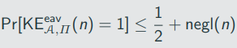

## Diffie-Hellman key-exchanging protocol

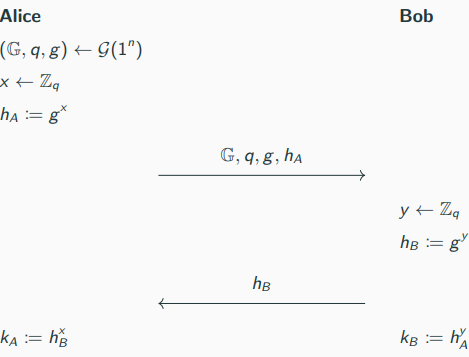

## Uniform group elements vs. uniform bit-strings

- Alice and Bob can apply a key-derivation function to their shared secret g^(xy) to obtain a bit-string that is indistinguishable from random to be used as a key for subsequent cryptographic application

## Active adversaries

- We stress that the Diffie-Hellman protocol in the presented variant is only secure against eavsdropping adversaries
- It is completely insecure against man-in-the-middle attack
# Private-key Encryption

## Historic Ciphers  

### Caesar's cipher
  - One of the oldest recorded cipher
  - Letters of the alphabet were shifted by 3 places orward: a was repklaced by D, b was replaced by E, and so on
  - For example: kosntanz -> NRQVWDC
  - Problem: cipher method is fixed; there is no key; fails to achieve Kerckhoffs principle

### Shift cipher
- A keyed variant of Caesar's cipher
- Key k is a number between 0 and 25
- Encryption workds by shifting letters by k places
- Decryption works by shifting letters by j places backwards

#### Example 

Consider the shift cipher 

K = {0,...,25} with Pr[K = k] = 1/ 26 for each k ∈ K 

Say the distribution over M is as follows 

Pr[M = a] = 0.7 and Pr[M = z] = 0.3

Probability that the ciphertext is B? There are two possibilites: either M = a and K = 1, or M = z and K = 2 

By independence of K and M, we have 

Pr[M = a ^ K = 1] = Pr[M = a] * Pr[K = 1] = 0.7 * 1/26

Similary, we have

Pr[M = z ^ K = 2] = Pr[M = z] * Pr[K = 2] = 0.3 * 1/26

Therefore

Pr[C = B] = Pr[M = z ^ K = 2] + Pr[M = a ^ K = 1] = 0.7 * 1/26 + 0.3 * 1/26 = 1/26

What is the probability that message a was encrypted, given that we observe ciphertext B?

Pr[C = c] = sum(Pr[M = m ^ K = k])

What is the probability that message ann was encrypted, given that we observe ciphertext DQQ? Using Bayes’ Theorem yields

Pr [M = ann | C = DQQ] = (Pr[C = DQQ | M = ann] * Pr[M = m]) / Pr [C = DQQ] = ( 1 * 1/26 * 0.2) / (1/52) = 0.4

## Mono-alphabetic substituion cipher

Attack possible using statical properties of the English language (we assume the encrypted text is some gramatically correct english text) The attack relies on two facts:

1. For any key, the mapping of each letter is fixed; if e is mapped to D, every appearance of e will result in an appearance of D
2. The frequency distribution of letters in English texts is known

## The Vigenere cipher 

## One Time pad

Construction

Fix an integer l > 0. The message space M, key space K, and ciphertext space C are all equal to {0,1}^l(the set of all binary strings of length l).

KGen: the key-generation algorithm chooses a key from K = {0,1}^l according to the uniform distribution (i.e., each of the 2^l string in the space is chosen as key with probability exactly 2^-l) Enc: given a key k ∈ {0,1}^l and a message m ∈ {0,1}^l, the encryption algorithm outputs the ciphertext c:= k ⊕ m Dec: given a key k ∈ {0,1}^l and a ciphertext c ∈ {0,1}^l, the decryption algorithm outputs the message m:= k ⊕ c

Problems/limitations of the OTP

- key is as long as the message
-  Only secureif the key is used once
    - of m and m' are encrypted using k, yielding c and c', respectively, then c ⊕ c' = (m ⊕ k) ⊕ (m' ⊕ k) = m ⊕ m'

## Pseudorandom OTP

Let G be a pseudorandom generator with expansion dactor l(n). Define a fixed-length private-key encryption scheme for messages of length l(n) as follows:

- KGen: in input 1^n, choose uniform k ∈ {0,1} ^ n and output it as the key.
- Enc: on input a key k ∈ {0,1} ^ n and a message m ∈ {0, 1} ^ l(n), output the ciphertext

c:= G(k) xor m

Dec: on input a key k ∈ {0,1} ^ n and a ciphertext c ∈ {0,1} ^ l(n), output the ciphertext

m:= G(k) xor c

If G is a pseudorandom generatotm then Construction 3.17 is an EAV-secure, fixed-length private-key encryption scheme for length l(n).

## Electronic Code Book (ECB) mode

Encryption:

1. For i = 1 to l, compute c_i := F_k(m_i)
2. Set c := F_k(m1), F_k(m2), ..., K_k(m_l)
- A naive mode of operation
- Encryption is ddeterministic and hence not CPA-secure -> repeated plaintext blocks result in repeated ciphertext blocks

## Cipher Block Chaining (CBC) mode

Encryption:

1. Choose ic uniformly at set c0:= iv
2. For i = 1 to l, compute 
3. Set c:= iv, c1,...,c_l

- CBC encryption is randomized and one can show:

If F is a pseudorandom permutation, then CBC mode is CPA-secure.

Disadvantage of CBC mode: ciphertext blocks have to be computed sequentially (not parrallelizable)

## Chained CBC mode

- A stateful variante of CBC mode (used in SSL 3.0 and TLS 1.0)
- Use the last block of previous ciphertext block as IV for the next message
- It appears to be as secure as CBC mode, but it is not CPA-secure

## Output Feedback (OFB) mode

Encryption: 

1. Choose ic uniformly at set y_0 := iv
2. For i = 1 to l, compute y_i := F_k(y_(i-1))
3. For i = 1 to l, compute c_i := y_i xor m_i
4. Set c := iv, c1,...,c_l

- For OFV, F does not need to be a permutation
- Stateful variant of OFB is secure (y_L is used as IV for next message)
- Encryption is again sequentially but the coslty part (evaluating F) can be done independent of the message

## Couter (CTR mode)

Encryption:

1. Choose iv uniformly from {0,1} ^ (3n/4)
2. For i = 1 to l, compute y_i := F_k (iv ∥ ⟨i⟩)
3. For i = 1 to l, compute c_i := y_i xor m_i
4. Set c:= iv, c1,...,c_l
Ctr mode is fully parallelizable

If F is a pseudorandom function, then CTR mode is CPA-secure for multiple encryptions.

## MACs 

A message authentication code (or MAC) consis of three probabilistic polynomial-time algorithms (KGen, Mac, Vrfy) such that:

1. The key-generation algorithm KGen takes as input the sectuiry parameter 1^n and outputs a key k with |k|>= n.

2. The tag-generation algorithm Mac and a message m ∈ {0,1}*, and outputs a tag t. Since this algorithm may be randomized, we wirte this as t <- Mac_k(m)

3. The deterministic verification algorithm Vrfy takes as input a key k, a messag m, and a tag t. It outputs a bit b, with b = 1 meaning valid and b = 0 meaning invalid. We wite this as b:= Vrfy_k(m,t)

It is required that for every n, every k putput by KGen (1^n), and every m ∈ {0,1}*, it holds that Vrfy_k(m, Mac_k(m)) = 1.

If there is a function l such that for every key k output by KGen(1^n), algorithm Mac_k is only defined for messages m ∈ {0,1} ^ (l(n)), then we call the scheme a fixed-length MAC for messages of length l(n).

As with private-key encryption, KGen(1^n) almost always output a uniform k ∈ {0,1}^n

For deterministic MACs (meaning Mac is deterministic), canonical verification works by letting Vrfy re-compute the tag and compare. More preciselym Vrfy_k(m, t):

1. computes t' := Mac_k(m)
2. Outputs 1 if t' = t

# Public-Key Encriptions
## RSA-FDH
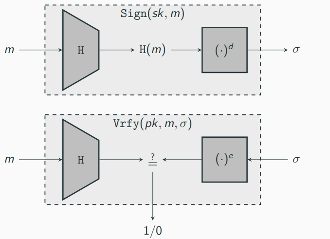
Let GenRSA be as before, and construct a siganture scheme as follows:

- KGen: on input 1^n run GenRSA(1^n) to obtain (N, e, d). The public key is ⟨N, e⟩ and the private key is ⟨N, d⟩. As part of key generation, a function H: {0, 1}* -> Z*_N is specified, but we leave this implicit.
- Sign: on input a private key sk = ⟨N, d⟩ and a message m ∈ Z*_N, compute 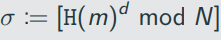
- Vrfy: on input a public key pk = ⟨N, e⟩, a message m ∈ Z* _N, and a singature σ ∈ Z*_N, output 1 if and only if 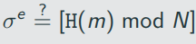

What properties does H has to specify for RSA-FDH to be secure?

- H has to be hard to invert -> absence of this enables the first attack discussed above
- H must not admit "multiplicative relations", meaning it should be hard to find m, m1, m2 with H(m) = H(m1) * H(m2) mod N -> absence of this enables the second attack discussed above
- H must be collision resistant -> absence of this allows for forgery attacks as colliding messages have the same signatures

# Attacks

## MAC  

### Replay attack

The above definition does not protect against replay attacks, where an adversry sends again ("replays") previosuly authenticated messages

This does not mean that replay attacks are not a security concern

- Assume that Alice issues a transaction sending 1.000$ to Bob
- Bob cannot modify the amount to 10.000$(this is a new message and would require breaking the MAC according to the above definition)
- Bob can, however, just repeat the messag ea total of ten times. From point of view of the bank, it looks like Alice wants to transfer 1.000$ to Bob ten times

Crucial observation: since verification is stateless, every valid pair (m,t) will always result in Vrfy_k(m, t) outputting 1

Security against replay attacks has to be hadled on the application leve -> one commons method is to use timestamps

### Block re-ordering attack

If ⟨t1,t2⟩ is a valid tag for message m1, m2(with m1 != m2), then ⟨t2,t1⟩ is a valid tag for message m2,m1

### Truncation attack

Adversary can simply drop blocks from the end of the message and tag

### "mix-and-match" attack

Tags ⟨t1, . . . ,td ⟩ and ⟨t'1, . . . ,t'd ⟩ for message m1,...,md and m'1, ..., m'd, respectively -> ⟨t1, t'2, t3, t'4⟩ is a valid tag for message m1, m2', m3, m4', ...

## CCA 

### Padding-Oracle Attacks

Scenario:

- Client sends messages encrypted using CBC-mode to a server
- Adversary can impersonate client and send ciphertexts to the server
- Adversary can tell if decrypted messages are valid or not 

### Encrypt-and-authenticate

Secure? No. Reason: Tag t might reveal the entire message

### Authenticate-then-encrypt

Secure? No. Reason: Padding Oracle Attack. Assume that there are different error messages for padding errors and authentication errors: Dec'_(k_E, k_M)(c):

1. Compute m~:= Dec_k_E(c). If an error in the padding is detected, return "bad padding" amd abort
2. Parse m~ as M || t. IF Vrfy_k_M (m,t) = 1, return m; else, return "authentication failure".

### Encrypt-then-authenticate

Secure? Yes

What happens when we do not use independent keys?

Consider encrypt-then-authenticate from above but using the same k for encryption and authentication, i.e. k = k_E = k_M

Let F be a strong pseudorandom permutation, which inplies that F^(-1) is a strong pseudorandom permutation as well

Define Enc_k(m) = F_k(m || r) for m ∈ {0, 1} ^ n/2 and a uniform r ∈ {0, 1} ^ n/2 -> (this can be shown to be a CPA-secure)

Define Mac_k(c) = F^ (-1)(c);

However, using these two primitives with the same key following the encrypt-then-authenticate methodology, encryption of a message m yields

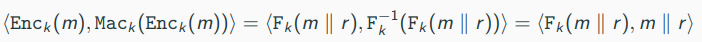

-> The ciphertext reveals the message in the clear!

The previous example shows that using independent keys is important

Basic principle of cryptography:

Different instances of cryptographic primitives should always use independent keys

## HMAC

### The birthday problem

O(2^(l/2)) better than brutte-force

## RSA Signatures

No-Message-Attack:

1. choose σ ∈ Z*_N
2. compute m := [σ^e mod N]
3. output (m, σ)

Verification: obvious

Forgery for arbitary message m:

1. Choose m1, m2 ∈ Z*_N distinct from m such that m = m1*m2 mod N
2. get signatures σ1 and σ2 for m1 and m2, respectively (-> two queries to oracle Sign)
3. output σ:= [σ1, σ2 mod N] as a signature of m

To avoid this attack (and the no-message attack from before), we can apply some transformation to the message before singing them -> this yields RSA full-domain hash (RSA-FDH)