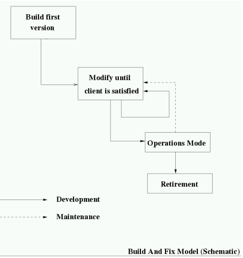
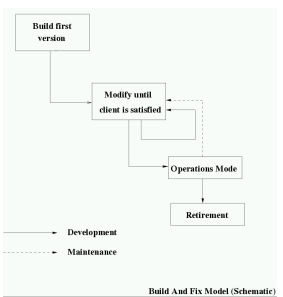

# The Disciple of Software Engineering

## The Importance of Software

### What is Software

- "All or part of the programs, procedures, rules, and associated document of an information processing system."
- Collection of programs which collaboratively provide a system service

### Importance of Software Systems

- Software is a determining, if not the most determining, technology in most system development projects

### Conclusion

Software is the material of the (post-)industrial information and knowledge society

## What is Softwate Engineering?

### Engineering 

- Engineering profession devoted to designing, constructing, and operating the structures, machines and other devices of industry and everyday life

### Characteristics of an Engineering Disciple

- Well-understood technologies
- Well-defined processes
- Predictability of process stage results
- Repeatability of process steps

### Attempts to define the term "Software Engineering"

- Multi-persoin construction of multi-version software

- (1) The application of a systematic, disciplined, quantidiable approach to the development, operation, and maintenance of software: that is, the application of enginnering to software.
- (2) the study of approaches as in

### Software-"Crisis"

- "software crisis" or the "software gap" between what was hoped for from a complex software system, and what was typically achieved.

### Types of Software Problems

- Failure of software projects
    - aborted projects
    - projects overrunning budget and time limits
    - do not deliver required functionality
- Failures of software systems
    - failures causing inconvenience and cost
    - failures threatening human life and/or the inviroment

### IEEE Computer Society

- professional association, not only software engineering
- purpose and scope is "to advance the thoery, practice, and application of computer and information processing science and technology"
- IEEE Transactions on Software Engineering
- IEEE Software

### ACM Assosiation for Computing Machinery
- professional association
- SIGSOFT Special Interest Group on Software Engineering
    - ESEC/FSE and ICSE conferences

## Software Errors, Faults and Failures

### Error

- A human action that produces an incorrect result, such as software containing a fault

### Fault

- 1. A manifestation of an error in software
- 2. An incorrect step, process, or data definition in a computer program. Syn: bug.
    - notice: may lead to the program to eventually enter an undesired state

### Failure

- 1. Termination of the ability of a product to perform a required function or its inability to perform within previously specified limits. 
- 2. An event in which a system or system component does not perform a required function within specified limits
    - Observed deparure of a system from its required (specified) behavior
    - failure may be observed a lot later than the occurrence of a fault

- Failures in software engineering, there are two things that can fail:
    - Software development projects
    - Software artefacts (Systems)

### An Ethical Perspective

- Software-controlled Safety Critical Systems
    - Safety-Critical System
    - failure threatens human life, or the enviroment
    - Examples:
        - software in automobiles ("drive by wire")
        - software in aircraft ("fly by wire")
        - software in train systems
        - software in trafffic control systems
        - software in medical systems
        - software in telecommunications systems
            - failure may affect emergency call and dispatch systems
    - increasing ubiquity of software controlled hardware systems increses reliability demands
    - typicall reliability requirements of safety-critical systems
        - reliability of  10 ^ -9
            - probability of failure per hour of operation < 10 ^ -9
            - one system failure every 10^9 hours (appr. 114,000 years)

### Summary: Symptoms of Software Crisis/Affliction

- Software products are being delivered late
    - mounting software costs
- Software projects exceed budget
    - mounting software costs
    - wasting of resources
- delivered software often does not really do what it is supposed to do
    - cost of inefficient use
    - challenge to human life or the enviroment
- software products are defective when delivered
    - cost of failures
    - cost of maintenance
    - ethical considerations (safety critical systems)
- large projects get abandened before delivery of a product
    - wasting of resources

## Software as an Engineering Artefact

### Characteristics of Software

- Software is engineered, not manufactured
    - mostly custom built
    - little component assembly
    - human intense production process
- Software does not wear out
    - but it deteriorates due to
        - change to accommodate changing requirements
        - changes in the enviroment software is executing in (hardware, operating system, etc.)

- Software is determining system factor
    - in techincal systems, determines up to 80% of development effort
    - total worldwide annual expenditure for software developmemt
        - 1985: $140 billion
        - 2000: $800 billion
    - compare with microelectronics sector: appr. $200 billion in 2001

- Software is complex
    - Current software artifacts are large and highly complex
    

- Or why is software inherently so difficult to produce?

    - 1. No similar system ever built before.
        - problem never solved before
        - solution may be unknown
        - assumptions about the system's enviroment may be guesses
        - difficulties to estimate time and number of people needed to complete project
        - example: baggage handling system at Intl. Airport
    - 2. Requirements are not well understood
        - "... behavior A for a total of less than 5 active threads, behavior B for more than 5 different active threads..."
        - which behavior for 5 active threads?
    - 3. Requirements change during the software life cycle
        - customers typically do not exactly know what capabilities they expect of a new system until they see an initial version or prototype

    - 4. Complex interactions amongst services and components
        - Call forwarding vs. call screening
        - reverse thrust deployment vs. in-flight avoidance
            - one contributing factor to a lufthansa crash in 1992
    
    - 5. Nature of systems
        - concurrent systems: races, deadlocks, etc.
        - embedded systems: hardware interactions, timing
        - information systems: complexity, legacy

    - 6. Software is easily malleable
        - lends itself to "code-and-fix"

        

    - 7. Software is a discrete artifact

        - consequences
            - correctness cannot be approximated
            - partial tests can only produce correctness claims with limited validity
        - comparison to continous artifacts
            - suspension bridge cable in which 1% of the wires are faulty
            - program in which 1% of statements are faulty
        

### Consequences

- attempt to base the software production on an engineering approach, with well-defined inputs, we defined methods, and well-defined results
- design software engineering as a process that supports
    - correctness and dependability of the software product
    - cost-effectiveness of the production of software
    - the complexity of the software artefact
    - the longevity of the software production life cycle, in particular changes in requirements and enviroment
    - communication amongst the stakeholders
- definition of software engineering process models

### Importance of Communication in SW development projects

- involved parties, called stakeholders, in software development projects
    - customers
    - end users
    - software desingers
    - software development contractors
    - software test personnel (quality assurance)
    - auditors of certifying agencies (for safety critical software)
    - project managers
    - domain experts
    - marketing experts
    - ...

- consequence: enabling and facilitaning communication about the software artifact is a cenrtal goal of software engineering

## Software Engineering Processes

### First Software Engineering Measure
- Intorduction the concept of a software engineering process
    - definition of a process model encompassing necessary activities
    - covering all phrases of the life cycle, from inception of the idea to retirement to product
    - goal: rigorous application to all development projects 
    - definition of activities with well-defined inputs and outputs

### Build-and-Fix

- No process Steps
    - no requirements specification, dasign document, testing, etc.
    - no documentation for later testing and maintenance

- No separation of Concerns
    - teamwork impossible
    - everything implemented in one big chunk

- Unable to Deal with Complexity
    - may work for very small programs
    - not for any project of reasonable size

### Software Life-Cycle ACtivities

I. Software Requirements
- What is the software supposed to do?
- elication and negotiation
- modeling and analysis
- specification / documentation
- project planning

II. Software Design
- How is the software to achieve this goals
- Architectual / class design
- low-level / object design
- modelling documentation

III. implementation and integration
- coding
- unit testing
- component / system integration 

IV. Quality Assurance
- reviews
- verification / validation
- customer acceptance testing 

V. Operation and Maintenance 

- deployment / operation
- maintenance
- retirement

### Process Models

- Classical Process m