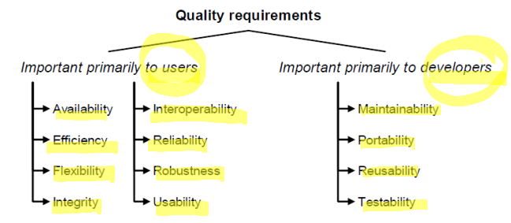
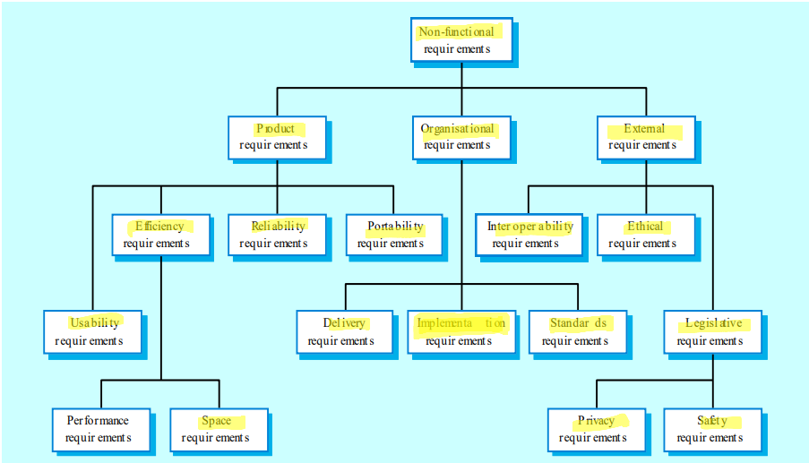
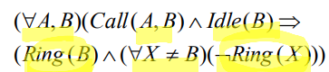
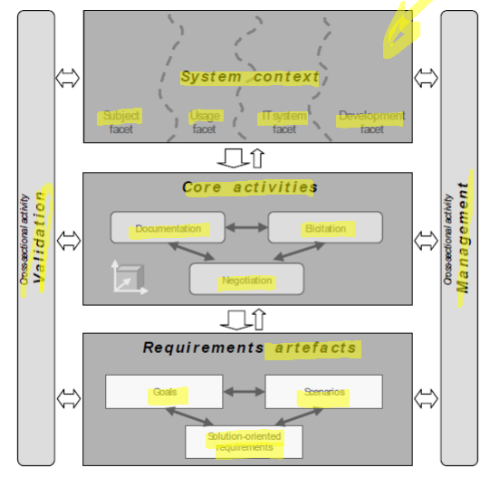

# Lecture 2

## Importance of Requirements Engineering

### System Design

- problem and system requirements
- feasibility study
- define main subsystems
    - allocate to hw/sw
- system design document
    - informal, with costumer
    - sometimes: user manuals, user interfaces and test plans defined

### SW Requirements Analysis and Specification

- "what" the system has to do, not how
- elicit software requirements describing expected observable external behavior
- edit software requirements document
    - Software Requirements Specification (SRS)
    - Lastenheft/Pflichtenheft

### Requirement

- "what"
- feature of the system or description of some system capability necessary to fulfill the purpose of the system, i.e. to provide its intended service
- standardized definition of a requirement:
    1. A condition or capability needed by a user to solve a problem or achieve an objective.
    2. A condition or capability that must be met or possessed by a system or system component to satisfy a contract, standart, specification, or other formally imposed documents
    3. A document representation of a condition or capability as in (1) or (2).

#### Example

- requirements for a smart home information system
    - R1: The system shall offer a user-friendly interface.
    - R2: The house information system shall generate a monthly report containing all granted and defined admittances to the house.
    - R3: If the PIN the user enters at the keypad is correct, the system shall open the door and record the granted access
    - R4: The system shall be available on the market by May 2006.
    - R5: The unlocking of the door shall happen within 0.8s after the PIN has been entered correctly.

### Classification to K.Pohl"
    - functional requirements
    - quality requirements
    - constrains
    - (non-functional requirements)

#### Functional requirements

- define services the system should provide
- behaviour of the system
- in some cases also what the system should not do
- examples:
    - R1: The airbag shall deploy in case of an accident
    - R2: The airbag shall not deploy unless a crash has been detected
    - R3: The house information system shall generate a monthly report containing all granted and defined admittances to the house.
    - R4: If the PIN the user enters at the keypad is correct, the system shall open the door and record the granted access; i.e. It should record the date and time, and the name of the PIN owner

#### Quality requirements

- define quality properties of the system, a component, a service or a function (e.g., perfomance)
- examples
    - R5: The system shall recover from an invalid API input.
    - R6: The system shall offer a user-friendly interface.
    - R7: The unlocking of the door shall happen within 0.8s after the PIN has been enterred correctly.

#### Constrains 

- an organisational or technological requirement that restricts the way in which the system shall be developed, e.g.:
    - the software for the Airbag Electronic Unit (ECU) shall be developed in accordance with the safery processes required by the ISO 26262 standard
    - the software for the Airbag ECU shall be completed and have successfully passed the acceptance testing three months prior to start of production
    - the software requirements specification (Pflichtheft/Lastenheft) document shall be editied in accordance with the German DIN 69906 standerd

#### Non-functional requirements

- type of requirements frequently used in the literature and in industrial practice
    - quality characteristics that the software solution must possess
- according to K. Pohl: term used in the literature, but non-functional requiremetns do not really exist
    - mainly underspecified functional requirements
    - few of them are quality requirements

### Alternative Classification (after Sommerville)

- Functional Requirements
    - statement which services the system shoul provide
    - interaction between system and enviroment
        - system states, input/output
    - how the system should behave in particular situations

- Non-functional Requirements
    - not primarily related to the system's functions/services themselves, but to the quality and additional characterics of the service
    - constrains on the servies / functions offered by the system
        - reliability (availibility, integrity, security, safety, etc.)
        - accuracy of results
        - perfomance / timing
        - human-computer interface issues
        - operating and physical contraints
        - portability and interoperability
        - standarts...

- Further Classification
    - user / system requirments
    - domain requirements
        - describe system characterics and features that reflect the domain
        - constrains on existing requirements 
        - define specific computations

### Conclusion

- RE is commonly accepted to the most important, critical and complex process in the software development process
- the RE process is pivotal, and his the highest impact on the capabilities of the emerging software product of any software lifecycle stage
- RE is important because it helps to define the purpose of any project by defining the constraints, specifying the process involved, and documenting both
- it is crucial to determine the mix of effective techiques to use for requirement elicitation and porpely document the process and the requirements to reduce the challenges and chances of failure
- RE should therefore be the starting point and backbone of any project or decision because
    - it helps to determine and focus on the objective
    - match the needs of stakeholders to the product development process, and
    - thereby increase the chances of achieving the best result

## Requirements Specification Properties

### Correctness

- all facts stated in the requirements specification represent required properties of the system to be designed
- counterexample (telephony system)
    - specification requires that callee receives a dial tone when the caller hangs up. while the system is supposed to provide a busy tone in this situation
- notice that this is different from the definition of (partial / total) program correctness!

### Unambiguity

- all facts stated in the specification have a single interpretation
- natural language desriptions are frquently ambiguous
- for up to 12 aircrafts on the control screen, the small display format is to be used, otherwise the large format is required
    - to satisfy the abstract system requirement to avoidance of clutter it is irrelevant whether this is interpreted as < 12 or =< 12
    - this may, however, lead to problems if both display formats are designed by different design teams, none of the two teams feels responsible for the case = 12 (empty display in that case?)

### Completness

- definition 1: every required property of the system is expressed in the specification
    - does this imply that the specification needs to include the description of behavior that is not permitted?
        - may be difficult to achieve due to large number of possible system behaviors
        - formal specification may help in this situation, e.g., 
         \
        however, there may be good reasons for allowing oher phones to ring... \
    
- definition 2: the responses of the software system on all types of possible input values are specified.
- further interpretations can be found in the literature

### Verifiability

- there exists an effective, either manual or automated procedure for checking whether a software product satisfies the required properties
- examples: 
    - use of mathematical proof
        - formalization
            - implementation => specification
    
    - experiments with a model to check validity of a property
        - testing 
        - model checking
        - simulation

- many requirements are verifiable
    - after every command the operating system is supposed to return control to the user
    - the software is never supposed to enter an infinite loop
    - the user interface is required to be easy to operate

### Consistency

- no two requirements are longically a contradiction (a and not a)
- possible inconsistencies
    - contradictory behavior
        - when the receiver is being picked up, a dial tone will be heard
        - when the receiver is being picked up, a ring tone will be heard
    - contradictory expressions
    - contradictory properties
    - temporal inconsistencies
        - entering a leads to an output b at the same time
        - b may never be observed less than 15 seconds after observing a

### Traceable

- the requirements specification is edited in such way that it is easy to reference every single requirement
    - often, achieved through numbering scheme (R1, R2, ...)
    - important when relating design or code to requirements
        - essential is testing

## Requirements Engineering Framework (Pohl)

### Requirements Engineering Framework (Pohl) - System context

- Subject facet
    - objects and events relevant for the system
    - for example, elements the system must store or process information about
- Usage facet
    - aspects concerning the usage by people or other systems
- IT system facet
    - objects and elements of the IT system enviroment of the system
    - for example existing hardware and software components to be used
- Development facet
    - aspects concerning the development process of the system
    - for example process guidelines, development tools

- Useful also for identifying relevant stakeholders and associated requirements!

- Activities
    - requirements eliciation
        - interviews, scenarios, market observation, etc.
    - requirements analysis and negotiation
        - determination, which of the possibly contradiction requirements are important
    - requirements documentation and specification
        - generally comprehesible requirements document
        - non-formal or formal specification
    - requirements validation
        - consistency
        - completness
        - correspondence of documented requiremtns and abstract customer or user requirements
    
## Requirements Elication

- to elicit
    - German: hervorrufen, entlocken, herauslocken, hervorlocken
- Elication
    - "the process of getting or producing something, especially information or a reaction"
    - German: Erhebung, Herausholung

- Requirements Elicitation (German: Anforderingsermittlung)
    - identification of relevant requirement sources
        - keep in mind the four facets: usage, subject, IT, development
        - take into consideration different stakeholders
        - check already defined documents, analyse existing systems
    - elicitation of existing requirements
    - development of new and innovative requirements

- Participation 
    - usually quite divers
        - software engineers (usually leading requirements elicitation)
        - users
        - marketing experts, ...
    - no single person knows everything about system

- Social Activity
    - as much as a technical one
    - imprecise and difficult process in which human communication problems need to be addressed
        - technical language barrier
            - ambiguiities
                - e.g. "implementation"
            - technical/ non-technical vocabulary
        - users / customers not aware of their needs
        - users / customers apprehensive of expressing thier needs
            - request reveals incompetency?
        - users may fear to express needs
            0 jeopardizing own or other's jobs
        - personalities and group dynamics

### Interviewing

- Three types of Interviews
    - standardised interview: interviewer has prepared questions and will not deviate from them
    - exploratory intervies: interviewer has prepared question but may deviate from them
    - unstructured interview: no prepared question catalogue

- Participants 
    - individual or group interviews are possible

- Activities 
    - preparation, execution and follow-up activities are, in principle the same for all types of interview

- Structured Questioning Techniques
    - usually lead by software engineer
    - context-of-system questions
        - why are we building this system?
        - who are the other users?
        - determine critical functionality / needs
    - open-ended questions
        - elicit large amount of information
        - useful when not much is known yet to ask specific questions
        - examples
            - "describe X"
            - "tell me what to do"
    - closed-ended questions
        - when enough about the system is knwon, ask specific questions
        - example
            - "how often should sales reports be generated?"

    - try to proceed from open-ended to closed-ended queations

    - rephrase answers
        - make sure you understood the client's answer
    - check for errors, inconsistencies and ambiguities
    - find out who else to interview
        - who else uses the system
        - who interacts with you
        - who will agree/disagree with you

### Interviewing - Activities

- Preparation
    - define the goal of the intervies
    - select and invite participants 
    - choose the interview location
    - work out a list of questions
    - make yourself familiar with the participants
    - know the participandts terminology
    - agreement between multiple interviewers

- Execution
    - opening 
        - explain the goal of the interview, introducing question
    - main phase
        - provide feedback and ask questions
        - create simple models, use scenarios
        - pay attention to non-verbal communication
        - take breaks
        - focus on the subject
        - document the results
    - finalisation
        - summarize main results
        - provide posistive feedback and
        - thank the paricipants

- Follow up (optional)
    - analyse the results of the interview
    - ask the interviewees to confirm the results

- Benefit from Requirements Elicitation

    - standardized interviews help identifying relevant requirement sources
    - elicitation of existing requirements in a conversation
    - developing new and innovative requirements with open interviews

- Relative Effort
    - medium to high

## 51